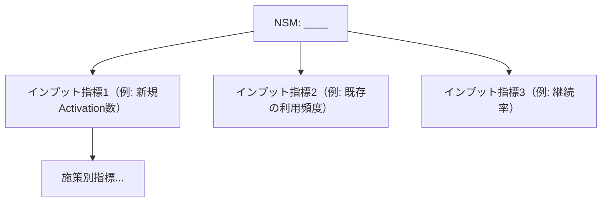

# ANALYSIS_FRAMEWORK.md — 分析フレームワーク標準ライブラリ

本書は Marketing Report Skill の **Step 3〜6（情報整理・インサイト抽出・仮説立案・戦略立案）** および **Step 7（改善案の優先順位付け）** で使う分析フレームワークの標準ライブラリである。14のフレームワークを統一フォーマットで定義し、選択マトリクスで「どの目的にどれを使うか」を判定可能にする。Step 4 の完了判定「事実→解釈→So What の3段が揃ったインサイト3〜7個」（`SKILL.md` 準拠）に到達するための道具箱であり、フレームワークを埋めること自体は成果ではない。

| 項目 | 内容 |
|---|---|
| Version | 1.0.0 |
| Status | Active |
| Last Updated | 2026-07-11 |

---

## 1. 総論 — フレームワークの使用原則

フレームワークは「**思考の抜け漏れ防止装置**」であり、**結論の代用ではない**。表が埋まったことと、意思決定を変えるインサイトが出たことは別である。

**使用ルール（判定文）**:

- FW-01: **1レポートにつき1〜3個まで。** 4個以上使う場合は、削れない理由をレポートの「前提条件」に書けなければ不合格。
- FW-02: 選定理由を1文で書けないフレームワークは使わない（`SKILL.md` Step 4 準拠）。「有名だから」「テンプレにあるから」は理由ではない。
- FW-03: フレームワークの各セルは、Step 2 で収集した**出典付きの事実**または明示された推定で埋める。埋めるための創作を禁止する。
- FW-04: 埋まらないセルは「要調査」と書いて空けておく。無理に埋めた一般論（例: SWOTの脅威に「景気変動」）は削除対象。
- FW-05: フレームワークの出力には必ず **So What（この分析から何を決めるべきか）を1〜3文**添える。So What のないフレームワーク表はレポートに載せない。
- FW-06: 「フレームワークを埋めること」を目的化しない。RQ（`RESEARCH_METHOD.md` §1）に答えるのに不要な軸は、省略して構わない（省略を明記する）。

---

## 2. フレームワーク選択マトリクス

### 2.1 分析目的 × 推奨フレームワーク

| 分析目的 | 第一候補 | 第二候補 | 補助 |
|---|---|---|---|
| 市場理解（市場の構造・魅力度） | Porter's Five Forces | 3C | Blue Ocean（戦略キャンバス） |
| 競合理解（誰と何で戦っているか） | 3C | Blue Ocean（戦略キャンバス） | SWOT |
| 顧客理解（誰の何のジョブか） | JTBD | Value Proposition Canvas | STP |
| 戦略立案（どこで戦い、何を武器にするか） | クロスSWOT | STP → 4P | Blue Ocean（ERRC） |
| 施策優先順位 | ICE / RICE（§5） | — | — |
| グロース診断（どこで漏れているか） | AARRR | North Star Metric | Hook Model |
| UX診断（なぜ使われない/続かないか） | HEART | Fogg（B=MAP） | Behavioral Economics |
| 継続率・習慣化の改善 | Hook Model | Fogg（B=MAP） | Behavioral Economics |
| 全社KPI設計（Step 8 と接続） | North Star Metric | AARRR | HEART |

### 2.2 レポート種別 → 定番の組み合わせ 早見表

`SKILL.md` §0-A のレポート種別に対応する。

| レポート種別 | 定番の組み合わせ（1〜3個） |
|---|---|
| 市場調査 | Five Forces + 3C（+ TAM/SAM/SOM は `WRITING_RULES.md` 準拠で数値提示） |
| 競合分析 | 3C + 戦略キャンバス（+ クロスSWOT） |
| UX分析 | HEART + Fogg（+ Behavioral Economics 適用表） |
| プロダクト分析 | AARRR + JTBD（+ NSM） |
| SNS・口コミ分析 | JTBD（声からジョブを抽出）+ AARRR の該当段階 |
| 価格・LTV/CAC 分析 | AARRR（Revenue段）+ 4P（Price）+ RICE で改善案順位付け |
| 投資家向け資料 | Five Forces + STP（+ NSM。市場規模は TAM/SAM/SOM 必須） |
| 経営会議資料 | クロスSWOT + 戦略オプション比較（Step 6 の評価軸: インパクト/実現性/リスク/投資額） |
| 事業計画サマリー | 3C → STP → 4P（§6 接続パターンA） |

---

## 3. 14フレームワーク定義

各フレームワークは統一フォーマット（①1行定義 ②使う場面/使わない場面 ③記入テンプレート ④良い使用例の要点 ⑤よくある誤用）で記述する。

---

### 3.1 SWOT（クロスSWOT含む）

**①1行定義**: 内部（強み/弱み）×外部（機会/脅威）の4象限で現状を棚卸しし、クロスSWOTで打ち手に変換するフレームワーク。

**②使う場面**: 戦略立案（Step 6）の直前に、3C等で集めた事実を統合するとき。
**使わない場面**: 事実収集が終わっていない段階（空想で埋まる）。単独でレポートの結論にするとき（SWOT単体は打ち手を生まない — 必ずクロスまでやる）。

**③記入テンプレート**:

```markdown
| | 機会 (O) | 脅威 (T) |
|---|---|---|
| **強み (S)** | **SO戦略（攻め）**: 強みで機会を取りにいく打ち手 | **ST戦略（差別化）**: 強みで脅威を無力化する打ち手 |
| **弱み (W)** | **WO戦略（補強）**: 弱みを補い機会を逃さない打ち手 | **WT戦略（防衛/撤退）**: 最悪シナリオの回避策 |
```

前段の4象限は以下を満たすこと:
- S/W: 社内データ・実績に基づく（各3件以内、検証可能な記述のみ）
- O/T: 市場・外部環境の変化（各3件以内、出典付き）

**④良い使用例の要点**: 各象限3件以内に絞り、全項目が Step 2 の事実に紐づく。クロスの4セルがそのまま Step 6 の戦略オプション候補になっている。

**⑤よくある誤用**: 象限を10個以上並べて優先度がない / 「強み: 技術力」のような検証不能な自己認識（判定: 第三者ソースか実績数値で裏付けられない強みは書かない）/ クロスSWOTを省略して4象限で終わる。

---

### 3.2 3C

**①1行定義**: Customer（市場・顧客）/ Competitor（競合）/ Company（自社）の3視点で事業環境を過不足なく把握するフレームワーク。

**②使う場面**: 分析の起点として現状を構造化するとき（Step 3 のグルーピング軸としても有効）。
**使わない場面**: 3視点のうち2つ以上でデータがないとき（先に Step 2 に戻る）。マクロ環境が主題のとき（Five Forces が適する）。

**③記入テンプレート**:

```markdown
| 視点 | 問い | 事実（出典付き） | 示唆 |
|---|---|---|---|
| Customer | 市場規模・成長率は？ 顧客の未充足ニーズは？ | | |
| Competitor | 主要競合は誰か？ 各社の戦略と強み/弱みは？ | | |
| Company | 自社の資産・実績・制約は？ | | |

**3Cの交点（So What）**: 顧客が求め、競合が提供できず、自社が提供できるものは何か → 1〜2文で。
```

**④良い使用例の要点**: Competitor 列が `RESEARCH_METHOD.md` §7 の競合調査9項目と接続している。最後の「交点」が Step 4 のインサイトになっている。

**⑤よくある誤用**: Company だけ厚く他が薄い（自社バイアス）/ 交点を書かずに3つの箱で終わる / Customer を「みんな」と定義する（セグメント未定義）。

---

### 3.3 STP

**①1行定義**: 市場を分割（Segmentation）し、狙いを定め（Targeting）、その中での立ち位置を決める（Positioning）ターゲティングのフレームワーク。

**②使う場面**: 「誰に売るか」が論点のとき。戦略立案（Step 6）で市場の切り取り方を決めるとき。
**使わない場面**: 市場が単一セグメントで自明なとき。ポジショニングだけが論点のとき（戦略キャンバスが適する）。

**③記入テンプレート**:

```markdown
**S: セグメンテーション**（切り口と各セグメントの規模を明記）
| セグメント | 定義 | 規模（数値+出典） | 成長性 | 競合密度 |
|---|---|---|---|---|

**T: ターゲティング**（評価基準を点数化して選定理由を示す）
| セグメント | 市場魅力度(1-5) | 自社適合度(1-5) | 合計 | 判定 |
|---|---|---|---|---|

**P: ポジショニング**（2軸マップ。軸は顧客の購買決定要因から選ぶ）
- 軸1: ____ / 軸2: ____
- ポジショニングステートメント: 「{ターゲット}にとって、{製品}は{競合}と違い{独自価値}を提供する」
```

**④良い使用例の要点**: セグメントの規模が数値で入っている。T の選定が採点表で追跡できる。P の2軸が「自社が勝てる軸」ではなく「顧客が選ぶ軸」になっている。

**⑤よくある誤用**: 規模を測れない切り口でセグメントする / ポジショニングマップの軸を自社に都合よく選ぶ（判定: 軸が顧客調査・口コミの上位テーマに由来しなければ再考）/ 全セグメントを狙う結論にする。

---

### 3.4 4P

**①1行定義**: Product / Price / Place / Promotion の4要素でマーケティング施策の一貫性を設計・点検するフレームワーク。

**②使う場面**: STP の後、打ち手を具体化するとき（Step 6→7 の橋渡し）。競合とのマーケティングミックス比較。
**使わない場面**: STP（誰に何を）が未確定のとき。B2B SaaS 等で Place の意味が薄い場合は項目を読み替える（Place→販売チャネル/導入経路）。

**③記入テンプレート**:

```markdown
| P | 現状（事実） | 競合比較 | 課題 | 打ち手案 |
|---|---|---|---|---|
| Product | | | | |
| Price | | | | |
| Place（チャネル） | | | | |
| Promotion | | | | |

**一貫性チェック（判定）**: 4行がすべて同じターゲット（STPのT）に向いているか？ 矛盾する行を挙げよ。
```

**④良い使用例の要点**: Price 行に競合の実勢価格が出典付きで入っている。一貫性チェックで矛盾（例: 高級ポジなのに割引Promotion）を発見している。

**⑤よくある誤用**: 現状の記述だけで課題と打ち手がない / 4Pを埋めること自体が目的化し STP と切断されている。

---

### 3.5 AARRR（海賊指標）

**①1行定義**: Acquisition→Activation→Retention→Referral→Revenue の5段階でユーザーライフサイクルのボトルネックを特定するグロース診断フレームワーク。

**②使う場面**: グロース診断・プロダクト分析で「どこで漏れているか」を特定するとき。KPI整理（Step 8）の下敷き。
**使わない場面**: プロダクトがローンチ前でデータがないとき（Fogg や VPC で設計段階の議論をする）。非デジタル事業で計測系がないとき。

**③記入テンプレート（各段階の代表KPI付き）**:

```markdown
| 段階 | 問い | 代表KPI | 現状値 | ベンチマーク/目標 | ボトルネック判定 |
|---|---|---|---|---|---|
| Acquisition（獲得） | どこから来るか | 流入数、CPA、チャネル別CVR | | | |
| Activation（活性化） | 最初の価値体験に到達するか | オンボーディング完了率、初回主要アクション率、Aha到達率 | | | |
| Retention（継続） | 使い続けるか | N日後継続率（D1/D7/D30）、DAU/MAU、解約率 | | | |
| Referral（紹介） | 人に薦めるか | 紹介経由率、NPS、バイラル係数(K) | | | |
| Revenue（収益） | 対価を払うか | 課金転換率、ARPU、LTV、LTV/CAC | | | |

**ボトルネック判定**: 段階間の転換率を並べ、ベンチマーク比または前段比で最も落差が大きい1段階を特定する。
**So What**: ボトルネック段階への集中投資案を1〜2文で。
```

**④良い使用例の要点**: 現状値に「要計測」を許容しつつ（捏造しない）、判定が「最も落差が大きい1段階」に絞られ、Step 7 の施策がその段階に集中している。

**⑤よくある誤用**: 5段階すべてを同時に改善しようとする（判定: 推奨施策の6割以上がボトルネック段階に向いていなければ絞り込み不足）/ Retention の定義（何をもって継続とするか）を書かずに数値を並べる。

---

### 3.6 JTBD（Jobs to be Done）

**①1行定義**: 顧客は製品を「買う」のではなく進歩（ジョブ）のために「雇う」と捉え、機能ではなくジョブ単位で需要と競合を定義するフレームワーク。

**②使う場面**: 顧客理解。口コミ・レビュー分析（`RESEARCH_METHOD.md` §6）から未充足ニーズを構造化するとき。カテゴリ外競合（代替手段）を洗い出すとき。
**使わない場面**: ジョブが自明なコモディティの価格比較。定性データが一切ないとき（ジョブの創作になる）。

**③記入テンプレート（ジョブステートメント形式）**:

```markdown
**ジョブステートメント**: 「{状況}のとき、{動機・進歩}したい。そうすれば{期待される結果}できるから。」

| 要素 | 内容 | 根拠（口コミ/インタビュー等、Tier明記） |
|---|---|---|
| 状況 (When) | | |
| 機能的ジョブ | | |
| 感情的ジョブ | | |
| 社会的ジョブ | | |
| 現在の代替手段（雇われているもの） | | |
| 代替手段への不満（未充足） | | |
| 雇用/解雇の決定要因 | | |
```

**④良い使用例の要点**: 「代替手段」に競合製品だけでなく「Excel」「何もしない」等の非製品が入っている。ジョブが動詞で書かれ、根拠の引用が `RESEARCH_METHOD.md` §6.3 のチェリーピッキング禁止ルールを守っている。

**⑤よくある誤用**: ジョブを機能名で書く（「検索機能が欲しい」はジョブではない）/ ペルソナの属性描写（年齢・職業）に終始しジョブが出てこない / 1つの製品に無数のジョブを列挙する（主要ジョブは1〜3個に絞る）。

---

### 3.7 Porter's Five Forces

**①1行定義**: 業界の収益性を「既存競合・新規参入・代替品・買い手・売り手」の5つの力で構造的に評価する市場魅力度分析。

**②使う場面**: 市場調査・参入判断・投資家向け資料で「この市場は儲かる構造か」に答えるとき。
**使わない場面**: 業界の境界が定義できていないとき（先に `RESEARCH_METHOD.md` §1.3 スコープ定義）。単一企業のミクロな施策検討。

**③記入テンプレート**:

```markdown
| 力 | 強さ (強/中/弱) | 根拠となる事実（出典付き） | 収益性への影響 |
|---|---|---|---|
| 既存競合の敵対関係 | | 競合数、上位集中度、差別化余地、撤退障壁 | |
| 新規参入の脅威 | | 参入障壁（資本・規制・ネットワーク効果・スイッチングコスト） | |
| 代替品の脅威 | | 代替手段の価格性能比、乗り換えコスト | |
| 買い手の交渉力 | | 買い手の集中度、価格感度、情報の対称性 | |
| 売り手の交渉力 | | 供給者の集中度、切り替え可能性 | |

**総合判定**: 業界の構造的魅力度（高/中/低）とその主因を2文以内で。
```

**④良い使用例の要点**: 「強/中/弱」の判定ごとに数値根拠（例: 上位3社シェア72%）がある。総合判定が参入/撤退の意思決定文になっている。

**⑤よくある誤用**: 5つの力を全部「中」にして何も言わない（判定: 5項目中4つ以上が「中」なら根拠不足を疑い再調査）/ 代替品を同業他社と混同する / 静的な現状分析で終わり、力の変化トレンドに触れない。

---

### 3.8 Blue Ocean Strategy（戦略キャンバス・ERRC）

**①1行定義**: 業界の競争要因を可視化（戦略キャンバス）し、取り除く/減らす/増やす/付け加える（ERRC）で競争のない価値曲線を設計するフレームワーク。

**②使う場面**: 競合が同質化していて差別化の軸を探すとき。ポジショニング刷新の提案。
**使わない場面**: 既存軸での改善が論点のとき。競争要因ごとの競合評価データがないとき。

**③記入テンプレート**:

```markdown
**戦略キャンバス**（競争要因 × 投資レベル 1-5）
| 競争要因 | 業界標準 | 競合A | 自社(現状) | 自社(提案) |
|---|---|---|---|---|
| 価格 | 3 | 4 | 3 | 2 |
| （要因2〜8: 顧客の購買決定要因から選ぶ） | | | | |

（価値曲線を図示する場合は Mermaid xychart の折れ線を使用。詳細は OUTPUT_RULES.md）

**ERRCグリッド**
| Eliminate（取り除く） | Raise（増やす) |
|---|---|
| 業界が当然視するが顧客価値のない要因 | 業界標準を大きく上回らせる要因 |
| **Reduce（減らす）** | **Create（付け加える）** |
| 業界標準以下でよい要因 | 業界が提供していない新要因 |
```

**④良い使用例の要点**: 競争要因が5〜8個で、顧客調査・口コミの上位テーマ由来。提案曲線が競合と2要因以上で明確に交差（メリハリ）している。ERRCの Eliminate が空欄でない（増やす提案だけならブルーオーシャンではない）。

**⑤よくある誤用**: 全要因で競合を上回る提案曲線（それはコスト増の同質化）/ 競争要因を社内用語で書き顧客の言葉になっていない / ERRC の E と R を書けず「全部足す」提案になる。

---

### 3.9 Value Proposition Canvas

**①1行定義**: 顧客プロファイル（ジョブ・ペイン・ゲイン）と価値マップ（製品・ペインリリーバー・ゲインクリエイター）の適合（フィット）を検証するフレームワーク。

**②使う場面**: JTBD で特定したジョブに対し、提供価値が噛み合っているかを点検するとき。新機能・新プランの妥当性検証。
**使わない場面**: 顧客プロファイル側のデータがない段階で価値マップだけ書くとき（自社の願望の羅列になる）。

**③記入テンプレート**:

```markdown
**顧客プロファイル**（根拠: 口コミ/インタビュー、Tier明記）
| 項目 | 内容 | 重要度(高/中/低) | 根拠 |
|---|---|---|---|
| ジョブ | | | |
| ペイン（障害・リスク・不満） | | | |
| ゲイン（期待・望む成果） | | | |

**価値マップ**
| 項目 | 内容 | 対応する顧客側項目 |
|---|---|---|
| 製品・サービス | | |
| ペインリリーバー | | → ペイン{#} |
| ゲインクリエイター | | → ゲイン{#} |

**フィット判定**: 重要度「高」のペイン/ゲインのうち、価値マップで対応が取れている割合 ___%（80%未満なら価値提案の再設計を提言）。
```

**④良い使用例の要点**: 右側（顧客）が先に埋まり、左側（価値）が後。フィット判定が%で出て、未対応の重要ペインが Step 7 の施策候補になっている。

**⑤よくある誤用**: 左側（自社の機能）から書き始める / ペインとゲインを裏返しに書くだけ（「遅いのがペイン、速いのがゲイン」）/ フィット判定をせずに2枚の表で終わる。

---

### 3.10 Behavioral Economics（行動経済学の主要原理）

**①1行定義**: 人間の非合理な意思決定パターン（バイアス）を、UX・価格・訴求の設計に応用するための原理集。

**②使う場面**: UX診断・課金導線・LP/訴求文の改善案を出すとき（Step 7）。口コミに現れた不合理な行動の説明。
**使わない場面**: ダークパターン（ユーザーの不利益になる操作的設計）の正当化。効果検証なしに「原理を使ったから効くはず」と断定するとき。

**③記入テンプレート（主要原理10個の適用表）**:

```markdown
| # | 原理 | 1行定義 | 本件での適用対象 | 打ち手案 | 倫理チェック(操作的でないか) |
|---|---|---|---|---|---|
| 1 | 損失回避 | 人は利得より損失を約2倍重く感じる | | 例: 無料トライアル終了時に「失うもの」を提示 | |
| 2 | アンカリング | 最初に見た数値が判断の基準点になる | | 例: 上位プランを先に見せる価格表 | |
| 3 | 社会的証明 | 他者の行動が正しさの手がかりになる | | 例: 導入社数・レビュー数の提示 | |
| 4 | バーナム効果 | 誰にでも当てはまる記述を「自分のことだ」と感じる | | 例: 診断コンテンツのパーソナライズ演出 | |
| 5 | ピークエンドの法則 | 体験の評価は最高潮と終わりで決まる | | 例: 完了画面・解約体験の設計 | |
| 6 | デフォルト効果 | 初期設定がそのまま選ばれやすい | | 例: 推奨プランの事前選択 | |
| 7 | 希少性 | 手に入りにくいものほど価値を感じる | | 例: 期間・数量限定（虚偽の希少性は禁止） | |
| 8 | 返報性 | 先に与えられると返したくなる | | 例: 先出しの無料価値提供 | |
| 9 | 保有効果 | 一度所有すると手放す価値を高く見積もる | | 例: 試用期間中のデータ蓄積 | |
| 10 | 現在バイアス | 将来の利得より目先の報酬を優先する | | 例: 即時リワードの設計 | |
```

**④良い使用例の要点**: 適用対象が実際の画面・導線名で特定されている。倫理チェック列が全行埋まっている。打ち手が Step 7 の ICE/RICE 採点に接続している。

**⑤よくある誤用**: 原理名を挙げるだけで適用対象がない「用語の展覧会」/ 虚偽の希少性・隠れた課金などダークパターンの提案（判定: ユーザーが全情報を知ったとき不快に感じる設計は不採用）/ 10原理すべてを1画面に適用する提案。

---

### 3.11 Fogg Behavior Model（B=MAP）

**①1行定義**: 行動(B)は動機(Motivation)×能力(Ability)×きっかけ(Prompt)が同時に揃ったときのみ起きる、とする行動設計モデル。

**②使う場面**: 「ユーザーがなぜその行動をしないのか」を診断するとき（Activation・オンボーディング改善に特に有効）。
**使わない場面**: 行動が特定されていない漠然とした「エンゲージメント向上」議論（先に対象行動を1つに絞る）。

**③記入テンプレート**:

```markdown
**対象行動（1つに特定）**: 例「初回セッションでプロジェクトを1件作成する」

| 要素 | 診断の問い | 現状評価(高/中/低)と根拠 | 打ち手の方向 |
|---|---|---|---|
| Motivation | その瞬間、やる理由が十分か（快/不快、希望/不安、帰属） | | 動機向上策は効果が持続しにくい点に注意 |
| Ability | 簡単か（時間・費用・認知負荷・手順数） | 手順数: __ステップ、所要: __分 | **最優先で改善**（動機を上げるより「簡単にする」方が確実、というFoggの原則） |
| Prompt | 適切なタイミングできっかけがあるか | | 動機・能力の水準に合わせた Prompt 設計 |

**診断結論**: 行動が起きない主因は M / A / P のどれか（1つに特定して書く）。
```

**④良い使用例の要点**: 対象行動が観測可能な1アクションに特定されている。Ability の評価が手順数・所要時間の実測で書かれている。診断結論が1要素に絞られている。

**⑤よくある誤用**: M/A/P全部が原因という結論（優先順位がない）/ 動機向上（キャンペーン等）に偏り Ability（手順削減）を検討しない / 対象行動が「もっと使ってもらう」のまま。

---

### 3.12 Hook Model

**①1行定義**: トリガー→行動→可変報酬→投資の4段ループでプロダクトの習慣化（自発的な再訪）を設計するフレームワーク。

**②使う場面**: Retention改善・習慣化が論点のとき（AARRR診断で Retention がボトルネックと出た後の深掘り）。
**使わない場面**: 使用頻度が構造的に低いプロダクト（年1回の手続き等 — 習慣化の対象外）。倫理的に依存を助長すべきでない領域。

**③記入テンプレート**:

```markdown
| 段階 | 問い | 現状 | 課題 | 打ち手案 |
|---|---|---|---|---|
| トリガー（外的） | 通知・メール・導線は適切なタイミングか | | | |
| トリガー（内的） | どの感情・状況が想起のきっかけか（例: 退屈→SNS） | | | |
| 行動 | トリガー直後の最小行動は十分簡単か（B=MAPで点検） | | | |
| 可変報酬 | 報酬に予測不能な変化があるか（獲物型/種族型/自己型） | | | |
| 投資 | ユーザーが入れた資産（データ・フォロー・実績）が次回の価値を高めるか | | | |

**ループ判定**: 外的トリガーなしで再訪する内的トリガーが特定できているか（Yes/No）。Noなら習慣化は未成立。
```

**④良い使用例の要点**: 内的トリガーが口コミ・行動データから特定されている。「投資」段が次回のトリガーに接続し、ループが閉じている。

**⑤よくある誤用**: 通知を増やすだけの提案（外的トリガー偏重）/ 可変報酬を「ポイント付与」と即断する（固定報酬は可変報酬ではない）/ 倫理チェックなしにエンゲージメント最大化を自己目的化する。

---

### 3.13 HEART Framework

**①1行定義**: UXの質を Happiness / Engagement / Adoption / Retention / Task success の5観点で捉え、Goals→Signals→Metrics で計測可能に落とすUX評価フレームワーク。

**②使う場面**: UX診断・UX改善の効果測定設計。「使いやすさ」という曖昧な議論を計測可能にするとき。
**使わない場面**: 5観点すべてを常に使う必要はない（論点に関わる2〜3観点に絞る）。定性課題の発見そのもの（JTBDやユーザビリティテストが適する）。

**③記入テンプレート（Goals-Signals-Metrics 表）**:

```markdown
| 観点 | Goals（目指す状態） | Signals（観測できる行動/態度） | Metrics（指標・定義式） | 現状値 | 目標値 |
|---|---|---|---|---|---|
| Happiness（満足） | | 例: 高評価、推奨意向 | 例: NPS、CSAT、ストア評価 | | |
| Engagement（関与） | | 例: 訪問頻度、利用の深さ | 例: 週あたりセッション数、主要機能利用率 | | |
| Adoption（新規定着） | | 例: 新規ユーザーの機能到達 | 例: 登録後7日以内の主要機能利用率 | | |
| Retention（継続） | | 例: 再訪、解約しない | 例: D30継続率、月次解約率 | | |
| Task success（課題達成） | | 例: 完了、エラーなし、速い | 例: タスク完了率、所要時間、エラー率 | | |
```

**④良い使用例の要点**: 論点に関係する観点だけを使い、使わない観点の省略を明記。Metrics に定義式があり、Step 8 の KPI ツリーにそのまま接続している。

**⑤よくある誤用**: Goals を飛ばして手持ちの指標を貼るだけ（指標が目標に紐づかない）/ 5観点×全指標を網羅して優先度がない / Happiness を「たぶん満足しているはず」で埋める（計測なき満足は書かない）。

---

### 3.14 North Star Metric（NSM）

**①1行定義**: プロダクトが顧客に届けている価値を最もよく代表する単一指標（NSM）を定め、全チームの先行指標をそこへ接続するKPI設計フレームワーク。

**②使う場面**: KPI整理（Step 8）の最上位設計。組織のKPIが乱立・矛盾しているとき。投資家向けにグロースの物語を1指標で語るとき。
**使わない場面**: 事業が複数でNSMが1つに定まらないとき（事業別に分ける）。売上そのものをNSMにしたいとき（下記の設計基準に反する）。

**③記入テンプレート**:

```markdown
**NSM設計基準（4条件すべてを満たすこと — 判定表）**
| 条件 | 判定 |
|---|---|
| 1. 顧客が受け取る価値を表している（社内都合の指標でない） | Yes/No |
| 2. 先行性がある（売上より先に動く。売上は遅行指標のためNSM不適格） | Yes/No |
| 3. 計測可能で、チームの活動で動かせる | Yes/No |
| 4. これが伸びれば中長期の収益が伸びると論理的に説明できる | Yes/No |

**NSM**: 例「週あたりのアクティブ利用チーム数」「月間◯◯完了件数」

**先行指標への分解（Mermaid）**
```



**④良い使用例の要点**: 4条件の判定表がすべて Yes で、Noの候補（例: 登録者数=価値を表さない）を棄却した経緯が残っている。分解ツリーが Step 8 の完了判定「KPIツリーが1枚の図」を直接満たす。

**⑤よくある誤用**: 売上・PV・登録者数などバニティ/遅行指標をNSMにする / NSMを複数置く / 分解せずスローガンとして掲げるだけで施策別指標に接続しない。

---

## 4. Step 4〜6 との接続（フレームワーク出力の使い方）

- Step 4（インサイト抽出）: フレームワークの各 So What を「事実→解釈→So What」の3段形式に書き直し、インサイト候補にする。表のセルはインサイトではない。
- Step 5（仮説立案）: インサイトを「もし〜すれば、〜になるはずだ」に変換する。確信度（高/中/低）は `RESEARCH_METHOD.md` §2.3 の根拠Tier対応表に従って付ける。
- Step 6（戦略立案）: クロスSWOTの4セル・STPのT候補・ERRCの提案が戦略オプション（2〜3案）の素材になる。比較軸（インパクト/実現性/リスク/投資額）は `SKILL.md` Step 6 に従う。

---

## 5. §優先順位付け — ICE / RICE

Step 7（改善案作成）の優先順位付けに使う。**全施策に採点し、点数順に並べる**（`SKILL.md` Step 7 完了判定「施策5個以上・全件にスコアと優先順位」準拠）。

### 5.1 ICE

各施策を Impact / Confidence / Ease で1〜10点評価し、**ICEスコア = (I + C + E) ÷ 3**（平均）で順位付けする。

**採点基準（判定可能な目安）**:

| 点 | Impact（目標KPIへの影響） | Confidence（効く確信度） | Ease（実行の容易さ） |
|---|---|---|---|
| 9-10 | ボトルネックKPIを20%以上動かす見込み | 自社A/Bテスト等の直接証拠がある | 1人×1週間以内で完了 |
| 7-8 | KPIを10〜20%動かす見込み | 同業他社の公開事例+自社データの傍証 | 1チーム×2週間以内 |
| 5-6 | KPIを5〜10%動かす見込み | 業界のベストプラクティスとされている | 1チーム×1〜2ヶ月 |
| 3-4 | KPIを5%未満/間接的に動かす | 理論・フレームワーク上の推論のみ | 複数チーム×四半期 |
| 1-2 | 影響経路を説明できない | 勘 | 大規模開発・外部依存あり |

- I-01: Confidence 3以下の施策を優先度上位3位以内に置く場合、先に小規模検証（実験）を独立した施策として切り出す。
- I-02: 採点の根拠を各施策1行で残す（点数だけの表は不合格）。

### 5.2 RICE

**RICEスコア = (Reach × Impact × Confidence) ÷ Effort**

| 要素 | 定義 | 単位・値 |
|---|---|---|
| Reach | 一定期間（四半期を標準）に影響を受ける人数・件数 | 実数（例: 4,000ユーザー/四半期）。出典または推定式を明記 |
| Impact | 1人あたりへの影響の大きさ | 3=大 / 2=中 / 1=小 / 0.5=最小 / 0.25=極小 |
| Confidence | 見積もりの確信度 | 100%=高（データあり）/ 80%=中 / 50%=低。50%未満の施策は「実験」に分類 |
| Effort | 必要工数 | 人月（0.5人月刻み。関係職種の合算） |

### 5.3 使い分け（判定文）

- P-01: **施策数が10未満 → ICE**（軽量・速い）。**10以上、または施策間の工数差が5倍以上 → RICE**（Effort を分母に持つため工数差を正しく反映できる）。
- P-02: Reach を数えるデータが全くない場合は RICE を使わない（Reach の捏造を誘発する）。ICE + 根拠1行で運用する。
- P-03: スコア僅差（上位の差が10%以内）の施策は、点数で機械的に決めず「戦略（Step 6 推奨案）との整合」で最終順位を決め、その理由を書く。
- P-04: スコアは `SKILL.md` Step 7 の工数規模（S・M・L）と矛盾しないこと（Ease 9 なのに工数 L 等は採点ミス）。

---

## 6. フレームワーク間の接続パターン

単体で使うより、以下の定型パターンで連結すると論理の飛躍（品質基準4「論理的」）を防げる。

| パターン | 流れ | 使う場面 |
|---|---|---|
| **A. 王道戦略パイプライン** | 3C（現状把握）→ クロスSWOT（統合と打ち手方向）→ STP（狙い）→ 4P（打ち手の一貫性） | 事業計画・経営会議資料 |
| **B. グロース診断→習慣化** | AARRR（ボトルネック特定）→ Hook Model（Retentionの深掘り）→ Fogg B=MAP（対象行動の障害特定） | プロダクト分析・UX分析 |
| **C. 顧客起点の価値再設計** | JTBD（ジョブ特定）→ Value Proposition Canvas（フィット検証）→ Blue Ocean ERRC（提供価値の再配分） | 差別化・リニューアル提案 |
| **D. 市場参入判断** | Five Forces（構造的魅力度）→ 3C（勝ち筋）→ STP（参入セグメント）+ TAM/SAM/SOM | 市場調査・投資家向け資料 |
| **E. KPI再設計** | NSM（最上位指標の確定）→ AARRR または HEART（先行指標の棚卸し）→ ICE/RICE（指標を動かす施策の順位付け） | KPI整理・グロース戦略 |

- 接続時も FW-01（1レポート1〜3個）は適用される。パターン内のフレームワークのうち、**表として本文に載せるのは1〜3個**とし、残りは付録（Appendix）または調査ログに回す。

---

## 7. 関連ファイル

- 入力: `RESEARCH_METHOD.md`（フレームワークのセルを埋める事実の収集規則・Tier定義・確信度対応）
- 出力先: `TEMPLATE.md`（分析章の配置）、`OUTPUT_RULES.md`（Mermaid・表の出力規定）
- 表現: `WRITING_RULES.md`（So What の書き方・確信度表記・数値表記）
- 検証: `CHECKLIST.md`（品質基準4「論理的」の判定で本書 §4 の3段形式が参照される）
