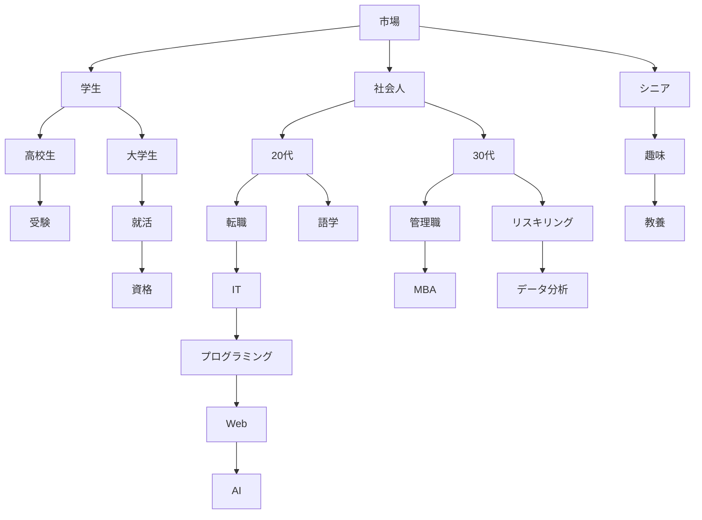
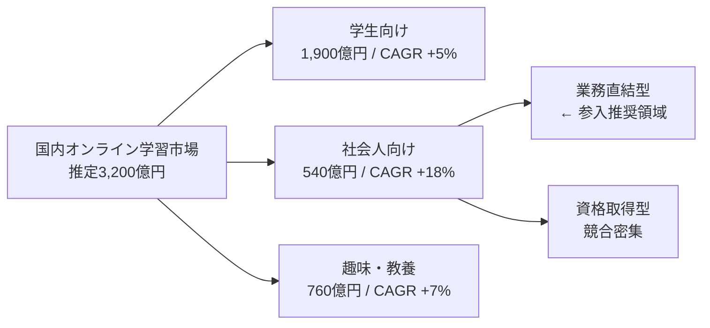

# EXAMPLES — 良い例・悪い例ライブラリ

本ファイルは、レポートの各構成要素について「良い例」「悪い例」「悪い例→良い例への改善プロセス」を対で示し、品質判断に迷ったときの参照基準を提供する。すべての例は**架空の題材（国内オンライン学習市場・架空サービス「LearnBase」等）で自作したもの**であり、実在企業の実データ・実在レポートのコピーは一切含まない。数値はすべて説明用の架空値である。

| 項目 | 内容 |
|---|---|
| Version | 1.0.0 |
| Status | Active |
| Last Updated | 2026-07-11 |

使い方: `SKILL.md` Step 10〜11 で品質判断に迷ったとき、該当する節の「悪い例の特徴」に自分の原稿が当てはまらないかを照合する。判定基準そのものは `CHECKLIST.md` を正とする。

---

## 1. Executive Summary の良い例・悪い例

### 悪い例

> **Executive Summary**
>
> 近年、オンライン学習市場は目覚ましい発展を遂げており、多くの企業が参入しています。コロナ禍以降のデジタル化の流れを受けて、学習のオンライン化はますます加速していくものと思われます。本レポートでは、国内オンライン学習市場について、市場規模、競合状況、顧客ニーズなど、さまざまな観点から調査を行いました。調査の結果、市場には多くの機会と課題があることがわかりました。詳細については本文をご覧ください。弊社としても、この市場動向を注視しつつ、適切なタイミングでの意思決定が重要になると考えられます。

### 良い例

> **Executive Summary**
>
> **結論: 社会人リスキリング領域に特化した形で2027年度に参入すべきである（推奨投資額: 初年度1.2億円）。**
>
> - **市場**: 国内オンライン学習市場は2026年時点で推定3,200億円、CAGR +9%で成長（出典: 業界団体X統計、2026-05調査）。うち社会人リスキリング領域は540億円だがCAGR +18%と最も速い。
> - **競合**: 大手3社は学生向けに集中しており、社会人向けの「業務直結型・短期集中」ポジションは空白である（§5 ポジショニングマップ参照）。
> - **勝ち筋**: 自社の法人顧客基盤（既存800社）を初期チャネルに使えるため、推定CACは市場平均の6割で立ち上げ可能（推定、§7に算出根拠）。
> - **リスク**: 大手の参入（発生可能性: 中）と講師調達（同: 高）。対応方針は§11 Risks参照。
> - **求める意思決定**: 2026年Q4までのPoC予算3,000万円の承認。Go/No-Go判定は「PoC受講完了率60%以上かつ法人継続意向70%以上」で2027年1月に行う。

### 改善プロセスの解説（何がダメでどう直したか）

- **結論がない → 第1文を意思決定文にした。** 悪い例は最後まで読んでも「で、どうするのか」が不明。良い例は太字1文で参入判断と金額を先に出した。
- **数字がゼロ → 主要数値4点（市場規模・CAGR・投資額・判定基準）を入れた。** 「目覚ましい発展」「多くの機会」はすべて数値に置換した。
- **出典がない → 数値に出典と調査日を付け、推定には「推定」と明記した。**
- **「詳細は本文を」で丸投げ → 本文の該当章番号への参照に変えた。** 要約は本文の予告ではなく、それ単体で意思決定できる縮約版である。
- **求める判断が不明 → 「PoC予算3,000万円の承認」と判定条件まで特定した。**（`CHECKLIST.md` E-2/E-3 準拠）
- **時候の挨拶的な前置き（「近年〜」）を全削除した。** 1行目から結論に入る。

---

## 2. 章構成の良い例・悪い例

### 悪い例（背景から始まる構成）

```text
1. はじめに
2. オンライン学習の歴史
3. 社会的背景（DX・リスキリングの潮流）
4. 調査方法について
5. 市場の概況
6. 各社の紹介
7. アンケート結果
8. 考察
9. まとめ
```

### 良い例（結論ファースト構成 = TEMPLATE.md 準拠）

```text
1. Executive Summary（結論・推奨・数字を1ページで）
2. 前提条件（目的・読者・スコープ・データの限界）
3. Key Findings(発見3〜7個、各々に根拠)
4. 市場分析（規模・成長性・構造）
5. 競合分析(ポジショニングと空白領域)
6. 顧客分析(セグメントとニーズ)
7. 戦略提言(推奨1案+代替案比較)
8. 実行計画(施策・優先順位)
9. KPI（ツリーと目標値）
10. ロードマップ(フェーズとGo/No-Go条件)
11. Risks（発生可能性x影響度と対応）
12. Appendix（出典一覧・詳細データ）
```

### 改善プロセスの解説

- **「はじめに」「歴史」「まとめ」を削除した。** 意思決定に使わない章は読者の時間を奪うだけである。歴史的経緯が判断材料になる場合のみ、市場分析の中に1段落で入れる。
- **結論（Summary・Findings）を先頭に移動した。** 悪い例は8章まで読まないと発見に到達しない。
- **「考察」を「戦略提言」に変えた。** 考察は書き手の思考メモであり、読者が欲しいのは推奨と根拠である。
- **「調査方法」は前提条件とAppendixに分割した。** 本文の流れを止めない。
- **章名をレポートの機能（何を意思決定させる章か）で命名した。**

---

## 3. 表の良い例・悪い例

### 悪い例（列過多・単位不統一・数値左揃え）

| サービス | 価格 | ユーザー数 | 満足度 | 講座数 | 特徴 | 強み | 弱み | 運営会社 | 設立 |
|:---|:---|:---|:---|:---|:---|:---|:---|:---|:---|
| A社 | 1980 | 12万 | 4.2 | 3000講座 | 動画中心 | 安い | サポート薄い | A社 | 2015 |
| B社 | 月3万円 | 8500人 | 高い | 200 | 伴走型 | 手厚い | 高額 | B社 | 2019 |

### 良い例（規定準拠: 列7以内・単位統一・数値右揃え・出典付き）

**表5-1: 主要競合の価格・規模比較（2026-06時点、各社公開情報より作成）**

| サービス | 月額価格（円） | 会員数（万人） | 講座数 | ポジション |
|:---|---:|---:|---:|:---|
| A社 | 1,980 | 12.0 | 3,000 | 低価格・動画量で圧倒 |
| B社 | 30,000 | 0.85 | 200 | 高単価・伴走型 |
| C社 | 9,800 | 3.2 | 650 | 中間・資格特化 |

### 改善プロセスの解説

- **10列 → 5列に削減した。** 「強み/弱み/特徴」は本文かポジショニング図へ、「運営会社/設立」はAppendixへ移した。1つの表は1つの問い（ここでは「価格と規模の位置関係」）だけに答えさせる。
- **単位を列見出しに統一した。**「1980」「月3万円」の混在を「月額価格（円）」列に揃え、桁区切りを入れた。
- **数値列を右揃えにした。** 桁の比較は右揃えでないとできない。
- **「高い」という定性値を数値化できないため削除した。** 満足度は測定方法が揃わない限り比較表に入れない。
- **表番号・タイトル・出典・基準日を付けた。**（`CHECKLIST.md` 5-4 準拠）

---

## 4. Mermaid図の良い例・悪い例

### 悪い例（ノード過多で読めない）



### 良い例（12ノード以内・1図1メッセージ）



### 改善プロセスの解説

- **23ノード → 6ノードに削減した。** 図の目的は「社会人向けが最も速く成長し、その中の業務直結型が空白」の1メッセージを伝えることだけ。詳細分解はAppendixの表に移した。
- **ノード内に数値を入れ、図だけで主張が伝わるようにした。**
- **深さを2階層までにした。** 4階層のツリーは図ではなく表で表現する。
- **強調したいノードに「← 参入推奨領域」のラベルを付け、視線の着地点を1つにした。**
- レンダリング確認（構文エラーなし・`CHECKLIST.md` 5-3）を出荷前に行う。

---

## 5. Key Findings の良い例・悪い例

### 悪い例（事実の羅列）

> - オンライン学習市場は3,200億円である。
> - 競合A社の会員は12万人である。
> - 社会人の62%が学び直しに関心がある。
> - 動画学習の完了率は低い。

### 良い例（事実→解釈→So What）

> **Finding 2: 社会人領域は市場の17%だが、成長の43%を生んでいる。**
> - **事実**: 社会人向けは540億円（市場の17%）だが、市場全体の年間成長額の43%を占める（出典: 業界団体X統計、2026-05調査）。
> - **解釈**: 市場の重心は学生から社会人へ移行しつつあり、今後の競争は社会人領域で起きる。
> - **So What**: 参入するなら現在シェア上位社が固まる前の社会人領域であり、学生領域への後発参入は推奨しない。

### 改善プロセスの解説

- **各事実に「解釈」と「So What」を付けた。** 事実だけの箇条書きは調査メモであり、Findingではない（`SKILL.md` Step 4 の定義準拠）。
- **見出し自体をメッセージ化した。**「市場規模について」ではなく「17%だが成長の43%」という発見を見出しに出す。
- **「低い」を数値+分母に置換する。** 悪い例4点目のような定性値は、数値が取れないなら「推定」として幅で書く。
- **意思決定への接続を明示した。** So Whatは「だから自社は〜すべき/すべきでない」まで書いて初めて完了する。

---

## 6. Strategic Recommendations の良い例・悪い例

### 悪い例（総花的）

> 市場の成長を踏まえ、以下の施策を総合的に推進すべきである。
> 1. 社会人向けサービスの検討
> 2. 学生向けサービスの強化
> 3. ブランド認知の向上
> 4. パートナーシップの模索
> 5. AI機能の研究

### 良い例（推奨1案+比較表）

> **推奨: 案B「法人経由の社会人リスキリング特化」で参入する。**
>
> | 評価軸 | 案A: 個人向け低価格 | **案B: 法人経由特化（推奨）** | 案C: 参入見送り |
> |:---|:---|:---|:---|
> | インパクト（3年後売上） | 推定8億円 | **推定14億円** | 0 |
> | 実現性 | 低（大手と価格競争） | **高（既存法人基盤800社を転用）** | — |
> | リスク | CAC高騰 | **講師調達（対応: §11）** | 機会損失 |
> | 初期投資 | 2.5億円 | **1.2億円** | 0 |
>
> 案Aを推奨しない理由: 低価格帯はA社（会員12万人）の規模の経済に対抗できず、CACが推定で案Bの2.5倍かかるため。案C（見送り）を推奨しない理由: 社会人領域のシェア固定は2〜3年内に進むと推定され、後発コストが参入コストを上回るため。

### 改善プロセスの解説

- **5つの並列提案 → 1つの推奨に確定した。** 全部やる提案はリソース配分の意思決定を放棄している（`CHECKLIST.md` 8-3）。
- **捨てた案を比較表に残した。** 経営層は「なぜ他の案ではないのか」を必ず問う。推奨しない理由を明文化した（`SKILL.md` Step 6 準拠）。
- **評価軸を4軸（インパクト/実現性/リスク/投資額）に固定し、数値を入れた。**
- **「検討」「模索」「研究」という動詞を排除した。** 推奨は実行可能な意思決定文で書く。

---

## 7. KPI・ロードマップ・Risks の構成例

### KPI（定義式・目標値・計測方法の3点セット + ツリー）

> ```mermaid
> graph TD
>   A[3年後売上 14億円] --> B[法人契約数 250社]
>   A --> C[受講者ARPU 46万円/年]
>   B --> D[商談化率 25%]
>   B --> E[受注率 30%]
>   C --> F[受講完了率 60%]
>   C --> G[年次更新率 80%]
> ```
>
> | KPI | 定義式 | 現状値 | 目標値（1年後） | 計測方法 / 頻度 |
> |:---|:---|---:|---:|:---|
> | 受講完了率 | 完了者数 ÷ 受講開始者数 | 要計測 | 60% | LMSログ / 週次 |
> | 年次更新率 | 更新社数 ÷ 更新期限到来社数 | 要計測 | 80% | CRM / 月次 |

### ロードマップ（フェーズ + 数値のGo/No-Go条件）

> | フェーズ | 期間 | 主要施策 | Go/No-Go判定条件（数値） |
> |:---|:---|:---|:---|
> | P1: PoC | 2026 Q4 | 既存法人10社で試験提供 | 完了率60%以上 かつ 継続意向70%以上 → P2へ |
> | P2: 限定展開 | 2027 Q1-Q2 | 50社へ拡大・講座30本整備 | 更新率75%以上 かつ CAC 12万円以下 → P3へ |
> | P3: 本展開 | 2027 Q3- | 営業体制5名・250社目標 | — |

### Risks（発生可能性 x 影響度 + 対応）

> | リスク | 発生可能性 | 影響度 | 対応方針 | 監視指標 |
> |:---|:---|:---|:---|:---|
> | 大手A社の社会人領域参入 | 中 | 大 | 法人契約の複数年化で先行ロックイン | A社のIR・求人動向 / 月次 |
> | 講師調達の遅延 | 高 | 中 | P1中に講師プール20名を先行契約 | 契約講師数 / 週次 |
> | PoC完了率の未達 | 中 | 大 | 未達時はNo-Go（判定条件P1に組込済） | 完了率 / 週次 |

構成のポイント: KPIツリーの各ノードが表の行と1対1対応する。ロードマップの判定条件はKPI表の指標を使う（新しい指標を判定条件で突然出さない）。Risksの監視指標は確認頻度まで書く。

---

## 8. 見出しの良い例・悪い例（10対）

| # | 悪い例（名詞止め） | 良い例（メッセージ見出し） |
|---|:---|:---|
| 1 | 市場規模について | 市場は3,200億円、成長の重心は社会人領域に移っている |
| 2 | 競合分析 | 大手3社は学生向けに集中し、業務直結型は空白である |
| 3 | 顧客アンケート結果 | 受講の最大障壁は価格ではなく「時間の確保」である |
| 4 | 価格戦略の検討 | 価格は月4.8万円の法人一括課金が最も受容される |
| 5 | 今後の課題 | 最大のボトルネックは講師調達であり、先行契約で解消する |
| 6 | KPIについて | 追うべき先行指標は受講完了率60%である |
| 7 | SNS運用状況 | リールへの偏重でフォロワー外リーチは伸びたが転換率が下がった |
| 8 | 解約理由の分析 | 解約の54%は初月の設定未完了に集中している |
| 9 | ロードマップ | 2026 Q4のPoCで完了率60%を超えたら本展開に進む |
| 10 | まとめ | 結論: 1.2億円で社会人特化参入、判定は2027年1月 |

判定方法: 見出しだけを上から読んで、レポートの主張の流れ（ストーリーライン）が再現できればPass。名詞止め見出しはどれも再現に寄与しないためFail（`CHECKLIST.md` 4-4）。

---

## 実レポートからの型の追加ルール

優れたレポートが完成したら、その「型」を本ファイルに還元する（`SKILL.md` §4 改善ループ準拠）。手順は以下の通り。

### 追加の条件（すべて満たすこと）

| # | 条件 |
|---|---|
| 1 | 当該レポートが `CHECKLIST.md` の最終出荷判定に一発合格した、またはユーザーから明示的な高評価を得た |
| 2 | 既存の例と重複しない新しい型である（同じ教訓の例を2つ置かない） |
| 3 | 匿名化・抽象化が完了している（下記の手順を実施済み） |

### 匿名化・抽象化の手順

1. **固有名詞をすべて `{{変数}}` 化する。** 企業名→`{{自社名}}`/`{{競合A}}`、製品名→`{{製品名}}`、人名・部署名→`{{担当}}`。架空名（LearnBase等）への置換でもよい。
2. **実数値をすべて架空値または `{{変数}}` に置換する。** 実データの桁感が推測できる置換（実数値の四捨五入など）は禁止。構造が伝わる範囲で完全に作り変える。
3. **出典の実URL・実文書名を削除し、「出典: {{出典}}」に置換する。**
4. **業界が特定される固有の事実は、汎用の架空題材（オンライン学習市場等）に翻訳する。**
5. 置換後に `{{` 以外の固有情報が残っていないことを検索で確認する（企業名・URL・実在ブランドで全文検索し0件）。

### 追記のフォーマット

- 該当する節（§1〜§8）に「良い例」として追記するか、新しい型なら新節を追加する。
- 必ず「悪い例（または改善前の状態）」「良い例」「改善プロセスの解説（箇条書き3点以上）」の3点セットで書く。良い例だけの追記は禁止（対比がないと判断基準にならない）。
- 追記後、本ファイルのVersionをマイナーアップし、Last Updatedを更新する。

### 禁止事項

- 実在レポート（社内・社外を問わず）の文章・図表・数値をそのまま、または軽微な改変で転載すること。
- `assets/reference/` の参考資料の内容を例として転記すること（参考資料はデザイン思想の学習のみに使う。`assets/README.md` 参照）。
- 顧客・取引先の情報が推測可能な形で例を書くこと。
