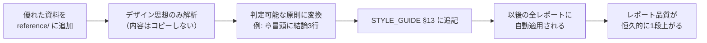

# Marketing Report Skill — 運用ガイド

本スキルは、市場調査・競合分析・UX分析・プロダクト分析・投資家向け資料・経営会議資料を、**誰が実行しても同一品質**で生成するための設計資産である。本書はスキルの全体像・各ファイルの役割・品質を継続的に向上させる運用手順を説明する。実行時のルール本体は各ファイルにあり、本書は地図として機能する。

| 項目 | 内容 |
|---|---|
| Version | 1.0.0 |
| Status | Active |
| Owner | @samkaz15 |
| Last Updated | 2026-07-11 |
| 配置 | `.claude/skills/marketing-report/` |

---

## 1. 使い方

### 1.1 起動方法

| 方法 | 入力例 |
|---|---|
| 明示的に呼ぶ | `/marketing-report 国内AI占い市場の競合分析レポートを作って` |
| 自然文で依頼する | 「〇〇市場の市場調査レポートを作成して」「競合分析を経営会議資料にまとめて」 |
| 他スキル・Agentから呼ぶ | Agentの実行手順に `Skill: marketing-report` を指定する |

`SKILL.md` の `description` に一致する依頼（レポート / 市場調査 / 競合分析 / 経営会議資料 / 投資家向け資料）で自動的に起動する。

### 1.2 実行されること

`SKILL.md` の11ステップが**順に、省略なく**実行される。各ステップには完了判定があり、満たさない限り次に進まない。

```
① 目的確認 → ② 調査 → ③ 情報整理 → ④ インサイト抽出 → ⑤ 仮説立案 → ⑥ 戦略立案
→ ⑦ 改善案作成 → ⑧ KPI整理 → ⑨ ロードマップ → ⑩ レポート生成 → ⑪ 品質チェック
```

### 1.3 出力

- 出力先: `docs/Reports/YYYY-MM-DD_{report-slug}.md`（ユーザー指定があればそちらを優先）
- 形式: `TEMPLATE.md` の標準12章構成（レポート種別により章を取捨選択し、省略章は「前提条件」に明記）
- 完了報告に `CHECKLIST.md` の品質チェック結果が含まれる

---

## 2. ファイル構成と役割

```
.claude/skills/marketing-report/
├── SKILL.md              # 中核。11ステップフロー・品質基準・他ファイルの読み込み指示
├── README.md             # 本書。全体像と運用ガイド
├── TEMPLATE.md           # レポート標準12章構成とコピー用スケルトン
├── STYLE_GUIDE.md        # デザインシステム（見出し・余白・表・図・色・トーン）
├── WRITING_RULES.md      # 文章規則（結論ファースト・数値表記・禁止表現）
├── RESEARCH_METHOD.md    # 調査手法（信頼度Tier・出典管理・捏造防止）
├── ANALYSIS_FRAMEWORK.md # 14フレームワークと選択マトリクス・ICE/RICE
├── OUTPUT_RULES.md       # 出力規定（GFM・Mermaid・脚注・参考文献・数値表記）
├── CHECKLIST.md          # 品質チェック9領域と出荷判定
├── PROMPTS.md            # 分析タイプ別プロンプト16種
├── EXAMPLES.md           # 良い例・悪い例・改善プロセス
└── assets/
    ├── README.md         # 参考資料の追加・解析ルール
    └── reference/        # 参考資料置き場（consulting/ ir/ design/ media/ internal/）
```

### 2.1 各ファイルの役割と読み込みタイミング

| ファイル | 一言でいうと | 答える問い | 読むタイミング |
|---|---|---|---|
| `SKILL.md` | 司令塔 | どの順で何をやるか | 起動時に必ず |
| `TEMPLATE.md` | 器 | どんな構成で書くか | Step 10 直前 |
| `STYLE_GUIDE.md` | 見た目の基準 | どう見せるか | Step 10 直前 |
| `WRITING_RULES.md` | 言葉の基準 | どう書くか | Step 10 直前 |
| `OUTPUT_RULES.md` | 技術仕様 | どう出力するか | Step 10 直前 |
| `RESEARCH_METHOD.md` | 調べ方 | 何を信じ、どう出典を残すか | Step 2 直前 |
| `ANALYSIS_FRAMEWORK.md` | 考え方の型 | どのフレームで分析するか | Step 3〜6 直前 |
| `CHECKLIST.md` | 検品基準 | 出荷してよいか | Step 11 |
| `PROMPTS.md` | 部品箱 | 個別分析をどう依頼するか | 該当分析時のみ |
| `EXAMPLES.md` | 見本帳 | 良し悪しの具体例は | 品質判断に迷ったとき |
| `assets/README.md` | 資料の扱い方 | 参考資料から何を学ぶか | Step 0-B |

> **注:** `SKILL.md` は Progressive Disclosure 設計になっており、全ファイルを同時に読み込まない。必要なステップで必要なファイルだけをReadすることで、コンテキストを浪費せずに品質を維持する。

### 2.2 責務の分離（重複を避けるための原則）

| 論点 | 正本 | 他ファイルでの扱い |
|---|---|---|
| 章構成・章の中身 | `TEMPLATE.md` | 他は参照のみ |
| 見た目のルール | `STYLE_GUIDE.md` | `OUTPUT_RULES.md` は技術的実装のみ担当 |
| 文章表現 | `WRITING_RULES.md` | `STYLE_GUIDE.md` はトーンの方向性のみ |
| 数値の信頼性・出典 | `RESEARCH_METHOD.md` | `WRITING_RULES.md` は表記法のみ |
| 合格判定 | `CHECKLIST.md` | 各ファイルの規則を判定文に変換して集約 |

ルールを追加するときは、**必ずどれか1ファイルを正本とし、他は参照リンクにする**。同じルールを2ファイルに書くと、改訂時に矛盾が発生する。

---

## 3. 参考資料でレポート品質を上げる方法

本スキル最大の拡張ポイントは `assets/reference/` である。**優れたレポートを1本追加するたびに、以後すべてのレポートの品質が上がる**構造になっている。

### 3.1 品質向上のメカニズム



重要なのは、**資産として残るのは資料ファイルではなく「判定可能な原則」**という点である。原則さえ書き残せば、元資料を削除しても品質は下がらない。

### 3.2 追加手順（5ステップ）

1. **配置**: `assets/reference/{category}/` に `{出典種別}_{テーマ}_{年}.pdf` の命名規則で置く（pptx/docxはPDF化してから）
2. **解析依頼**: 「`assets/reference/` の資料を解析して STYLE_GUIDE の Learned Principles を更新して」と依頼する
3. **解析**: `assets/README.md` §5 の15項目（レイアウト・情報設計・章構成・図表・余白・要約方法等）**のみ**を対象に解析される
4. **還元**: 学んだ原則が判定可能な形式で `STYLE_GUIDE.md` §13.2 の表に追記される（出典ファイル名付き）
5. **検証**: 次のレポート生成で新原則が適用されていることを `CHECKLIST.md` で確認する

### 3.3 どんな資料を追加すべきか

| 優先度 | 資料の種類 | 学べること |
|---|---|---|
| 高 | 戦略ファーム型の提案書・分析資料（PDF） | ストーリー構成、結論の示し方、図表と文章の役割分担 |
| 高 | 上場企業のIR資料・投資家向けピッチ | 市場規模・成長性・リスクの語り方、数値の見せ方 |
| 中 | 優れたレポートデザイン集・情報設計の書籍 | 余白、タイポグラフィ、視線誘導 |
| 中 | 大手調査会社の公開レポート | 章構成、要約の型、出典の示し方 |
| 低 | 自社の過去レポート（機密区分確認の上） | 自組織の慣習、読者の期待値 |

**維持基準**: 合計10ファイル以内。1資料あたり最低1原則を還元できないものは削除する（詳細は `assets/README.md` §9）。

### 3.4 やってはいけないこと

- 参考資料の**文章・数値・図表・分析結果を流用する**こと（デザイン思想のみが学習対象）
- 権利者の許諾なく再配布制限のある資料を配置すること（privateリポジトリでも配布にあたる）
- 抽象化せずに「この資料の3章の書き方を真似る」といった資料依存の原則を書くこと

---

## 4. スキル自体の改善ループ

参考資料以外にも、以下3つの経路でスキルは継続的に強化される。

| 経路 | トリガー | 更新先 | 規則の所在 |
|---|---|---|---|
| ① 失敗の還元 | `CHECKLIST.md` で**同じ項目が2回Fail**した | 原因となったルールファイル | `SKILL.md` §4 |
| ② 成功の型化 | 優れたレポートが完成した | `EXAMPLES.md`（匿名化・`{{変数}}`化して追記） | `EXAMPLES.md` 末尾 |
| ③ 資料からの学習 | `assets/reference/` に資料追加 | `STYLE_GUIDE.md` §13 | `assets/README.md` §8 |

### 4.1 改訂ルール

1. **1ルール1正本**: 追記先は §2.2 の責務分離に従い1ファイルに限定する
2. **判定可能性**: 追加するルールは必ず数値または判定文にする（「読みやすく」は不可、「1文60文字以内」は可）
3. **バージョニング**: ルール追加はパッチ（1.0.0→1.0.1）、構造変更はマイナー（1.1.0）、フロー変更はメジャー（2.0.0）
4. **PR管理**: 変更はPull Requestで行い、コミットメッセージに改訂理由（どのレポートのどの失敗が起点か）を残す

### 4.2 四半期メンテナンス

| # | 項目 | 判定 |
|---|---|---|
| 1 | `CHECKLIST.md` のFail履歴を集計し、頻出Failをルール化したか | 未対応のFail頻出項目がゼロ |
| 2 | `assets/reference/` を棚卸ししたか | 10ファイル以内・全資料が原則還元済み |
| 3 | `PROMPTS.md` に新しい分析タイプを追加したか | 過去3ヶ月で使った分析がすべて収録済み |
| 4 | `EXAMPLES.md` の例が現行ルールと矛盾していないか | 矛盾ゼロ |
| 5 | 各ファイルのVersion・Last Updatedが実態と一致するか | 全11ファイルで一致 |

---

## 5. 他レポート種別への転用

本スキルは占い事業のマーケティングに限定されない。以下のように転用する。

| 用途 | 使い方 |
|---|---|
| UX分析レポート | `TEMPLATE.md` の種別マトリクスで「UX分析」列を参照。`ANALYSIS_FRAMEWORK.md` のHEART / JTBD / Fogg を選択 |
| プロダクト分析 | AARRR + North Star Metric を選択。KPI章を厚くする |
| 投資家向け資料 | `WRITING_RULES.md` の投資家向け表現（TAM/SAM/SOM・CAGR・LTV/CAC）を適用。Risks章を必須化 |
| 経営会議資料 | Executive Summary + Strategic Recommendations + Next Actions を厚くし、調査詳細は`<details>`で折りたたむ |
| 定例モニタリング | `PROMPTS.md` の該当分析プロンプトを単体使用し、12章のうち4〜9章のみ生成 |

新しい種別が定着したら、`TEMPLATE.md` の種別マトリクスに列を追加する。

---

## 6. 関連ドキュメント

- リポジトリのSkill規約: [`00_System/Skill_Base_Template.md`](../../../00_System/Skill_Base_Template.md) / [`00_System/Skill_Architecture.md`](../../../00_System/Skill_Architecture.md)
- 品質基準の正本: [`00_System/Quality_Standard.md`](../../../00_System/Quality_Standard.md)
- 本スキルで生成したレポートの出力先: `docs/Reports/`
