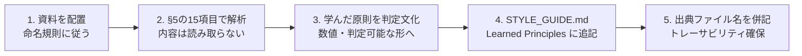

# 参考資料（assets/reference/）管理ルール

`assets/reference/` は、世界トップレベルのレポートが持つ **デザイン思想・情報設計・ストーリー構成を学ぶための参考資料置き場** である。内容を転載・引用するための素材置き場ではない。資料を1本追加するたびに `STYLE_GUIDE.md` の「Learned Principles」へ判定文を1つ以上還元することで、レポート品質が継続的に向上する構造になっている。

| 項目 | 内容 |
|---|---|
| Version | 1.0.0 |
| Status | Active |
| Last Updated | 2026-07-11 |

関連ファイル: [`../SKILL.md`](../SKILL.md)（Step 0-B で本書を参照）/ [`../STYLE_GUIDE.md`](../STYLE_GUIDE.md)（学習成果の還元先）/ [`../EXAMPLES.md`](../EXAMPLES.md)（例の追加ルール）

---

## 1. 大原則（この2行だけは必ず守る）

1. **学ぶのは「どう見せるか」だけ**。レイアウト・構成・要約の型を抽象化して学習する。
2. **「何を書くか」は絶対に学ばない**。文章・数値・図表・分析結果の複製、翻案、言い換えによる流用はすべて禁止する。

判定文: 生成したレポートの任意の段落・表・図について、「参考資料の該当箇所を見なくても、調査結果だけから同じものが書けるか」に**Yes**と答えられること。Noなら流用にあたるため書き直す。

---

## 2. 対応形式

| 形式 | 拡張子 | Claude Codeでの扱い | 推奨対応 |
|---|---|---|---|
| PDF | `.pdf` | Readツールで直接解析可能（`pages` 指定、1回20ページまで） | **推奨形式**。そのまま配置する |
| 画像 | `.png` / `.jpg` | Readツールで視覚的に解析可能 | スライド1枚単位の参考に最適 |
| Markdown | `.md` | 直接読める | Notion書き出しはMarkdown形式を選ぶ |
| HTML / CSV | `.html` / `.csv` | 直接読める（HTMLは構造のみ参考） | Notion書き出しの代替 |
| PowerPoint | `.pptx` | 直接読めない | **PDF書き出しして配置**（元ファイルは置かない） |
| Word | `.docx` | 直接読めない | **PDF書き出しして配置** |

- 1ファイルの上限は **20MB**。超える場合は必要な章のみPDFで抜き出す。
- パスワード保護・DRM付きファイルは配置しない（解析できず、権利上も不適切）。

## 3. 配置方法とディレクトリ

```
assets/reference/
├── consulting/    # 戦略ファーム型の分析資料・提案書
├── ir/            # IR資料・決算説明会資料・投資家向けピッチ
├── design/        # デザインシステム・情報設計・レポートデザイン集
├── media/         # 調査メディア・業界レポートのレイアウト
└── internal/      # 自社の過去レポート（機密区分の確認必須）
```

- サブフォルダは上記5種を基本とし、必要時に追加してよい（追加したら本書の表も更新する）。
- ファイルは必ずいずれかのサブフォルダに置く。`reference/` 直下への直置きは禁止。

## 4. 命名規則

**書式**: `{出典種別}_{テーマ}_{年}.{拡張子}`

- すべて英語の**ケバブケース**（小文字とハイフン）。日本語ファイル名・スペース・全角文字は禁止。
- 正規表現: `^[a-z]+_[a-z0-9-]+_[0-9]{4}\.[a-z]+$`

| 良い例 | 悪い例 | 悪い理由 |
|---|---|---|
| `consulting_market-entry-deck_2025.pdf` | `市場参入資料.pdf` | 日本語・年次なし |
| `ir_saas-growth-deck_2024.pdf` | `IR Deck (final) v2.pdf` | スペース・括弧・バージョン表記 |
| `design_report-layout-guide_2025.pdf` | `dl.pdf` | テーマが不明 |

## 5. 解析対象（学んでよいもの）

以下15項目に限定する。これ以外を目的に資料を開かない。

| # | 学習対象 | 具体的に見るポイント |
|---|---|---|
| 1 | レイアウト | 1ページ内の情報の配置比率、視線移動の順路 |
| 2 | 情報設計 | 情報の階層数、グルーピングの粒度 |
| 3 | 章構成 | 章の順序、章数、章あたりの分量配分 |
| 4 | 見出し構成 | 見出しの階層、メッセージ見出しか名詞見出しか |
| 5 | 図表の使い方 | 主張1つに対する図表の数、図と文章の役割分担 |
| 6 | 余白 | 要素間の間隔の取り方、詰め込み度合い |
| 7 | 文字量 | 1ページ/1セクションあたりの文字数の水準 |
| 8 | タイトル設計 | 結論を含むか、何文字か、サブタイトルとの関係 |
| 9 | 色の考え方 | 使用色数、強調色の使用頻度、意味付けのルール |
| 10 | グラフ選定 | どのデータ型にどの図を当てているか |
| 11 | アイコン利用 | 使用箇所、装飾かステータス表現か |
| 12 | ストーリー構成 | 結論ファーストか、問題提起型か、論の運び方 |
| 13 | 経営者向け表現 | 意思決定に必要な情報の絞り方、選択肢の示し方 |
| 14 | 投資家向け表現 | 市場規模・成長性・リスクの語り方の枠組み |
| 15 | 要約・結論のまとめ方 | Executive Summaryの構成要素と順序 |

## 6. 解析しない対象（禁止事項）

| 禁止行為 | 具体例 |
|---|---|
| 文章の転載・翻案 | 参考資料の一文を言い換えてレポートに使う |
| データ・数値の流用 | 資料内の市場規模・シェア・成長率をそのまま自レポートの根拠にする |
| 図表の複製 | 図の構造とラベルをそのまま再現する |
| 分析結果の再利用 | 資料の結論・提言を自分の分析結果として提示する |
| 固有情報の引用 | 企業名入りの事例・顧客名・未公開情報を記載する |

> **注:** 参考資料に載っていた事実をどうしても使いたい場合は、参考資料を出典にせず、**一次情報源まで遡って自分で確認し、その一次情報を出典として記載する**（`RESEARCH_METHOD.md` の信頼度Tier規定に従う）。

## 7. 著作権・機密への配慮

1. **社外資料**: 権利者の許諾なく再配布可能な状態にしない。privateリポジトリであっても、アクセス権を持つ全員への配布にあたる点を認識する。
2. **社内資料**: 機密区分（社外秘・関係者外秘）を確認し、区分がある資料は原則配置しない。配置する場合は `internal/` に限定し、リポジトリの公開範囲を確認する。
3. **有償資料**: ライセンス条項で再配布・共有が禁じられている調査レポート（有償の業界レポート等）は配置しない。
4. **判断に迷ったら置かない**。代わりに「学んだ原則」だけを `STYLE_GUIDE.md` に書き残せば、資料そのものがなくても品質は向上する。

## 8. 更新フロー（資料追加時に必ず実行）



**追記の書式**（`STYLE_GUIDE.md` §13.2 の表に1行追加する。列は同ファイルの定義に従う）:

```markdown
| 7 | 2026-07-11 | consulting_market-entry-deck_2025.pdf | 章の冒頭に「この章の結論」を3行以内で置く | STYLE_GUIDE §5 |
```

追記後は `STYLE_GUIDE.md` のVersionをパッチ更新する（同ファイル §13.1 の規則）。

- 原則は必ず**判定可能な形**にする。「余白を美しく」ではなく「H2の直前に空行2つ、章末に区切り線」と書く。
- 抽象化されているか確認する: 追記した原則が、元資料を知らない人にも独立して適用できること。
- 元資料を削除しても原則は残る。**資産として残るのは原則であり、ファイルではない**。

## 9. ベストプラクティス

| # | 基準 | 判定 |
|---|---|---|
| 1 | 少数精鋭を維持する | `reference/` 配下は**合計10ファイル以内**。超えたら質の低い順に削除する |
| 2 | 1資料1学び以上 | 配置後にLearned Principlesが1件も増えない資料は削除する |
| 3 | 多様性を持たせる | 同種の資料は3本まで（コンサル型ばかり集めない。IR・デザイン・メディアを混ぜる） |
| 4 | 四半期棚卸し | 3ヶ月ごとに全ファイルを見直し、参照されていない資料を削除する |
| 5 | 新しさより構成の良さ | 古くても情報設計が優れた資料を優先する（内容を使わないため鮮度は無関係） |

## 10. トラブルシューティング

| 症状 | 対応 |
|---|---|
| PDFが読めない（画像PDF） | 該当ページをPNG化して配置し直す |
| ファイルが大きすぎる | 参考にしたい章のみ抽出したPDFを作る |
| pptx/docxしかない | PDF書き出ししてから配置。元ファイルは置かない |
| 学べる点が見つからない | その資料は参考資料として不適格。削除する |
