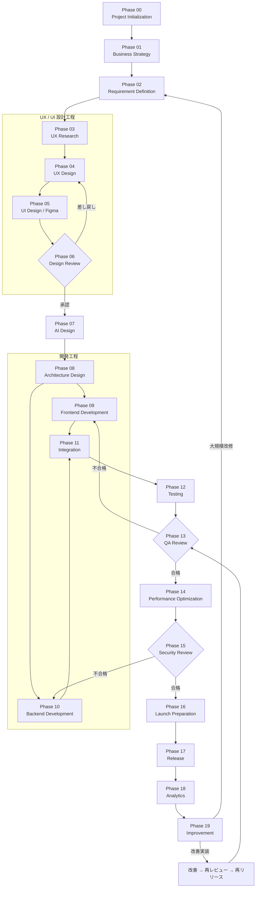
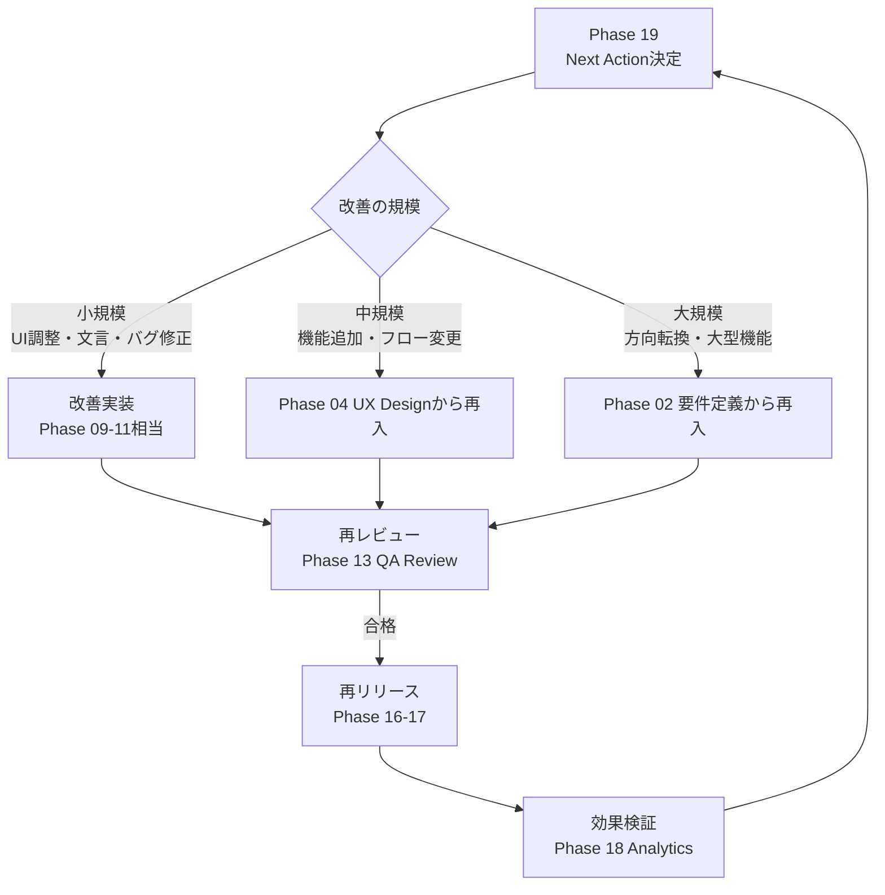

# Development Workflow

> **AI Development Operating System — 標準開発ワークフロー**
>
> AIサービス・Webサービス・SaaS・スマホアプリ・社内システム・AIエージェント、すべてのプロダクト開発に共通で適用する標準フロー。
> このWorkflowに従うだけで、企画からローンチ後の改善までを世界トップクラスの品質で実行できることを目的とする。

| 項目 | 内容 |
|---|---|
| **Version** | 1.0.0 |
| **Status** | Active |
| **Last Updated** | 2026-07-07 |
| **関連ドキュメント** | [`templates/Agent_Base_Template.md`](../templates/Agent_Base_Template.md) |

---

## 目次

1. [目的と原則](#目的と原則)
2. [Workflow全体図](#workflow全体図)
3. [工程一覧](#工程一覧)
4. [共通ルール](#共通ルール)
5. [Phase詳細（00〜19）](#phase-00--project-initialization)
6. [改善ループ](#改善ループloop)
7. [成果物一覧](#成果物一覧)
8. [Version Management](#version-management)

---

## 目的と原則

### 目的

| 目的 | 実現方法 |
|---|---|
| **開発品質の標準化** | 全Phaseに共通のExit Criteria（通過条件）を設け、満たすまで次工程に進まない |
| **属人化の排除** | 全タスク・判断基準・レビュー観点を本ドキュメントに明文化する |
| **Claude Codeによる高速開発** | 各PhaseでAI Tasksを明確化し、AIに委譲できる作業を最大化する |
| **レビュー漏れゼロ** | Phase単位のレビュー＋QA Review（Phase 13）の二重チェック構造にする |
| **ローンチ品質の最大化** | Launch Preparation（Phase 16）で機械的に検証できるチェックリストを通過させる |

### 5つの原則

1. **Exit Criteriaを満たすまで次に進まない** — 手戻りコストは工程が進むほど指数的に増える。ゲートは飛ばさない。
2. **AIは実行、人間は判断** — ブランド・世界観・感情・事業判断・倫理・法務など、価値観を伴う決定は必ず人間が行う。
3. **すべての成果物はGitHubに残す** — 口頭・チャットで決めたことも、対応するPhaseディレクトリのMarkdownに記録する。
4. **レビューは前倒しする** — 後工程での指摘は手戻りが大きい。ドラフト段階で早くレビューを受ける。
5. **ローンチは終わりではなく始まり** — Phase 18-19の改善ループを回し続けることを前提に設計する。

---

## Workflow全体図

**フローの読み方**:
- 基本は Phase 00 → 19 の直列進行。Frontend / Backend（09/10）のみ並行可。
- ひし形（06 / 13 / 15）は**ゲートレビュー**。不合格なら指定Phaseへ差し戻し。
- Phase 19 以降は改善ループ。小規模改善は Phase 13（QA Review）から、大規模改修は Phase 02（要件定義）からやり直す。

---

## 工程一覧

| Phase | 名称 | 主担当ディレクトリ | 主な成果物 | ゲート |
|---|---|---|---|---|
| 00 | Project Initialization | `00_System/` | プロジェクト憲章、リポジトリ | — |
| 01 | Business Strategy | `01_Product/` | 事業戦略書、Lean Canvas | 人間承認 |
| 02 | Requirement Definition | `01_Product/` | PRD、ユーザーストーリー | 人間承認 |
| 03 | UX Research | `02_UX/` | リサーチレポート、ペルソナ | レビュー |
| 04 | UX Design | `02_UX/` | ユーザーフロー、IA、ワイヤーフレーム | レビュー |
| 05 | UI Design（Figma） | `03_UI/` | UIデザイン、デザインシステム、プロトタイプ | レビュー |
| 06 | Design Review | `03_UI/` | デザインレビュー報告書 | **ゲート** |
| 07 | AI Design | `04_AI/` | AI機能設計書、プロンプト設計、評価計画 | レビュー |
| 08 | Architecture Design | `05_Development/` | アーキテクチャ設計書、技術選定書 | 人間承認 |
| 09 | Frontend Development | `05_Development/` | フロントエンドコード | コードレビュー |
| 10 | Backend Development | `05_Development/` | バックエンドコード、API | コードレビュー |
| 11 | Integration | `05_Development/` | 結合済みアプリケーション | 結合テスト |
| 12 | Testing | `06_Test/` | テスト計画、テスト結果 | テスト合格 |
| 13 | QA Review | `06_Test/` | QAレビュー報告書 | **ゲート** |
| 14 | Performance Optimization | `05_Development/` | パフォーマンス改善報告 | 数値基準 |
| 15 | Security Review | `06_Test/` | セキュリティレビュー報告書 | **ゲート** |
| 16 | Launch Preparation | `07_Launch/` | ローンチチェックリスト完了 | チェック全通過 |
| 17 | Release | `07_Launch/` | リリース、運用体制 | 人間承認 |
| 18 | Analytics | `08_Growth/` | KPIダッシュボード、分析レポート | — |
| 19 | Improvement | `08_Growth/` | 改善バックログ、Next Action | 人間承認 |

---

## 共通ルール

### すべてのPhaseに共通する進め方

1. **開始前**: Inputが揃っているかChecklist（開始前）で検証。不足があれば前工程に差し戻す。
2. **作業中**: AI TasksはClaude Code等のAIエージェントに委譲し、Human Tasksは人間が実施する。
3. **完了時**: Deliverablesを対応ディレクトリにコミット → Reviewを実施 → Exit Criteriaを判定。
4. **引き渡し**: [Agent Base Template](../templates/Agent_Base_Template.md) の Handoff Note 形式で次工程へ引き渡す。

### レビューの共通3段階

| Stage | 実施者 | 観点 |
|---|---|---|
| 1. セルフレビュー | 作成したAI/人間 | Exit Criteria・成果物の完全性 |
| 2. クロスレビュー | 次工程の担当Agent | 「この成果物で次工程を開始できるか」 |
| 3. 最終レビュー | 人間（Owner） | 事業判断・ブランド・品質の最終確認 |

### 人間が必ず判断すること（全Phase共通）

以下はAIに委譲してはならない。各PhaseのHuman Tasksにも個別に明記する。

- **ブランド・世界観・感情** — プロダクトが与える印象・トーンの最終決定
- **事業判断** — 予算、スケジュール、スコープ、ピボットの決定
- **倫理** — ユーザーへの影響、ダークパターンの排除、AIの利用範囲
- **法務** — 利用規約、プライバシーポリシー、ライセンス、法規制対応
- **最終承認** — 各ゲート（Phase 06 / 13 / 15 / 17）の通過判定

---

# Phase 00 — Project Initialization

## Goal
プロジェクトの土台（リポジトリ・体制・ルール・ゴール）を確立し、全員が同じ前提で開発を開始できる状態を作る。

## Input
- プロジェクトの発案（アイデアメモ、依頼、課題）
- 本Workflowと Agent Base Template

## Tasks
- プロジェクト憲章の作成（目的・ゴール・非ゴール・制約・期限）
- リポジトリ作成、本OSのディレクトリ構成適用
- 使用ツールの決定（GitHub / Figma / 分析基盤 / デプロイ先）
- 体制の定義（Owner、利用するAgent一覧）

## AI Tasks
- ディレクトリ構成・テンプレートのセットアップ
- プロジェクト憲章のドラフト作成
- 類似プロダクト・市場の初期調査

## Human Tasks
- **プロジェクトの目的とゴールの最終決定**（なぜやるのかはAIには決められない）
- 予算・期限・スコープ上限の決定（事業判断）
- Owner（最終責任者）の任命

## Deliverables
- `00_System/project-charter.md` — プロジェクト憲章
- セットアップ済みリポジトリ

## Review
- Owner がプロジェクト憲章を確認し、「目的・ゴール・非ゴール」に曖昧さがないことを承認する。

## Exit Criteria
- [ ] プロジェクト憲章が承認済み
- [ ] リポジトリと開発環境が全メンバー/Agentから利用可能
- [ ] ゴールと非ゴール（やらないこと）が明文化されている

## Risks
- 目的が曖昧なまま走り出し、後工程で方針が二転三転する
- 「非ゴール」を決めずスコープが際限なく拡大する

## Checklist
**開始前**
- [ ] プロジェクトの発案内容が文章化されている
**作業中**
- [ ] 憲章の各項目（目的/ゴール/非ゴール/制約/期限）を埋めている
- [ ] ツール・体制の決定理由を記録している
**完了後**
- [ ] Exit Criteria をすべて満たした
- [ ] Handoff Note を作成した

## Next Phase
→ **Phase 01: Business Strategy**（プロジェクト憲章を入力として渡す）

---

# Phase 01 — Business Strategy

## Goal
「誰の・どんな課題を・どう解決し・どう収益化するか」を定義し、作る価値のあるプロダクトであることを検証する。

## Input
- プロジェクト憲章（Phase 00）

## Tasks
- 市場調査・競合分析
- ターゲット顧客と課題の仮説定義
- 価値提案（Value Proposition）の定義
- ビジネスモデル・収益モデルの設計（Lean Canvas）
- 成功指標（North Star Metric・KGI/KPI仮説）の設定

## AI Tasks
- 市場・競合のリサーチと比較表の作成
- Lean Canvas のドラフト作成
- 収益シミュレーションの試算
- 類似プロダクトの成功/失敗事例の収集

## Human Tasks
- **事業として取り組むかの最終判断**（Go / No-Go）
- 価値提案とポジショニングの決定（ブランドの根幹）
- 収益モデル・価格戦略の決定（事業判断）
- 倫理面の確認（この事業がユーザー・社会に害を与えないか）

## Deliverables
- `01_Product/business-strategy.md` — 事業戦略書
- `01_Product/lean-canvas.md` — Lean Canvas
- `01_Product/competitor-analysis.md` — 競合分析

## Review
- セルフレビュー: 主張とデータが紐づいているか、推測に「仮説」と明記されているか
- 最終レビュー: Owner が Go / No-Go を判定

## Exit Criteria
- [ ] ターゲット顧客・課題・価値提案が1文で言える状態になっている
- [ ] North Star Metric が定義されている
- [ ] Owner が Go 判定を出した

## Risks
- 競合調査が浅く、既存プロダクトとの差別化が説明できない
- 「自分が欲しいもの」バイアスで市場性を過大評価する
- 収益モデルを後回しにして無料前提の設計が固定化する

## Checklist
**開始前**
- [ ] プロジェクト憲章が承認済みである
**作業中**
- [ ] 競合を最低3つ調査し、比較表にしている
- [ ] 数値は出典を明記している
**完了後**
- [ ] Go / No-Go の判断理由が記録されている
- [ ] Handoff Note を作成した

## Next Phase
→ **Phase 02: Requirement Definition**（事業戦略書・Lean Canvas を渡す）

---

# Phase 02 — Requirement Definition

## Goal
事業戦略を「何を作るか」に翻訳し、開発チーム・Agentの全員が同じゴールを見られるPRD（プロダクト要求仕様書）を完成させる。

## Input
- 事業戦略書、Lean Canvas（Phase 01）

## Tasks
- PRD作成（背景・目的・ターゲット・機能要件・非機能要件）
- ユーザーストーリーの作成（受け入れ基準付き）
- MVPスコープの決定（リリース必須 / 後回しの線引き）
- 制約条件の整理（技術・予算・期限・法規制）

## AI Tasks
- PRDドラフトの作成
- ユーザーストーリーと受け入れ基準の展開
- 機能の依存関係の整理
- 非機能要件（性能・可用性・セキュリティ）の標準項目提案

## Human Tasks
- **MVPスコープの最終決定**（何を捨てるかは事業判断）
- 機能の優先順位付けの承認
- 法務要件の確認（個人情報・決済・業法など該当法規制の洗い出し）

## Deliverables
- `01_Product/prd.md` — PRD
- `01_Product/user-stories.md` — ユーザーストーリー一覧
- `01_Product/mvp-scope.md` — MVPスコープ定義

## Review
- クロスレビュー: UX Research Agent が「この要件でリサーチ設計ができるか」を確認
- 最終レビュー: Owner がスコープを承認

## Exit Criteria
- [ ] すべてのユーザーストーリーに受け入れ基準がある
- [ ] MVP / 将来対応の線引きが明文化されている
- [ ] 非機能要件が数値で定義されている（例: LCP 2.5秒以内）
- [ ] Owner がPRDを承認した

## Risks
- 機能の羅列になり「なぜ作るか」が抜け落ちる
- MVPが肥大化しリリースが遅延する
- 非機能要件が「速い・安全」など曖昧なまま進む

## Checklist
**開始前**
- [ ] 事業戦略書が Go 判定済みである
**作業中**
- [ ] 各機能が North Star Metric にどう寄与するか説明できる
- [ ] 「やらないこと」リストを更新している
**完了後**
- [ ] PRD承認済み・Handoff Note作成済み

## Next Phase
→ **Phase 03: UX Research**（PRD・ユーザーストーリーを渡す）

---

# Phase 03 — UX Research

> **UX工程はこのWorkflowで最も重要な工程群である。** ここでの手抜きは後工程すべての品質を毀損する。
> 参考: Nielsen Norman Group のリサーチ手法、Google UX（HEARTフレームワーク）、行動心理学・認知心理学の知見。

## Goal
ターゲットユーザーの行動・課題・文脈・メンタルモデルを**証拠に基づいて**理解し、デザインの判断根拠を確立する。

## Input
- PRD、ユーザーストーリー（Phase 02）

## Tasks
- リサーチ計画の作成（明らかにしたい問い＝リサーチクエスチョンの定義）
- デスクリサーチ（既存調査・統計・レビュー分析・競合UX分析）
- ユーザーインタビュー / アンケートの設計と実施
- ペルソナの作成（行動・目標・ペイン・利用文脈を含む）
- カスタマージャーニーマップの作成（感情曲線・タッチポイント付き）
- ジョブ理論（JTBD）によるユーザーの「片付けたいジョブ」の定義

## AI Tasks
- リサーチ計画・インタビュースクリプトのドラフト作成
- 競合プロダクトのUX分析（オンボーディング・主要フロー・レビュー分析）
- インタビュー記録の要約・パターン抽出（アフィニティ分析）
- ペルソナ・ジャーニーマップのドラフト作成
- 行動心理学の知見の適用提案（認知負荷、選択のパラドックス、損失回避、社会的証明など）

## Human Tasks
- **実ユーザーへのインタビュー実施**（生の感情・文脈の観察はAIには代替できない）
- リサーチ結果の解釈の最終判断（データの読み違いは人間が防ぐ）
- ペルソナの妥当性判断（「実在しそうか」の肌感覚）
- 倫理確認（調査対象者への配慮、個人情報の扱い）

## Deliverables
- `02_UX/research-plan.md` — リサーチ計画
- `02_UX/research-report.md` — リサーチレポート（発見・示唆・証拠）
- `02_UX/personas.md` — ペルソナ（1〜3体）
- `02_UX/customer-journey.md` — カスタマージャーニーマップ
- `02_UX/jtbd.md` — Jobs to be Done 定義

## Review
- セルフレビュー: すべての発見（Finding）に証拠（発言・データ・観察）が紐づいているか
- クロスレビュー: UX Design Agent が「この情報でフロー設計ができるか」を確認
- 最終レビュー: Owner がペルソナ・ジョブ定義を承認

## Exit Criteria
- [ ] リサーチクエスチョンすべてに回答が出ている（または「わからない」と明記）
- [ ] ペルソナに行動・目標・ペイン・利用文脈が揃っている
- [ ] ジャーニーマップに感情曲線と課題箇所（ペインポイント）がマップされている
- [ ] 発見はすべて証拠に紐づいている（推測には「仮説」と明記）

## Risks
- 作り手に都合の良い「理想ユーザー」を捏造する（確証バイアス）
- インタビューで誘導質問をして欲しい答えを引き出してしまう
- デモグラフィック（年齢・性別）だけのペルソナで行動が読めない
- リサーチ結果が示唆に変換されず「調査しただけ」で終わる

## Checklist
**開始前**
- [ ] リサーチクエスチョンが定義されている
- [ ] PRDのターゲット定義を確認した
**作業中**
- [ ] 誘導質問を避けたオープンクエスチョンで聞いている
- [ ] 発見と解釈（事実と意見）を分けて記録している
**完了後**
- [ ] 各発見がデザインへの示唆（So What）に変換されている
- [ ] Handoff Note を作成した

## Next Phase
→ **Phase 04: UX Design**（リサーチレポート・ペルソナ・ジャーニーマップを渡す）

---

# Phase 04 — UX Design

> 参考: 情報アーキテクチャ（IA）設計原則、Nielsen Norman Group ユーザビリティ10原則、認知心理学（メンタルモデル・認知負荷理論・ヒックの法則・フィッツの法則）。

## Goal
リサーチで得たユーザー理解を、迷わず・ストレスなく・目的を達成できる体験構造（フロー・情報設計・画面骨格）に変換する。

## Input
- リサーチレポート、ペルソナ、ジャーニーマップ、JTBD（Phase 03）
- PRD・ユーザーストーリー（Phase 02）

## Tasks
- ユーザーフロー図の作成（主要タスクごと・正常系/異常系）
- 情報アーキテクチャ（IA）設計 — サイトマップ、ナビゲーション構造、コンテンツ分類
- ワイヤーフレームの作成（全主要画面・状態バリエーション含む）
- インタラクション設計（画面遷移・フィードバック・エラー処理の方針）
- オンボーディング設計（初回体験・Empty State・価値実感までの最短経路）
- ユーザビリティ原則の適用確認（NN/g 10原則をフローに当てる）

## AI Tasks
- ユーザーフロー図（Mermaid）のドラフト作成
- IA・サイトマップの構造化提案
- ワイヤーフレームの構成案（画面ごとの要素・優先順位・状態一覧）
- 認知負荷の観点からのフロー診断（ステップ数・入力項目数・分岐の複雑さ）
- 競合のフローとの比較分析

## Human Tasks
- **体験の「感情の流れ」の最終判断**（どこで安心させ、どこで驚かせるか）
- トレードオフの決定（例: ステップを減らす vs 情報を確実に取得する）
- ワイヤーフレームの構造承認
- ダークパターンの排除確認（倫理: 解約妨害・強制継続などを設計に含めない）

## Deliverables
- `02_UX/user-flows.md` — ユーザーフロー図（正常系・異常系）
- `02_UX/information-architecture.md` — IA・サイトマップ
- `02_UX/wireframes.md` — ワイヤーフレーム（Figmaリンク＋説明）
- `02_UX/interaction-principles.md` — インタラクション設計方針

## Review
**ワイヤーフレームレビュー（本Phaseの必須レビュー）**

| 観点 | 確認内容 |
|---|---|
| タスク完遂性 | ペルソナが各ユーザーストーリーを完遂できるか（フローを指でなぞって検証） |
| 認知負荷 | 1画面の情報量・選択肢数は適切か（ヒックの法則） |
| 一貫性 | ナビゲーション・操作パターンが画面間で統一されているか |
| 異常系 | エラー・空状態・ローディング・オフラインが設計されているか |
| 回復可能性 | 誤操作から戻れるか（Undo・確認・キャンセル） |

- クロスレビュー: UI Design Agent が「このワイヤーでUI設計ができるか」を確認
- 最終レビュー: Owner がフロー・IA・ワイヤーフレームを承認

## Exit Criteria
- [ ] すべてのユーザーストーリーに対応するフローが存在する
- [ ] 主要フローの異常系（エラー・空・ローディング）が設計済み
- [ ] ワイヤーフレームレビューの全観点をパスした
- [ ] リサーチの発見がフロー設計に反映されている（トレーサビリティがある）

## Risks
- 正常系だけ設計して異常系が実装工程で場当たり的に決まる
- 作り手のメンタルモデルで設計し、ユーザーのメンタルモデルと乖離する
- ワイヤー段階でビジュアルに凝り始めて手戻りが増える
- ステップ削減を優先しすぎて必要な確認・安心材料を削る

## Checklist
**開始前**
- [ ] ペルソナ・ジャーニーマップが承認済みである
**作業中**
- [ ] 各画面の目的（ユーザーに何をさせるか）を1文で書ける
- [ ] フローの各ステップで「ユーザーの疑問・不安」を想定している
**完了後**
- [ ] ワイヤーフレームレビュー完了・指摘対応済み
- [ ] Handoff Note を作成した

## Next Phase
→ **Phase 05: UI Design（Figma）**（ワイヤーフレーム・IA・インタラクション方針を渡す）

---

# Phase 05 — UI Design（Figma）

> 参考: Apple Human Interface Guidelines（明瞭さ・尊重・深み）、Google Material Design 3（デザイントークン・コンポーネント体系）、WCAG 2.2（アクセシビリティ）。

## Goal
ワイヤーフレームを、ブランドを体現し・美しく・アクセシブルで・実装可能な高忠実度UIデザインとデザインシステムに仕上げる。

## Input
- ワイヤーフレーム、IA、インタラクション設計方針（Phase 04）
- 事業戦略書のブランド方針（Phase 01）

## Tasks
- デザイントークンの定義（色・タイポグラフィ・スペーシング・角丸・シャドウ・モーション）
- デザインシステムの構築（Figma: コンポーネント・バリアント・Auto Layout）
- 全画面の高忠実度デザイン（状態バリエーション: default / hover / focus / disabled / error / empty / loading）
- レスポンシブ設計（モバイル / タブレット / デスクトップのブレークポイント）
- ダークモード対応（対象プロダクトの場合）
- プロトタイプ作成（Figmaプロトタイプで主要フローを操作可能に）
- アクセシビリティ設計（コントラスト比 4.5:1 以上、タッチターゲット 44pt 以上、フォーカス順序）

## AI Tasks
- デザイントークン体系のドラフト設計
- Figmaでのコンポーネント・画面の構築（Figma MCP等を活用）
- コントラスト比・タッチターゲットの機械的検証
- 状態バリエーションの網羅チェック（漏れの検出）
- HIG / Material Design ガイドラインとの適合診断

## Human Tasks
- **ブランド表現の最終決定**（色・書体・トーンが世界観に合うかは人間の感性で判断）
- **「感情」の判断**（このUIは使っていて心地よいか・信頼できる見た目か）
- ビジュアルの品位の最終確認（余白・リズム・階層の美しさ）
- デザインシステムの命名・構造の承認

## Deliverables
- `03_UI/design-tokens.md` — デザイントークン定義
- `03_UI/design-system.md` — デザインシステム（Figmaリンク＋運用ルール）
- `03_UI/screen-designs.md` — 全画面デザイン（Figmaリンク＋画面一覧）
- `03_UI/prototype.md` — プロトタイプ（Figmaリンク＋検証シナリオ）

## Review
**本Phase内で実施する3つのレビュー**（Phase 06 のゲートレビューとは別に、制作中に随時実施）

| レビュー | タイミング | 観点 |
|---|---|---|
| デザイントークンレビュー | トークン定義直後 | 体系性・拡張性・命名の一貫性 |
| デザインシステムレビュー | コンポーネント構築後 | バリアント網羅・Auto Layout・再利用性 |
| 画面デザインレビュー | 各画面完成ごと | ワイヤーとの整合・状態網羅・アクセシビリティ |

## Exit Criteria
- [ ] 全画面がデザインシステムのコンポーネントで構築されている（一点物の要素が原則ない）
- [ ] 全画面に状態バリエーション（error / empty / loading 含む）が存在する
- [ ] コントラスト比・タッチターゲットがアクセシビリティ基準を満たす
- [ ] 主要フローがプロトタイプで操作できる
- [ ] レスポンシブの全ブレークポイントが設計済み

## Risks
- デザインシステムを作らず画面を量産し、一貫性が崩壊する
- 正常系の画面だけ美しく、エラー・空状態がデザインされない
- 装飾過多で情報の階層が埋もれる（明瞭さ < 見た目）
- アクセシビリティを「後で対応」にして構造的に直せなくなる

## Checklist
**開始前**
- [ ] ワイヤーフレームが承認済みである
- [ ] ブランド方針（トーン&マナー）を確認した
**作業中**
- [ ] 新しい画面を作る前にデザインシステムの既存コンポーネントを確認している
- [ ] ハードコードした色・数値を使っていない（すべてトークン参照）
**完了後**
- [ ] 3つのレビュー（トークン/システム/画面）が完了している
- [ ] Handoff Note を作成した

## Next Phase
→ **Phase 06: Design Review**（全デザイン成果物とプロトタイプを渡す）

---

# Phase 06 — Design Review 🚧ゲート

## Goal
UX/UIの全成果物を統合的にレビューし、「実装する価値のある設計」であることを保証する。不合格なら Phase 04 / 05 へ差し戻す。

## Input
- UX成果物一式（Phase 03-04）、UI成果物一式（Phase 05）

## Tasks
- Figmaレビュー（デザインファイルの品質検査）
- プロトタイプレビュー（ユーザビリティテスト）
- デザインシステムレビュー（実装可能性の検証）
- PRD・リサーチとの整合性検証（トレーサビリティ確認）
- レビュー報告書の作成と合否判定

## AI Tasks
- チェックリストベースの機械的検査（状態網羅・トークン使用率・コントラスト比・命名規則）
- PRDの各要件とデザインの対応表（トレーサビリティマトリクス）の作成
- ヒューリスティック評価のドラフト（NN/g 10原則ベース）
- レビュー報告書のドラフト作成

## Human Tasks
- **プロトタイプを使ったユーザビリティテストの実施・観察**（5人テストで主要な問題の大半は発見できる — NN/g）
- **ブランド・世界観・感情の最終判定**（「このプロダクトらしいか」）
- 合否の最終判定（ゲート通過の承認）
- 差し戻し時の優先順位付け（何を直せば通過できるかを明確に）

## Deliverables
- `03_UI/design-review-report.md` — デザインレビュー報告書（指摘一覧・合否・条件）
- `03_UI/usability-test-results.md` — ユーザビリティテスト結果

## Review

**デザインレビュー表（この表の全項目を判定する）**

| # | レビュー | 観点 | 判定基準 |
|---|---|---|---|
| 1 | **Figmaレビュー** | ファイル構造・命名・Auto Layout・コンポーネント化率 | 実装者が迷わず参照できる |
| 2 | **ワイヤーフレーム整合** | ワイヤーで承認した構造がUIで維持されているか | 構造変更には承認記録がある |
| 3 | **プロトタイプレビュー** | 主要タスクの完遂率・迷い・エラー | テスト参加者がタスクを完遂できる |
| 4 | **デザインシステムレビュー** | トークン・コンポーネントの体系性、実装可能性 | 開発Agentが仕様として使える |
| 5 | **ヒューリスティック評価** | NN/g ユーザビリティ10原則 | 重大違反（タスク阻害）ゼロ |
| 6 | **アクセシビリティ** | WCAG 2.2 AA（コントラスト・フォーカス・代替テキスト方針） | AA基準の設計上の担保 |
| 7 | **ブランド適合** | トーン&マナー・世界観の体現 | Ownerの感性による承認 |
| 8 | **要件トレーサビリティ** | PRDの全要件がデザインでカバーされているか | 対応表に漏れゼロ |

## Exit Criteria
- [ ] レビュー表の全8項目が合格
- [ ] ユーザビリティテストで発見された重大問題（タスク完遂を阻害する問題）がゼロ
- [ ] 指摘事項がすべて「修正済み」または「対応不要（理由記録済み）」
- [ ] Owner がゲート通過を承認した

## Risks
- レビューが「感想会」になり、判定基準のない指摘が飛び交う
- 重大指摘を「リリース後に直す」で通過させ、そのまま放置される
- ユーザビリティテストを省略して作り手の主観だけで合格にする

## Checklist
**開始前**
- [ ] Phase 05 のExit Criteriaが満たされている
- [ ] ユーザビリティテストの参加者・シナリオが準備できている
**作業中**
- [ ] 指摘は「箇所・問題・修正提案」のセットで記録している
- [ ] 判定は基準に基づき、好みの指摘と区別している
**完了後**
- [ ] 合否と条件が報告書に明記されている
- [ ] Handoff Note を作成した

## Next Phase
→ 合格: **Phase 07: AI Design** ／ 不合格: **Phase 04 または 05 へ差し戻し**

---

# Phase 07 — AI Design

## Goal
プロダクトに組み込むAI機能を設計する。モデル選定・プロンプト設計・評価方法・フォールバック・安全性を実装可能なレベルで定義する。

*AI機能を持たないプロダクトの場合、このPhaseはスキップ可（スキップ判断を記録すること）。*

## Input
- PRD（Phase 02）、UXフロー（Phase 04）、UIデザイン（Phase 05-06）

## Tasks
- AI機能の要件定義（何をAIで解くか・解かないか）
- モデル選定（品質・レイテンシ・コストの比較）
- プロンプト設計（システムプロンプト・変数設計・出力フォーマット）
- 評価設計（評価データセット・自動評価・合格基準）
- フォールバック設計（AI失敗時のUX・タイムアウト・リトライ）
- 安全性設計（入力検証・出力フィルタ・悪用対策・レート制限）
- コスト設計（トークン試算・キャッシュ戦略・上限設定）

## AI Tasks
- モデル比較表の作成（ベンチマーク・料金・制約）
- プロンプトのドラフト設計と改善イテレーション
- 評価データセットのドラフト作成
- コスト試算シミュレーション

## Human Tasks
- **AIの利用範囲の倫理判断**（AIに任せてよい判断か・誤答時の被害は許容可能か）
- モデル・コストの最終決定（事業判断）
- 評価合格基準の承認（「どこまでの品質なら出せるか」）
- 法務確認（データの学習利用・プライバシー・生成物の権利）

## Deliverables
- `04_AI/ai-feature-spec.md` — AI機能設計書
- `04_AI/model-selection.md` — モデル選定書（比較と決定理由）
- `04_AI/prompt-design.md` — プロンプト設計書
- `04_AI/evaluation-plan.md` — 評価計画（データセット・基準）
- `04_AI/safety-design.md` — 安全性・フォールバック設計

## Review
- セルフレビュー: 評価基準が数値化されているか、フォールバックが全失敗モードを覆うか
- クロスレビュー: Architecture Agent が「この設計でシステムに組み込めるか」を確認
- 最終レビュー: Owner が品質基準・コスト上限を承認

## Exit Criteria
- [ ] AI機能ごとに評価方法と合格基準（数値）が定義されている
- [ ] すべてのAI呼び出しにフォールバックUXが設計されている
- [ ] コスト上限とアラート閾値が設定されている
- [ ] 安全性リスク（プロンプトインジェクション・有害出力・個人情報）への対策が明記されている

## Risks
- 「AIっぽい機能」を目的化し、ユーザー課題を解いていない
- 評価なしでプロンプトを主観調整し続け品質が安定しない
- 正常系のみ設計し、AI失敗時にUXが崩壊する
- トークンコストが想定を超え利益を圧迫する

## Checklist
**開始前**
- [ ] AIで解く課題がPRDのユーザーストーリーと紐づいている
**作業中**
- [ ] プロンプトの変更は評価結果とセットで記録している
- [ ] 失敗モード（誤答・遅延・拒否・課金失敗）を列挙した
**完了後**
- [ ] 評価計画が実行可能な状態である
- [ ] Handoff Note を作成した

## Next Phase
→ **Phase 08: Architecture Design**（AI機能設計書一式を渡す）

---

# Phase 08 — Architecture Design

## Goal
要件・デザイン・AI設計を実現する技術アーキテクチャを決定し、開発を並行して進められる設計図を完成させる。

## Input
- PRD（Phase 02）、デザイン成果物（Phase 05-06）、AI設計（Phase 07）

## Tasks
- 技術スタック選定（フロントエンド・バックエンド・DB・インフラ・AI）
- システム構成図の作成
- データモデル設計（ER図）
- API設計（エンドポイント・スキーマ・認証）
- 非機能要件の実現方式（性能・可用性・スケーラビリティ・監視）
- 開発規約の策定（コーディング規約・ブランチ戦略・CI/CD）

## AI Tasks
- 技術選定の比較表作成（選定理由・トレードオフ付き）
- システム構成図・ER図・API仕様のドラフト作成
- 開発規約・CI/CD設定のドラフト作成
- セキュリティ設計の標準項目適用（認証・認可・暗号化・秘密管理）

## Human Tasks
- **技術スタックの最終決定**（チームのスキル・採用・長期保守を含む事業判断）
- インフラコストの承認
- ベンダーロックイン・ライセンスのリスク判断

## Deliverables
- `05_Development/architecture.md` — アーキテクチャ設計書（構成図含む）
- `05_Development/tech-stack.md` — 技術選定書
- `05_Development/data-model.md` — データモデル（ER図）
- `05_Development/api-spec.md` — API仕様
- `05_Development/coding-standards.md` — 開発規約

## Review
- セルフレビュー: 全機能要件・非機能要件に実現方式が対応しているか
- クロスレビュー: Frontend / Backend Agent が「この設計で実装を開始できるか」を確認
- 最終レビュー: Owner が技術選定とコストを承認

## Exit Criteria
- [ ] PRDの全要件に対応する技術的実現方式が存在する
- [ ] API仕様がフロント/バック双方の合意フォーマットで定義されている
- [ ] 開発規約・ブランチ戦略・CI/CDが決定している
- [ ] Owner が技術選定を承認した

## Risks
- 流行技術を実績・保守性の検証なしに採用する
- API仕様が曖昧なまま並行開発が始まり結合で破綻する
- 非機能要件（スケール・監視）が後回しになる

## Checklist
**開始前**
- [ ] デザインレビュー（Phase 06）を通過している
**作業中**
- [ ] 技術選定に「不採用の選択肢と理由」を記録している
**完了後**
- [ ] フロント/バック双方がAPI仕様に合意した
- [ ] Handoff Note を作成した

## Next Phase
→ **Phase 09: Frontend Development** と **Phase 10: Backend Development**（並行開始可）

---

# Phase 09 — Frontend Development

## Goal
デザインを忠実に・高性能に・保守可能なコードで実装し、デザインシステムとの一貫性を保ったフロントエンドを完成させる。

## Input
- デザイン成果物（Phase 05-06）、アーキテクチャ・API仕様・開発規約（Phase 08）

## Tasks
- 開発環境・CI/CDセットアップ
- デザイントークン・共通コンポーネントの実装（デザインシステムのコード化）
- 画面実装（全状態: loading / error / empty / success）
- API結合部の実装（モック→実APIの段階結合）
- ユニットテスト・コンポーネントテストの実装
- アクセシビリティ実装（セマンティックHTML・キーボード操作・ARIA）

## AI Tasks
- コンポーネント・画面のコード実装（Claude Code）
- Figmaデザインからのコード生成と忠実度検証
- テストコードの実装
- コードレビュー（規約準拠・重複・複雑度）

## Human Tasks
- 実装されたUIの「触り心地」の確認（アニメーション・レスポンスの感覚的品質）
- デザインとの差異の許容判断（技術制約による妥協の承認）
- コードレビューの最終承認（マージ権限は人間）

## Deliverables
- フロントエンドコード（リポジトリ）
- 実装済みコンポーネントカタログ（Storybook等）
- ユニットテスト（カバレッジレポート付き）

## Review
- AIコードレビュー: 規約準拠・バグ・セキュリティ（XSS等）
- 人間レビュー: PR単位でレビューし、デザイン再現度をFigmaと突き合わせ確認

## Exit Criteria
- [ ] 全画面・全状態が実装されている
- [ ] デザインシステムのトークン・コンポーネントを使用している（ハードコードなし）
- [ ] ユニットテストがCI上でパスしている
- [ ] キーボードのみで主要フローを操作できる

## Risks
- デザインシステムを無視した一点物実装で一貫性が崩れる
- 正常系のみ実装し、エラー・空状態が「あとで」になる
- API仕様の変更に気づかず結合時に手戻りする

## Checklist
**開始前**
- [ ] API仕様・開発規約に合意済みである
**作業中**
- [ ] PRは小さく分割し、レビューを受けてからマージしている
- [ ] 状態網羅（loading/error/empty）をコンポーネント単位で確認している
**完了後**
- [ ] CIグリーン・カバレッジ基準達成
- [ ] Handoff Note を作成した

## Next Phase
→ **Phase 11: Integration**（Backend完了と合流）

---

# Phase 10 — Backend Development

## Goal
API仕様・データモデルに忠実で、安全・高性能・観測可能なバックエンドを完成させる。

## Input
- アーキテクチャ・API仕様・データモデル・開発規約（Phase 08）、AI設計（Phase 07）

## Tasks
- 開発環境・CI/CDセットアップ
- データベース構築・マイグレーション整備
- API実装（認証・認可・バリデーション含む）
- AI機能の組み込み（プロンプト管理・評価パイプライン・フォールバック実装）
- ユニットテスト・APIテストの実装
- ログ・監視・エラートラッキングの実装

## AI Tasks
- API・ビジネスロジックのコード実装（Claude Code）
- テストコード・マイグレーションの実装
- セキュリティ標準実装（入力検証・レート制限・秘密管理）
- コードレビュー（規約準拠・N+1・インジェクション脆弱性）

## Human Tasks
- データ設計の最終確認（後から変えにくい意思決定）
- 個人情報の取り扱い実装の確認（法務要件との整合）
- 外部サービス契約・APIキー管理の決定
- コードレビューの最終承認

## Deliverables
- バックエンドコード（リポジトリ）
- APIドキュメント（実装と同期した状態）
- ユニット/APIテスト（カバレッジレポート付き）

## Review
- AIコードレビュー: 規約・バグ・セキュリティ・パフォーマンス
- 人間レビュー: PR単位・データモデル変更は必須レビュー

## Exit Criteria
- [ ] API仕様書のすべてのエンドポイントが実装・テスト済み
- [ ] 認証・認可・入力検証が全エンドポイントに適用されている
- [ ] ログ・エラートラッキングが動作している
- [ ] マイグレーションで環境を再現できる

## Risks
- API仕様と実装が乖離しフロントの結合が破綻する
- バリデーション・認可漏れがセキュリティ事故につながる
- AI呼び出しの失敗処理が不十分で本番障害になる

## Checklist
**開始前**
- [ ] API仕様・データモデルに合意済みである
**作業中**
- [ ] 仕様変更はAPI仕様書を先に更新してから実装している
- [ ] エラーレスポンスの形式が全エンドポイントで統一されている
**完了後**
- [ ] CIグリーン・カバレッジ基準達成
- [ ] Handoff Note を作成した

## Next Phase
→ **Phase 11: Integration**（Frontend完了と合流）

---

# Phase 11 — Integration

## Goal
フロントエンド・バックエンド・AI機能を結合し、エンドツーエンドで動作するアプリケーションとして成立させる。

## Input
- フロントエンドコード（Phase 09）、バックエンドコード（Phase 10）

## Tasks
- フロント/バックの実API結合（モックの置き換え）
- 環境構築（開発 / ステージング環境の整備）
- E2E動作確認（主要ユーザーフローの通し確認）
- 結合で発覚した不整合の修正
- データフロー・状態管理の整合性確認

## AI Tasks
- 結合作業・不整合の検出と修正（Claude Code）
- E2Eテストシナリオのドラフト作成と自動化
- API仕様と実装の差分検出

## Human Tasks
- ステージング環境での主要フローの手動確認（実際に触って違和感を検知）
- 結合方針の判断（不整合発覚時にフロント/バックどちらを直すか）

## Deliverables
- ステージング環境で動作する結合済みアプリケーション
- `05_Development/integration-notes.md` — 結合時の変更・既知の問題

## Review
- 主要ユーザーフローがステージングで通しで動作することを確認（デモ形式）

## Exit Criteria
- [ ] 全ユーザーストーリーの主要フローがステージングで完遂できる
- [ ] モック・スタブが本番コードパスに残っていない
- [ ] 既知の問題が記録され、ブロッカーがゼロ

## Risks
- 「結合してみたら動かない」— API仕様の解釈差異が噴出する
- 環境差異（ローカルでは動く）による問題の見逃し
- 結合時の応急修正が規約違反のまま残る

## Checklist
**開始前**
- [ ] フロント/バック双方のExit Criteriaが満たされている
**作業中**
- [ ] 発覚した不整合はAPI仕様書に反映している
**完了後**
- [ ] ステージングで主要フローを通しで確認した
- [ ] Handoff Note を作成した

## Next Phase
→ **Phase 12: Testing**

---

# Phase 12 — Testing

## Goal
テスト計画に基づきアプリケーション全体を体系的に検証し、品質の証拠を揃える。

## Input
- 結合済みアプリケーション（Phase 11）、PRD受け入れ基準（Phase 02）、AI評価計画（Phase 07）

## Tasks
- テスト計画の作成（範囲・種類・環境・基準）
- 機能テスト（全ユーザーストーリーの受け入れ基準検証）
- E2Eテストの整備・実行
- AI機能の評価実行（Phase 07の評価計画に基づく）
- 回帰テストスイートの整備
- 異常系テスト（ネットワーク断・タイムアウト・不正入力・境界値）

## AI Tasks
- テストケースの網羅的生成（正常系・異常系・境界値）
- E2E/回帰テストの自動化実装
- AI機能の自動評価実行とレポート生成
- バグの再現手順整理と修正実装

## Human Tasks
- 探索的テストの実施（シナリオ外の「意地悪な操作」は人間の直感が有効）
- バグの優先度判定（修正必須 / リリース後対応の線引きは事業判断）
- AI評価結果の合否承認

## Deliverables
- `06_Test/test-plan.md` — テスト計画
- `06_Test/test-cases.md` — テストケース一覧
- `06_Test/test-results.md` — テスト結果（バグ一覧・対応状況）
- `06_Test/ai-evaluation-results.md` — AI機能評価結果

## Review
- テスト結果レビュー: 未修正バグの残留リスクを判定し、対応方針（修正/許容）を全件決定する

## Exit Criteria
- [ ] 全ユーザーストーリーの受け入れ基準がテストでパスした
- [ ] AI機能が評価計画の合格基準を満たした
- [ ] Critical / High のバグがゼロ
- [ ] 残存バグ全件に対応方針が記録されている

## Risks
- 正常系テストだけで「テスト済み」と判断する
- テストデータが本番データの多様性を反映していない
- バグ修正が新たなバグを生む（回帰テスト不足）

## Checklist
**開始前**
- [ ] テスト計画がレビュー済みである
**作業中**
- [ ] バグは再現手順付きで記録している
- [ ] 修正後に回帰テストを回している
**完了後**
- [ ] テスト結果が証拠（ログ・スクリーンショット）付きで記録されている
- [ ] Handoff Note を作成した

## Next Phase
→ **Phase 13: QA Review**

---

# Phase 13 — QA Review 🚧ゲート

## Goal
プロダクト全体を10の品質領域から横断レビューし、リリース候補としての品質を保証する。不合格なら該当工程へ差し戻す。

## Input
- テスト済みアプリケーション・テスト結果（Phase 12）、全工程の成果物

## Tasks
- 10領域のQAレビュー実施（下表）
- 指摘事項の記録と修正確認
- QAレビュー報告書の作成と合否判定

## AI Tasks
- 機械的検査の実行（Lighthouse・axe・リンクチェック・コード静的解析）
- 各領域のチェックリスト検査とレポート生成
- 指摘事項の修正実装

## Human Tasks
- **UX/UIの最終的な体験品質の判定**（数値化できない「使い心地」）
- 指摘の重大度判定と差し戻し判断
- ゲート通過の最終承認

## Deliverables
- `06_Test/qa-review-report.md` — QAレビュー報告書（10領域の判定・指摘・対応）

## Review

**QAレビュー表（10領域すべてを判定する）**

| # | 領域 | レビュー観点 | 合格基準の例 |
|---|---|---|---|
| 1 | **UI** | デザイン再現度・一貫性・状態網羅 | Figmaとの差異が承認済みのみ |
| 2 | **UX** | フロー完遂性・迷いポイント・エラー回復 | 主要タスク完遂率100%（テストシナリオ） |
| 3 | **AI** | 評価基準達成・フォールバック動作・安全性 | 評価合格＋失敗時UX動作確認済み |
| 4 | **Frontend** | コード品質・状態管理・コンソールエラー | 規約準拠・コンソールエラーゼロ |
| 5 | **Backend** | API整合・データ整合・エラー処理・ログ | 全API仕様準拠・構造化ログ出力 |
| 6 | **Performance** | Core Web Vitals・API応答時間 | LCP≦2.5s / INP≦200ms / CLS≦0.1 |
| 7 | **Accessibility** | WCAG 2.2 AA・キーボード操作・スクリーンリーダー | axe重大違反ゼロ＋手動確認 |
| 8 | **SEO** | メタタグ・構造化データ・sitemap・インデックス制御 | Lighthouse SEO 90+ |
| 9 | **Analytics** | イベント計測の発火・KPI取得可能性 | 定義済みイベント全件発火確認 |
| 10 | **Security** | 認証認可・入力検証・依存脆弱性（一次確認） | 既知の重大脆弱性ゼロ（詳細はPhase 15） |

## Exit Criteria
- [ ] 10領域すべてが合格基準を満たした
- [ ] 指摘事項がすべて「修正済み」または「許容（理由記録済み）」
- [ ] Owner がゲート通過を承認した

## Risks
- 領域ごとの担当が曖昧でレビュー漏れが発生する
- 数値基準のない領域（UX等）が主観で甘く判定される
- 差し戻しコストを恐れて「条件付き合格」を乱発する

## Checklist
**開始前**
- [ ] Phase 12 のExit Criteriaが満たされている
**作業中**
- [ ] 各領域の判定に証拠（計測結果・スクリーンショット）を添付している
**完了後**
- [ ] 報告書に10領域の判定がすべて記録されている
- [ ] Handoff Note を作成した

## Next Phase
→ 合格: **Phase 14: Performance Optimization** ／ 不合格: **該当Phase（09-12）へ差し戻し**

---

# Phase 14 — Performance Optimization

## Goal
実測データに基づいてボトルネックを特定・改善し、パフォーマンス目標値を安定して達成する。

## Input
- QA通過済みアプリケーション、Performanceレビュー結果（Phase 13）

## Tasks
- パフォーマンス計測（Core Web Vitals・API応答・DBクエリ・AI応答時間）
- ボトルネックの特定と優先順位付け
- 改善実施（バンドルサイズ・画像最適化・キャッシュ・クエリ改善・CDN）
- 負荷テスト（想定ピークトラフィックでの動作検証）

## AI Tasks
- 計測・プロファイリングの実行とボトルネック分析
- 最適化の実装（コード分割・遅延読み込み・インデックス追加等）
- 負荷テストシナリオの作成・実行

## Human Tasks
- 最適化とコストのトレードオフ判断（インフラ増強 vs 実装改善）
- 「体感speed」の確認（数値が良くても体感が悪いケースの検知）

## Deliverables
- `05_Development/performance-report.md` — 計測結果・改善内容・達成値

## Review
- 改善前後の計測値を比較し、目標値の達成をデータで確認する。

## Exit Criteria
- [ ] Core Web Vitals が目標値を満たす（実機・実回線での計測）
- [ ] 想定ピーク負荷で応答時間・エラー率が基準内
- [ ] 改善内容が回帰テストをパスしている

## Risks
- ローカル環境の数値だけで判断し実ユーザー環境で遅い
- 過剰最適化でコードが複雑化し保守性を損なう
- 負荷テストを省略しローンチ直後に落ちる

## Checklist
**開始前**
- [ ] 計測環境（実機・回線条件）が定義されている
**作業中**
- [ ] 改善は1つずつ適用し、効果を計測してから次に進んでいる
**完了後**
- [ ] 目標達成の証拠（計測データ）が記録されている
- [ ] Handoff Note を作成した

## Next Phase
→ **Phase 15: Security Review**

---

# Phase 15 — Security Review 🚧ゲート

## Goal
セキュリティ観点の体系的レビューを実施し、ユーザーと事業を守れる状態であることを保証する。不合格なら該当工程へ差し戻す。

## Input
- パフォーマンス最適化済みアプリケーション（Phase 14）

## Tasks
- OWASP Top 10 ベースの脆弱性レビュー
- 認証・認可の検証（権限昇格・セッション管理・多要素認証）
- データ保護の検証（暗号化・個人情報の取り扱い・バックアップ）
- AI固有のセキュリティ検証（プロンプトインジェクション・出力経由の攻撃・データ漏洩）
- 依存パッケージの脆弱性スキャン
- 秘密情報管理の確認（APIキー・環境変数・リポジトリ内の混入チェック）
- インシデント対応手順の整備

## AI Tasks
- 静的解析・依存関係スキャン・設定ミス検査の実行
- OWASPチェックリストベースの検査とレポート生成
- 発見された脆弱性の修正実装

## Human Tasks
- **リスク許容の最終判断**（残存リスクを受容してリリースするかは事業判断）
- 法務要件の最終確認（プライバシーポリシー・利用規約と実装の整合）
- インシデント対応体制の承認（誰が・いつ・どう動くか）
- ゲート通過の最終承認

## Deliverables
- `06_Test/security-review-report.md` — セキュリティレビュー報告書
- `07_Launch/incident-response.md` — インシデント対応手順

## Review
- 重大度（Critical / High / Medium / Low）で全指摘を分類し、Critical / High は修正必須とする。

## Exit Criteria
- [ ] Critical / High の脆弱性がゼロ
- [ ] 個人情報の取り扱いがプライバシーポリシーと一致している
- [ ] 秘密情報がリポジトリ・クライアントコードに含まれていない
- [ ] インシデント対応手順が整備されている
- [ ] Owner がゲート通過を承認した

## Risks
- 「内部ツールだから」とセキュリティを省略し、後に外部公開されて事故になる
- AI機能経由の情報漏洩（プロンプトインジェクション）を見落とす
- 指摘修正が期限切れで放置される

## Checklist
**開始前**
- [ ] 検査対象（ドメイン・API・依存関係）の一覧がある
**作業中**
- [ ] 指摘は重大度付きで記録している
**完了後**
- [ ] Critical / High ゼロを確認した
- [ ] Handoff Note を作成した

## Next Phase
→ 合格: **Phase 16: Launch Preparation** ／ 不合格: **該当Phase（09-11）へ差し戻し**

---

# Phase 16 — Launch Preparation

## Goal
ローンチに必要なすべての項目を機械的に検証し、「リリースボタンを押すだけ」の状態を作る。

## Input
- 全ゲート通過済みアプリケーション（Phase 15）

## Tasks
- ローンチチェックリストの全項目検証（下記）
- 本番環境の最終構築・デプロイリハーサル
- ロールバック手順の整備とテスト
- サポート体制・告知物の準備

## AI Tasks
- チェックリストの機械的検証（メタタグ・OGP・404/500・リンク切れ・速度計測）
- デプロイスクリプト・ロールバック手順の整備
- 告知文・ヘルプドキュメントのドラフト作成

## Human Tasks
- **ローンチ日・告知戦略の決定**（事業判断）
- 利用規約・プライバシーポリシー・特商法表記の最終確認（法務）
- 決済の実流通テスト（実カードでの購入・返金確認）
- ロールバック判断基準の承認

## Deliverables
- `07_Launch/launch-checklist.md` — 検証済みローンチチェックリスト
- `07_Launch/rollback-plan.md` — ロールバック手順
- `07_Launch/release-plan.md` — リリース計画（日時・手順・体制）

## Review

**ローンチチェックリスト（全項目必須。対象外の項目は「N/A＋理由」を記録）**

### 検索・共有
- [ ] **SEO**: タイトル・ディスクリプション・構造化データ・sitemap.xml・robots.txt
- [ ] **OGP**: og:title / og:image / og:description、Twitter Card、実際の共有プレビュー確認
- [ ] 検索エンジンへのインデックス設定（公開範囲の意図と一致）

### 計測・法令
- [ ] **Analytics**: 計測タグ動作・主要イベント発火・コンバージョン設定
- [ ] **Cookie**: Cookie同意バナー・オプトアウト動作（対象地域の法令準拠）
- [ ] 利用規約・プライバシーポリシー・特商法表記の公開

### エラー・表示
- [ ] **404ページ**: デザイン済み・主要導線への復帰リンクあり
- [ ] **500ページ**: デザイン済み・ユーザーへの案内あり
- [ ] **レスポンシブ**: 全ブレークポイント・主要実機での表示確認
- [ ] **表示速度**: 本番環境でのCore Web Vitals達成確認

### 機能・決済
- [ ] **決済**: 本番決済の実流通テスト（購入・返金・領収書）
- [ ] **通知**: プッシュ通知・アプリ内通知の実機受信確認
- [ ] **メール**: 送信ドメイン認証（SPF/DKIM/DMARC）・全トランザクションメールの受信確認

### 運用
- [ ] **ログ**: 構造化ログが本番で収集されている
- [ ] **監視**: 死活監視・アラート通知先・エスカレーション設定
- [ ] **エラートラッキング**: 本番エラーの収集・通知動作確認
- [ ] バックアップ・リストア手順の動作確認
- [ ] ロールバック手順のリハーサル完了

## Exit Criteria
- [ ] ローンチチェックリスト全項目が ✅ または N/A（理由付き）
- [ ] デプロイ・ロールバックのリハーサルが完了している
- [ ] リリース計画（日時・手順・体制・中止基準）が承認済み

## Risks
- チェックを「たぶん大丈夫」で飛ばし、公開直後に発覚する
- 本番環境と検証環境の差異（環境変数・ドメイン設定）による事故
- ロールバック手順が未検証で、障害時に戻せない

## Checklist
**開始前**
- [ ] Phase 15 のゲートを通過している
**作業中**
- [ ] チェックは本番（相当）環境で実施している
**完了後**
- [ ] 全項目の検証証拠が記録されている
- [ ] Handoff Note を作成した

## Next Phase
→ **Phase 17: Release**

---

# Phase 17 — Release

## Goal
計画に基づき安全にリリースを実行し、公開直後の初期監視で問題の早期検知・即応を行う。

## Input
- リリース計画・検証済みチェックリスト（Phase 16）

## Tasks
- リリース実行（段階的公開が可能なら カナリア → 全体 の順）
- 公開直後の集中監視（エラー率・応答時間・主要フロー・決済）
- 告知の実施（プレスリリース・SNS・既存ユーザー通知）
- 初期ユーザーフィードバックの収集開始

## AI Tasks
- デプロイの実行・監視ダッシュボードの確認
- 公開直後の異常検知（エラー急増・パフォーマンス劣化のアラート分析）
- 初期フィードバックの収集・分類

## Human Tasks
- **リリース実行の最終承認（Go / No-Go）**
- **ロールバックの判断**（中止基準に達した場合の決断）
- 告知内容・タイミングの最終確認（ブランド・広報判断）

## Deliverables
- 公開されたプロダクト
- `07_Launch/release-log.md` — リリース記録（日時・バージョン・問題・対応）

## Review
- リリース後24-72時間の監視レポートを確認し、安定稼働を宣言する。

## Exit Criteria
- [ ] 本番で主要フローが動作している（リリース直後の実確認）
- [ ] エラー率・応答時間が基準内で安定している（24時間以上）
- [ ] 重大インシデントが発生していない（発生時は対応完了している）

## Risks
- 金曜夜・深夜など対応困難な時間帯のリリース
- 公開直後のトラフィック急増による障害
- 問題発生時にロールバック判断が遅れ被害が拡大する

## Checklist
**開始前**
- [ ] リリース体制（担当・連絡手段・中止基準）が確認済み
**作業中**
- [ ] 監視ダッシュボードを常時確認している
**完了後**
- [ ] リリース記録を作成した
- [ ] Handoff Note を作成した

## Next Phase
→ **Phase 18: Analytics**

---

# Phase 18 — Analytics

## Goal
プロダクトの実際の利用状況をKPIで定量把握し、改善の意思決定に使える分析レポートを継続的に生成する。

## Input
- 公開済みプロダクト・計測データ（Phase 17）、North Star Metric・KPI仮説（Phase 01）

## Tasks
- KPIダッシュボードの構築
- 定例分析レポートの作成（週次/月次）
- コンバージョンファネルの分析（離脱ポイントの特定）
- ユーザーセグメント別の行動分析
- 定性フィードバック（レビュー・問い合わせ）との突き合わせ

## AI Tasks
- ダッシュボード構築・データパイプライン整備
- 定例レポートの自動生成（変化点・異常値の検出コメント付き）
- ファネル分析・コホート分析の実行
- 定性フィードバックの分類・要約

## Human Tasks
- KPI変化の解釈の最終判断（数字の裏の「なぜ」の仮説立て）
- 分析の優先順位付け（どの指標の深掘りに投資するか）

## Deliverables
- `08_Growth/kpi-dashboard.md` — KPIダッシュボード定義（リンク・指標定義）
- `08_Growth/analytics-report.md` — 分析レポート（定例更新）

## Review
- レポートの数値定義・集計ロジックの正しさを検証する（計測バグは意思決定を狂わせる）。

### 必須KPI定義

| KPI | 定義 | 見るポイント |
|---|---|---|
| **CVR** | コンバージョン数 ÷ 訪問数 | ファネル全体と各ステップの変化 |
| **Retention** | N日後継続率（D1 / D7 / D30） | プロダクト価値の実感度 |
| **LTV** | 顧客生涯価値（平均収益 × 継続期間） | CAC（顧客獲得コスト）との比率 |
| **DAU / MAU** | 日次/月次アクティブユーザー | DAU/MAU比率でスティッキネスを測る |
| **Session** | セッション数・平均セッション時間 | エンゲージメントの深さ |
| **Exit Rate** | ページ/画面ごとの離脱率 | 想定外の離脱箇所の発見 |
| **Drop Rate** | ファネル各ステップの脱落率 | 改善対象ステップの特定 |
| **Conversion Funnel** | 流入→活性化→転換→継続の各段階通過率 | ボトルネック段階の特定 |

## Exit Criteria
- [ ] 必須KPIすべてがダッシュボードで確認できる
- [ ] 計測値の正しさが検証済み（テスト計測との一致確認）
- [ ] 最初の分析レポートが作成され、改善候補が1つ以上抽出されている

## Risks
- 計測バグに気づかず誤ったデータで意思決定する
- 指標を眺めるだけで示唆（So What）に変換されない
- バニティメトリクス（見栄えの良い数字）に注目し本質的KPIを見失う

## Checklist
**開始前**
- [ ] KPIの定義・集計ロジックが文書化されている
**作業中**
- [ ] 異常値は原因（計測バグ/実変化）を切り分けている
**完了後**
- [ ] レポートに「次に調べるべき問い」が含まれている
- [ ] Handoff Note を作成した

## Next Phase
→ **Phase 19: Improvement**

---

# Phase 19 — Improvement

## Goal
分析データから改善案を体系的に生成・優先順位付けし、ROIに基づくNext Actionを決定して改善ループを回す。

## Input
- 分析レポート・KPIデータ（Phase 18）、ユーザーフィードバック

## Tasks
改善パイプライン（下記4ステップ）を実行する。

1. **改善案の生成** — KPIボトルネック・ユーザーフィードバック・ヒートマップ等から改善仮説を列挙
2. **優先順位付け** — RICEスコア（Reach × Impact × Confidence ÷ Effort）で定量評価
3. **ROI試算** — 改善による期待効果（KPI改善幅 × 事業インパクト）と実装コストを試算
4. **Next Action決定** — 上位施策を改善バックログ化し、実行計画に落とす

## AI Tasks
- KPIデータからの改善仮説の自動生成（離脱箇所・エラー箇所・遅延箇所ベース）
- RICEスコアの試算と優先順位表の自動生成
- ROI試算シミュレーション
- 改善バックログ・Next Actionドラフトの自動出力

## Human Tasks
- **改善仮説の妥当性判断**（データの相関と因果の混同をチェック）
- **実行する施策の最終決定**（リソース配分は事業判断）
- ブランド・体験に影響する改善の承認（数値が良くても世界観を壊す施策は却下）

## Deliverables
- `08_Growth/improvement-backlog.md` — 改善バックログ（RICEスコア・ROI付き）
- `08_Growth/next-actions.md` — Next Action（施策・担当・期限・期待効果）

## Review
- 優先順位の根拠（スコアの入力値）が妥当かをレビューする。恣意的なスコア操作を防ぐ。

## Exit Criteria
- [ ] 改善案がRICEスコア・ROI付きでバックログ化されている
- [ ] Next Action（次に実行する施策）が決定し、期待効果が数値で定義されている
- [ ] 各施策に「効果検証の方法」が定義されている

## Risks
- 思いつきの改善案が優先され、データ起点の改善が後回しになる
- 施策を実行して効果検証しない「打ちっぱなし」
- 局所最適（1画面のCVR）がプロダクト全体の体験を損なう

## Checklist
**開始前**
- [ ] 最新の分析レポートが揃っている
**作業中**
- [ ] 各改善案に根拠データを紐づけている
**完了後**
- [ ] Next Actionに効果検証方法が定義されている
- [ ] 改善ループ（下記）への接続を確認した

## Next Phase
→ **改善ループ**（下記）へ。改善実装は規模に応じて Phase 02 または Phase 09 から再入する。

---

## 改善ループ（Loop）

Phase 19 で決定した施策は、以下のループで実装・再リリースする。**改善でも品質ゲートは省略しない。**

### ループの運用ルール

1. **規模判定**: 改善の影響範囲で再入Phaseを決める（表参照）。判断に迷えば大きい方の規模として扱う。
2. **再レビュー必須**: どんな小さな改善でも Phase 13（QA Review）の関連領域は再検証する。
3. **効果検証必須**: 再リリース後、Phase 19 で定義した「効果検証の方法」でKPI変化を測定し、結果を `08_Growth/improvement-backlog.md` に記録する。
4. **学びの資産化**: 成功/失敗にかかわらず、施策の結果は `examples/` に事例として蓄積し、次の改善仮説の精度を上げる。

| 改善規模 | 例 | 再入Phase | 再レビュー範囲 |
|---|---|---|---|
| 小規模 | 文言修正・UI調整・軽微なバグ修正 | 実装（09-11相当） | QA該当領域＋回帰テスト |
| 中規模 | 機能追加・フロー変更・画面追加 | Phase 04（UX Design） | Design Review＋QA全領域 |
| 大規模 | ピボット・大型機能・アーキテクチャ変更 | Phase 02（要件定義） | 全ゲート |

---

## 成果物一覧

| Phase | 成果物 | パス |
|---|---|---|
| 00 | プロジェクト憲章 | `00_System/project-charter.md` |
| 01 | 事業戦略書 / Lean Canvas / 競合分析 | `01_Product/business-strategy.md` ほか |
| 02 | PRD / ユーザーストーリー / MVPスコープ | `01_Product/prd.md` ほか |
| 03 | リサーチ計画 / レポート / ペルソナ / ジャーニーマップ / JTBD | `02_UX/research-*.md` ほか |
| 04 | ユーザーフロー / IA / ワイヤーフレーム / インタラクション方針 | `02_UX/user-flows.md` ほか |
| 05 | デザイントークン / デザインシステム / 画面デザイン / プロトタイプ | `03_UI/design-*.md` ほか |
| 06 | デザインレビュー報告書 / ユーザビリティテスト結果 | `03_UI/design-review-report.md` ほか |
| 07 | AI機能設計書 / モデル選定 / プロンプト設計 / 評価計画 / 安全性設計 | `04_AI/ai-feature-spec.md` ほか |
| 08 | アーキテクチャ / 技術選定 / データモデル / API仕様 / 開発規約 | `05_Development/architecture.md` ほか |
| 09-11 | フロントエンド / バックエンド / 結合済みアプリ | リポジトリ + `05_Development/integration-notes.md` |
| 12 | テスト計画 / テストケース / テスト結果 / AI評価結果 | `06_Test/test-*.md` ほか |
| 13 | QAレビュー報告書 | `06_Test/qa-review-report.md` |
| 14 | パフォーマンス改善報告 | `05_Development/performance-report.md` |
| 15 | セキュリティレビュー報告書 / インシデント対応手順 | `06_Test/security-review-report.md` ほか |
| 16 | ローンチチェックリスト / ロールバック手順 / リリース計画 | `07_Launch/launch-checklist.md` ほか |
| 17 | リリース記録 | `07_Launch/release-log.md` |
| 18 | KPIダッシュボード / 分析レポート | `08_Growth/kpi-dashboard.md` ほか |
| 19 | 改善バックログ / Next Action | `08_Growth/improvement-backlog.md` ほか |

---

## Version Management

| Version | 日付 | 変更内容 | 担当 |
|---|---|---|---|
| 1.0.0 | 2026-07-07 | 初版作成（Phase 00-19＋改善ループ） | Claude Code + Owner |

### 運用ルール

- 本Workflowの変更は Pull Request で行い、Owner の承認を必須とする
- Phase構成の変更（追加・削除・順序変更）は Major バージョンアップとする
- 各プロジェクトでの運用から得た改善は、四半期ごとに本Workflowへ還元する

---

## References

| 参照元 | 適用箇所 |
|---|---|
| [Apple Human Interface Guidelines](https://developer.apple.com/design/human-interface-guidelines/) | Phase 05-06（明瞭さ・一貫性・アクセシビリティ） |
| [Google Material Design 3](https://m3.material.io/) | Phase 05（デザイントークン・コンポーネント体系） |
| [Google UX / HEART Framework](https://research.google/) | Phase 03, 18（UX指標の設計） |
| [Nielsen Norman Group](https://www.nngroup.com/) | Phase 03-06（リサーチ手法・ユーザビリティ10原則・5人テスト） |
| [WCAG 2.2](https://www.w3.org/TR/WCAG22/) | Phase 05, 13（アクセシビリティ基準） |
| [OWASP Top 10](https://owasp.org/www-project-top-ten/) | Phase 15（セキュリティレビュー） |
| [Core Web Vitals](https://web.dev/vitals/) | Phase 13-14（パフォーマンス基準） |
| [Linear Method](https://linear.app/method) | 全体（品質と速度の両立・小さなイテレーション） |
| [Stripe](https://stripe.com/docs) | Phase 08-10（API設計・ドキュメント品質） |
| [Anthropic](https://www.anthropic.com/) | Phase 07(AI設計・評価・安全性) |
| [RICE Framework (Intercom)](https://www.intercom.com/blog/rice-simple-prioritization-for-product-managers/) | Phase 19（優先順位付け） |

---

*This workflow is part of the AI Development Operating System.*
*Maintained in: `00_System/Development_Workflow.md`*
