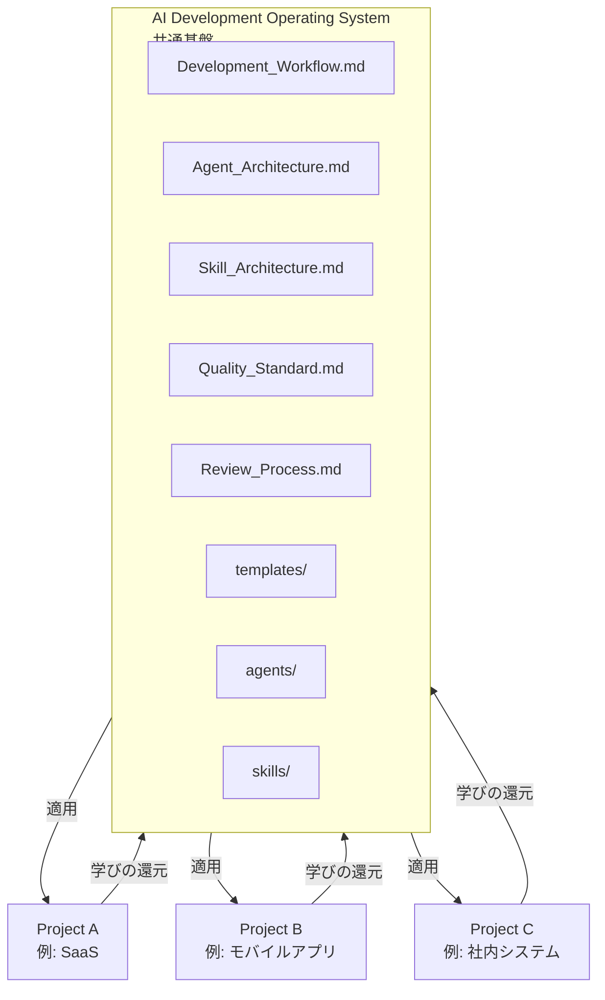
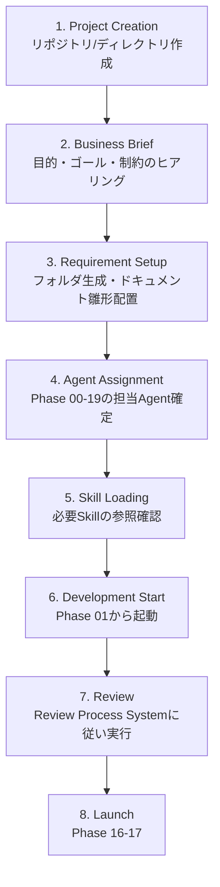
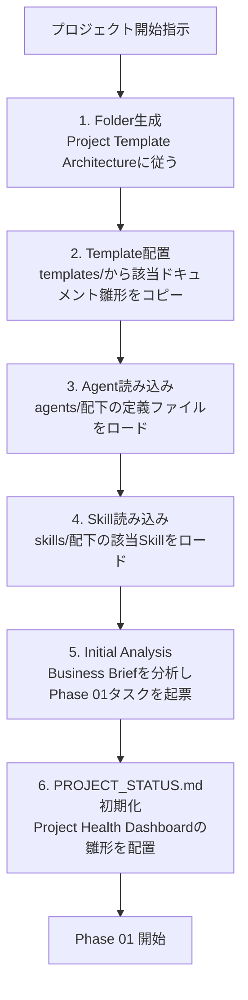
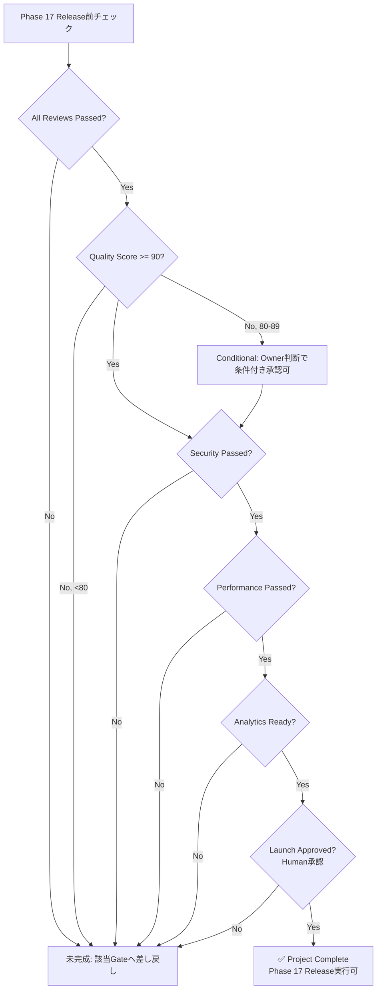

# Project Template System

> **AI Development Operating System — 実案件適用テンプレート**
>
> 本OS（Workflow / Agent / Skill / Quality / Review）を実際のプロジェクトに適用するための標準構造。
> 新規プロジェクトは本テンプレートに従ってフォルダ・ドキュメント・Agent/Skillの割当を初期化し、どのサービスを作っても同じ構造・同じ品質基準で開発できる状態を作る。

| 項目 | 内容 |
|---|---|
| **Version** | 1.0.0 |
| **Status** | Active |
| **Last Updated** | 2026-07-08 |
| **関連ドキュメント** | [`Development_Workflow.md`](./Development_Workflow.md) / [`Agent_Architecture.md`](./Agent_Architecture.md) / [`Skill_Architecture.md`](./Skill_Architecture.md) / [`Quality_Standard.md`](./Quality_Standard.md) / [`Review_Process.md`](./Review_Process.md) |

---

## 目次

1. [設計思想](#設計思想)
2. [Project Template Architecture（フォルダ構造）](#project-template-architectureフォルダ構造)
3. [Phase Integration（Phase×フォルダ×ドキュメント×Agent×Skill）](#phase-integration)
4. [Project Initialization Flow](#project-initialization-flow)
5. [Required Documents](#required-documents)
6. [Claude Code Integration](#claude-code-integration)
7. [Project Rules](#project-rules)
8. [Project Health Dashboard](#project-health-dashboard)
9. [Project Completion Definition](#project-completion-definition)
10. [Version Management](#version-management)

---

## 設計思想

| 目的 | 実現方法 |
|---|---|
| **新規サービス開発の高速化** | フォルダ・ドキュメント・Agent/Skill割当をテンプレート化し、初期化作業をゼロにする |
| **プロジェクト構造の標準化** | どのプロジェクトも同じ13ディレクトリ構成にし、Claude Codeが迷わず参照できる状態にする |
| **品質基準の自動適用** | プロジェクト初期化時に [`Quality_Standard.md`](./Quality_Standard.md) と [`Review_Process.md`](./Review_Process.md) をプロジェクトに紐づける |
| **Claude Codeによる再現性のある開発** | Initialization FlowとExecution Flowを固定手順化し、誰が実行しても同じ初期状態になる |
| **複数サービス展開可能な基盤作成** | プロジェクト固有情報は各プロジェクトのディレクトリに閉じ込め、`00_System/` `templates/` `agents/` `skills/` は全プロジェクト共通の基盤として維持する |

### 本OSとプロジェクトの関係



- **共通基盤（`00_System/` `templates/` `agents/` `skills/`）は変更しない** — プロジェクト側が基盤を参照する一方向が基本
- **学びの還元だけが逆方向** — プロジェクトで得た改善は、Skillの `examples/` やテンプレートの改訂としてのみ基盤に戻す（[`Skill_Architecture.md — 継続改善`](./Skill_Architecture.md) 参照）
- プロジェクト本体は本リポジトリ内に作る場合は `projects/{project-name}/` 配下、別リポジトリで管理する場合は本テンプレートを新規リポジトリのルートにコピーする

---

## Project Template Architecture（フォルダ構造）

新規プロジェクト作成時に生成する標準フォルダ構造。

```
{Project_Name}/
├── README.md                      # プロジェクト概要（本テンプレートのプロジェクト版）
├── PROJECT_STATUS.md              # Project Health Dashboard（常時更新）
│
├── docs/                          # プロジェクト固有の補足ドキュメント・議事録
│
├── strategy/                      # Phase 00-01: 事業戦略
│   ├── project-charter.md
│   ├── business-strategy.md
│   ├── lean-canvas.md
│   ├── market-research.md
│   └── competitor-analysis.md
│
├── requirements/                  # Phase 02: 要件定義
│   ├── prd.md
│   ├── user-stories.md
│   ├── mvp-scope.md
│   └── decision-log.md
│
├── ux/                             # Phase 03-04: UXリサーチ・設計
│   ├── research-plan.md
│   ├── research-report.md
│   ├── personas.md
│   ├── customer-journey.md
│   ├── jtbd.md
│   ├── user-flows.md
│   ├── information-architecture.md
│   ├── wireframes.md
│   └── interaction-principles.md
│
├── ui/                             # Phase 05-06: UIデザイン・デザインレビュー
│   ├── design-tokens.md
│   ├── design-system.md
│   ├── screen-designs.md
│   ├── prototype.md
│   ├── design-review-report.md
│   └── usability-test-results.md
│
├── architecture/                  # Phase 08: アーキテクチャ設計
│   ├── architecture.md
│   ├── tech-stack.md
│   ├── data-model.md
│   ├── api-spec.md
│   └── coding-standards.md
│
├── ai/                             # Phase 07: AI機能設計
│   ├── ai-feature-spec.md
│   ├── model-selection.md
│   ├── prompt-design.md
│   ├── evaluation-plan.md
│   └── safety-design.md
│
├── frontend/                       # Phase 09: フロントエンド実装（コード本体）
│
├── backend/                        # Phase 10: バックエンド実装（コード本体）
│
├── tests/                          # Phase 12-13: テスト・QA
│   ├── test-plan.md
│   ├── test-cases.md
│   ├── test-results.md
│   ├── ai-evaluation-results.md
│   ├── qa-review-report.md
│   └── quality-score.md
│
├── security/                       # Phase 15: セキュリティレビュー
│   ├── security-review-report.md
│   └── incident-response.md
│
├── analytics/                      # Phase 18-19: 分析・グロース
│   ├── kpi-dashboard.md
│   ├── analytics-report.md
│   ├── improvement-backlog.md
│   └── next-actions.md
│
└── launch/                         # Phase 16-17: ローンチ
    ├── launch-checklist.md
    ├── rollback-plan.md
    ├── release-plan.md
    └── release-log.md
```

### 命名の対応関係

本テンプレートのフォルダ名は [`Development_Workflow.md`](./Development_Workflow.md) の番号付きディレクトリ（`01_Product/` 等）と**内容的に対応するが、プロジェクト内では意味ベースの英語名を使う**（`strategy/` `requirements/` 等）。これは複数プロジェクトを横断するとき、番号よりも内容名の方が検索・参照しやすいための意図的な差異。

| Workflow側（`00_System`基盤） | Project側（本テンプレート） |
|---|---|
| `01_Product/` | `strategy/` + `requirements/` |
| `02_UX/` | `ux/` |
| `03_UI/` | `ui/` |
| `04_AI/` | `ai/` |
| `05_Development/` | `architecture/` + `frontend/` + `backend/` |
| `06_Test/` | `tests/` + `security/`（セキュリティレビュー報告のみ） |
| `07_Launch/` | `launch/` |
| `08_Growth/` | `analytics/` |

---

## Phase Integration

[`Development_Workflow.md`](./Development_Workflow.md) の各Phaseで「どのフォルダに・何を・誰が・何のSkillで作るか」を定義する。

| Phase | 作成/使用フォルダ | 生成ドキュメント | 担当Agent | 必要Skill |
|---|---|---|---|---|
| 00 Project Initialization | `docs/`, ルート一式 | `README.md`, `PROJECT_STATUS.md` | CEO, PM | — |
| 01 Business Strategy | `strategy/` | business-strategy, lean-canvas, market-research, competitor-analysis | CEO（主）, PM, Market Research, Growth | Market Research Skill, Business Strategy Skill |
| 02 Requirement Definition | `requirements/` | prd, user-stories, mvp-scope | PM（主）, CEO, UX Research, AI Engineer | Product Management Skill, KPI Design Skill |
| 03 UX Research | `ux/` | research-plan, research-report, personas, customer-journey, jtbd | UX Research（主） | UX Research Skill |
| 04 UX Design | `ux/` | user-flows, information-architecture, wireframes, interaction-principles | UX Designer（主）, UX Research | UX Design Skill |
| 05 UI Design（Figma） | `ui/` | design-tokens, design-system, screen-designs, prototype | UI Designer（主）, UX Designer | UI Design Skill, Apple HIG Skill, Material Design Skill |
| 06 Design Review 🚧 | `ui/` | design-review-report, usability-test-results | UI Designer（主宰）, UX Designer, PM, QA | UI/UX Design Skill（レビュー観点） |
| 07 AI Design | `ai/` | ai-feature-spec, model-selection, prompt-design, evaluation-plan, safety-design | AI Engineer（主）, PM, Security | AI Engineering Skill |
| 08 Architecture Design | `architecture/` | architecture, tech-stack, data-model, api-spec, coding-standards | Backend Engineer（主）, Frontend, AI Engineer, Security | Backend Skill, Frontend Skill |
| 09 Frontend Development | `frontend/` | コード, コンポーネントカタログ | Frontend Engineer（主） | Frontend Skill |
| 10 Backend Development | `backend/` | コード, APIドキュメント | Backend Engineer（主）, AI Engineer | Backend Skill, AI Engineering Skill |
| 11 Integration | `frontend/`, `backend/` | integration-notes | Frontend + Backend Engineer | Frontend Skill, Backend Skill |
| 12 Testing | `tests/` | test-plan, test-cases, test-results, ai-evaluation-results | QA Engineer（主）, 全Engineering | QA Skill |
| 13 QA Review 🚧 | `tests/` | qa-review-report, quality-score | QA Engineer（主宰）, Security, Performance | QA Skill, Security Skill, Performance Skill |
| 14 Performance Optimization | `architecture/`（reportのみ） | performance-report | Performance（主） | Performance Skill |
| 15 Security Review 🚧 | `security/` | security-review-report, incident-response | Security（主宰）, Backend, AI Engineer | Security Skill |
| 16 Launch Preparation | `launch/` | launch-checklist, rollback-plan, release-plan | PM（主）, 全Agent分担 | Marketing Skill |
| 17 Release | `launch/` | release-log | PM（主）, CEO, Backend, QA, Security | — |
| 18 Analytics | `analytics/` | kpi-dashboard, analytics-report | Growth（主）, PM | KPI Design Skill |
| 19 Improvement | `analytics/` | improvement-backlog, next-actions | Growth（主）, PM, CEO | CRO Skill, KPI Design Skill |

**参照ルール**: 各セルの詳細（Goal / Tasks / Exit Criteria等）は [`Development_Workflow.md`](./Development_Workflow.md) の該当Phase章を正本とする。本表はプロジェクトフォルダとの対応を素早く引くための索引。

---

## Project Initialization Flow

新規プロジェクト開始時の標準フロー。



| # | ステージ | 実施内容 | 完了条件 |
|---|---|---|---|
| 1 | **Project Creation** | リポジトリ作成（または `projects/{name}/` 作成）。本テンプレートのフォルダ構造をコピー | 13フォルダ＋README＋PROJECT_STATUS.mdが存在する |
| 2 | **Business Brief** | 人間から目的・ターゲット・制約・期限をヒアリングし `strategy/project-charter.md` 相当を作成 | Phase 00 のExit Criteria充足 |
| 3 | **Requirement Setup** | `templates/` から各Phaseのドキュメント雛形を該当フォルダに配置 | Required Documents（後述）の雛形が全て配置済み |
| 4 | **Agent Assignment** | Phase Integration表を参照し、このプロジェクトで実際に稼働させるAgentを確定（AI機能がなければAI Engineer等はスキップ可） | 担当Agent一覧が `PROJECT_STATUS.md` に記録されている |
| 5 | **Skill Loading** | 各Agentが使うSkillを `skills/` から参照確認。プロジェクト固有の追加知識があれば `docs/` に補足 | 主要Skillの参照リンク切れがない |
| 6 | **Development Start** | Phase 01（Business Strategy）から順にWorkflowを開始 | Phase 01 着手 |
| 7 | **Review** | 各Phase完了ごとに [`Review_Process.md`](./Review_Process.md) の7ステージ（Creation→Release）を実行 | 各Gateの判定記録がある |
| 8 | **Launch** | Phase 16-17 完了、[Project Completion Definition](#project-completion-definition) を満たす | 全完成条件が✅ |

---

## Required Documents

プロジェクト開始時〜完了までに必ず生成するドキュメント一覧。**未生成のまま次工程に進むことは原則禁止**（[`Development_Workflow.md`](./Development_Workflow.md) の各PhaseのExit Criteriaに連動）。

| # | ドキュメント | 生成Phase | 保存先 | テンプレート |
|---|---|---|---|---|
| 1 | Product Brief（project-charter） | 00 | `strategy/` | `templates/product-brief.md` |
| 2 | Business Strategy / Lean Canvas | 01 | `strategy/` | `templates/business-strategy.md` |
| 3 | PRD | 02 | `requirements/` | `templates/prd.md` |
| 4 | User Persona | 03 | `ux/` | `templates/persona.md` |
| 5 | User Journey（Customer Journey Map） | 03 | `ux/` | `templates/customer-journey.md` |
| 6 | UX Specification（Flow / IA / Wireframe） | 04 | `ux/` | `templates/ux-specification.md` |
| 7 | UI Specification（Design System / Screens） | 05 | `ui/` | `templates/ui-specification.md` |
| 8 | Architecture Document | 08 | `architecture/` | `templates/architecture-document.md` |
| 9 | API Specification | 08 | `architecture/` | `templates/api-spec.md` |
| 10 | AI Specification | 07 | `ai/` | `templates/ai-specification.md` |
| 11 | Test Plan | 12 | `tests/` | `templates/test-plan.md` |
| 12 | Launch Checklist | 16 | `launch/` | [`Development_Workflow.md`](./Development_Workflow.md) Phase 16内チェックリスト |
| 13 | Analytics Plan（KPI Dashboard定義） | 01/18 | `analytics/` | `templates/kpi-dashboard.md` |

**運用ルール**:
- テンプレート未整備のドキュメントは、作成後に `templates/` へ汎化して還元する（[`README.md`](../README.md) の再利用ファースト原則）
- 各ドキュメントの完成条件（Definition of Done）は該当Skillの `Quality Criteria`（[`Skill_Architecture.md`](./Skill_Architecture.md)）を参照する

---

## Claude Code Integration

Claude Codeがプロジェクト開始時・進行中に自動実行する処理。



### 各ステップの詳細

| # | 処理 | 内容 |
|---|---|---|
| 1 | **Folder生成** | 本ドキュメントの[フォルダ構造](#project-template-architectureフォルダ構造)通りに13ディレクトリ＋README＋PROJECT_STATUS.mdを生成 |
| 2 | **Template配置** | [Required Documents](#required-documents)表のテンプレートを対応フォルダにコピーし、`{{変数}}` を残したままにする（記入は各Phaseで行う） |
| 3 | **Agent読み込み** | [`Agent_Architecture.md`](./Agent_Architecture.md) の一覧＋ `agents/` 配下の個別定義ファイルを読み込み、このプロジェクトで使うAgentを確認する |
| 4 | **Skill読み込み** | [`Skill_Architecture.md`](./Skill_Architecture.md) のAgent×Skill Matrixに従い、Phase 01で必要なSkill（Market Research, Business Strategy等）を読み込む |
| 5 | **Initial Analysis** | Business Brief（人間からのヒアリング内容）を分析し、Phase 01の最初のタスク（市場調査・戦略ドラフト）を起票する |
| 6 | **PROJECT_STATUS.md初期化** | [Project Health Dashboard](#project-health-dashboard)の雛形をプロジェクトルートに配置し、全指標を「未着手」で初期化する |

### 実行プロンプト（標準形式）

```markdown
# Project Initialization: {{PROJECT_NAME}}

`00_System/Project_Template.md` に従い、新規プロジェクトを初期化してください。

## Business Brief
- プロジェクト名: {{PROJECT_NAME}}
- 概要: {{PROJECT_DESCRIPTION}}
- ターゲット: {{TARGET_USERS}}
- 制約: {{CONSTRAINTS}}（期限・予算・技術）
- AI機能: {{HAS_AI_FEATURE}}（Yes/No — Noなら Phase 07 / AI Engineer Agent をスキップ）

## 実行ルール
1. Project Initialization Flow の8ステージに従って初期化する
2. フォルダ構造は Project Template Architecture に完全準拠する
3. Required Documents の雛形をすべて配置する
4. Agent Assignment 結果と Skill Loading 結果を PROJECT_STATUS.md に記録する
5. 初期化完了後、Phase 01 の最初のタスクを提案する
```

---

## Project Rules

すべてのプロジェクトに共通適用するルール。プロジェクト固有の例外は `docs/project-rules-override.md` に理由とともに明記する（無断逸脱は禁止）。

### Naming Convention
- ファイル名: 英語ケバブケース（例: `user-persona.md`）
- ディレクトリ名: 本テンプレートの13フォルダ名を固定使用
- ブランチ名: `{type}/{phase-or-scope}-{short-desc}`（例: `feature/09-onboarding-flow`, `fix/13-login-bug`）
- コンポーネント/変数名: プロジェクトの `architecture/coding-standards.md` に従う（言語ごとの規約はそちらで定義）

### Git Strategy
- **ブランチモデル**: `main`（常にリリース可能）+ 短命な `feature/` `fix/` ブランチ + PRマージ
- **コミット**: 1コミット1目的。メッセージは「何を」より「なぜ」を書く
- **PRサイズ**: 1PR1目的、レビュー可能な単位に分割する（[`Review_Process.md — 05 Code Review`](./Review_Process.md) 準拠）
- **マージ**: Human承認必須（[`Review_Process.md`](./Review_Process.md) のApprovalステージ）。CIグリーンが前提条件
- **保護**: `main` への直接pushは禁止、force pushは原則禁止

### Documentation Rule
- すべての意思決定はMarkdownで記録する（口頭・チャットのみの決定は無効）
- 1ファイル1トピック。肥大化したら分割する
- 各ドキュメントは [`Agent_Base_Template.md`](./Agent_Base_Template.md) 準拠のHandoff Note形式で引き渡す
- 推測には「仮説:」と明記する（[`Quality_Standard.md`](./Quality_Standard.md) 共通5基準「検証可能性」）

### Code Style
- 言語ごとのLinter/Formatterを導入し、CIで強制する（設定は `architecture/coding-standards.md`）
- 型安全を優先する（TypeScript strict等）。`any` / 型無視の濫用禁止
- コメントは「なぜ」のみ。「何を」は書かない（可読な命名で代替する）
- デザイントークン・共通コンポーネントの再利用を優先し、一点物の実装を避ける

### Review Rule
- 全成果物は [`Review_Process.md`](./Review_Process.md) の7ステージ（Creation→Release）を通過する
- 判定は PASS / WARNING / FAIL の3段階（[`Quality_Standard.md`](./Quality_Standard.md) 準拠）
- ゲートPhase（06 / 13 / 15）は Human承認必須
- 指摘は「箇所・問題・Severity・修正提案」の4点セットで行う

### Security Rule
- 秘密情報（APIキー・認証情報）はリポジトリに含めない（`.gitignore` 徹底、Secret管理サービス利用）
- 個人情報の収集は目的に必要な最小限（[`Quality_Standard.md — 07 Security Quality`](./Quality_Standard.md)）
- 全エンドポイントに認証・認可・入力バリデーションを標準適用
- Critical / High脆弱性はリリースブロッカー（例外なし）

---

## Project Health Dashboard

プロジェクトの現在状態を常に一目で把握するための仕組み。`PROJECT_STATUS.md` としてプロジェクトルートに置き、各Phase完了時・週次で更新する。

### 評価項目と算出方法

[`Quality_Standard.md — Quality Score System`](./Quality_Standard.md#quality-score-system) の8スコアをそのまま流用し、進行中プロジェクトの「現時点のスコア」として表示する。

| 評価項目 | 対応スコア | 現時点の意味 |
|---|---|---|
| **Business** | Product Score | 事業戦略・PRDの品質と進捗 |
| **UX** | UX Score | リサーチ・設計の品質と進捗 |
| **UI** | UI Score | デザインシステム・画面デザインの品質と進捗 |
| **AI** | AI Score | AI機能設計・評価の品質と進捗（AI機能なしならN/A） |
| **Engineering** | Engineering Score | 実装・テストの品質と進捗 |
| **Quality** | （Engineering+Testing平均） | QAレビューの合格状況 |
| **Security** | Security Score | 脆弱性検査の状況 |
| **Performance** | Performance Score | 速度・負荷検証の状況 |
| **Launch Readiness** | Launch Readiness Score | ローンチ準備の充足度 |

### PROJECT_STATUS.md テンプレート

```markdown
# Project Status: {{PROJECT_NAME}}

**最終更新**: {{DATE}} | **現在Phase**: {{CURRENT_PHASE}} | **総合スコア**: {{OVERALL_SCORE}} / 100

## Health Dashboard

| 評価項目 | スコア | ステータス | 備考 |
|---|---|---|---|
| Business | {{SCORE}}/100 | 🟢/🟡/🔴 | |
| UX | {{SCORE}}/100 | 🟢/🟡/🔴 | |
| UI | {{SCORE}}/100 | 🟢/🟡/🔴 | |
| AI | {{SCORE}}/100 or N/A | 🟢/🟡/🔴 | |
| Engineering | {{SCORE}}/100 | 🟢/🟡/🔴 | |
| Quality（QA） | {{SCORE}}/100 | 🟢/🟡/🔴 | |
| Security | {{SCORE}}/100 | 🟢/🟡/🔴 | |
| Performance | {{SCORE}}/100 | 🟢/🟡/🔴 | |
| Launch Readiness | {{SCORE}}/100 | 🟢/🟡/🔴 | |

**ステータス凡例**: 🟢 80+（健全） / 🟡 70-79（要注意） / 🔴 70未満（要対応）

## Phase進行状況

| Phase | Status | Gate判定 | 完了日 |
|---|---|---|---|
| 00-19 | Not Started / In Progress / Done | PASS/WARNING/FAIL/- | |

## Open Issues（Severity別件数）

| Critical | High | Medium | Low |
|---|---|---|---|
| {{N}} | {{N}} | {{N}} | {{N}} |

## Assigned Agents

{{Phase Integration表から確定したAgent一覧}}
```

### 運用ルール
- 各Phaseの Review Gate 判定が出るたびに該当スコアを更新する
- Critical Issueが1件でもある間は全体ステータスを🔴固定とする（他が高スコアでも隠さない）
- 週次でOwnerがダッシュボードをレビューし、停滞Phaseを検知する

---

## Project Completion Definition

プロジェクトが「完成＝ローンチ可能」と判定する条件。[`Quality_Standard.md — Quality Score System`](./Quality_Standard.md#quality-score-system) のリリース必要条件を土台に、プロジェクト管理の観点を加える。

### 完成条件チェックリスト

- [ ] **All Reviews Passed** — [`Review_Process.md`](./Review_Process.md) の全Review Gate（Phase 06 / 13 / 15 / 16 / 17）がPASS
- [ ] **Quality Score 90+** — 総合スコアが90以上（World-Classライン。80台はConditional launchとしてOwner判断を要する）
- [ ] **Security Passed** — Security ScoreがGate基準（≧80かつCritical/High脆弱性ゼロ）を満たす
- [ ] **Performance Passed** — Core Web Vitals・API応答・負荷テストが[`Quality_Standard.md`](./Quality_Standard.md)の数値基準を満たす
- [ ] **Analytics Ready** — KPIダッシュボードが稼働し、全必須イベントの発火が確認済み
- [ ] **Launch Approved** — Launch Checklist（[`Development_Workflow.md`](./Development_Workflow.md) Phase 16）全項目が✅、Human Ownerがリリースを承認

### 判定フロー



**運用ルール**: 完成条件を満たさずにリリースする場合（緊急対応・期限優先等）は、未達項目・リスク・対応計画を `launch/release-plan.md` に明記し、Human Ownerの明示的なリスク受容を記録する。無条件の「なし崩しリリース」は禁止。

---

## Version Management

| Version | 日付 | 変更内容 | 担当 |
|---|---|---|---|
| 1.0.0 | 2026-07-08 | 初版作成（Project Template Architecture・Phase Integration・Initialization Flow・Required Documents・Claude Code Integration・Project Rules・Health Dashboard・Completion Definition） | Claude Code + Owner |

### 運用ルール

- 本書の変更はPull Request＋Owner承認で行う
- フォルダ構造・Phase Integrationの変更はMajor、チェックリスト・テンプレートの追加はMinorバージョンアップ
- 実プロジェクトへの適用で得た改善（フォルダが足りない、ドキュメントが重複する等）は、四半期ごとに本書へ還元する
- 本書と個別プロジェクトの `PROJECT_STATUS.md` が矛盾した場合、プロジェクト側の実態を優先し、本書の構造自体に問題があれば改訂を検討する

---

*This template is part of the AI Development Operating System.*
*Maintained in: `00_System/Project_Template.md`*
