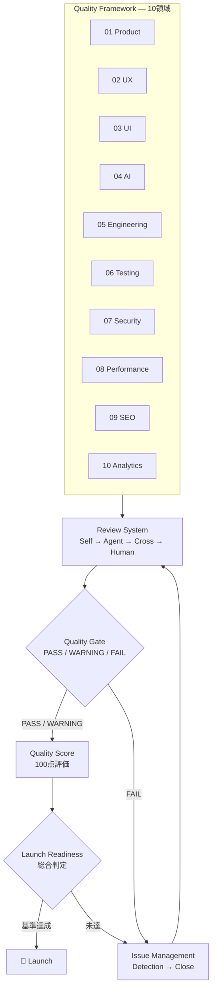
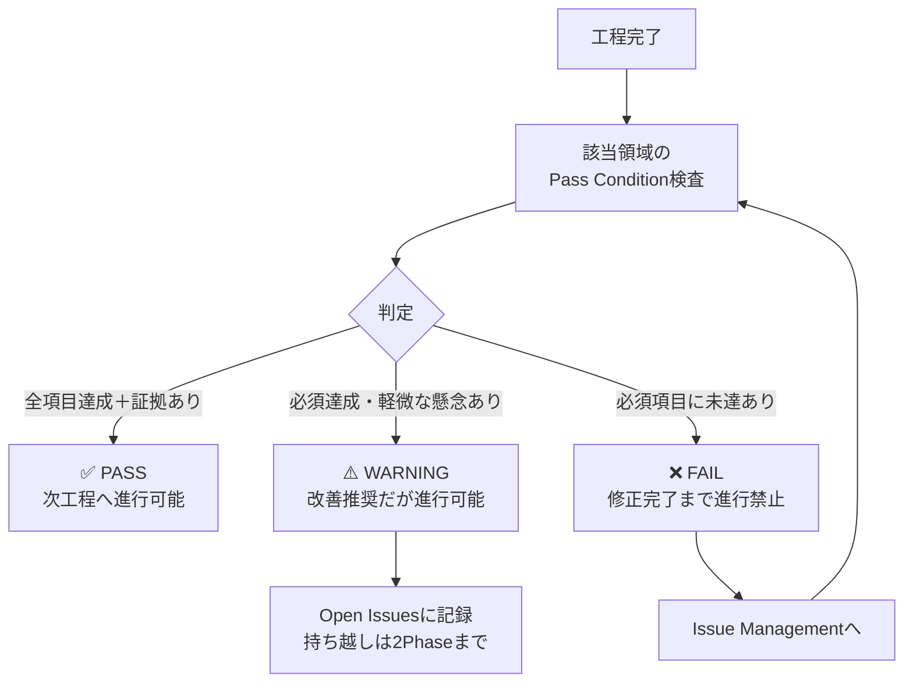
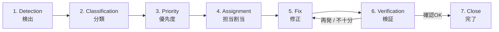

# Quality Standard System

> **AI Development Operating System — 品質保証基準書**
>
> 本OSにおける「品質」の単一情報源（Single Source of Truth）。
> 10の品質領域（Quality Framework）・4段階レビュー（Review System）・品質ゲート（Quality Gate）・100点評価（Quality Score）・問題管理（Issue Management）で構成する。
> [`Development_Workflow.md`](./Development_Workflow.md) のExit Criteria、[`Agent_Architecture.md`](./Agent_Architecture.md) のQuality Control、[`Skill_Architecture.md`](./Skill_Architecture.md) のQuality Criteriaは、すべて本書を参照基準とする。

| 項目 | 内容 |
|---|---|
| **Version** | 2.0.0 |
| **Status** | Active |
| **Last Updated** | 2026-07-07 |
| **関連ドキュメント** | [`Development_Workflow.md`](./Development_Workflow.md) / [`Agent_Architecture.md`](./Agent_Architecture.md) / [`Skill_Architecture.md`](./Skill_Architecture.md) |

---

## 目次

1. [品質哲学](#品質哲学)
2. [Quality Framework 全体像](#quality-framework-全体像)
3. [品質領域 01〜10](#01-product-quality)
4. [Quality Gate System](#quality-gate-system)
5. [Review System](#review-system)
6. [Quality Score System](#quality-score-system)
7. [Issue Management](#issue-management)
8. [Quality Numbers（数値基準一覧）](#quality-numbers数値基準一覧)
9. [Version Management](#version-management)

---

## 品質哲学

> **品質とは、ユーザーが目的を達成でき、チームが自信を持って変更でき、事業が信頼を失わない状態である。**

### 品質5原則

1. **判定可能でなければ基準ではない** — 「高品質」「使いやすい」は基準ではない。誰が判定しても同じ結果になる文・数値で書く。
2. **品質は後付けできない** — アクセシビリティ・セキュリティ・性能は最後に足すものではなく、最初から組み込む（Shift Left）。
3. **証拠なき合格はない** — PASS判定には計測結果・テスト結果・チェックリストの証拠を必ず添える。
4. **属人的判断を排除する** — 合否は本書の基準で決まる。「あの人がOKと言った」は判定ではない。人間の判断が必要な項目（感性・倫理・事業）は、判断の観点まで本書で定義する。
5. **基準は生きた文書として改訂する** — 障害・差し戻しが起きたら「どの基準があれば防げたか」を分析し、本書に還元する。改訂は必ずPRで行う。

---

## Quality Framework 全体像



### 領域 × Workflow Phase × 責任Agent 対応表

| # | 品質領域 | 主に評価するPhase | 責任Agent（判定主宰） |
|---|---|---|---|
| 01 | Product Quality | 01, 02, 06, 13 | Product Manager Agent |
| 02 | UX Quality | 04, 06, 13 | UX Designer Agent |
| 03 | UI Quality | 05, 06, 13 | UI Designer Agent |
| 04 | AI Quality | 07, 12, 13 | AI Engineer Agent |
| 05 | Engineering Quality | 08-11, 13 | Frontend / Backend Engineer Agent |
| 06 | Testing Quality | 12, 13 | QA Engineer Agent |
| 07 | Security Quality | 13, 15 | Security Agent |
| 08 | Performance Quality | 13, 14 | Performance Agent |
| 09 | SEO Quality | 13, 16 | Growth Agent（検証はQA） |
| 10 | Analytics Quality | 13, 16, 18 | Growth Agent |

---

# 01 Product Quality

### Goal
「作る価値のあるものを作っているか」を保証する。機能の量ではなく、ユーザー価値と事業価値の実現度で判定する。

### Evaluation Criteria

| 評価項目 | 判定基準 |
|---|---|
| **Vision Alignment** | すべての主要機能がVision・Missionに接続している。説明できない機能が存在しない |
| **Problem Solution Fit** | 解決する課題が証拠（リサーチ・データ）で実証され、ソリューションが課題に対応している |
| **User Value** | ペルソナが「以前より良くなった」と言える具体的な変化を1文で説明できる |
| **Business Value** | North Star Metric・収益への寄与経路が定義され、ユニットエコノミクスが成立見込みである |
| **Market Fit** | 競合に対する差別化が明確で、ターゲット市場のニーズと合致している |

### Review Method
- PRD・事業戦略書と成果物のトレーサビリティ検査（AI: 対応表生成 → PM Agentが判定）
- 「この機能は誰の何を解決するか」の1文テスト（全主要機能に実施）
- CEO AgentによるVision整合レビュー＋Human Ownerの事業判断

### Pass Condition
- [ ] 全主要機能がユーザー課題・事業価値に紐づいている（トレーサビリティ100%）
- [ ] 課題の実在が証拠で裏付けられている
- [ ] North Star Metricへの寄与経路が説明できる
- [ ] Human OwnerがVision整合を承認した

---

# 02 UX Quality

> 参考: Apple Human Interface Guidelines / Google Material Design / Nielsen Norman Group / Cognitive Psychology / Behavior Design

### Goal
ユーザーが迷わず・ストレスなく・安心して目的を達成できる体験を保証する。

### Evaluation Criteria

| 評価項目 | 判定基準 |
|---|---|
| **User Journey** | 全ユーザーストーリーに対応するフローが存在し、感情曲線のペインポイントに対策がある |
| **Information Architecture** | ユーザーのメンタルモデルに沿った分類・ラベリング。目的の情報に3クリック/タップ以内で到達できる |
| **Usability** | NN/g ユーザビリティ10原則の重大違反ゼロ。ユーザビリティテスト（5人）で主要タスク完遂率100% |
| **Cognitive Load** | 1画面の主要アクションは1つ。選択肢・入力項目が最小化されている（ヒックの法則） |
| **Accessibility** | WCAG 2.2 AA準拠（コントラスト4.5:1・キーボード完遂・スクリーンリーダー対応） |
| **Conversion Flow** | 主要CVフローの各ステップに離脱理由となる摩擦がなく、異常系（エラー・空・戻る）から回復できる |

### Review Method
- **ワイヤーフレームレビュー**（Phase 04）: フロー完遂性・認知負荷・異常系網羅を検査
- **ユーザビリティテスト**（Phase 06）: 5人テストでタスク完遂・迷い・エラーを観察（人間実施）
- **ヒューリスティック評価**: NN/g 10原則チェックリスト（AI実行 → UX Designerが判定）
- **行動設計レビュー**: ナッジとダークパターンの境界確認（人間必須）

### Pass Condition
- [ ] ユーザビリティテストで重大問題（タスク阻害）ゼロ
- [ ] 全主要フローに異常系（エラー・空・ローディング）が設計されている
- [ ] WCAG 2.2 AA を設計上満たしている
- [ ] ダークパターンを含まない（人間確認済み）

---

# 03 UI Quality

### Goal
ブランドを体現し、一貫性があり、実装可能なビジュアル品質を保証する。

### Evaluation Criteria

| 評価項目 | 判定基準 |
|---|---|
| **Visual Consistency** | 全画面で同じ要素が同じ見た目・同じ挙動。一点物のコンポーネントが原則ない |
| **Design System** | トークン → コンポーネント → 画面の3層構造。全画面がシステム参照で構築されている |
| **Typography** | タイプスケールが定義され、階層（見出し/本文/注釈）が一貫。行間・可読性が担保されている |
| **Spacing** | スペーシングスケール（8pt等）に準拠。任意の余白値がない |
| **Color** | 意味的カラー設計（Primary/Semantic/Neutral）。コントラスト基準達成。ダークモード対応（対象時） |
| **Motion** | モーションに意味（文脈の維持・フィードバック）がある。装飾のみのモーションがなく、Reduce Motion対応 |
| **Responsive** | 全ブレークポイントで崩れなし。コンテンツ優先度がビューポートごとに設計されている |

### Review Method
- **Figma Review**: ファイル構造・命名・Auto Layout・コンポーネント化率・トークン使用率を検査（AI機械検査＋UI Designer判定）
- **Prototype Review**: 主要フローをプロトタイプで操作し、遷移・モーション・状態変化を検証
- **Design System Review**: バリアント網羅・命名体系・実装可能性をFrontend Engineer Agentと合同検査
- ブランド適合の最終判定（Human必須 — 感性品質）

### Pass Condition
- [ ] 全画面がデザインシステム参照で構築（ハードコードゼロ）
- [ ] 全コンポーネントに状態バリエーション（default/hover/focus/disabled/error/empty/loading）
- [ ] Figma Review・Prototype Review・Design System Review をすべて通過
- [ ] Human Ownerがブランド適合を承認した

---

# 04 AI Quality

### Goal
AI機能が「デモ」ではなく「プロダクト品質」であることを保証する。品質は必ず計測で証明する。

### Evaluation Criteria

| 評価項目 | 判定基準 |
|---|---|
| **Accuracy** | 評価データセットでの正答率・タスク達成率が合格基準（数値）を達成している |
| **Consistency** | 同等の入力に対して出力品質が安定している（複数回実行での分散が許容内） |
| **Safety** | プロンプトインジェクション・有害出力・個人情報漏洩への対策が実装され、攻撃テストで検証済み |
| **Hallucination Control** | 事実性が必要な出力に根拠（出典・データ参照）があり、不確実な場合は「わからない」と応答する設計 |
| **Prompt Quality** | プロンプトがバージョン管理され、変更が評価結果とセットで記録されている |
| **Evaluation System** | 自動評価パイプラインが存在し、プロンプト・モデル変更時に回帰評価が実行される |

### Review Method
- 自動評価パイプラインの実行（評価データセット・LLM-as-judge・数値レポート）
- レッドチーミング（インジェクション・悪用シナリオの攻撃テスト）
- フォールバック動作の障害注入テスト（タイムアウト・API障害・不正出力）
- 評価合格基準の妥当性レビュー（Human承認 —「この品質で出せるか」）

### Pass Condition
- [ ] 全AI機能が評価合格基準（数値）を達成し、証拠レポートがある
- [ ] 全AI呼び出しにフォールバックUXがあり、動作確認済み
- [ ] 攻撃テスト（インジェクション等）で重大な突破がゼロ
- [ ] コスト上限・アラートが設定されている

---

# 05 Engineering Quality

### Goal
半年後の自分・他人が安全に変更でき、本番で壊れないコードとシステムを保証する。

### Evaluation Criteria

**Frontend**

| 評価項目 | 判定基準 |
|---|---|
| **Code Quality** | 規約・Lint・型チェック完全準拠。コンソールエラーゼロ。命名が意図を表す |
| **Component Architecture** | デザイントークン参照で実装。コンポーネントの責務が単一で、重複実装がない |
| **Performance** | バンドル最適化・画像最適化・不要な再レンダリング防止が実装されている |

**Backend**

| 評価項目 | 判定基準 |
|---|---|
| **Architecture** | 設計書と実装が一致。レイヤー責務が分離され、変更影響が局所化されている |
| **Database** | 正規化・インデックス・トランザクションが適切。N+1がない。マイグレーションで再現可能 |
| **API** | 仕様書と実装が一致。エラー形式統一。全エンドポイントに認証・認可・バリデーション |

**Infrastructure**

| 評価項目 | 判定基準 |
|---|---|
| **Scalability** | 想定ピーク×2の負荷に対応できる構成。ボトルネックが把握されている |
| **Reliability** | 監視・アラート・構造化ログ・エラートラッキングが動作。バックアップ・リストア検証済み |

### Review Method
- AIコードレビュー（規約・バグ・脆弱性・複雑度）＋人間のPRレビュー（マージ承認は人間）
- アーキテクチャレビュー: 設計書との整合検査（Phase 08成果物と突き合わせ）
- CI検査: 型・Lint・テスト・ビルドの常時グリーン

### Pass Condition
- [ ] CI（型・Lint・テスト・ビルド）が全グリーン
- [ ] API仕様書・設計書と実装が一致している
- [ ] 全エンドポイントに認証・認可・バリデーションがある
- [ ] 監視・ログ・エラートラッキングが本番相当環境で動作している

---

# 06 Testing Quality

### Goal
「動くはず」を「動く証拠がある」に変える。テスト自体の品質（網羅性・信頼性）を保証する。

### Evaluation Criteria

| テストレベル | 定義 | 合格基準 |
|---|---|---|
| **Unit Test** | 関数・コンポーネント単位の検証。外部依存はモック化 | 主要ロジックのカバレッジ ≧ 80%・CI常時実行 |
| **Integration Test** | API・DB・モジュール間結合の検証 | 全APIエンドポイントの正常系＋主要異常系を網羅 |
| **E2E Test** | 実ブラウザ/実機でのユーザーフロー通し検証 | 全ユーザーストーリーの主要フローが自動化されている |
| **Regression Test** | 変更による既存機能の破壊を検知 | 回帰スイートがCIで常時実行・フレーキーテスト放置ゼロ |
| **User Acceptance Test** | 受け入れ基準に基づく最終検証（人間実施） | 全受け入れ基準がPASS・探索的テスト実施済み |

### Review Method
- テスト計画レビュー: リスクベースの範囲・優先度の妥当性を検査
- テストケースレビュー: 異常系・境界値が正常系と同数以上あるか検査
- テスト結果レビュー: バグの再現手順・重大度・対応方針を全件判定

### Pass Condition
- [ ] 5レベルすべてのテストが定義・実行され、結果が記録されている
- [ ] 受け入れ基準のテスト網羅率100%
- [ ] Critical / High バグ残存ゼロ、残存バグ全件に対応方針が記録済み
- [ ] 回帰スイートがCIで安定稼働している

---

# 07 Security Quality

### Goal
ユーザーのデータと事業の信頼を守る。攻撃者視点での検証を経ていないものはリリースしない。

### Evaluation Criteria

| 評価項目 | 判定基準 |
|---|---|
| **Authentication** | 認証が全保護リソースに適用。セッション管理・パスワード/トークン管理が標準に準拠 |
| **Authorization** | 権限昇格・他ユーザーデータへの未認可アクセスが不可能（IDOR等の検査済み） |
| **Data Protection** | 保存時・転送時の暗号化。秘密情報がリポジトリ・クライアント・ログに含まれない |
| **Privacy** | 個人情報の収集が目的に必要な最小限。実装とプライバシーポリシーが一致 |
| **Vulnerability** | OWASP Top 10 検査済み。依存パッケージの既知脆弱性対応済み。Critical / High ゼロ |

### Review Method
- 機械検査: 静的解析・依存関係スキャン・シークレットスキャン（AI実行）
- 手動検査: 認可ロジック・ビジネスロジックの穴・AI固有リスク（プロンプトインジェクション）
- 脅威モデリング: 資産列挙 → 攻撃面特定 → 対策マッピングのレビュー
- リスク受容判断（Human必須）

### Pass Condition
- [ ] OWASP Top 10 全項目の検査記録がある
- [ ] Critical / High 脆弱性ゼロ
- [ ] 実装とプライバシーポリシーの一致を確認済み
- [ ] 残存リスクがHuman Ownerに報告され、受容が記録されている

---

# 08 Performance Quality

### Goal
「速さは機能」。実測データで体感速度と負荷耐性を保証する。

### Evaluation Criteria

| 評価項目 | 判定基準 |
|---|---|
| **Loading Speed** | 初回表示・画面遷移が実機・実回線で体感的に高速（数値は下記CWV） |
| **Core Web Vitals** | LCP ≦ 2.5s / INP ≦ 200ms / CLS ≦ 0.1（実機・実回線計測） |
| **API Response** | 主要エンドポイント p95 ≦ 500ms。AI応答は待機UX（ストリーミング・進捗）で体感を担保 |
| **Database Performance** | スロークエリゼロ（閾値超過なし）。N+1なし。インデックスが実行計画で検証済み |

### Review Method
- 実測レビュー: Lighthouse / WebPageTest / プロファイラの計測結果を改善前後で比較
- 負荷テストレビュー: 想定ピーク×2でのエラー率・応答時間を検証
- 「体感速度」の人間確認（数値が良くても体感が悪いケースの検知）

### Pass Condition
- [ ] Core Web Vitals 3指標が実機・実回線計測で基準達成
- [ ] API p95 ≦ 500ms（例外はプロジェクト憲章に記録）
- [ ] 想定ピーク×2の負荷でエラー率 < 1%
- [ ] 計測証拠（改善前後の比較データ）が記録されている

---

# 09 SEO Quality

### Goal
検索エンジンとユーザーの両方に、プロダクトの価値が正しく発見・理解される状態を保証する。

### Evaluation Criteria

| 評価項目 | 判定基準 |
|---|---|
| **Technical SEO** | クロール可能な構造・正しいステータスコード・canonical・リダイレクト設計 |
| **Metadata** | 全ページに固有のtitle・description。OGP・Twitter Cardが設定され共有プレビューが正しい |
| **Structured Data** | 該当コンテンツにSchema.org構造化データが実装され、検証ツールでエラーゼロ |
| **Indexability** | sitemap.xml・robots.txtが公開意図と一致（公開すべきものは載り、非公開は載らない） |
| **Performance** | Core Web Vitals達成（SEOランキング要因として。基準は08と共通） |

### Review Method
- 機械検査: Lighthouse SEO・構造化データ検証・リンク切れ・メタタグ網羅（AI実行）
- 公開範囲レビュー: インデックス設定が意図（公開/非公開）と一致するか人間確認

### Pass Condition
- [ ] Lighthouse SEO スコア ≧ 90
- [ ] 全公開ページに固有のメタデータ・OGPがある（実共有プレビュー確認済み）
- [ ] 構造化データ検証エラーゼロ
- [ ] sitemap / robots が公開意図と一致している

---

# 10 Analytics Quality

### Goal
リリース後の意思決定を支えるデータが、正確に・漏れなく・使える形で取得できる状態を保証する。

### Evaluation Criteria

| 評価項目 | 判定基準 |
|---|---|
| **Event Tracking** | KPIツリーに必要な全イベントが定義書どおりに発火する（実機確認済み） |
| **Conversion Tracking** | 全CVポイントが計測され、ファネルとして接続されている |
| **Data Accuracy** | テスト計測と実測値が一致。重複計測・欠損・開発環境データの混入がない |
| **Dashboard** | 必須KPI（CVR / Retention / LTV / DAU / MAU / Session / Exit / Drop / Funnel）が閲覧可能 |

### Review Method
- 発火検査: 定義書の全イベントを実機で操作し、計測基盤への到達を確認（AI＋人間）
- 定義レビュー: KPIの定義・集計ロジックが文書と一致するか検査
- ダッシュボードレビュー: 意思決定に必要な粒度・鮮度があるか確認

### Pass Condition
- [ ] 定義済みイベントの発火確認100%
- [ ] CVファネルが端から端まで接続されている
- [ ] テスト計測との一致検証済み（データ正確性の証拠あり）
- [ ] 必須KPIダッシュボードが稼働している

---

# Quality Gate System

各工程の終了時に、該当する品質領域の Pass Condition に基づいて3段階で判定する。



| 判定 | 条件 | 扱い |
|---|---|---|
| ✅ **PASS** | 該当領域のPass Conditionをすべて満たし、証拠が添付されている | 次工程へ進行可能 |
| ⚠️ **WARNING** | 必須条件は満たすが、改善推奨事項・軽微な懸念・未解決の申し送りがある | **改善推奨だが進行可能**。内容をOpen Issuesに記録し、持ち越しは2Phaseまで（3Phase目で自動FAIL） |
| ❌ **FAIL** | Pass Conditionに未達項目がある。または重大指摘（タスク阻害・Critical/High脆弱性・データ破壊リスク）がある | **修正完了まで進行禁止**。Issue Managementに登録し、修正 → 再判定 |

**ゲート運用の鉄則**:
1. 判定者は作成Agent以外（自己承認禁止）
2. 「今回だけ例外」でFAILを通さない — 基準がおかしいなら本書をPRで改訂する
3. ゲートPhase（06 / 13 / 15）ではWARNINGもHuman承認必須

### Workflow ゲートとの対応

| ゲート | 検査する品質領域 |
|---|---|
| **Phase 06: Design Review** | 01 Product（整合）+ 02 UX + 03 UI |
| **Phase 13: QA Review** | 01〜10 全領域（横断検査） |
| **Phase 15: Security Review** | 07 Security + 04 AI（Safety） |
| **Phase 16: Launch Preparation** | 08 Performance + 09 SEO + 10 Analytics + Launch Checklist |

---

# Review System

すべての成果物は4段階レビューを通過する。各段階の観点は重複させず、レビュー漏れをゼロにする。

## Self Review（自己評価）

- **実施者**: 担当Agent（成果物の作成者）
- **タイミング**: 提出前（必須）
- **観点**: 該当領域のPass Condition・Skill定義のQuality Criteria・チェックリストの自己検査
- **ルール**: セルフレビュー記録（チェック結果）を成果物に添付する。未実施の提出は受理しない

## Agent Review（専門レビュー）

- **実施者**: 同領域の専門Agent（例: コード→Engineering Layer内の相互レビュー、Figma→UI Designer Agent）
- **タイミング**: Self Review通過後
- **観点**: 専門領域の技術的正しさ・ベストプラクティス準拠・品質基準達成
- **ルール**: 指摘は「箇所 / 問題 / 重大度 / 修正提案」のセットで行う

## Cross Review（領域横断レビュー）

- **実施者**: 別領域のAgent（原則: 成果物の利用者＝下流Agent＋Quality Layer該当Agent）
- **タイミング**: Agent Review通過後
- **観点**: 「この成果物で次工程を開始できるか」「他領域との整合が取れているか」
- **ルール**: 下流Agentの視点で入力として検査。専門外の観点からの違和感も指摘してよい（新鮮な目）

## Human Review（最終判断）

- **実施者**: Human Owner
- **タイミング**: Cross Review通過後（ゲートPhase・Human Approval該当項目は必須）
- **観点**: 感性品質（ブランド・世界観・心地よさ）・事業判断・倫理・法務・リスク受容
- **ルール**: AIが判定できない領域に集中する。技術的検査のやり直しではない

## Review Matrix（レビュー責任表）

| 成果物領域 | Self | Agent Review | Cross Review | Human Review |
|---|---|---|---|---|
| 事業戦略・PRD | 作成Agent | CEO / PM Agent | UX Research・Engineering Layer | 承認必須（Go/No-Go） |
| UXデザイン | UX Designer | UX Research Agent | UI Designer・Frontend・QA | 構造・倫理の承認 |
| UIデザイン | UI Designer | UX Designer Agent | Frontend・Performance・QA | ブランド承認必須 |
| AI設計・実装 | AI Engineer | Backend Engineer Agent | Security・QA・UX Designer | 品質基準・倫理の承認 |
| コード（FE/BE） | 実装Agent | Engineering Layer相互 | QA・Security・Performance | マージ承認 |
| テスト成果物 | QA Engineer | Engineering Layer | Security・Performance | 残存リスク承認 |
| セキュリティ報告 | Security | Backend / AI Engineer | QA | リスク受容必須 |
| 分析・グロース | Growth | PM Agent | UX Research | 施策・投資の承認 |

---

# Quality Score System

リリース判定と品質の可視化のため、8つのスコアを100点満点で算出する。

## 採点方法（全スコア共通）

各品質領域の Evaluation Criteria の項目ごとに0〜10点で採点し、100点満点に換算する。

| 項目点 | 基準 |
|---|---|
| **10点** | 基準を満たし、証拠があり、参考水準（世界トップクラス）に達している |
| **8点** | 基準を満たし、証拠がある（合格ライン） |
| **5点** | 部分的に満たすが、明確な改善点がある |
| **2点** | 着手されているが基準に達していない |
| **0点** | 未実施・未達成 |

**スコア = （項目点の合計 ÷ 満点）× 100**（項目は各領域のEvaluation Criteria表に対応）

## Score Table（8スコアと総合スコア）

| スコア | 対応する品質領域 | 重み | 判定主宰Agent |
|---|---|---|---|
| **Product Score** | 01 Product Quality | 20% | Product Manager |
| **UX Score** | 02 UX Quality | 15% | UX Designer |
| **UI Score** | 03 UI Quality | 10% | UI Designer |
| **AI Score** | 04 AI Quality ※ | 10% | AI Engineer |
| **Engineering Score** | 05 Engineering + 06 Testing | 15% | FE/BE Engineer + QA |
| **Security Score** | 07 Security Quality | 15% | Security |
| **Performance Score** | 08 Performance Quality | 10% | Performance |
| **Launch Readiness Score** | 09 SEO + 10 Analytics + Launch Checklist達成率 | 5% | PM + Growth |

※ AI機能を持たないプロダクトはAI Scoreを除外し、重みを他スコアに比例配分する。

## 総合スコア算出方法

```
総合スコア = Σ（各スコア × 重み）
```

**例**: Product 85 / UX 90 / UI 88 / AI 80 / Engineering 85 / Security 92 / Performance 87 / Launch 90
→ 総合 = 85×0.20 + 90×0.15 + 88×0.10 + 80×0.10 + 85×0.15 + 92×0.15 + 87×0.10 + 90×0.05 = **86.7点**

## 判定基準

| 総合スコア | 判定 |
|---|---|
| **90〜100** | 🏆 World-Class — 世界トップクラス品質 |
| **80〜89** | ✅ Launch Ready — リリース可能 |
| **70〜79** | ⚠️ Conditional — 弱点領域の改善計画を条件にリリース判断（Human決裁） |
| **〜69** | ❌ Not Ready — リリース不可。改善後に再採点 |

**リリースの必要条件**（総合スコアだけでは通過できない）:
- [ ] 総合スコア ≧ 80
- [ ] すべての個別スコア ≧ 70（1領域でも70未満ならリリース不可）
- [ ] Security Score ≧ 80 かつ Critical / High 脆弱性ゼロ（セキュリティは点数で妥協しない）
- [ ] 3ゲート（06 / 13 / 15）すべてPASS済み

**運用ルール**: 採点は根拠（各項目の点と証拠）をスコアシートとして `06_Test/quality-score.md` に記録する。恣意的な採点を防ぐため、項目点8以上には証拠添付を必須とする。

---

# Issue Management

品質検査・レビュー・運用で発見された問題は、すべて以下のフローで管理する。GitHub Issues での運用を前提とする。



### 1. Detection（検出）
- 検出経路: レビュー指摘・テスト失敗・ゲートFAIL・監視アラート・ユーザー報告
- 記録形式: **再現手順・期待値・実際の挙動・環境・証拠（ログ/スクリーンショット）** を必須項目としてIssue化する

### 2. Classification（分類）
- **種別**: Bug / Security / Performance / UX / Design / Documentation / Process
- **該当品質領域**: 01〜10のどの領域の基準違反か
- **原因工程**: どのPhaseで混入したか（再発防止の分析に使用）

### 3. Priority（優先度）

| 優先度 | 定義 | 対応期限 |
|---|---|---|
| **P0 Critical** | サービス停止・データ破壊・重大セキュリティ・課金事故 | 即時対応（他作業を中断） |
| **P1 High** | 主要機能の阻害・ゲートFAILの原因・回避策なし | 現Phase内で修正 |
| **P2 Medium** | 機能に影響するが回避策あり・WARNING事項 | 次リリースまで |
| **P3 Low** | 軽微な改善・磨き込み | バックログ管理（改善ループで消化） |

### 4. Assignment（担当割当）
- 該当領域の責任Agent（RACI表のR/A）に割り当てる
- 領域をまたぐ場合はPM Agentが主担当を1つに決める（共同責任にしない）

### 5. Fix（修正）
- 修正は根本原因（Root Cause）に対して行う。対症療法の場合はその旨を明記し、根本対応をIssue化する
- 修正PRはIssueにリンクし、変更理由をコミットメッセージに残す

### 6. Verification（検証）
- 修正者以外（QA Engineer Agent または検出者）が再現手順で修正を検証する
- 回帰テストを実行し、修正が他を壊していないことを確認する
- P0 / P1 は「どの基準・チェックがあれば防げたか」を分析し、本書またはチェックリストに還元する（再発防止）

### 7. Close（完了）
- 検証OK・再発防止の記録完了でCloseする
- Close時に分類・原因工程を確定し、品質KPI（下記）の集計データとする

### Issue管理のKPI

| KPI | 定義 | 目標 |
|---|---|---|
| P0/P1 平均修正時間 | Detection → Verification完了までの時間 | P0: 24h以内 / P1: Phase内 |
| 再発率 | 同一根本原因のIssue再発生率 | < 5% |
| 混入工程の偏り | 原因工程の分布（特定Phaseへの集中を検知） | 四半期レビューで分析 |
| 基準還元率 | P0/P1のうち再発防止が本書に反映された割合 | 100% |

---

# Quality Numbers（数値基準一覧）

機械的に判定できる数値基準の一覧。プロジェクト固有の事情で変更する場合は、プロジェクト憲章に明記して上書きする（無断緩和は禁止）。

| カテゴリ | 指標 | 基準値 |
|---|---|---|
| **Performance** | LCP | ≦ 2.5秒 |
| | INP | ≦ 200ms |
| | CLS | ≦ 0.1 |
| | API応答（主要エンドポイント p95） | ≦ 500ms |
| | 負荷テスト（想定ピーク×2） | エラー率 < 1% |
| **Accessibility** | コントラスト比（通常/大テキスト） | ≧ 4.5:1 / ≧ 3:1 |
| | タッチターゲット | iOS ≧ 44pt / Android・Web ≧ 48dp |
| | axe 重大違反 | 0件 |
| **SEO** | Lighthouse SEO | ≧ 90 |
| | 構造化データ検証エラー | 0件 |
| **Code** | 型・Lint・コンソールエラー | 0件 |
| | 主要ロジックのテストカバレッジ | ≧ 80%（憲章で上書き可） |
| **Security** | Critical / High 脆弱性 | 0件 |
| **Test** | 受け入れ基準のテスト網羅率 | 100% |
| | Critical / High バグ残存 | 0件 |
| **Usability** | 主要タスク完遂率（5人テスト） | 100%（重大な迷いなし） |
| **AI** | 評価合格基準 | プロジェクトごとに数値定義（未定義での実装着手禁止） |
| **Score** | リリース必要条件 | 総合 ≧ 80・全領域 ≧ 70・Security ≧ 80 |

---

# Version Management

| Version | 日付 | 変更内容 | 担当 |
|---|---|---|---|
| 2.0.0 | 2026-07-07 | Quality Standard Systemとして全面改訂（10品質領域のGoal/Criteria/Review/Pass Condition・4段階Review System・Quality Score System・Issue Management を追加） | Claude Code + Owner |
| 1.0.0 | 2026-07-07 | 初版作成（品質哲学・共通5基準・領域別基準・数値基準） | Claude Code + Owner |

### 運用ルール

- 本書の変更はすべてPull Request＋Owner承認で行う
- 数値基準・Pass Conditionの変更はMinor、品質領域・スコア体系の変更はMajorバージョンアップ
- P0/P1インシデントの再発防止は必ず本書への反映を検討する（基準還元率100%が目標）
- 形骸化した基準（常にN/A・誰も参照しない）は四半期レビューで削除する — 基準は少なく・鋭く保つ

---

*This standard is part of the AI Development Operating System.*
*Maintained in: `00_System/Quality_Standard.md`*
