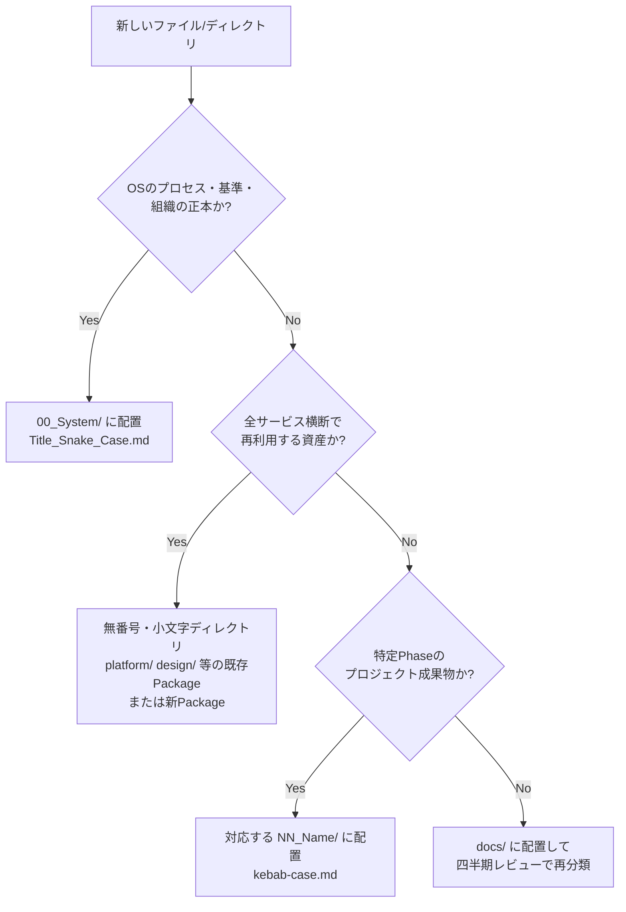

# Repository Standard

> **AI Development Operating System — リポジトリ構造・配置規約の正本**
>
> 「新しいものをどこに置くか」「何がどこの正本か」を定義する。
> 本書は過去に発生した配置の混乱（番号付きディレクトリの衝突・テンプレートの置き場所の揺れ）を規約として確定させ、再発を防ぐために存在する。

| 項目 | 内容 |
|---|---|
| **Version** | 1.0.0 |
| **Status** | Active |
| **Last Updated** | 2026-07-10 |

---

## 1. ディレクトリの3分類

本リポジトリのトップレベルディレクトリは、必ず以下3分類のいずれかに属する。

| 分類 | 命名 | 内容 | 例 |
|---|---|---|---|
| **OS基盤** | `00_System/`＋`01_Product/` | プロセス・組織・能力・品質・要件定義の正本ドキュメント | `Development_Workflow.md` 等 |
| **共有資産Package** | 無番号・小文字英語 | 全サービス横断で再利用する資産。`README.md` を正本とし、`templates/` `checklists/` `prompts/` `examples/` のサブ構造を持つ | `platform/` `design/` `ai/` `engineering/` `agents/` `skills/` `templates/` `prompts/` `examples/` `docs/` |
| **Workflow成果物置き場** | `NN_Name/`（02〜08） | Development_WorkflowのPhase成果物を置く（プロジェクト実行時に使用） | `02_UX/` `06_Test/` 等 |

### 配置判定フロー



### 禁止事項

- ❌ **新しい番号付きディレクトリの追加**（`01_Agent_Base/` `02_Platform/` のような番号系列の新設）。番号は `00`〜`08` の既存Workflow系列で凍結する。新しい大分類は必ず無番号Packageとして作る
- ❌ 同じ内容の正本を2箇所に置く（コピーではなく相対リンクで参照する）
- ❌ 分類不明のままトップレベルに直接ファイルを置く（`README.md` `.gitignore` を除く）

---

## 2. 命名規則

| 対象 | 規則 | 例 |
|---|---|---|
| OS基盤ドキュメント（00_System/・01_Product/） | `Title_Snake_Case.md` | `Quality_Standard.md` |
| Package正本 | `{package}/README.md` | `platform/README.md` |
| Packageサブ資産・成果物・テンプレート | 英語ケバブケース | `user-persona.md` |
| Agent定義 | `agents/{layer}/{agent-name}.md`（ケバブケース） | `agents/executive/ceo.md` |
| Skill定義 | `skills/{category}/{skill-name}/SKILL.md` | `skills/ux/ux-research/SKILL.md` |
| 変数プレースホルダ | `{{UPPER_SNAKE_CASE}}` | `{{PROJECT_NAME}}` |

---

## 3. 正本マップ（何がどこの正本か）

矛盾が生じた場合は、この表の「正本」を優先し、他方を追従修正する。

| 領域 | 正本 | 参照する側 |
|---|---|---|
| 開発プロセス（Phase 00-19） | `00_System/Development_Workflow.md` | 全Package・Project_Template |
| Agent組織・RACI | `00_System/Agent_Architecture.md` | Agent_Base_Template・各Package Deliverables |
| Agent定義の構造 | `00_System/Agent_Base_Template.md` | `agents/` 配下の全定義ファイル |
| Skill体系・カテゴリ | `00_System/Skill_Architecture.md` | Skill_Base_Template・skills/ |
| Skill定義の構造 | `00_System/Skill_Base_Template.md` | `skills/` 配下の全SKILL.md（※個別SKILL.mdの内容自体はSKILL.md側が正） |
| 品質の判定基準 | `00_System/Quality_Standard.md` | Review_Process・全Package |
| レビューの実行手順 | `00_System/Review_Process.md` | engineering/ の12 Review Catalog |
| 要件定義プロセス | `01_Product/Requirement_Engineering_Framework.md` | `templates/Requirement_Template.md`（構造は常に同期） |
| 共通基盤（認証・決済等） | `platform/README.md`（Domain実装後は各Domain README） | 各サービス |
| デザイン標準 | `design/README.md` | UI/UX関連の全作業 |
| AI実装標準 | `ai/README.md` | AI機能の全作業 |
| エンジニアリング実行標準・Git規約 | `engineering/README.md` | 全実装作業 |
| リポジトリ構造・配置 | 本書 | 全ドキュメント |

---

## 4. Package標準構造

新しい共有資産Packageを作る場合、以下の構造に従う（`platform/` `design/` `ai/` `engineering/` と同一）:

```
{package}/
├── README.md        # Package正本（Version・Status・変更履歴を必ず持つ）
├── templates/       # そのPackage固有のテンプレート
├── checklists/      # チェックリスト
├── prompts/         # AI作業用標準プロンプト
└── examples/        # 実案件の良例・失敗例（学びの還元先）
```

- README.mdには必ず「関連ドキュメント」表を置き、既存正本との役割分担を明記する
- 既存正本と重複する内容は書かず、参照する（重複禁止ルール）

---

## 5. ドキュメント共通規約

- すべての正本ドキュメントは冒頭にメタ表（Version / Status / Last Updated / 関連ドキュメント）を持つ
- すべての正本ドキュメントは末尾にVersion Management（変更履歴表＋運用ルール）を持つ
- バージョニング: 構造・原則の変更 = Major / 内容の追加・改善 = Minor / 誤字・明確化 = Patch
- 変更はPull Request＋Owner承認で行う（直接pushはブートストラップ期のみの例外とし、実案件開始後は禁止）
- リンクは相対パスで書く（リンク切れはCIまたはRepository Reviewで検査）

---

## 6. Repository Review との連携

本書の遵守状況は、四半期の **Repository Review**（[`engineering/README.md — 12 Review Catalog #12`](../engineering/README.md)）で監査する:

- [ ] 3分類に属さないディレクトリ・ファイルがないか
- [ ] 命名規則違反がないか
- [ ] 正本の重複・矛盾がないか（正本マップとの照合）
- [ ] リンク切れゼロか
- [ ] 各正本のVersion Managementが更新されているか

---

## Version Management

| Version | 日付 | 変更内容 | 担当 |
|---|---|---|---|
| 1.0.0 | 2026-07-10 | 初版作成（3分類・配置判定フロー・命名規則・正本マップ・Package標準構造。番号付きディレクトリの新設凍結を規約化） | Claude Code + Owner |

---

*This standard is part of the AI Development Operating System.*
*Maintained in: `00_System/Repository_Standard.md`*
