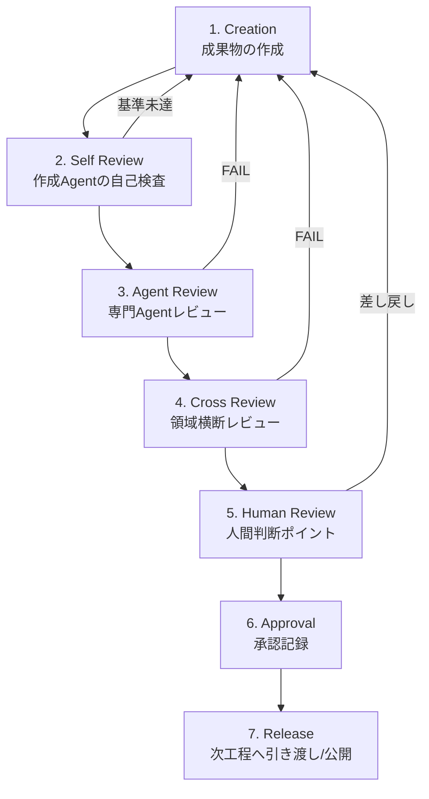
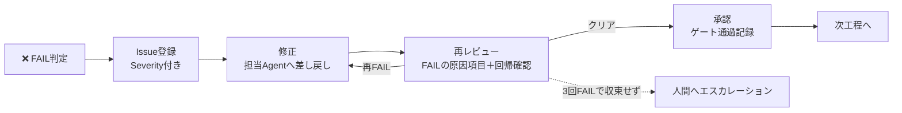
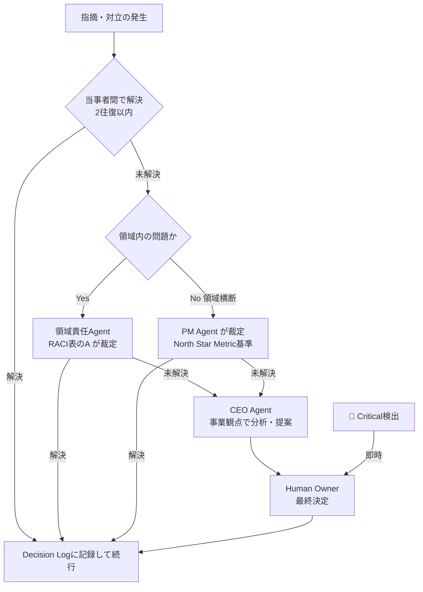

# Review Process System

> **AI Development Operating System — レビュー実行機構**
>
> 本OSのすべてのレビューの「誰が・いつ・何を・どうレビューするか」を定義する実行機構。
> 判定基準そのもの（何をもって合格とするか）は [`Quality_Standard.md`](./Quality_Standard.md) が定義し、本書はその基準を**漏れなく・高速に・属人化せず**適用するプロセスを定義する。

| 項目 | 内容 |
|---|---|
| **Version** | 1.0.0 |
| **Status** | Active |
| **Last Updated** | 2026-07-07 |
| **関連ドキュメント** | [`Quality_Standard.md`](./Quality_Standard.md) / [`Development_Workflow.md`](./Development_Workflow.md) / [`Agent_Architecture.md`](./Agent_Architecture.md) / [`Skill_Architecture.md`](./Skill_Architecture.md) |

---

## 目次

1. [設計思想](#設計思想)
2. [Review Framework（6レビュー体系）](#01-product-review)
3. [Review Flow（7ステージ）](#review-flow)
4. [Review Gate System](#review-gate-system)
5. [Review Document Template](#review-document-template)
6. [Severity System](#severity-system)
7. [AI Review Automation](#ai-review-automation)
8. [Human Decision Framework](#human-decision-framework)
9. [Review Matrix](#review-matrix)
10. [Issue Escalation Flow](#issue-escalation-flow)
11. [Version Management](#version-management)

---

## 設計思想

| 目的 | 実現方法 |
|---|---|
| **レビュー漏れゼロ** | 6レビュー体系×Review Matrixで全成果物に責任Reviewerを割当。レビューなしの成果物は次工程に進めない |
| **品質基準の自動適用** | 各レビューはQuality_Standardの該当領域のPass Conditionをチェックリストとして機械適用する |
| **AI生成物の品質保証** | AI Review Automationで機械検査を先に回し、人間・上位レビューは判断が必要な点に集中する |
| **人間判断ポイントの明確化** | Human Decision Frameworkで「AIが判定してはならない領域」を列挙し、それ以外はAIが完結させる |
| **高速開発と品質両立** | 自動化ファースト＋小さな成果物単位のレビューで、レビューを「関門」ではなく「加速装置」にする |

### レビュー3原則

1. **早く・小さく・何度も** — 大きな成果物を最後に一度レビューするより、小さな単位で早期にレビューする。手戻りコストは工程が進むほど指数的に増える。
2. **指摘は修正提案とセット** — 「箇所 / 問題 / 重大度 / 修正提案」の4点セットでない指摘は受理しない。批評ではなく修正を前進させる。
3. **成果物を裁き、作成者を裁かない** — 指摘は成果物の品質に対して行う。AIにも人間にも同じ基準を適用する。

---

# Review Framework

成果物の種類に応じて6つのレビュー体系を適用する。各レビューの判定基準は [`Quality_Standard.md`](./Quality_Standard.md) の対応領域を参照する。

---

## 01 Product Review

| 項目 | 内容 |
|---|---|
| **対象** | Business Strategy / Requirement（PRD・ユーザーストーリー）/ Feature Decision（機能追加・変更の意思決定） |
| **主なPhase** | 01, 02, 19（機能決定はプロジェクト全期間） |
| **基準** | Quality_Standard「01 Product Quality」 |

### Reviewチェックリスト

- [ ] **目的達成性**: この成果物はVision・プロジェクト目的の達成に寄与するか。寄与経路を1文で説明できるか
- [ ] **ユーザー価値**: 解決する課題が証拠（リサーチ・データ）で実証されているか。ペルソナの「何が良くなるか」が具体的か
- [ ] **市場性**: 競合との差別化が明確か。市場のニーズ・タイミングと合致しているか
- [ ] **収益性**: North Star Metric・収益への寄与が説明できるか。ユニットエコノミクスを毀損しないか
- [ ] **優先順位**: RICE等のスコアに根拠があるか。「今やるべき」理由が機会費用込みで説明できるか

### Reviewer

| 段階 | 担当 | 観点 |
|---|---|---|
| Agent Review | Product Manager Agent | 要件品質・優先順位の根拠 |
| Cross Review | CEO Agent（＋下流のUX Research / Engineering） | Vision整合・実現可能性 |
| Human Review | **Human Owner（必須）** | Go/No-Go・スコープ・事業判断 |

---

## 02 UX Review

> 参考: Apple HIG / Nielsen Norman Group / Cognitive Psychology / Behavior Design

| 項目 | 内容 |
|---|---|
| **対象** | User Flow / Information Architecture / Customer Journey（＋ワイヤーフレーム） |
| **主なPhase** | 03, 04, 06 |
| **基準** | Quality_Standard「02 UX Quality」 |

### Reviewチェックリスト

- [ ] **使いやすさ**: ペルソナが主要タスクを迷わず完遂できるか（フローを指でなぞって検証）。NN/g 10原則の重大違反がないか
- [ ] **認知負荷**: 1画面の主要アクションは1つか。選択肢・入力項目・ステップ数は最小か（ヒックの法則・ミラーの法則）
- [ ] **ユーザー心理**: メンタルモデルと構造が一致しているか。不安・疑問が生まれる箇所に安心材料（フィードバック・説明）があるか
- [ ] **継続率**: 初回体験で価値実感（Aha Moment）まで最短で到達できるか。再訪の動機・導線が設計されているか
- [ ] **Conversion**: CVフローの各ステップに摩擦（不要な入力・不明瞭なCTA・信頼不足）がないか。異常系から回復できるか
- [ ] **倫理**: ダークパターン（誤認誘導・解約妨害・強制）を含まないか

### Reviewer

| 段階 | 担当 | 観点 |
|---|---|---|
| Agent Review | UX Research Agent | リサーチ証拠との整合 |
| Cross Review | UI Designer / Frontend / QA Agent | 実装・検証可能性 |
| Human Review | Human Owner | 体験の感情設計・倫理・構造承認 |

---

## 03 UI Design Review

| 項目 | 内容 |
|---|---|
| **対象** | Figma（デザインファイル）/ Prototype / Design System |
| **主なPhase** | 05, 06 |
| **基準** | Quality_Standard「03 UI Quality」 |

### Reviewチェックリスト

- [ ] **Visual Quality**: 階層・余白・リズムが整い、情報の優先度が視覚的に伝わるか。ブランドのトーン&マナーを体現しているか
- [ ] **Consistency**: 同じ要素が同じ見た目・挙動か。全画面がトークン・コンポーネント参照か（一点物・ハードコードなし）
- [ ] **Accessibility**: コントラスト比（4.5:1）・タッチターゲット（44pt/48dp）・フォーカス順序を満たすか
- [ ] **Responsive**: 全ブレークポイントで崩れがないか。ビューポートごとのコンテンツ優先度が設計されているか
- [ ] **Motion**: モーションに意味（文脈維持・フィードバック）があるか。Reduce Motion対応か
- [ ] **状態網羅**: 全コンポーネントに default / hover / focus / disabled / error / empty / loading があるか
- [ ] **実装可能性**: Figmaの命名・Auto Layout・構造が実装者の仕様として機能するか

### Reviewer

| 段階 | 担当 | 観点 |
|---|---|---|
| Agent Review | UX Designer Agent | ワイヤー・体験構造との整合 |
| Cross Review | UI Designer Agent（相互）＋ Frontend / Performance Agent | システム品質・実装可能性 |
| Human Review | **Human Approval（必須）** | ブランド・感性品質の最終判定 |

---

## 04 AI Review

| 項目 | 内容 |
|---|---|
| **対象** | Prompt（設計・変更）/ LLM Output（生成品質）/ Agent Behavior（マルチステップ挙動） |
| **主なPhase** | 07, 10, 12, 13 |
| **基準** | Quality_Standard「04 AI Quality」 |

### Reviewチェックリスト

- [ ] **Accuracy**: 評価データセットで合格基準（数値）を達成しているか。証拠レポートがあるか
- [ ] **Safety**: プロンプトインジェクション・有害出力・個人情報漏洩への対策が攻撃テストで検証済みか
- [ ] **Consistency**: 同等入力での出力品質が安定しているか（複数回実行の分散が許容内か）
- [ ] **Failure Cases**: 全失敗モード（誤答・遅延・拒否・API障害）にフォールバックUXがあり、動作確認済みか
- [ ] **Evaluation**: プロンプト変更が評価結果とセットで記録されているか。回帰評価が自動実行されるか
- [ ] **コスト**: トークンコストが試算内か。上限・アラートが設定されているか

### Reviewer

| 段階 | 担当 | 観点 |
|---|---|---|
| Agent Review | AI Engineer Agent（相互）＋ Backend Engineer Agent | 設計・実装品質 |
| Cross Review | Security Agent ＋ QA Engineer Agent ＋ UX Designer Agent | 安全性・失敗時UX |
| Human Review | Human Owner | 品質基準の受容・倫理・利用範囲 |

---

## 05 Code Review

| 項目 | 内容 |
|---|---|
| **対象** | Frontend / Backend / Infrastructure（すべてのコード変更＝PR単位） |
| **主なPhase** | 09, 10, 11, 14（＋改善ループの全実装） |
| **基準** | Quality_Standard「05 Engineering Quality」 |

### Reviewチェックリスト

- [ ] **Architecture**: 設計書と一致しているか。責務分離が保たれ、変更影響が局所化されているか
- [ ] **Maintainability**: 命名が意図を表すか。重複がないか。半年後の他人が安全に変更できるか
- [ ] **Security**: 入力検証・認可・秘密情報管理に穴がないか（インジェクション・XSS・IDOR）
- [ ] **Performance**: N+1・不要な再レンダリング・非効率クエリがないか
- [ ] **Testing**: 変更にテストが伴っているか。CIがグリーンか。異常系がテストされているか
- [ ] **規約準拠**: 開発規約・Lint・型チェックに完全準拠しているか

### Reviewer

| 段階 | 担当 | 観点 |
|---|---|---|
| Agent Review | Engineering Layer相互（FE⇄BE⇄AIE） | 技術品質・規約準拠 |
| Cross Review | QA / Security / Performance Agent（変更内容に応じて） | 品質横断検査 |
| Human Review | **Human（マージ承認必須）** | 最終マージ判断 |

**運用ルール**: PRは1目的・小さく分割する。AIレビュー（自動）→ Agent Review → Human マージの順で、AI指摘の修正が終わってから人間がレビューする（人間の時間を機械検査に使わない）。

---

## 06 QA Review

| 項目 | 内容 |
|---|---|
| **対象** | Complete Product（結合済みプロダクト全体） |
| **主なPhase** | 13（ゲート）＋改善ループの再レビュー |
| **基準** | Quality_Standard「01〜10 全領域」 |

### Reviewチェックリスト（10領域横断）

| # | 領域 | 検査内容 | 検査方法 |
|---|---|---|---|
| 1 | **UI** | デザイン再現度・一貫性・状態網羅 | Figma突き合わせ＋実機確認 |
| 2 | **UX** | フロー完遂性・迷い・エラー回復 | シナリオテスト＋探索的テスト |
| 3 | **AI** | 評価基準達成・フォールバック・安全性 | 評価パイプライン＋障害注入 |
| 4 | **Frontend** | コード品質・状態管理・コンソールエラー | CI＋静的解析＋実機 |
| 5 | **Backend** | API整合・データ整合・エラー処理・ログ | APIテスト＋ログ検査 |
| 6 | **Performance** | Core Web Vitals・API応答 | Lighthouse＋実機実測 |
| 7 | **Accessibility** | WCAG 2.2 AA・キーボード・スクリーンリーダー | axe＋手動検証 |
| 8 | **SEO** | メタデータ・構造化データ・インデックス制御 | Lighthouse＋検証ツール |
| 9 | **Analytics** | イベント発火・CV計測・データ正確性 | 実機操作＋計測基盤確認 |
| 10 | **Security** | 認証認可・入力検証・依存脆弱性（一次） | スキャン＋チェックリスト |

### Reviewer

| 段階 | 担当 | 観点 |
|---|---|---|
| Agent Review | QA Engineer Agent（主宰） | 10領域の検査統合 |
| Cross Review | Security / Performance / UI・UX Designer Agent | 各専門領域の判定 |
| Human Review | **Human Owner（ゲート承認必須）** | 体験品質の最終判定・リリース可否 |

---

# Review Flow

すべての成果物は以下の7ステージを通過する。ステージの飛ばしは禁止（自動化により高速化はできるが、省略はできない）。



| # | ステージ | 実施者 | 内容 | 完了条件 |
|---|---|---|---|---|
| 1 | **Creation** | 担当Agent | Skill定義・Quality_Standardを参照して成果物を作成 | 成果物＋Decision Log完成 |
| 2 | **Self Review** | 作成Agent | 該当領域のPass Condition・チェックリストの自己検査。**AI Review Automation（後述）をここで実行** | セルフチェック記録の添付 |
| 3 | **Agent Review** | 同領域の専門Agent | 専門観点の技術的正しさ・ベストプラクティス準拠 | Review Document作成・指摘対応完了 |
| 4 | **Cross Review** | 下流Agent＋Quality Layer | 「次工程を開始できるか」＋領域間整合 | Review Document作成・QC判定（PASS/WARNING） |
| 5 | **Human Review** | Human Owner | Human Decision Framework該当項目のみ判断（該当なしならスキップ可） | 判断記録 |
| 6 | **Approval** | Human / 委任されたAgent | 承認の記録（PR Approve・Review DocumentのDecision欄） | 承認記録の保存 |
| 7 | **Release** | 担当Agent | Handoff Noteを添えて次工程へ引き渡し（Phase 17では公開） | Handoff Note受領確認 |

**高速化の原則**: ステージ2の自動検査で機械的な指摘を潰し切ってから人間・上位レビューに進む。人間が誤字やLintエラーを見つけるのはプロセスの失敗と見なす。

---

# Review Gate System

Development_Workflow の各Phaseの出口に Review Gate を設定する。ゲート判定は3段階。

## Gate Status

| Status | 条件 | 扱い |
|---|---|---|
| ✅ **PASS** | 該当領域のPass Conditionすべて達成＋証拠添付 | 次工程へ進行可能 |
| ⚠️ **WARNING** | 必須条件は達成。改善推奨事項・軽微な懸念あり | 改善推奨だが進行可能。Open Issues登録必須・持ち越し2Phaseまで |
| ❌ **FAIL** | Pass Condition未達、またはCritical/High問題あり | **修正完了まで進行禁止** |

## FAIL時のフロー



- 再レビューはFAIL原因の項目＋影響範囲の回帰確認に絞る（全項目再検査はしない — 高速化）
- 同一成果物が3回FAILした場合は自動的に人間へエスカレーションする（基準・要件・体制のどこかに構造的問題がある）

## Phase別 Review Gate 一覧

| Phase | Gate | 適用Review | ゲート責任者 | Human承認 |
|---|---|---|---|---|
| 01-02 | 戦略・要件Gate | 01 Product Review | PM Agent | **必須（Go/No-Go・PRD）** |
| 03-04 | UX Gate | 02 UX Review | UX Designer Agent | 構造承認 |
| 05 | UI Gate | 03 UI Design Review | UI Designer Agent | ブランド承認 |
| 06 | **Design Review Gate 🚧** | 01+02+03 統合 | UI Designer Agent | **必須** |
| 07 | AI設計Gate | 04 AI Review（設計） | AI Engineer Agent | 品質基準・倫理承認 |
| 08 | アーキテクチャGate | 05 Code Review（設計） | Backend Engineer Agent | 技術選定承認 |
| 09-11 | 実装Gate（PR単位） | 05 Code Review | Engineering Layer | マージ承認 |
| 12 | テストGate | 06 QA Review（準備） | QA Engineer Agent | バグ優先度承認 |
| 13 | **QA Review Gate 🚧** | 06 QA Review（10領域） | QA Engineer Agent | **必須** |
| 14 | PerformanceGate | 05+QA該当領域 | Performance Agent | コスト判断 |
| 15 | **Security Review Gate 🚧** | 07 Security | Security Agent | **必須（リスク受容）** |
| 16 | Launch Gate | Launch Checklist全項目 | PM Agent | **必須（公開判断）** |
| 17 | Release Gate | リリース計画・監視体制 | PM Agent | **必須（実行Go）** |
| 19 | 改善Gate | 01 Product Review（施策） | Growth Agent | 施策・投資承認 |

---

# Review Document Template

すべてのAgent Review以降のレビューは、この形式で記録する。保存先: 対象成果物と同じディレクトリ（例: `06_Test/reviews/`）または PRコメント。

```markdown
# Review Document

| 項目 | 内容 |
|---|---|
| **Review Date** | YYYY-MM-DD |
| **Reviewer** | レビュー実施Agent / 人間 |
| **Target** | レビュー対象（成果物パス・PR番号・Figmaリンク） |
| **Objective** | このレビューの目的（どのGate・どの品質領域の検査か） |

## Findings（所見）

良い点・確認できた品質を記録する（指摘だけのレビューにしない）。

- （例）全画面がデザイントークン参照で構築されており、一貫性が高い

## Issues（指摘事項）

| # | 箇所 | 問題 | Severity | Recommendation（修正提案） |
|---|---|---|---|---|
| 1 | `path/to/file:L42` | 問題の内容 | Critical / High / Medium / Low | 具体的な修正案 |

## Decision（判定）

- **Status**: ✅ PASS / ⚠️ WARNING / ❌ FAIL
- **根拠**: 判定の根拠（Pass Conditionの充足状況・証拠へのリンク）

## Next Action

- （例）Issue #1-2 を修正後、再レビュー（担当: Frontend Engineer Agent、期限: 現Phase内）
- （例）WARNING事項を Open Issues に登録し、Phase 14 で解消
```

**記入ルール**:
- Issues は必ず「箇所・問題・Severity・修正提案」の4点セット
- Decision の根拠には証拠（計測結果・チェックリスト・テスト結果）をリンクする
- FAILの場合、Next Action に修正担当・期限を必ず明記する

---

# Severity System

すべての指摘・Issueは4段階のSeverityで分類する（[`Quality_Standard.md — Issue Management`](./Quality_Standard.md#issue-management) の優先度P0〜P3に対応）。

| Severity | 定義 | 例 | 対応ルール |
|---|---|---|---|
| 🔴 **Critical** | ユーザー・事業に重大な被害。リリース絶対不可 | データ破壊、認証バイパス、課金事故、タスク完遂不能、法令違反 | 即時修正（他作業中断）。ゲートは自動FAIL |
| 🟠 **High** | 主要機能・体験を大きく損なう。回避策なし | 主要フローのバグ、High脆弱性、CWV大幅未達、WCAG重大違反 | 現Phase内で修正。ゲートはFAIL |
| 🟡 **Medium** | 品質を損なうが回避策がある | 軽微なUI不整合、エッジケースバグ、改善可能な遅延 | 修正またはWARNINGとしてOpen Issues登録（持ち越し2Phaseまで） |
| 🟢 **Low** | 軽微な改善・磨き込み | 文言の揺れ、微細な余白ズレ、リファクタ提案 | バックログ登録。改善ループで消化 |

**判定ルール**:
- Severityは「ユーザー・事業への影響」で決める。修正の難易度では決めない
- 判定に迷ったら1段階上に倒す（過小評価が最も危険）
- Critical / High が1件でもあればゲートはFAIL

---

# AI Review Automation

Claude Codeが自動実行するレビュー。**Self Reviewステージ（ステージ2）で必ず実行し、機械検査を通過してから上位レビューに進む。**

| # | 自動レビュー | 内容 | 対応領域 |
|---|---|---|---|
| 1 | **Code Review** | 規約準拠・型/Lint・バグパターン・重複・複雑度・アンチパターン検出 | 05 Engineering |
| 2 | **UX Checklist** | NN/g 10原則チェックリスト・状態網羅（error/empty/loading）・フロー完遂の静的検査 | 02 UX |
| 3 | **Design Check** | トークン使用率・コンポーネント化率・コントラスト比・命名規則（Figma検査） | 03 UI |
| 4 | **SEO Check** | メタタグ・OGP・構造化データ・sitemap/robots・リンク切れ | 09 SEO |
| 5 | **Performance Check** | Lighthouse実行・バンドルサイズ・CWV計測・N+1検出 | 08 Performance |
| 6 | **Security Scan** | 静的解析・依存脆弱性スキャン・シークレット混入検査・OWASPチェックリスト | 07 Security |
| 7 | **Test Generation** | テストケース生成（正常系・異常系・境界値）・カバレッジギャップ検出 | 06 Testing |
| 8 | **AI Evaluation** | 評価データセットでの自動評価・回帰評価・出力の一貫性検査 | 04 AI |
| 9 | **Accessibility Check** | axe実行・キーボード操作性・ARIA・フォーカス順序の機械検査 | 02 UX / 03 UI |
| 10 | **Doc Check** | リンク切れ・用語の揺れ・テンプレート準拠・変数置換漏れ（`{{ }}`残留） | Documentation |

**自動化の運用ルール**:
1. 自動レビューの結果はRe​view Documentに添付する（証拠として）
2. 自動検査で検出できる指摘を人間・上位Agentが指摘した場合、自動レビュー側のチェック項目を強化する（仕組みで再発防止）
3. 自動レビューはCI・実行スクリプトとして整備し、`skills/quality/` 配下のSkillと連動させる

---

# Human Decision Framework

**AIが判定・決定してはならない領域。** 以下に該当する判断は、どれだけ開発を高速化したくても必ず人間（Human Owner）が行う。

| 領域 | 人間が判断する内容 | 理由 |
|---|---|---|
| **ブランド判断** | 色・書体・トーン・世界観が「このプロダクトらしいか」。感性品質（心地よさ・信頼感） | 感性・美意識はプロダクトの人格。数値化できない |
| **事業判断** | Go/No-Go・予算・スコープ・期限・ピボット・価格・リソース配分 | 事業リスクの責任は人間にしか取れない |
| **倫理判断** | ダークパターン境界・AIの利用範囲・ユーザー/社会への影響・データの扱い | 価値観の決定はAIに委譲してはならない |
| **法務判断** | 利用規約・プライバシーポリシー・法規制対応・ライセンス・権利 | 法的責任の主体は人間・法人 |
| **最終公開判断** | リリースのGo・ロールバック実行・障害時の対外対応 | 不可逆な対外アクションの決定 |
| **リスク受容** | 残存脆弱性・残存バグを受容してリリースするか | 損害の受容は経営判断 |
| **人・組織** | 実ユーザーへの調査実施・外部ベンダー契約・謝礼 | 人への影響・金銭契約 |

**運用ルール**:
1. Agentは上記に該当する判断に達したら、**作業を止めて選択肢＋推奨案＋根拠**を人間に提示する（勝手に決めて進まない）
2. 逆に、上記に該当しない判断はAgentが完結させる（何でも人間に聞くのは高速開発の阻害）
3. 判断の結果は必ずDecision Logに記録し、同じ判断を二度聞かない

---

# Review Matrix

Agent × Review Area の責任対応表。**主宰** = レビューを統括しDecisionを出す / ✓ = Reviewerとして参加 / — = 関与なし。

| Review Area \ Agent | CEO | PM | MR | GR | UXR | UXD | UID | FE | BE | AIE | QA | SEC | PERF | Human |
|---|---|---|---|---|---|---|---|---|---|---|---|---|---|---|
| 01 Product Review | ✓ | **主宰** | ✓ | ✓ | ✓ | — | — | — | — | — | — | — | — | 承認 |
| 02 UX Review | — | ✓ | — | ✓ | ✓ | **主宰** | ✓ | ✓ | — | — | ✓ | — | — | 承認 |
| 03 UI Design Review | — | ✓ | — | — | — | ✓ | **主宰** | ✓ | — | — | ✓ | — | ✓ | **承認必須** |
| 04 AI Review | — | ✓ | — | — | — | ✓ | — | — | ✓ | **主宰** | ✓ | ✓ | — | 承認 |
| 05 Code Review (FE) | — | — | — | — | — | — | ✓ | **主宰** | ✓ | — | ✓ | ✓ | ✓ | マージ承認 |
| 05 Code Review (BE) | — | — | — | — | — | — | — | ✓ | **主宰** | ✓ | ✓ | ✓ | ✓ | マージ承認 |
| 06 QA Review | — | ✓ | — | — | — | ✓ | ✓ | ✓ | ✓ | ✓ | **主宰** | ✓ | ✓ | **承認必須** |
| Security Review | — | — | — | — | — | — | — | ✓ | ✓ | ✓ | ✓ | **主宰** | — | **承認必須** |
| Performance Review | — | — | — | — | — | — | ✓ | ✓ | ✓ | — | ✓ | — | **主宰** | コスト判断 |
| Launch Review | ✓ | **主宰** | — | ✓ | — | — | — | ✓ | ✓ | ✓ | ✓ | ✓ | ✓ | **承認必須** |
| Growth Review | ✓ | ✓ | ✓ | **主宰** | ✓ | — | — | — | — | — | — | — | — | 施策承認 |

Agent略称は [`Agent_Architecture.md`](./Agent_Architecture.md) に対応。

**Matrixの運用ルール**:
- 主宰Agentは参加Reviewerの指摘を統合し、単一のDecisionを出す（判定の分裂を防ぐ）
- 作成Agentは自分の成果物のレビューを主宰できない（自己承認禁止）
- 新しいAgent・Review Areaを追加したら本Matrixを必ず更新する

---

# Issue Escalation Flow

レビューで解決しない問題・対立のエスカレーション経路。**2往復で解決しない議論は即エスカレーション**（時間を溶かさない）。



| レベル | 裁定者 | 対象 |
|---|---|---|
| L1 | 当事者Agent間 | 通常の指摘・修正のやりとり（2往復まで） |
| L2 | 領域責任Agent（RACIのA） | 専門領域内の判断対立 |
| L3 | PM Agent | 領域横断の対立・優先順位の対立 |
| L4 | CEO Agent | 事業判断を伴う対立（分析・提案まで） |
| L5 | **Human Owner** | 最終決定。**Critical Severityは全レベルを飛ばして直行** |

**ルール**:
- エスカレーション時は「対立の内容・双方の主張・データ・推奨案」をセットで上げる（丸投げ禁止）
- 裁定結果はDecision Logに記録し、同種の対立の前例とする
- 3回同じ種類の対立が起きたら、ルール（本書・Quality_Standard）側の欠陥として改訂を検討する

---

# Version Management

| Version | 日付 | 変更内容 | 担当 |
|---|---|---|---|
| 1.0.0 | 2026-07-07 | 初版作成（6 Review Framework・7ステージReview Flow・Gate System・Document Template・Severity・AI Automation・Human Decision Framework・Review Matrix・Escalation Flow） | Claude Code + Owner |

### 運用ルール

- 本書の変更はPull Request＋Owner承認で行う
- Review Framework・Matrixの変更はMajor、チェックリスト項目の追加・改善はMinorバージョンアップ
- レビュー漏れ・すり抜けが発生したら「どのチェック・どのReviewerがいれば防げたか」を分析し、本書に還元する
- 判定基準の変更は本書ではなく [`Quality_Standard.md`](./Quality_Standard.md) 側で行う（本書はプロセスのみを管理）

---

*This process is part of the AI Development Operating System.*
*Maintained in: `00_System/Review_Process.md`*
