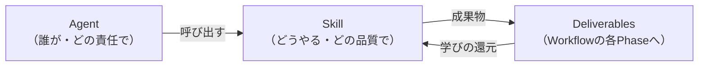
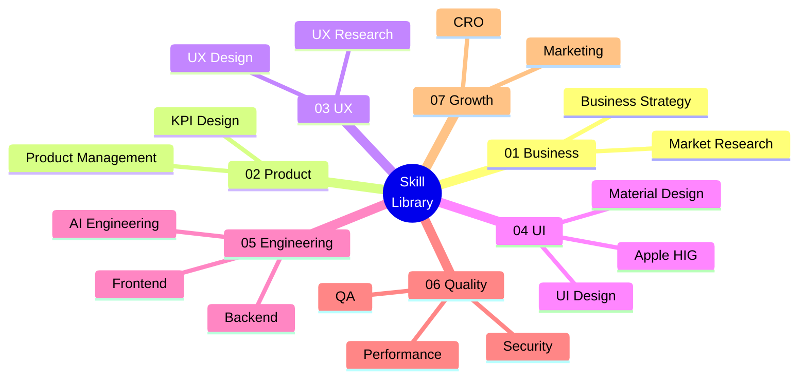
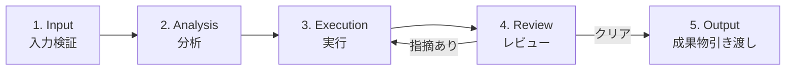

# Skill Architecture System

> **AI Development Operating System — スキル能力基盤**
>
> Agentが使う「能力」を再利用可能なSkillとして標準化する設計書。
> Agentが**誰が**やるか（責任・役割）を定義するのに対し、Skillは**どうやる**か（知識・手法・手順）を定義する。
> 1つのSkillは複数のAgent・複数のプロジェクトから呼び出され、ノウハウの属人化を排除する。

| 項目 | 内容 |
|---|---|
| **Version** | 1.0.0 |
| **Status** | Active |
| **Last Updated** | 2026-07-07 |
| **関連ドキュメント** | [`Development_Workflow.md`](./Development_Workflow.md) / [`Agent_Architecture.md`](./Agent_Architecture.md) / [`Agent_Base_Template.md`](./Agent_Base_Template.md) |

---

## 目次

1. [設計思想](#設計思想)
2. [Skill Map](#skill-map)
3. [Skill一覧表](#skill一覧表)
4. [Agent × Skill Matrix](#agent--skill-matrix)
5. [Skill詳細定義（01〜07）](#01-business-skills)
6. [Skill Execution Framework](#skill-execution-framework)
7. [Skill Library Structure](#skill-library-structure)
8. [Version Management](#version-management)

---

## 設計思想

| 目的 | 実現方法 |
|---|---|
| **Agent能力の標準化** | 全Skillが共通の10項目定義とExecution Frameworkに従う |
| **再利用可能な開発能力の構築** | Skillはプロジェクト非依存で記述し、プロジェクト固有情報はInputで注入する |
| **Claude Codeの品質向上** | 各Skillに Knowledge Base・Methodology・Quality Criteria を持たせ、実行のたびに参照する |
| **プロジェクト横断利用** | `skills/` ライブラリとして独立管理し、どのプロジェクトからも呼び出せる |
| **属人的なノウハウの排除** | 実行して得た学びをSkillファイルに還元し、ノウハウを「人」ではなく「Skill」に蓄積する |

### AgentとSkillの関係



- **Agent** = 役割・責任・判断基準（[`Agent_Architecture.md`](./Agent_Architecture.md)）
- **Skill** = 知識・手法・実行手順（本ドキュメント + `skills/` ライブラリ）
- 1つのAgentは複数のSkillを使い、1つのSkillは複数のAgentから使われる（多対多）
- Skillの実行結果はWorkflowのPhase成果物になる

### Skil設計の原則

1. **1 Skill = 1能力領域** — 肥大化したら分割する。100以上のSkillに拡張しても、カテゴリと命名規則で秩序を保つ。
2. **知識は外部化する** — 「Claudeが知っているはず」に依存せず、判断基準・フレームワーク・品質基準をSkillに明文化する。
3. **実行のたびに賢くなる** — 実行で得た学び（うまくいったパターン・失敗）をSkillファイルに還元する（Continuous Improvement）。
4. **Automation Levelを正直に定義する** — AIで自動化できる部分と人間判断が必要な部分を混ぜない。

---

## Skill Map



---

## Skill一覧表

| # | Skill | カテゴリ | 一言でいうと | 主利用Phase | Automation |
|---|---|---|---|---|---|
| 1 | Market Research | 01 Business | 市場・競合・トレンドの調査能力 | 01, 03 | High |
| 2 | Business Strategy | 01 Business | 事業モデル・価値提案の設計能力 | 01 | Medium |
| 3 | Product Management | 02 Product | PRD・優先順位付けの能力 | 02, 19 | High |
| 4 | KPI Design | 02 Product | 指標設計・ファネル分析の能力 | 01, 18 | High |
| 5 | UX Research | 03 UX | ユーザー調査・行動分析の能力 | 03 | Medium |
| 6 | UX Design | 03 UX | 情報設計・フロー設計の能力 | 04 | High |
| 7 | UI Design | 04 UI | ビジュアル・デザインシステム構築能力 | 05 | Medium |
| 8 | Apple HIG | 04 UI | HIG準拠の設計・検証能力 | 05, 06 | High |
| 9 | Material Design | 04 UI | Material準拠＋アクセシビリティ能力 | 05, 06 | High |
| 10 | Frontend | 05 Engineering | React/Next.js実装能力 | 09, 11 | High |
| 11 | Backend | 05 Engineering | API・DB・インフラ構築能力 | 08, 10, 11 | High |
| 12 | AI Engineering | 05 Engineering | LLM設計・評価システム構築能力 | 07, 10 | High |
| 13 | QA | 06 Quality | テスト設計・品質保証能力 | 12, 13 | High |
| 14 | Security | 06 Quality | 脆弱性検査・プライバシー保護能力 | 15 | High |
| 15 | Performance | 06 Quality | 速度改善・負荷検証能力 | 13, 14 | High |
| 16 | Marketing | 07 Growth | SEO・コンテンツ・広告能力 | 16, 18, 19 | Medium |
| 17 | CRO | 07 Growth | CVR改善・A/Bテスト能力 | 19 | High |

**Automation凡例**: High = 大部分をAIが実行可（人間はレビュー・承認） / Medium = AIと人間の協働が前提 / Low = 人間主導（AIは支援）

---

## Agent × Skill Matrix

● = 主利用（そのSkillの実行主体） / ○ = 副利用（参照・レビューで使用）

| Skill \ Agent | CEO | PM | MR | GR | UXR | UXD | UID | FE | BE | AIE | QA | SEC | PERF |
|---|---|---|---|---|---|---|---|---|---|---|---|---|---|
| Market Research | ○ | ○ | ● | ○ | ○ | — | — | — | — | — | — | — | — |
| Business Strategy | ● | ○ | ○ | ○ | — | — | — | — | — | — | — | — | — |
| Product Management | ○ | ● | — | ○ | — | — | — | — | — | — | ○ | — | — |
| KPI Design | ○ | ● | — | ● | — | — | — | — | — | — | — | — | — |
| UX Research | — | ○ | ○ | ○ | ● | ○ | — | — | — | — | — | — | — |
| UX Design | — | ○ | — | — | ○ | ● | ○ | ○ | — | ○ | — | — | — |
| UI Design | — | — | — | — | — | ○ | ● | ○ | — | — | ○ | — | — |
| Apple HIG | — | — | — | — | — | ○ | ● | ○ | — | — | ○ | — | — |
| Material Design | — | — | — | — | — | ○ | ● | ○ | — | — | ○ | — | — |
| Frontend | — | — | — | — | — | — | ○ | ● | ○ | — | ○ | — | ○ |
| Backend | — | — | — | — | — | — | — | ○ | ● | ○ | ○ | ○ | ○ |
| AI Engineering | — | ○ | — | — | — | — | — | — | ○ | ● | ○ | ○ | — |
| QA | — | ○ | — | — | — | — | — | ○ | ○ | ○ | ● | ○ | ○ |
| Security | — | — | — | — | — | — | — | ○ | ○ | ○ | ○ | ● | — |
| Performance | — | — | — | — | — | — | ○ | ○ | ○ | — | ○ | — | ● |
| Marketing | ○ | ○ | ○ | ● | — | — | — | ○ | — | — | — | — | — |
| CRO | — | ○ | — | ● | ○ | ○ | ○ | ○ | — | — | — | — | — |

Agent略称は [`Agent_Architecture.md`](./Agent_Architecture.md) のAgent一覧表に対応（MR=Market Research, GR=Growth, UXR=UX Research, UXD=UX Designer, UID=UI Designer, FE=Frontend, BE=Backend, AIE=AI Engineer）。

---

# 01 Business Skills

## Skill 1: Market Research Skill

**File**: `skills/business/market-research/SKILL.md`

### Skill Purpose
思い込みではなく市場の事実に基づいた意思決定を可能にする。競合・市場・ユーザー・トレンドの一次情報を収集し、プロダクトへの示唆に変換する能力。

### Knowledge Base
- 市場分析の基礎（TAM/SAM/SOM・市場成長率・セグメンテーション）
- 競合分析の観点（機能・価格・UX・ポジショニング・ビジネスモデル）
- 調査情報の信頼性評価（一次情報 vs 二次情報・出典の質）
- 業界レポート・統計データの読み方

### Methodology
- **3C分析**（Customer / Competitor / Company）
- **SWOT分析**・**ポジショニングマップ**
- **PEST分析**（マクロ環境・規制動向）
- **レビューマイニング**（競合のレビュー分析からペイン抽出）

### Input
- 調査目的（答えるべき問い）
- 対象市場・競合の範囲指定
- 調査の深さ・期限の指定

### Process
1. 調査依頼を「答えるべき問い」のリストに分解する
2. 問いごとに情報源を特定し、一次情報を優先して収集する（出典を必ず記録）
3. 3C/SWOT等のフレームワークで構造化する
4. 事実（Fact）と解釈（Insight）を分離する
5. 「So What（プロダクトへの示唆）」に変換して報告書化する

### Output
- 競合比較表（`01_Product/competitor-analysis.md`）
- 市場調査レポート（`01_Product/market-research.md`）
- トレンドレポート

### Quality Criteria
- [ ] すべての事実に出典が明記されている
- [ ] 競合は最低3社、機能・価格・UXの3観点以上で比較されている
- [ ] 事実と解釈が明確に分離されている
- [ ] 各発見が「プロダクトへの示唆」に変換されている

### Related Agents
● Market Research Agent ／ ○ CEO・PM・Growth・UX Research Agent

### Automation Level
**High** — 情報収集・構造化・比較表作成・レポート生成はAIが実行。WebSearch/WebFetchで一次情報を収集できる。

### Human Judgment Required
- 調査結果の解釈が事業方針を左右する場合の最終判断
- 有料データソースの購入判断
- 「この市場に参入すべきか」の意思決定そのもの

---

## Skill 2: Business Strategy Skill

**File**: `skills/business/business-strategy/SKILL.md`

### Skill Purpose
「誰の・どんな課題を・どう解決し・どう収益化するか」を構造化し、作る価値のある事業として成立させる能力。

### Knowledge Base
- ビジネスモデルの類型（SaaS・マーケットプレイス・広告・フリーミアム・従量課金）
- ユニットエコノミクス（LTV / CAC・粗利構造・損益分岐）
- 価格戦略（バリューベース・競合ベース・コストベース）
- 参入障壁とモート（ネットワーク効果・スイッチングコスト・データ優位）

### Methodology
- **Lean Canvas / Business Model Canvas**
- **Value Proposition Canvas**（顧客のジョブ・ペイン・ゲインとの適合）
- **Revenue Model設計**（収益源の構造化・価格シミュレーション）
- **Growth Strategy**（AARRR・グロースループ設計）

### Input
- プロジェクト憲章（目的・制約）
- 市場調査・競合分析の結果（Market Research Skill）
- ターゲット顧客の仮説

### Process
1. 顧客課題と提供価値を Value Proposition Canvas で適合させる
2. Lean Canvas で事業全体を1枚に構造化する
3. 収益モデルを設計し、ユニットエコノミクスを試算する
4. 成長戦略（獲得チャネル・グロースループ）を仮説化する
5. 前提・リスク・検証方法を明記し、Go/No-Go判断の材料を揃える

### Output
- 事業戦略書（`01_Product/business-strategy.md`）
- Lean Canvas（`01_Product/lean-canvas.md`）
- 収益シミュレーション

### Quality Criteria
- [ ] 価値提案が1文で言える（誰の・何を・どう解決）
- [ ] LTV > CAC の成立見込みが数値で試算されている
- [ ] 前提（仮説）と検証方法がセットで記録されている
- [ ] 最も重要なリスクが特定されている

### Related Agents
● CEO Agent ／ ○ PM・Market Research・Growth Agent

### Automation Level
**Medium** — Canvas作成・試算・構造化はAIが実行。事業の方向性・価格の最終決定は人間。

### Human Judgment Required
- 事業のGo / No-Go判断
- 価格・収益モデルの最終決定
- ビジョンとの整合・倫理面の判断

---

# 02 Product Skills

## Skill 3: Product Management Skill

**File**: `skills/product/product-management/SKILL.md`

### Skill Purpose
事業戦略を「何を・どの順序で作るか」に翻訳し、チーム全員が同じゴールに向かえる要件とロードマップを作る能力。

### Knowledge Base
- PRDの構成要素（背景・目的・ターゲット・機能/非機能要件・非ゴール）
- ユーザーストーリーと受け入れ基準（INVEST原則・Given/When/Then）
- スコープ管理（MVP定義・スコープクリープの防御）
- ロードマップ設計（Now/Next/Later・マイルストーン）

### Methodology
- **ユーザーストーリーマッピング**
- **RICE / ICE スコアリング**（優先順位付け）
- **MoSCoW分析**（Must/Should/Could/Won't）
- **Kano分析**（当たり前品質・魅力品質の分類）

### Input
- 事業戦略書・Lean Canvas
- UXリサーチ結果・ユーザーフィードバック
- 技術的制約（Engineering Layerから）

### Process
1. 事業戦略を「ユーザー課題 → 解決策 → 機能」に分解する
2. 機能をユーザーストーリー化し、受け入れ基準を付与する
3. RICE/MoSCoWで優先順位付けし、MVPの線を引く
4. 非機能要件を数値で定義する（性能・可用性・セキュリティ）
5. 「やらないこと（非ゴール）」を明文化する

### Output
- PRD（`01_Product/prd.md`）
- ユーザーストーリー一覧（`01_Product/user-stories.md`）
- MVPスコープ・ロードマップ（`01_Product/mvp-scope.md`）

### Quality Criteria
- [ ] 全ユーザーストーリーに受け入れ基準がある
- [ ] 優先順位に根拠スコア（RICE等）が付いている
- [ ] 非機能要件が数値で定義されている
- [ ] 非ゴールが明文化されている

### Related Agents
● Product Manager Agent ／ ○ CEO・Growth・QA Engineer Agent

### Automation Level
**High** — PRDドラフト・ストーリー展開・スコアリングはAIが実行。スコープの最終決定は人間。

### Human Judgment Required
- MVPスコープの最終決定（何を捨てるか）
- 優先順位の承認
- ステークホルダー間の利害調整

---

## Skill 4: KPI Design Skill

**File**: `skills/product/kpi-design/SKILL.md`

### Skill Purpose
プロダクトの成功を計測可能にする。North Star Metricを頂点とするKPIツリーを設計し、改善の意思決定をデータで支える能力。

### Knowledge Base
- 指標設計の原則（先行指標 vs 遅行指標・バニティメトリクスの回避）
- ファネル構造（AARRR: Acquisition/Activation/Retention/Referral/Revenue）
- コホート分析・リテンションカーブの読み方
- LTV算出モデル（ARPU × 継続期間・割引現在価値）

### Methodology
- **North Star Metric設計**（プロダクト価値と相関する単一指標）
- **KPIツリー分解**（NSM → ドライバー指標 → 施策指標）
- **Funnel Analysis**（ステップ別転換率・ボトルネック特定）
- **Retention / LTV Analysis**（コホート・D1/D7/D30・LTV/CAC）

### Input
- 事業戦略書（収益モデル・成長仮説）
- プロダクトの主要ユーザーフロー
- 計測基盤の制約（取得可能なイベント）

### Process
1. プロダクトの中核価値を特定し、North Star Metric を定義する
2. NSMをドライバー指標に分解し、KPIツリーを作る
3. 各指標に定義・集計ロジック・目標値を明文化する
4. 計測イベント設計（どの操作で何を記録するか）に落とす
5. ダッシュボード要件を定義する

### Output
- KPIツリー定義（`08_Growth/kpi-dashboard.md`）
- 計測イベント設計書
- ファネル・リテンション分析レポート

### Quality Criteria
- [ ] NSMがプロダクト価値と論理的に接続している
- [ ] 全指標に定義・集計ロジック・目標値がある
- [ ] 先行指標が含まれている（遅行指標だけで構成しない）
- [ ] 計測イベントとして実装可能な粒度まで落ちている

### Related Agents
● Product Manager / Growth Agent ／ ○ CEO Agent

### Automation Level
**High** — ツリー分解・定義文書化・分析の実行はAIが実行。NSMの選定承認は人間。

### Human Judgment Required
- North Star Metric の最終選定（事業の方向を規定する）
- 目標値の設定（事業計画との整合）
- 指標が示す結果の解釈と投資判断

---

# 03 UX Skills

## Skill 5: UX Research Skill

**File**: `skills/ux/ux-research/SKILL.md`

### Skill Purpose
ユーザーの行動・動機・文脈を証拠に基づいて理解し、デザイン判断の根拠を作る能力。チームの思い込みを排除する。

### Knowledge Base
- 定性調査の技法（半構造化インタビュー・オープンクエスチョン・誘導の回避）
- 行動心理学・認知心理学（メンタルモデル・認知バイアス・動機理論）
- サンプリングの考え方（5人テストの根拠・スクリーニング設計）
- 定性データ分析（アフィニティ分析・テーマ抽出）

### Methodology
- **User Interview設計**（リサーチクエスチョン → 質問項目への展開）
- **Persona作成**（行動ベース・デモグラ偏重の回避）
- **Journey Map**（行動・思考・感情・タッチポイントの時系列マップ）
- **JTBD（Jobs to be Done）**・**Behavior Analysis**（行動データとの突き合わせ）

### Input
- PRD・ターゲット仮説
- インタビュー記録・アンケート回答・行動データ
- 競合UX分析

### Process
1. リサーチクエスチョンを定義する（明らかにしたい問い）
2. 問いに適した手法を選定する（定性=なぜ／定量=どれだけ）
3. 誘導のないインタビューガイド・調査票を設計する
4. 結果をアフィニティ分析でパターン化し、証拠付きの発見に変換する
5. ペルソナ・ジャーニーマップ・JTBDに統合し、デザインへの示唆を出す

### Output
- リサーチ計画・レポート（`02_UX/research-plan.md` / `research-report.md`）
- ペルソナ（`02_UX/personas.md`）
- ジャーニーマップ・JTBD（`02_UX/customer-journey.md` / `jtbd.md`）

### Quality Criteria
- [ ] すべての発見に証拠（発言・データ・観察）が紐づいている
- [ ] 質問設計に誘導質問が含まれていない
- [ ] ペルソナが行動・目標・ペイン・文脈を含む（デモグラだけでない）
- [ ] ジャーニーマップに感情曲線とペインポイントがある

### Related Agents
● UX Research Agent ／ ○ PM・UX Designer・Growth・Market Research Agent

### Automation Level
**Medium** — 調査設計・記録分析・ドキュメント化はAIが実行。実ユーザーとの対話は人間が実施。

### Human Judgment Required
- 実ユーザーインタビューの実施（生の感情・文脈の観察）
- 調査結果の解釈の最終判断
- 調査倫理（対象者への配慮・個人情報）

---

## Skill 6: UX Design Skill

**File**: `skills/ux/ux-design/SKILL.md`

### Skill Purpose
ユーザー理解を「迷わず目的を達成できる体験構造」に変換する能力。認知に沿った情報設計・フロー設計で使いやすさを構造レベルで保証する。

### Knowledge Base
- 情報アーキテクチャ（分類・ラベリング・ナビゲーション・検索）
- 認知心理学の法則（ヒックの法則・フィッツの法則・ミラーの法則・認知負荷理論）
- NN/g ユーザビリティ10原則（システム状態の可視化・エラー防止・一貫性 等）
- 状態設計（loading / error / empty / success の網羅）

### Methodology
- **Information Architecture設計**（カードソーティング・サイトマップ）
- **User Flow設計**（タスクフロー・正常系/異常系・意思決定ポイント）
- **Interaction Design**（フィードバック・アフォーダンス・エラー回復）
- **Cognitive Psychology適用**（認知負荷診断・選択肢数の最適化）

### Input
- リサーチレポート・ペルソナ・ジャーニーマップ・JTBD
- PRD・ユーザーストーリー

### Process
1. ユーザーストーリーごとに「目的 → 最短経路」でフローを設計する
2. 異常系（エラー・空・オフライン）を正常系とセットで設計する
3. IAを設計し、ユーザーのメンタルモデルとの一致を検証する
4. 認知負荷診断（ステップ数・入力量・選択肢数）でフローを磨く
5. ワイヤーフレームで構造を可視化し、NN/g 10原則でセルフチェックする

### Output
- ユーザーフロー図（`02_UX/user-flows.md`）
- IA・サイトマップ（`02_UX/information-architecture.md`）
- ワイヤーフレーム・インタラクション方針（`02_UX/wireframes.md` / `interaction-principles.md`）

### Quality Criteria
- [ ] 全ユーザーストーリーに対応するフローがある
- [ ] 主要フローの異常系が設計されている
- [ ] NN/g 10原則の重大違反がない
- [ ] リサーチの発見が設計に反映されている（トレーサビリティ）

### Related Agents
● UX Designer Agent ／ ○ UX Research・UI Designer・Frontend・PM Agent

### Automation Level
**High** — フロー図・IA・ワイヤー構成案・認知負荷診断はAIが実行。体験の感情設計の判断は人間。

### Human Judgment Required
- 体験の「感情の流れ」の最終判断
- トレードオフの決定（例: ステップ削減 vs 丁寧な確認）
- ダークパターンの排除確認

---

# 04 UI Skills

## Skill 7: UI Design Skill

**File**: `skills/ui/ui-design/SKILL.md`

### Skill Purpose
体験構造を、ブランドを体現する美しくアクセシブルなビジュアルに仕上げる能力。デザインシステムで一貫性と拡張性を両立する。

### Knowledge Base
- ビジュアルデザインの原則（階層・コントラスト・近接・整列・反復・余白）
- タイポグラフィ（書体選定・スケール・行間・可読性）
- カラー設計（意味的色設計・コントラスト比・ダークモード）
- デザイントークン体系（色・タイポ・スペーシング・角丸・シャドウ・モーション）

### Methodology
- **Visual Design**（階層設計・グリッドシステム・8ptスペーシング）
- **Component Design**（バリアント・状態網羅・Auto Layout）
- **Design System構築**（トークン → コンポーネント → パターン → 画面）
- **Responsive Design**（ブレークポイント設計・モバイルファースト）

### Input
- ワイヤーフレーム・IA・インタラクション方針
- ブランド方針（トーン&マナー）
- Apple HIG / Material Design Skill（プラットフォーム規約）

### Process
1. デザイントークンを最初に定義する（画面から作らない）
2. コンポーネントをバリアント・状態込みで構築する
3. 画面をコンポーネントの組み合わせで構成する（一点物を作らない）
4. 全状態（default/hover/focus/disabled/error/empty/loading）を用意する
5. レスポンシブ・アクセシビリティを機械検証し、プロトタイプ化する

### Output
- デザイントークン・デザインシステム（`03_UI/design-tokens.md` / `design-system.md`）
- 画面デザイン・プロトタイプ（`03_UI/screen-designs.md` / `prototype.md`）

### Quality Criteria
- [ ] 全画面がトークン・コンポーネント参照で構築されている（ハードコードなし）
- [ ] 全画面に状態バリエーションがある
- [ ] コントラスト比 4.5:1 以上・タッチターゲット 44pt 以上
- [ ] Figmaファイルが実装者にとって仕様として機能する（命名・Auto Layout）

### Related Agents
● UI Designer Agent ／ ○ UX Designer・Frontend・QA Engineer Agent

### Automation Level
**Medium** — トークン設計・コンポーネント構築（Figma MCP）・機械検証はAIが実行。ブランド表現・美的判断は人間。

### Human Judgment Required
- ブランド表現（色・書体・トーン）の最終決定
- 「心地よさ・信頼感」など感性品質の判定
- ビジュアルの品位（余白・リズム）の最終確認

---

## Skill 8: Apple HIG Skill

**File**: `skills/ui/apple-hig/SKILL.md`

### Skill Purpose
Apple Human Interface Guidelinesに準拠した設計・検証を行う能力。iOS/macOS向けプロダクトの品質をAppleの水準に揃える。

### Knowledge Base
- HIGの3原則（Clarity 明瞭さ / Deference コンテンツ優先 / Depth 階層と文脈）
- プラットフォーム規約（ナビゲーションパターン・モーダル・ジェスチャ・SF Symbols）
- Dynamic Type・セーフエリア・タッチターゲット（44pt）
- プラットフォーム間の差異（iOS / iPadOS / macOS / watchOS）

### Methodology
- **Human Interface Guidelines準拠チェック**（コンポーネント・ナビゲーション・レイアウト）
- **Interaction Principles適用**（直接操作・フィードバック・一貫性・ユーザー主導）
- **Motion Design**（意味のあるモーション・空間的連続性・Reduce Motion対応）

### Input
- UIデザイン・プロトタイプ（UI Design Skill）
- 対象プラットフォーム（iOS / iPadOS / macOS）

### Process
1. 対象プラットフォームのHIG該当章を特定する
2. ナビゲーション構造・コンポーネント使用がHIGパターンに沿うか検証する
3. Dynamic Type・セーフエリア・タッチターゲットを検証する
4. モーションの意味と Reduce Motion 対応を設計・検証する
5. 逸脱箇所は「意図的な逸脱か・修正すべきか」を判定し記録する

### Output
- HIG準拠チェックレポート（Design Review への入力）
- モーション設計方針
- 逸脱箇所と対応方針の記録

### Quality Criteria
- [ ] ナビゲーション・コンポーネントが標準パターンに準拠（逸脱は理由記録済み）
- [ ] Dynamic Type・セーフエリア・44ptターゲットを満たす
- [ ] モーションが意味を持ち、Reduce Motion に対応している

### Related Agents
● UI Designer Agent ／ ○ UX Designer・Frontend・QA Engineer Agent

### Automation Level
**High** — 準拠チェック・逸脱検出・レポート生成はAIが実行。意図的逸脱の判断は人間。

### Human Judgment Required
- 標準パターンから意図的に逸脱する判断（ブランド表現とのトレードオフ）
- プラットフォームらしさとプロダクトらしさのバランス

---

## Skill 9: Material Design Skill

**File**: `skills/ui/material-design/SKILL.md`

### Skill Purpose
Google Material Design（M3）とアクセシビリティ基準に準拠した設計・検証を行う能力。Android/Web向けプロダクトの品質を保証する。

### Knowledge Base
- Material Design 3（デザイントークン・ダイナミックカラー・コンポーネント体系）
- エレベーション・ステート（hover/focus/pressed/dragged のステートレイヤー）
- WCAG 2.2（知覚可能・操作可能・理解可能・堅牢）
- アクセシビリティ実装（コントラスト・フォーカス管理・スクリーンリーダー・タッチターゲット48dp）

### Methodology
- **Material Design準拠チェック**（トークン・コンポーネント・レイアウトグリッド）
- **Accessibility検証**（WCAG 2.2 AA チェックリスト・axe等の機械検証＋手動検証）

### Input
- UIデザイン・デザインシステム（UI Design Skill）
- 対象プラットフォーム（Android / Web）

### Process
1. デザイントークンがM3のトークン構造と整合するか検証する
2. コンポーネントのステート設計（ステートレイヤー）を検証する
3. WCAG 2.2 AA チェックリストで機械検証＋手動検証を行う
4. キーボード操作・フォーカス順序・スクリーンリーダー読み上げを検証する
5. 違反・逸脱を重大度付きで記録し、修正提案を出す

### Output
- Material準拠チェックレポート
- アクセシビリティ検証レポート（Design Review / QA Review への入力）

### Quality Criteria
- [ ] トークン・コンポーネントがM3体系と整合している
- [ ] WCAG 2.2 AA の機械検証で重大違反ゼロ
- [ ] キーボードのみで主要フローを完遂できる
- [ ] タッチターゲット 48dp 以上

### Related Agents
● UI Designer Agent ／ ○ UX Designer・Frontend・QA Engineer Agent

### Automation Level
**High** — 準拠チェック・WCAG機械検証・レポート生成はAIが実行。

### Human Judgment Required
- ブランドカラーとダイナミックカラーの優先判断
- アクセシビリティとビジュアル表現が衝突した場合の裁定

---

# 05 Engineering Skills

## Skill 10: Frontend Skill

**File**: `skills/engineering/frontend/SKILL.md`

### Skill Purpose
デザインを忠実・高速・保守可能なコードで再現する能力。React/Next.js/TypeScriptによる実装とフロントエンド品質の標準を提供する。

### Knowledge Base
- React（コンポーネント設計・フック・状態管理・レンダリング最適化）
- Next.js（App Router・SSR/SSG/ISR・ルーティング・キャッシュ戦略）
- TypeScript（型設計・strictモード・型安全なAPI連携）
- Performance（バンドル分割・画像最適化・Core Web Vitals・遅延読み込み）

### Methodology
- **コンポーネント駆動開発**（トークン → 共通コンポーネント → 画面の順に実装）
- **型駆動設計**（APIスキーマから型生成・型で契約を保証）
- **テスト戦略**（ユニット・コンポーネント・Storybookカタログ化）
- **Performance Optimization**（計測 → ボトルネック特定 → 改善 → 再計測）

### Input
- Figmaデザイン・デザインシステム（Code Connect対応）
- API仕様・開発規約

### Process
1. デザイントークン・共通コンポーネントを先に実装する
2. 画面を全状態（loading/error/empty含む）込みで実装する
3. 型安全にAPIと結合する（モック → 実APIの段階結合）
4. テスト・アクセシビリティ・コンソールエラーゼロを確認する
5. 小さなPRに分割してレビューを受ける

### Output
- フロントエンドコード（PR単位）
- コンポーネントカタログ・ユニットテスト

### Quality Criteria
- [ ] デザイントークン参照で実装されている（ハードコードなし）
- [ ] 全状態が実装されている
- [ ] 型エラー・Lintエラー・コンソールエラーがゼロ
- [ ] キーボード操作・セマンティックHTMLが担保されている

### Related Agents
● Frontend Engineer Agent ／ ○ UI Designer・Backend・QA・Performance Agent

### Automation Level
**High** — 実装・テスト・リファクタリングはClaude Codeが実行。マージ承認は人間。

### Human Judgment Required
- PRの最終マージ承認
- 「触り心地」（アニメーション・レスポンス感）の確認
- 主要ライブラリの採用判断

---

## Skill 11: Backend Skill

**File**: `skills/engineering/backend/SKILL.md`

### Skill Purpose
安全で・速く・壊れないAPI・データ基盤・インフラを構築する能力。プロダクトの信頼性の土台を提供する。

### Knowledge Base
- API Design（REST/GraphQL・リソース設計・バージョニング・エラーフォーマット統一）
- Database Design（正規化・インデックス・トランザクション・マイグレーション）
- Authentication / Authorization（OAuth2 / OIDC・セッション・RBAC・多要素認証）
- Infrastructure（IaC・CI/CD・監視・構造化ログ・スケーラビリティ）

### Methodology
- **仕様駆動開発**（API仕様書を実装より先に更新する）
- **データモデルファースト**（変更コストの高い決定を先に固める）
- **Secure by Default**（全エンドポイントに認証・認可・バリデーションを標準適用）
- **Observability設計**（ログ・メトリクス・トレースを実装時から組み込む）

### Input
- PRD・非機能要件
- アーキテクチャ設計書・データモデル
- AI機能設計（AI Engineering Skillから）

### Process
1. データモデルを設計し、ER図と制約を確定する
2. API仕様書を作成し、フロントエンドと合意する
3. 認証・認可・バリデーションを標準実装する
4. 構造化ログ・エラートラッキング・監視を組み込む
5. ユニット/APIテストとマイグレーションで再現性を担保する

### Output
- バックエンドコード・APIドキュメント
- アーキテクチャ・データモデル・API仕様（`05_Development/`配下）

### Quality Criteria
- [ ] API仕様書と実装が一致している
- [ ] 全エンドポイントに認証・認可・バリデーションがある
- [ ] エラーレスポンス形式が統一されている
- [ ] マイグレーションで環境を再現できる

### Related Agents
● Backend Engineer Agent ／ ○ Frontend・AI Engineer・Security・Performance Agent

### Automation Level
**High** — 設計ドラフト・実装・テストはClaude Codeが実行。技術選定・データ設計の承認は人間。

### Human Judgment Required
- 技術スタック・インフラ構成の決定（コスト含む）
- データモデルの大きな変更
- 外部サービス契約・本番環境の操作

---

## Skill 12: AI Engineering Skill

**File**: `skills/engineering/ai-engineering/SKILL.md`

### Skill Purpose
AI機能を「デモ」ではなく「プロダクト品質」で構築する能力。プロンプト設計・評価システム・安全対策で、AI品質を計測可能にする。

### Knowledge Base
- LLM Architecture（モデル選定・コンテキスト管理・キャッシュ・コスト設計）
- Prompt Engineering（構造化プロンプト・Few-shot・出力フォーマット制御・変数設計）
- Agent Design（ツール定義・マルチステップ・ループ制御・フォールバック）
- Evaluation（評価データセット・LLM-as-judge・回帰検知・合格基準設計）
- AI安全性（プロンプトインジェクション対策・出力フィルタ・レート制限）

### Methodology
- **評価駆動開発**（評価データセットと合格基準をプロンプトより先に作る）
- **プロンプトバージョン管理**（変更は評価結果とセットで記録）
- **フォールバック設計**（全失敗モードにUXレベルの受け皿を用意）
- **コストガバナンス**（トークン試算・上限・アラート）

### Input
- PRDのAI要件・UXフロー
- モデル情報（Claude API等の最新仕様）
- 評価用データ（実データまたは合成データ）

### Process
1. 「AIで解くべき問題か」から検証する（ルールベースで済むなら使わない）
2. 評価データセットと合格基準を定義する
3. プロンプト・ツール・フォールバックを設計する
4. 評価 → 改善のループを回し、基準達成まで繰り返す
5. 安全対策（インジェクション・有害出力・コスト暴走）を実装・検証する

### Output
- AI機能設計書・プロンプト設計書・評価計画（`04_AI/`配下）
- AI機能実装コード・評価パイプライン
- プロンプトライブラリ（`prompts/`配下）

### Quality Criteria
- [ ] 評価基準が数値で定義され、達成が計測されている
- [ ] 全AI呼び出しにフォールバックがある
- [ ] プロンプト変更が評価結果とセットで記録されている
- [ ] インジェクション・コスト暴走への対策が実装されている

### Related Agents
● AI Engineer Agent ／ ○ PM・Backend・QA・Security Agent

### Automation Level
**High** — プロンプト設計・評価実行・改善ループはClaude Codeが実行。品質基準・倫理判断は人間。

### Human Judgment Required
- モデル選定・コスト上限の承認
- 評価合格基準の承認（「この品質で出せるか」）
- AIの利用範囲の倫理判断

---

# 06 Quality Skills

## Skill 13: QA Skill

**File**: `skills/quality/qa/SKILL.md`

### Skill Purpose
「動くはず」を「動く証拠がある」に変える能力。体系的なテスト設計・実行・バグ管理で品質を計測可能にする。

### Knowledge Base
- テスト設計技法（同値分割・境界値分析・デシジョンテーブル・状態遷移）
- テストレベル（ユニット・結合・E2E・回帰・探索的テスト）
- バグレポートの標準（再現手順・期待値・実際・環境・重大度）
- テスト自動化（Playwright等・CI統合・フレーキーテスト対策）

### Methodology
- **Test Planning**（リスクベースドテスト・テスト範囲と基準の定義）
- **Regression Testing**（回帰スイート設計・CI常時実行）
- **Bug Detection**（境界値・異常系・探索的テストの組み合わせ）

### Input
- 受け入れ基準付きユーザーストーリー
- 結合済みアプリケーション
- AI評価計画（AI機能がある場合）

### Process
1. 受け入れ基準をテスト可能な形式（Given/When/Then）に変換する
2. リスクベースでテスト範囲・優先度を決める
3. 正常系・異常系・境界値のテストケースを設計する（異常系≧正常系）
4. E2E・回帰スイートを自動化しCIに統合する
5. バグを標準形式で記録し、修正後に回帰テストを回す

### Output
- テスト計画・テストケース・テスト結果（`06_Test/`配下）
- QAレビュー報告書（PASS/WARNING/FAIL判定）
- 自動テストスイート

### Quality Criteria
- [ ] 全受け入れ基準に対応するテストケースがある
- [ ] 異常系・境界値がテストされている
- [ ] バグが再現手順付きで記録されている
- [ ] 回帰スイートがCIで常時実行されている

### Related Agents
● QA Engineer Agent ／ ○ 全Engineering・Security・Performance・PM Agent

### Automation Level
**High** — ケース生成・自動化・実行・レポートはAIが実行。探索的テストとリリース判断は人間。

### Human Judgment Required
- 探索的テスト（シナリオ外の「意地悪な操作」）
- バグ優先度・残存バグの許容判断
- QAゲートの最終通過判定

---

## Skill 14: Security Skill

**File**: `skills/quality/security/SKILL.md`

### Skill Purpose
ユーザーのデータと事業の信頼を守る能力。脆弱性・プライバシーリスクを体系的に検出し、リリース前に潰す。

### Knowledge Base
- OWASP Top 10（インジェクション・認証不備・アクセス制御・設定ミス 等）
- 認証・認可の設計（セッション管理・トークン・権限昇格の防止）
- プライバシー（個人情報の分類・データ最小化・ポリシー整合・関連法規の論点）
- AI固有リスク（プロンプトインジェクション・出力経由攻撃・データ漏洩）

### Methodology
- **Security Review**（OWASPチェックリスト＋手動検査の組み合わせ）
- **脅威モデリング**（資産の列挙 → 攻撃面の特定 → 対策マッピング）
- **Privacy Review**（データフロー図とポリシーの突き合わせ）
- **依存関係スキャン**（既知脆弱性の継続監視）

### Input
- アプリケーションコード・インフラ構成
- データフロー・個人情報の取り扱い一覧
- プライバシーポリシー・利用規約

### Process
1. 資産（データ・権限・金銭）を列挙し、攻撃者視点で攻撃面を洗い出す
2. 機械検査（静的解析・依存スキャン）を実行する
3. 手動検査（認可ロジック・ビジネスロジックの穴）を行う
4. 指摘を重大度付き（Critical/High/Medium/Low）で記録する
5. Critical/High の修正を検証し、再発防止をチェックリストに還元する

### Output
- セキュリティレビュー報告書（`06_Test/security-review-report.md`）
- 脆弱性指摘（重大度・再現手順・修正提案付き）
- インシデント対応手順（`07_Launch/incident-response.md`）

### Quality Criteria
- [ ] OWASP Top 10 の全項目が検査されている
- [ ] Critical / High の脆弱性がゼロ
- [ ] 実装とプライバシーポリシーが一致している
- [ ] 秘密情報がリポジトリ・クライアントに含まれていない

### Related Agents
● Security Agent ／ ○ Backend・AI Engineer・Frontend・QA Engineer Agent

### Automation Level
**High** — 機械検査・チェックリスト検査・レポートはAIが実行。リスク受容の判断は人間。

### Human Judgment Required
- 残存リスクの受容判断
- 法務要件の最終確認
- インシデント対応体制の承認

---

## Skill 15: Performance Skill

**File**: `skills/quality/performance/SKILL.md`

### Skill Purpose
「速さは機能」を実現する能力。実測に基づくボトルネック特定と改善で、体感速度と負荷耐性をリリース品質に引き上げる。

### Knowledge Base
- Core Web Vitals（LCP ≦2.5s / INP ≦200ms / CLS ≦0.1 の意味と改善手法）
- フロント最適化（バンドル・画像・フォント・キャッシュ・レンダリング）
- バック最適化（クエリ・N+1・インデックス・キャッシュ層・非同期化）
- 負荷テスト設計（シナリオ・段階負荷・限界値把握）

### Methodology
- **計測駆動改善**（計測 → 特定 → 1改善 → 再計測のループ。推測で最適化しない）
- **Core Web Vitals監視**（実機・実回線・フィールドデータ）
- **Load Testing**（想定ピークの2倍まで・ボトルネックの特定）

### Input
- 結合済みアプリケーション
- 非機能要件の目標値
- 想定トラフィック

### Process
1. 実機・実回線条件で現状を計測する（ベースライン確定）
2. ボトルネックをデータで特定し、影響の大きい順に並べる
3. 改善を1つずつ適用し、効果を計測してから次に進む
4. 負荷テストで限界値とスケール挙動を把握する
5. 改善前後の比較と達成値をレポート化する

### Output
- パフォーマンスレポート（`05_Development/performance-report.md`）
- ボトルネック分析・改善提案（優先順位付き）
- 負荷テスト結果

### Quality Criteria
- [ ] 計測が実機・実回線条件で行われている
- [ ] Core Web Vitals が目標値を達成している
- [ ] 改善ごとに前後の計測値が記録されている
- [ ] 想定ピーク負荷での動作が検証されている

### Related Agents
● Performance Agent ／ ○ Frontend・Backend・QA Engineer・UI Designer Agent

### Automation Level
**High** — 計測・分析・最適化実装・負荷テストはAIが実行。コストトレードオフの判断は人間。

### Human Judgment Required
- パフォーマンス目標と改善コストのトレードオフ
- インフラ増強（コスト）による解決の承認
- 「体感速度」の最終確認

---

# 07 Growth Skills

## Skill 16: Marketing Skill

**File**: `skills/growth/marketing/SKILL.md`

### Skill Purpose
プロダクトを必要とするユーザーに届ける能力。SEO・コンテンツ・広告の設計と実行で、持続的な獲得チャネルを構築する。

### Knowledge Base
- SEO（検索意図・テクニカルSEO・構造化データ・E-E-A-T）
- Content Strategy（コンテンツファネル・トピッククラスター・配信チャネル）
- Advertising（媒体特性・ターゲティング・クリエイティブ・CPA/ROAS管理）
- ブランドとパフォーマンスの両立

### Methodology
- **SEO設計**（キーワード戦略 → 情報設計 → テクニカル対応 → 計測）
- **Content Strategy**（ペルソナ×ファネル段階のコンテンツマップ）
- **Advertising運用**（仮説 → 小予算検証 → 効果測定 → スケール）

### Input
- ペルソナ・JTBD（UX Research Skill）
- KPI・獲得目標（KPI Design Skill）
- ブランド方針・予算

### Process
1. ペルソナの情報行動（検索・SNS・コミュニティ）から接点を特定する
2. チャネルごとに獲得仮説とKPIを設計する
3. SEO・コンテンツ・広告の施策を優先順位付きで計画する
4. 小さく実験し、CPA/ROASで効果検証する
5. 効くチャネルに投資を集中し、学びを記録する

### Output
- マーケティング戦略書・SEO設計書
- コンテンツ計画・広告運用レポート（`08_Growth/`配下）

### Quality Criteria
- [ ] 施策がペルソナの実際の情報行動に基づいている
- [ ] 全施策にKPIと効果検証方法が定義されている
- [ ] SEOがテクニカル要件（構造化データ・サイトマップ等）を満たす
- [ ] 誇大表現・誤認を招く表現がない

### Related Agents
● Growth Agent ／ ○ CEO・PM・Market Research・Frontend Agent

### Automation Level
**Medium** — SEO設計・コンテンツ制作・分析はAIが実行。予算配分・ブランド表現は人間。

### Human Judgment Required
- 広告予算の配分決定
- ブランドイメージに関わるクリエイティブの承認
- 景表法等の法令面の最終確認

---

## Skill 17: CRO Skill

**File**: `skills/growth/cro/SKILL.md`

### Skill Purpose
既存トラフィックからの成果を最大化する能力。データに基づく仮説検証（A/Bテスト）でCVRを継続的に改善する。

### Knowledge Base
- ファネル分析（ステップ別離脱・セグメント別差異）
- A/Bテストの統計（サンプルサイズ・有意差・検定の落とし穴）
- LPO（ファーストビュー・オファー・フォーム最適化・社会的証明）
- 行動心理学の応用と倫理境界（ナッジは可・ダークパターンは禁止）

### Methodology
- **Conversion Optimization**（ボトルネック特定 → 原因仮説 → 施策設計）
- **A/B Testing**（仮説 → 実験設計 → 統計判定 → 学びの記録）
- **Landing Page Optimization**（メッセージ適合・情報階層・CTA設計）

### Input
- ファネルデータ・ヒートマップ・行動データ
- ユーザーフィードバック・離脱理由
- KPI目標（KPI Design Skill）

### Process
1. ファネルから最も離脱の大きいステップを特定する
2. 定量＋定性データで離脱の原因仮説を立てる
3. 仮説をA/Bテストとして設計する（成功基準・サンプルサイズを事前定義）
4. 実験を実行し、統計的に判定する
5. 勝ちパターンを反映し、学び（勝ち negative含む）を記録する

### Output
- CRO施策バックログ（RICE付き）
- A/Bテスト設計書・結果レポート（`08_Growth/`配下）

### Quality Criteria
- [ ] 施策がデータ（離脱箇所・原因仮説）に紐づいている
- [ ] 成功基準・サンプルサイズがテスト前に定義されている
- [ ] 統計的判定のルールが守られている（途中で覗いて止めない）
- [ ] ダークパターンを含まない

### Related Agents
● Growth Agent ／ ○ PM・UX Research・UX/UI Designer・Frontend Agent

### Automation Level
**High** — 分析・仮説生成・テスト設計・判定はAIが実行。実験の実施判断・倫理確認は人間。

### Human Judgment Required
- 実験実施の承認（ユーザーへの影響を伴うため）
- UXとCVRが衝突する施策の裁定
- ダークパターン境界の判断

---

# Skill Execution Framework

すべてのSkillは以下の5ステージで実行する。Agent側のWorkflow（[`Agent_Architecture.md`](./Agent_Architecture.md)）と互換の構造。



## 標準実行フォーマット

Skillを実行するときは、この順序で必ず進める。

### 1. Input（入力検証）
- Skillの `Input` 定義と照合し、必要情報が揃っているか検証する
- 不足があれば**推測で補完せず**、依頼元に差し戻す
- プロジェクト固有の制約（期限・技術・予算）を確認する

### 2. Analysis（分析）
- `Knowledge Base` と `Methodology` を読み込み、今回のタスクに適用する手法を選定する
- 既存資産（`templates/` `examples/` `prompts/` 過去の成果物）を確認する
- 実行計画（何を・どの順序で・どの品質基準で）を立てる

### 3. Execution（実行）
- `Process` の手順に従って実行する
- `Automation Level` の範囲内でAIが実行し、`Human Judgment Required` に該当する判断は人間へ諮る
- 判断・トレードオフは Decision Log に記録する

### 4. Review（レビュー）
- `Quality Criteria` の全項目をセルフチェックする
- Quality Control（PASS / WARNING / FAIL — [`Agent_Architecture.md`](./Agent_Architecture.md#quality-control)）で判定を受ける
- FAILなら Execution に戻る（3回で収束しなければ人間へエスカレーション）

### 5. Output（成果物引き渡し）
- `Output` 定義のパスに成果物をコミットする
- Handoff Note を添えて次のAgent / Phaseへ引き渡す
- **実行で得た学び（うまくいったパターン・失敗・改善案）をSkillファイルに還元する**

## Skill実行の起動プロンプト（標準形式）

```markdown
# Skill実行: {{SKILL_NAME}}

`skills/{{CATEGORY}}/{{SKILL_NAME}}/SKILL.md` を読み込み、定義に従って実行してください。

- **実行Agent**: {{AGENT_NAME}}
- **対応Phase**: {{PHASE_ID}}
- **タスク**: {{TASK_DESCRIPTION}}
- **Input**: {{INPUT_FILES}}
- **制約**: {{CONSTRAINTS}}
- **出力先**: {{OUTPUT_PATH}}

実行ルール:
1. Input検証 → Analysis → Execution → Review → Output の順で進める
2. Quality Criteria を満たすまで Output しない
3. Human Judgment Required に該当する判断は作業を止めて確認する
4. 得られた学びを実行後に報告する（Skillファイルへの還元候補）
```

---

# Skill Library Structure

## GitHubフォルダ構成

```
skills/
├── README.md                        # Skillレジストリ（全Skill索引・ステータス）
├── _template/
│   └── SKILL.md                     # Skill定義テンプレート（10項目の雛形）
│
├── business/                        # 01 Business Skills
│   ├── market-research/
│   │   ├── SKILL.md                 # Skill本体（10項目定義）
│   │   ├── references/              # フレームワーク詳細・チェックリスト
│   │   └── examples/                # 過去の実行例・良い成果物サンプル
│   └── business-strategy/
│       └── SKILL.md
│
├── product/                         # 02 Product Skills
│   ├── product-management/
│   └── kpi-design/
│
├── ux/                              # 03 UX Skills
│   ├── ux-research/
│   └── ux-design/
│
├── ui/                              # 04 UI Skills
│   ├── ui-design/
│   ├── apple-hig/
│   └── material-design/
│
├── engineering/                     # 05 Engineering Skills
│   ├── frontend/
│   ├── backend/
│   └── ai-engineering/
│
├── quality/                         # 06 Quality Skills
│   ├── qa/
│   ├── security/
│   └── performance/
│
└── growth/                          # 07 Growth Skills
    ├── marketing/
    └── cro/
```

## 構成ルール（100 Skill時代への備え）

| ルール | 内容 |
|---|---|
| **1 Skill = 1ディレクトリ** | `SKILL.md`（本体）＋`references/`（詳細知識）＋`examples/`（実行例）で構成。本体は簡潔に保ち、詳細は references に逃がす |
| **命名規則** | ディレクトリ名は英語ケバブケース。カテゴリ名は7分類（business/product/ux/ui/engineering/quality/growth）に固定 |
| **レジストリ管理** | `skills/README.md` に全Skillの索引（名前・カテゴリ・ステータス・Version）を1行1Skillで維持。Skill追加時に必ず更新 |
| **カテゴリの追加** | 8個目以降のカテゴリ追加は本ドキュメントの改訂（Major）として Owner 承認を必須とする |
| **サブスキル分割** | 1つのSkillが肥大化したら `frontend/react/` のように階層化して分割する（例: Frontend → react / nextjs / performance） |
| **ステータス管理** | 各Skillは `Draft / Active / Deprecated` を持つ。Deprecated には後継Skillを明記 |
| **Claude Code連携** | 各 `SKILL.md` はClaude Codeが直接読み込んで実行できる自己完結な記述にする（外部の暗黙知に依存しない） |
| **学びの還元** | Skill実行後の学びは `SKILL.md`（手順・基準の改善）または `examples/`（事例追加）に反映し、コミットメッセージに理由を残す |

## Skillファイルの標準フロントマター

```markdown
---
name: market-research
category: business
version: 1.0.0
status: Active
related_agents: [market-research, ceo, product-manager]
related_phases: ["01", "03"]
automation_level: High
---
```

---

# Version Management

| Version | 日付 | 変更内容 | 担当 |
|---|---|---|---|
| 1.0.0 | 2026-07-07 | 初版作成（7カテゴリ / 17 Skill・Execution Framework・Library Structure） | Claude Code + Owner |

### 運用ルール

- Skillの追加は「`skills/` に定義ファイル作成 → `skills/README.md` 索引更新 → 本ドキュメントの一覧表・Matrix更新」の3点セットで行う
- カテゴリ構成の変更は Major バージョンアップ（Owner承認必須）
- 本ドキュメントと `skills/` 配下の個別定義が矛盾した場合、個別定義（`SKILL.md`）を正とし、本ドキュメントを追従させる
- 四半期ごとにKPI（再利用回数・改善回数）を振り返り、使われないSkillは統合・Deprecated化する

---

*This architecture is part of the AI Development Operating System.*
*Maintained in: `00_System/Skill_Architecture.md`*
