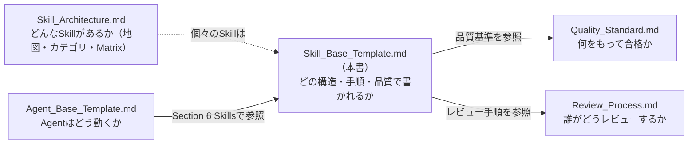
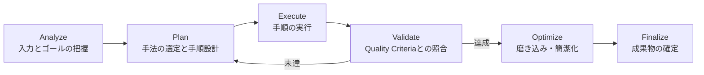
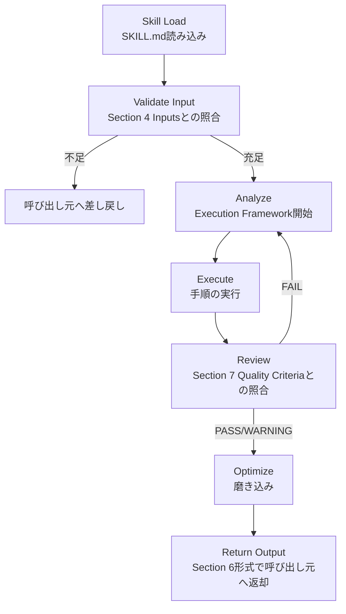
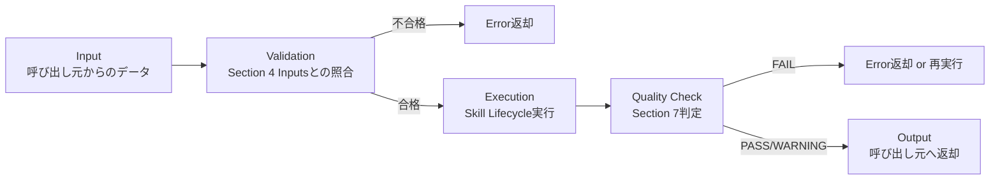

# Skill Base Template System

> **AI Development Operating System — 全Skill共通基盤**
>
> 本OS上で定義されるすべてのSkill（Market Research / Business Strategy / Requirement Definition / UX Research / User Journey / Information Architecture / UI Design / Design System / Frontend Development / Backend Development / Prompt Engineering / Testing / Security Review / Performance Optimization / Analytics / SEO ... 今後追加される1000以上のSkillすべて）が共通して使う定義テンプレートと実行基盤。
>
> [`Skill_Architecture.md`](./Skill_Architecture.md) が「**どんなSkillが存在するか**（7カテゴリ・スキルマップ・Agent×Skill Matrix）」という全体地図を定義するのに対し、本書は「**個々のSkillファイルがどの構造・どの実行手順・どの品質基準で書かれるべきか**」という個別Skill定義の設計図（[`Agent_Base_Template.md`](./Agent_Base_Template.md) のSkill版）を定義する。
> 新しいSkillを作るときは、本書の [Skill定義テンプレート](#skill定義テンプレートコピー用) をコピーし、`{{ }}` を埋めるだけで運用開始できる状態を目指す。

| 項目 | 内容 |
|---|---|
| **Version** | 1.0.0 |
| **Status** | Active |
| **Last Updated** | 2026-07-08 |
| **関連ドキュメント** | [`Skill_Architecture.md`](./Skill_Architecture.md) / [`Agent_Base_Template.md`](./Agent_Base_Template.md) / [`Agent_Architecture.md`](./Agent_Architecture.md) / [`Quality_Standard.md`](./Quality_Standard.md) / [`Review_Process.md`](./Review_Process.md) |

---

## 目次

1. [設計思想](#設計思想)
2. [Skill定義テンプレート（コピー用）](#skill定義テンプレートコピー用)
   - [1 Skill Identity](#1-skill-identity)
   - [2 Capability](#2-capability)
   - [3 Required Knowledge](#3-required-knowledge)
   - [4 Inputs](#4-inputs)
   - [5 Execution Framework](#5-execution-framework)
   - [6 Outputs](#6-outputs)
   - [7 Quality Criteria](#7-quality-criteria)
   - [8 Human Judgment](#8-human-judgment)
   - [9 Error Handling](#9-error-handling)
   - [10 Performance](#10-performance)
   - [11 Reusability](#11-reusability)
   - [12 Documentation](#12-documentation)
3. [Skill Lifecycle](#skill-lifecycle)
4. [Skill Execution Protocol](#skill-execution-protocol)
5. [Skill Versioning](#skill-versioning)
6. [Skill Library Structure（1000+ Skill対応）](#skill-library-structure1000-skill対応)
7. [Skill Quality Matrix](#skill-quality-matrix)
8. [新規Skill作成チェックリスト](#新規skill作成チェックリスト)
9. [Version Management](#version-management)

---

## 設計思想

| 目的 | 実現方法 |
|---|---|
| **Skill品質の標準化** | 12セクションの固定構造をすべてのSkillに強制し、どのSkillを開いても同じ場所に同じ情報がある状態にする |
| **Agent間での再利用性向上** | SkillをAgentから疎結合にし、Capability/Input/Outputを明示することで「誰でも呼び出せる部品」にする |
| **Claude Codeとの高い親和性** | Execution FrameworkとExecution Protocolを構造化し、Claude Codeが迷わず「入力→検証→実行→検証→出力」を辿れるようにする |
| **保守性** | Versioning・Documentation・Quality Criteriaを標準搭載し、1000以上のSkillが数年運用されても劣化しない構造にする |
| **拡張性** | カテゴリ×サブカテゴリの階層構造とレジストリ管理で、Skillが増え続けても検索性・整合性が崩れない設計にする |

### 本書と他ドキュメントの関係



- **Skill_Architecture.md**: 7カテゴリ・Skill一覧・Agent×Skill Matrixの正本（Whatの地図）
- **Agent_Base_Template.md**: Agentの構造・思考・状態遷移の正本（Section 6 SkillsでSkillを参照する側）
- **Skill_Base_Template.md（本書）**: 個々のSkillファイルが満たすべき構造・実行フロー・品質基準の正本（Howの正本）
- 実際のSkillファイルは `skills/{category}/{skill-name}/SKILL.md` に、本書のテンプレートをコピーして作成する

### 設計原則（Agent_Base_Templateとの対称性）

1. **抽象化された実行フレームワークであり、特定タスクの手順書ではない** — [Section 5](#5-execution-framework)は「何をすべきか」の型であり、中身はタスクごとにAgentが埋める（[`Agent_Base_Template.md — Section 4`](./Agent_Base_Template.md#4-internal-thinking-process)と同じ思想）。
2. **1 Skill = 1能力領域** — 肥大化したらサブカテゴリに分割する（[Skill Library Structure](#skill-library-structure1000-skill対応)参照）。
3. **Skillは知識を外部化する装置** — 「Claudeが知っているはず」に依存せず、[Section 3 Required Knowledge](#3-required-knowledge)に判断基準・フレームワークを明文化する。
4. **失敗を前提に設計する** — [Section 9 Error Handling](#9-error-handling)を標準搭載し、入力不足・競合・リスクへの対応を先に定義する。

---

## Skill定義テンプレート（コピー用）

### 使い方

1. 本テンプレートを `skills/{category}/{skill-name}/SKILL.md` としてコピーする
   - `{category}` は [`Skill_Architecture.md`](./Skill_Architecture.md) の7カテゴリ英語名（`business` / `product` / `ux` / `ui` / `engineering` / `quality` / `growth`）
   - 例: `skills/engineering/prompt-engineering/SKILL.md`
2. `{{ }}` 変数をすべて置換する
3. 「記入ガイド」（`>` の引用ブロック）は記入後に削除する
4. [新規Skill作成チェックリスト](#新規skill作成チェックリスト) を満たしていることを確認する
5. [`Skill_Architecture.md`](./Skill_Architecture.md) のSkill一覧表・Agent×Skill Matrixに追記してPRを出す

### 変数一覧

| 変数 | 説明 | 例 |
|---|---|---|
| `{{SKILL_NAME}}` | Skill名（英語ケバブケース、ディレクトリ名） | `prompt-engineering` |
| `{{SKILL_DISPLAY_NAME}}` | 表示名 | `Prompt Engineering Skill` |
| `{{CATEGORY}}` | 所属カテゴリ | `engineering` |
| `{{VERSION}}` | セマンティックバージョン | `1.0.0` |
| `{{OWNER}}` | 管理責任者（人間） | `@samkaz15` |
| `{{CREATED_DATE}}` / `{{UPDATED_DATE}}` | 作成日／更新日（ISO 8601） | `2026-07-08` |
| `{{RELATED_AGENTS}}` | 主に利用するAgent | `ai-engineer` |

---
---

```markdown
---
skill_name: {{SKILL_NAME}}
display_name: {{SKILL_DISPLAY_NAME}}
category: {{CATEGORY}}
version: {{VERSION}}
status: Draft   # Draft / Active / Deprecated
owner: {{OWNER}}
created: {{CREATED_DATE}}
updated: {{UPDATED_DATE}}
related_agents: [{{RELATED_AGENTS}}]
related_phases: []   # Development_Workflow.md のPhase番号
tags: []              # レジストリ検索用タグ
---
```

# {{SKILL_DISPLAY_NAME}}

## 1. Skill Identity

> **記入ガイド**: このSkillが何者かを一意に定義する。Purposeが曖昧だと他のSkillと重複・境界不明瞭になる。

| 項目 | 内容 |
|---|---|
| **Skill Name** | `{{SKILL_NAME}}` |
| **Version** | `{{VERSION}}` |
| **Category** | `{{CATEGORY}}`（[`Skill_Architecture.md`](./Skill_Architecture.md) の7カテゴリに対応） |
| **Purpose** | {{このSkillが実現する能力を1〜2文で。成果物でなく「できるようになること」で書く}} |
| **Scope** | {{このSkillが対応する作業範囲の外形}} |
| **Related Domain** | {{関連する専門領域・学問領域（例: 認知心理学、統計学、暗号理論）}} |

```yaml
identity:
  skill_name: "{{SKILL_NAME}}"
  category: "{{CATEGORY}}"
  purpose: "{{PURPOSE_ONE_LINE}}"
```

---

## 2. Capability

> **記入ガイド**: 「できないこと」を明記することが最重要。過大な能力表明は誤用・過度な信頼を招く。

### このSkillでできること
- {{能力1}}
- {{能力2}}

### できないこと

| できないこと | 理由 / 代替 |
|---|---|
| {{限界1}} | {{代替Skill or 人間対応が必要な理由}} |

### 前提条件
- [ ] {{このSkillを使う前に満たされているべき条件1}}

### 適用条件
- {{どんな状況・タスクで使うべきか}}
- **適用しない状況**: {{誤用を避けるための非適用条件}}

### 制約事項
- {{技術的・倫理的・コスト的な制約}}

---

## 3. Required Knowledge

> **記入ガイド**: Claude Codeが「知っているはず」に依存せず、判断の下敷きとなる知識を明文化する。[`Skill_Architecture.md`](./Skill_Architecture.md) の Knowledge Base / Methodology を継承・詳細化する。

| 種別 | 内容 |
|---|---|
| **理論** | {{基礎となる理論・原則（例: 認知負荷理論、情報理論）}} |
| **ベストプラクティス** | {{実務で確立された手法}} |
| **フレームワーク** | {{使用する分析・設計フレームワーク（例: RICE、JTBD、OWASP Top 10）}} |
| **業界標準** | {{準拠する標準・規格（例: WCAG 2.2、ISO等）}} |
| **参考ガイドライン** | {{参照元（例: Apple HIG、NN/g、OWASP）}} |

---

## 4. Inputs

> **記入ガイド**: 「何が揃えば実行できるか」を厳密に定義する。[`Agent_Base_Template.md — Section 3`](./Agent_Base_Template.md#3-inputs) と同一思想（推測補完の禁止）。

### 必須入力

| 入力 | 形式 | 説明 |
|---|---|---|
| {{必須入力1}} | Markdown / JSON / データ | {{説明}} |

### 任意入力
- {{あれば精度が上がる入力}}

### Context / 前工程成果物 / 設定値

| 種別 | 内容 |
|---|---|
| **Context** | このSkillが呼ばれているProject・Phase・呼び出し元Agentの状況 |
| **前工程成果物** | このSkillの実行前提となる、他Phase/他Skillの成果物 |
| **設定値** | プロジェクト固有のパラメータ（例: 品質基準の閾値、対象プラットフォーム） |

**入力不足の場合**: 推測で補完せず、不足項目を明示して呼び出し元（Agent/人間）に差し戻す（[Section 9 Error Handling](#9-error-handling)）。

---

## 5. Execution Framework

> **記入ガイド**: これは特定タスクの手順書ではなく、**どんなタスクにも適用できる抽象化された実行の型**である。各ステージで「何をすべきか」を定義し、中身はタスクごとに埋める。（[`Agent_Base_Template.md — Section 4`](./Agent_Base_Template.md#4-internal-thinking-process) とSkillレベルで対称）



| ステージ | 型（自問すべきこと） |
|---|---|
| **Analyze** | 何を達成すべきか？入力から読み取れる制約・前提は何か？[Section 3 Required Knowledge](#3-required-knowledge)のどれが関係するか？ |
| **Plan** | どの手法・フレームワークを使うか？どの順序で進めるか？[Section 2 Capability](#2-capability)の範囲内か？ |
| **Execute** | Planに従い実行する。判断・トレードオフをその都度記録する |
| **Validate** | [Section 7 Quality Criteria](#7-quality-criteria)のPass Conditionを満たしているか？証拠はあるか？ |
| **Optimize** | 冗長な部分はないか？より簡潔・明瞭にできないか？（削れるものをすべて削る） |
| **Finalize** | [Section 6 Outputs](#6-outputs)の形式で確定し、呼び出し元へ返す準備が整っているか？ |

**運用ルール**: Validateで未達の場合はPlanに戻る（Executeからのやり直しではなく、手法選定から見直す）。3回繰り返しても未達の場合は[Section 9 Error Handling](#9-error-handling)のエスカレーションに従う。

---

## 6. Outputs

> **記入ガイド**: 出力形式を具体的に定義する。呼び出し元が何を受け取るかを曖昧にしない。

### 成果物

| 出力形式 | 用途 | 該当する場合の出力先 |
|---|---|---|
| **Markdown** | 人間が読む主成果物（仕様書・レポート等） | {{出力先パス}} |
| **JSON** | Agent間・ツール間でパースされるデータ | {{出力先パス}} |
| **Report** | 分析・検査結果の報告 | {{出力先パス}} |
| **Checklist** | 完成条件・品質基準の充足確認 | 成果物内 |
| **Specification** | 実装可能な粒度の仕様（API仕様・デザイン仕様等） | {{出力先パス}} |
| **Design** | ビジュアル・構造の設計成果物（Figma等） | {{出力先パス}} |
| **Recommendation** | 選択肢＋推奨案＋根拠（Human Judgment向け） | 成果物内 or Handoff Note |

このSkillが実際に生成するのは: {{該当する出力形式を明記}}

---

## 7. Quality Criteria

> **記入ガイド**: 判定は必ず実行者（Agent）以外が行う（[`Quality_Standard.md`](./Quality_Standard.md) 準拠）。

### 完成条件（Definition of Done）
- [ ] {{完成条件1}}
- [ ] Decision Log（判断根拠）が記録されている
- [ ] [Section 6 Outputs](#6-outputs)の形式に準拠している

### 品質基準
[`Quality_Standard.md`](./Quality_Standard.md) の該当領域（該当する場合はDomain名を明記: {{例: 02 UX Quality}}）のEvaluation Criteria・Pass Conditionを適用する。

### 判定基準

| 判定 | 条件 |
|---|---|
| ✅ **PASS** | 完成条件・品質基準を全て満たし証拠添付済み |
| ⚠️ **WARNING** | 必須は満たすが軽微な懸念あり（Open Issues登録・持ち越し2工程まで） |
| ❌ **FAIL** | 完成条件未達、または重大指摘あり |

---

## 8. Human Judgment

> **記入ガイド**: AIだけでは判断しない領域を明示する。[`Review_Process.md — Human Decision Framework`](./Review_Process.md#human-decision-framework) の全社共通項目に加え、このSkill固有の項目を書く。

このSkillの実行結果が以下に該当する場合、判断を確定させず選択肢＋推奨案として人間に提示する:

- [ ] **ブランド**: {{該当する場合の具体例}}
- [ ] **倫理**: {{該当する場合の具体例}}
- [ ] **法務**: {{該当する場合の具体例}}
- [ ] **最終意思決定**: {{事業判断・不可逆な決定に該当する場合の具体例}}
- [ ] {{このSkill固有の追加項目}}

---

## 9. Error Handling

> **記入ガイド**: 「うまくいく前提」ではなく失敗モードを先に定義する（[`Agent_Base_Template.md — Section 9`](./Agent_Base_Template.md#9-error-handling) と同一思想）。

| 状況 | 対応 |
|---|---|
| **入力不足** | 推測で補完せず、[Section 4 Inputs](#4-inputs)の不足項目を明示して差し戻す |
| **条件不足**（[Section 2 適用条件](#2-capability)を満たさない） | 実行を中断し、条件不足である旨と必要条件を報告する |
| **競合**（他Skillの出力・既存資産と矛盾） | 証拠の強い方を優先し、対立をDecision Logに記録。解決しなければ呼び出し元Agentに判断を委ねる |
| **リスク**（[Section 8 Human Judgment](#8-human-judgment)に該当する結果に至った） | 確定させず、選択肢＋推奨案として提示する |
| **再実行** | [Section 5 Execution Framework](#5-execution-framework)のPlanに戻る。最大3回。同じ手法を繰り返さない（毎回変更点を記録） |
| **エスカレーション** | 3回の再実行でも未達、またはCritical相当のリスクを検出した場合、呼び出し元Agent経由で人間に引き上げる |

---

## 10. Performance

> **記入ガイド**: [`Skill_Architecture.md`](./Skill_Architecture.md) のAutomation Levelと連動させる。

| 指標 | 定義 | 目標 |
|---|---|---|
| **Accuracy** | 初回実行でのPASS率 | ≧ 80%（[`Quality_Standard.md`](./Quality_Standard.md) 品質KPI準拠） |
| **Speed** | 実行の所要時間（タスク規模あたり） | {{目安時間}} |
| **Cost** | 実行あたりのトークン・API・ツールコスト | {{許容コスト}} |
| **Token Efficiency** | 不要なコンテキストを持ち込まない（必要な知識・入力のみ参照） | 過剰な全文読み込みを避ける |
| **Scalability** | 複数プロジェクト・大量呼び出しでも品質が劣化しないか | プロジェクト非依存であること |

---

## 11. Reusability

> **記入ガイド**: [`Agent_Architecture.md`](./Agent_Architecture.md) のAgent×Skill Matrixと矛盾しないこと。

| 項目 | 内容 |
|---|---|
| **利用可能Agent** | {{このSkillを呼び出せるAgent一覧（主利用/副利用）}} |
| **関連Skill** | {{近接領域のSkill（重複を避けるための境界確認用）}} |
| **依存Skill** | {{このSkillが前提とする他のSkill（例: UI Design SkillはDesign System Skillに依存）}} |

### 継承ルール
- サブカテゴリへの分割時（例: `frontend` → `frontend/react` `frontend/nextjs`）、共通のCapability・Required Knowledgeは親Skillに残し、子Skillは差分のみを記述する
- 依存Skillのバージョンが上がった場合、このSkillの互換性を [Skill Versioning](#skill-versioning) に従い確認する

---

## 12. Documentation

> **記入ガイド**: Skillごとに必須となるファイル構成。[Skill Library Structure](#skill-library-structure1000-skill対応)のディレクトリ構造に対応する。

| ファイル | 必須/任意 | 内容 |
|---|---|---|
| `SKILL.md` | 必須 | 本テンプレートに基づく定義本体 |
| `CHANGELOG.md` | 必須 | [Skill Versioning](#skill-versioning)に基づく変更履歴 |
| `references/` | 任意 | フレームワーク詳細・チェックリスト・外部資料の要約 |
| `examples/` | 推奨 | 過去の実行例・良い成果物サンプル（学びの蓄積先） |

---
---

# Skill Lifecycle

Skillが呼び出されてから結果を返すまでの一生。[`Agent_Base_Template.md — Agent Lifecycle`](./Agent_Base_Template.md#agent-lifecycle) のExecuteステージの内部で発生する。



| ステージ | 内容 | 対応セクション |
|---|---|---|
| Skill Load | `SKILL.md` と関連する `references/` が読み込まれる | [1 Skill Identity](#1-skill-identity) |
| Validate Input | 必須入力・前提条件・適用条件を検証する | [4 Inputs](#4-inputs), [2 Capability](#2-capability) |
| Analyze〜Execute | 抽象化された実行フレームワークを実行 | [5 Execution Framework](#5-execution-framework) |
| Review | 品質基準との照合 | [7 Quality Criteria](#7-quality-criteria) |
| Optimize | 冗長性の除去・簡潔化 | [5 Execution Framework — Optimize](#5-execution-framework) |
| Return Output | 定義された形式で呼び出し元Agentへ返す | [6 Outputs](#6-outputs) |

---

# Skill Execution Protocol

すべてのSkill呼び出しが従う、外部から見た標準呼び出し契約。Skill Lifecycleが「内部でどう動くか」であるのに対し、本プロトコルは「外部からどう呼び出し、どう結果を受け取るか」を定義する（[`Agent_Base_Template.md — Agent Communication Standard`](./Agent_Base_Template.md#agent-communication-standard) と接続）。



## 呼び出しフォーマット

```yaml
skill_call:
  skill_name: "{{skill_name}}"
  version: "{{minimum_required_version}}"
  called_by: "{{agent_name}}"
  input:
    required: { }     # Section 4 必須入力に対応
    optional: { }      # Section 4 任意入力に対応
    context: "{{project/phase/callerの状況}}"
  constraints:
    deadline: "{{あれば}}"
    cost_limit: "{{あれば}}"
```

## 返却フォーマット

```yaml
skill_result:
  skill_name: "{{skill_name}}"
  status: PASS | WARNING | FAIL
  output:
    format: Markdown | JSON | Report | Checklist | Specification | Design | Recommendation
    path: "{{出力先 or インラインデータ}}"
  quality:
    decision: PASS | WARNING | FAIL
    evidence: "{{判定根拠へのリンク}}"
  human_judgment_flags: ["{{該当したSection 8項目があれば}}"]
  errors: ["{{Section 9に該当した場合の内容}}"]
```

---

# Skill Versioning

Skillはコードと同様にセマンティックバージョニング（`MAJOR.MINOR.PATCH`）で管理する。

## バージョンアップのルール

| 変更種別 | 例 | バージョン |
|---|---|---|
| **互換性を壊す変更** | Capability/Scopeの縮小、Input/Output形式の変更、Section構造の変更 | MAJOR |
| **後方互換な追加** | Capabilityの追加、Required Knowledgeの拡充、Optional Inputの追加 | MINOR |
| **修正・明確化** | 誤字修正、記述の明確化、examplesの追加 | PATCH |

## 互換性（Compatibility）

- Skillを呼び出すAgentは `skill_call.version` に**最低要求バージョン**を指定する
- MAJOR変更を行う場合、[`Agent_Architecture.md — Agent × Skill Matrix`](./Agent_Architecture.md) および [`Skill_Architecture.md — Agent × Skill Matrix`](./Skill_Architecture.md#agent--skill-matrix) を参照し、依存する全Agentへの影響を確認してから変更する
- 依存Skill（[Section 11 Reusability](#11-reusability)）がMAJOR変更された場合、このSkillは互換性を再検証し、必要ならこのSkillもMAJORを上げる

## 廃止ルール（Deprecation）

1. `status: Deprecated` に変更し、後継Skill（あれば）を `SKILL.md` に明記する
2. 猶予期間（目安: 1四半期）は `skills/{category}/{skill-name}/` に残し、利用側Agentへの移行を促す
3. 猶予期間経過後、`skills/_deprecated/{skill-name}/` に移動する（履歴として保持、レジストリからは除外）
4. 廃止の理由・後継Skillへの移行方法を `CHANGELOG.md` に記録する

## 変更履歴管理（Changelog）

各Skillの `CHANGELOG.md` は以下の形式で管理する:

```markdown
| Version | 日付 | 変更内容 | 担当 |
|---|---|---|---|
| 1.1.0 | 2026-08-01 | Optional Inputに{{X}}を追加 | {{担当}} |
| 1.0.0 | 2026-07-08 | 初版作成 | {{担当}} |
```

---

# Skill Library Structure（1000+ Skill対応）

[`Skill_Architecture.md — Skill Library Structure`](./Skill_Architecture.md#skill-library-structure) の7カテゴリ構造を土台に、1000以上のSkillでも検索性・整合性が崩れないよう階層化・レジストリ管理を追加する。

```
skills/
├── README.md                        # 人間向けレジストリ（索引・利用ガイド）
├── registry.json                    # 機械可読レジストリ（name/category/tags/version/status/path）
├── _template/
│   └── SKILL.md                     # 本書のSkill定義テンプレート（コピー元）
├── _deprecated/                     # 廃止済みSkillの隔離先（履歴保持、レジストリ除外）
│   └── {old-skill-name}/
│
├── business/                        # 01 Business Skills
│   ├── market-research/
│   │   ├── SKILL.md
│   │   ├── CHANGELOG.md
│   │   ├── references/
│   │   └── examples/
│   └── business-strategy/
│
├── product/                         # 02 Product Skills
│   ├── product-management/
│   ├── kpi-design/
│   └── requirement-definition/
│
├── ux/                               # 03 UX Skills
│   ├── ux-research/
│   ├── ux-design/
│   ├── user-journey/
│   └── information-architecture/
│
├── ui/                               # 04 UI Skills
│   ├── ui-design/
│   ├── design-system/
│   ├── apple-hig/
│   └── material-design/
│
├── engineering/                     # 05 Engineering Skills（サブカテゴリで深さを吸収）
│   ├── frontend/
│   │   ├── react/
│   │   ├── nextjs/
│   │   └── performance-optimization/
│   ├── backend/
│   │   ├── api-design/
│   │   ├── database-design/
│   │   └── infrastructure/
│   └── ai/
│       ├── prompt-engineering/
│       ├── llm-architecture/
│       ├── agent-design/
│       └── evaluation/
│
├── quality/                         # 06 Quality Skills
│   ├── qa/
│   │   └── testing/
│   ├── security/
│   │   └── security-review/
│   └── performance/
│
└── growth/                          # 07 Growth Skills
    ├── marketing/
    │   └── seo/
    ├── cro/
    └── analytics/
```

## 拡張ルール

| ルール | 内容 |
|---|---|
| **サブカテゴリ化の閾値** | 1カテゴリ配下のSkillが15件を超えたら、サブカテゴリ（例: `engineering/frontend/`）に分割する |
| **命名規則** | ディレクトリ名は英語ケバブケース固定。カテゴリ名は7分類（+サブカテゴリ）に統制する |
| **registry.json** | Skill追加・廃止のたびに機械的に更新する（CIでSKILL.mdのfrontmatterと自動同期する運用を推奨） |
| **タグ検索** | カテゴリを跨ぐ横断的な発見のため、frontmatterの `tags` を活用する（例: `accessibility` タグはui/engineering/quality複数カテゴリに横断） |
| **依存関係の可視化** | `registry.json` に `depends_on` / `used_by` を持たせ、MAJORバージョンアップの影響範囲を機械的に追跡できるようにする |
| **カテゴリの追加** | 8個目以降のトップカテゴリ追加は [`Skill_Architecture.md`](./Skill_Architecture.md) の改訂（Major）としてOwner承認を必須とする |

## registry.json スキーマ例

```json
{
  "skills": [
    {
      "name": "prompt-engineering",
      "category": "engineering/ai",
      "version": "1.0.0",
      "status": "Active",
      "path": "skills/engineering/ai/prompt-engineering/SKILL.md",
      "tags": ["ai", "llm", "prompt"],
      "related_agents": ["ai-engineer"],
      "depends_on": [],
      "used_by": ["ai-engineer", "backend-engineer"]
    }
  ]
}
```

---

# Skill Quality Matrix

Skillの成果物を評価する5次元。[`Quality_Standard.md — Quality Score System`](./Quality_Standard.md#quality-score-system) の採点方式（0〜10点→100点換算）をSkillレベルに適用する。

| 次元 | 判定基準 | 検証方法 |
|---|---|---|
| **Accuracy（正確性）** | 出力が[Section 7 Quality Criteria](#7-quality-criteria)の完成条件を満たす | Self Review + Cross Review |
| **Completeness（網羅性）** | [Section 4 Inputs](#4-inputs)で定義した情報を出力が漏れなく反映している | チェックリスト照合 |
| **Reusability（再利用性）** | 他プロジェクト・他Agentからそのまま呼び出し可能（プロジェクト固有情報がハードコードされていない） | Reusability（Section 11）レビュー |
| **Documentation（文書品質）** | [Section 12 Documentation](#12-documentation)の必須ファイルが揃い、[`Quality_Standard.md`](./Quality_Standard.md) 共通5基準（明瞭さ・簡潔さ・一貫性・検証可能性・誠実さ）を満たす | Doc Check（自動＋人間） |
| **Performance（効率性）** | [Section 10 Performance](#10-performance)の目標値を満たす | 実行ログ集計 |

## カテゴリ別の重点次元（参考）

| カテゴリ | 特に重視する次元 |
|---|---|
| Business / Product | Accuracy, Completeness |
| UX / UI | Completeness, Documentation |
| Engineering | Accuracy, Performance |
| Quality | Accuracy, Reusability |
| Growth | Performance, Reusability |

**運用ルール**: 5次元の平均が80点未満のSkillは`Draft`ステータスから`Active`へ昇格させない。

---

# 新規Skill作成チェックリスト

新しいSkillを追加する際、このチェックリストをすべて満たすまで `skills/` にマージしない。

## 定義ファイル作成時

- [ ] 12セクション（Skill Identity〜Documentation）がすべて記入され、`{{ }}` 変数の置換漏れがない（`grep '{{'` で0件）
- [ ] 記入ガイド（`>` ブロック）が削除されている
- [ ] Category が [`Skill_Architecture.md`](./Skill_Architecture.md) の7分類（+サブカテゴリ）いずれかに一致する
- [ ] できないこと（Capability）に最低1つ、代替Skillまたは理由が明記されている
- [ ] `CHANGELOG.md` が作成され、初版エントリがある

## システム整合性

- [ ] [`Skill_Architecture.md`](./Skill_Architecture.md) のSkill一覧表・Agent×Skill Matrixに追記した
- [ ] `skills/registry.json` にエントリを追加した
- [ ] 依存Skill（Section 11）が実在する（または新規Skillとして同時追加されている）
- [ ] 重複するSkillが既存にないか確認した（近接領域のSkillとの境界をSection 2で明記した）

## 品質

- [ ] Purpose（Section 1）が1文で説明できる（複数の能力を混在させていない）
- [ ] Human Judgment（Section 8）が具体的（「重要な判断」のような曖昧語がない）
- [ ] [Skill Quality Matrix](#skill-quality-matrix) 5次元の初回セルフ評価が80点相当以上見込める設計になっている

---

# Version Management

| Version | 日付 | 変更内容 | 担当 |
|---|---|---|---|
| 1.0.0 | 2026-07-08 | 初版作成。12セクション構造・Skill Lifecycle・Execution Protocol・Versioning・Library Structure（1000+対応）・Quality Matrix・新規Skill作成チェックリストを追加 | Claude Code + Owner |

### 運用ルール

- 本書の変更はPull Request＋Owner承認で行う
- 12セクション構造・Lifecycle・Protocolの変更はMajor、チェックリスト・記入例の改善はMinorバージョンアップ
- 既存のSkillファイル（`skills/`配下）は、本書の構造変更（Major）が入った場合に追従して更新する
- 本書と個別Skillファイルが矛盾した場合、本書を正とする
- [`Skill_Architecture.md`](./Skill_Architecture.md) 内の17 Skillの要約定義（10項目形式）は、本書公開時点での既存資産として維持し、新規作成・改訂されるSkillから順に本書の12セクション形式へ移行する（一括書き換えは行わない）

---

*This template is part of the AI Development Operating System.*
*Maintained in: `00_System/Skill_Base_Template.md`*
