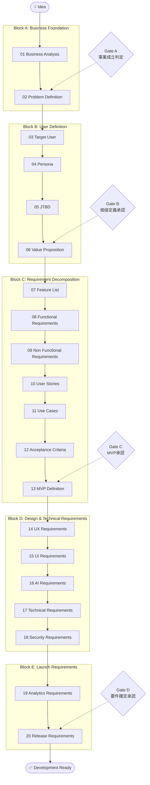
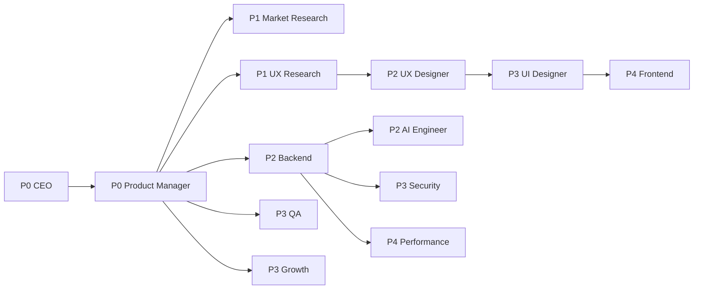

# Requirement Engineering Framework

> **AI Development Operating System — 要件定義フレームワーク**
>
> アイデアを受け取ってから「Development Ready（開発着手可能）」に至るまでの要件定義プロセスの正本。
> AIサービス・Webサービス・SaaS・モバイルアプリ・AIエージェント・自動化システム・FX AIなど、**すべてのプロダクトで共通利用する**。
>
> **Mission: 誰が（どのAIが・どの人間が）要件定義を行っても、同じ品質になること。**
> Claude Code / ChatGPT / Gemini など複数のAIが共同開発しても、本Frameworkに従う限り成果物の構造・品質・判断基準はブレない。

| 項目 | 内容 |
|---|---|
| **Version** | 1.0.0 |
| **Status** | Active |
| **Last Updated** | 2026-07-08 |
| **記入用テンプレート** | [`templates/Requirement_Template.md`](../templates/Requirement_Template.md) |
| **関連ドキュメント** | [`Development_Workflow.md`](../00_System/Development_Workflow.md) / [`Agent_Architecture.md`](../00_System/Agent_Architecture.md) / [`Quality_Standard.md`](../00_System/Quality_Standard.md) / [`Review_Process.md`](../00_System/Review_Process.md) |

---

## 目次

1. [設計思想](#設計思想)
2. [全体フロー](#全体フロー)
3. [ステージ一覧](#ステージ一覧)
4. [マルチAI共同開発ルール](#マルチai共同開発ルール)
5. [ステージ詳細（01〜20）](#block-a--business-foundation)
6. [8ドメイン網羅マトリクス](#8ドメイン網羅マトリクス)
7. [Human Final Review（人間最終レビュー）](#human-final-review人間最終レビュー)
8. [AI自動化項目](#ai自動化項目)
9. [記入サンプル](#記入サンプル)
10. [本Frameworkを運用するAgent一覧（作成計画）](#本frameworkを運用するagent一覧作成計画)
11. [Version Management](#version-management)

---

## 設計思想

| 目的 | 実現方法 |
|---|---|
| **誰がやっても同じ品質** | 20ステージ×8定義項目（Goal/Inputs/Outputs/AI Tasks/Human Tasks/Checklist/Review/Exit Criteria）の固定構造。判断基準を人ではなくFrameworkに持たせる |
| **複数AIでもブレない** | 本Framework＋記入テンプレートを唯一の正本とし、どのAIも「テンプレートを埋める」作業に統一する（[マルチAI共同開発ルール](#マルチai共同開発ルール)） |
| **アイデア→開発まで一気通貫** | 事業分析→ユーザー価値→機能→画面→AI設計→技術要件が1本のフローで接続し、トレーサビリティが切れない |
| **AIは提案・人間は決定** | 各ステージのHuman Tasksに「AIが決めてはならない項目」を明記（ブランド・事業戦略・優先順位・世界観・倫理・法務・最終意思決定） |
| **再利用性** | プロダクト種別に依存しない抽象度で設計。プロダクト固有情報はテンプレートの記入内容としてのみ存在する |

### Development_Workflow との関係

本Frameworkは [`Development_Workflow.md`](../00_System/Development_Workflow.md) の **Phase 01（Business Strategy）〜 Phase 02（Requirement Definition）を中心に、Phase 07（AI Design）・Phase 08（Architecture Design）の要件レベルの前段までを詳細化**したもの。

- Workflow = プロダクト開発全体の時間軸（Phase 00〜19）
- 本Framework = そのうち「何を作るかを確定させる」工程の詳細プロセス
- 本Frameworkの完了状態（Development Ready）= Workflow Phase 03以降を開始できる状態

---

## 全体フロー

**ゲート（Human承認必須ポイント）**:

| Gate | 位置 | 人間が決定すること |
|---|---|---|
| **Gate A** | Stage 02完了時 | この課題に取り組むか（Go / No-Go） |
| **Gate B** | Stage 06完了時 | この価値提案で進めるか（事業の核の確定） |
| **Gate C** | Stage 13完了時 | MVPスコープの確定（何を捨てるか） |
| **Gate D** | Stage 20完了時 | 要件凍結・開発着手の承認（Development Ready宣言） |

---

## ステージ一覧

| # | ステージ | Block | 主担当Agent | 主な成果物（Templateの章） | Human決定 |
|---|---|---|---|---|---|
| 01 | Business Analysis | A | Market Research + CEO | 市場・競合・SWOT・収益モデル・KPI/ROI | 事業リスク許容 |
| 02 | Problem Definition | A | Product Manager | 課題定義書 | **Gate A: Go/No-Go** |
| 03 | Target User | B | UX Research | ターゲット定義 | ターゲット確定 |
| 04 | Persona | B | UX Research | ペルソナ | ペルソナ妥当性 |
| 05 | JTBD | B | UX Research | Jobs to be Done | ジョブ解釈の確定 |
| 06 | Value Proposition | B | Product Manager + CEO | 価値提案 | **Gate B: 事業の核** |
| 07 | Feature List | C | Product Manager | 機能一覧 | 機能の取捨 |
| 08 | Functional Requirements | C | Product Manager | 機能要件書 | — |
| 09 | Non Functional Requirements | C | Backend Engineer + PM | 非機能要件書 | 基準値の承認 |
| 10 | User Stories | C | Product Manager | ユーザーストーリー | — |
| 11 | Use Cases | C | Product Manager | ユースケース | — |
| 12 | Acceptance Criteria | C | Product Manager + QA | 受け入れ基準 | — |
| 13 | MVP Definition | C | Product Manager + CEO | MVPスコープ | **Gate C: スコープ確定** |
| 14 | UX Requirements | D | UX Designer | UX要件書 | 体験方針の承認 |
| 15 | UI Requirements | D | UI Designer | UI要件書 | ブランド・世界観 |
| 16 | AI Requirements | D | AI Engineer | AI要件書 | AI利用範囲の倫理 |
| 17 | Technical Requirements | D | Backend Engineer | 技術要件書 | 技術選定・コスト |
| 18 | Security Requirements | D | Security | セキュリティ要件書 | リスク受容・法務 |
| 19 | Analytics Requirements | E | Growth | 計測要件書 | KPI確定 |
| 20 | Release Requirements | E | Product Manager | リリース要件書 | **Gate D: 要件凍結** |

---

## マルチAI共同開発ルール

Claude Code / ChatGPT / Gemini など複数のAIが本Frameworkで共同作業する場合の統一ルール。

1. **正本は本Framework＋記入テンプレートのみ** — 各AIの内部知識・流儀で構造を変えない。「テンプレートの該当章を埋める」以外の作業形態を認めない。
2. **1ステージ1AI** — 同一ステージを複数AIが同時に書かない。分担はステージ単位で行い、担当と状態（未着手/作業中/完了）をテンプレートのStatus Trackerに記録する。
3. **用語は用語集に従う** — 同じ概念に別の語を使わない（例: 「顧客/ユーザー/利用者」の揺れ禁止）。テンプレートの用語集（Glossary）を唯一の定義とし、新出用語は追記してから使う。
4. **前ステージの成果物を書き換えない** — 矛盾を発見したら、勝手に修正せず「指摘」としてOpen Issuesに記録し、担当ステージのExit Criteria再判定にかける。
5. **推測には「仮説:」を明記** — どのAIも、確認していない情報を事実として書かない（[`Quality_Standard.md`](../00_System/Quality_Standard.md) 共通5基準）。
6. **Human Tasksを代行しない** — 各ステージのHuman Tasks項目は、どのAIも「選択肢＋推奨案＋根拠」の提示までしか行わない。
7. **Exit Criteria未達で先に進まない** — 後工程のAIは、前工程のExit Criteriaチェックが✅であることを確認してから着手する。

---

# Block A — Business Foundation

## Stage 01: Business Analysis

**Goal**: アイデアが事業として成立しうるかを、市場の事実に基づいて分析する。

**Inputs**: アイデア（1文〜メモレベルでよい）、発案者の意図・制約（予算・期限）

**Outputs**: Templateの「1. Business Analysis」章 — 市場分析（規模・成長性）、競合分析（最低3社）、SWOT、ポジショニングマップ、収益モデル仮説、KPI仮説（North Star Metric候補）、ROI試算

**AI Tasks**:
- 市場規模・成長率・トレンドの調査（出典必須）
- 競合の機能・価格・ポジショニング比較表の作成
- SWOT・ポジショニングマップのドラフト
- 収益モデルのパターン提示とROI試算シミュレーション

**Human Tasks**:
- **事業リスクの許容判断**（市場の不確実性をどこまで受け入れるか）
- **参入する市場・ポジションの選択**（AIは選択肢提示まで）
- 収益モデルの方向性の決定（事業戦略）

**Checklist**:
- 開始前: [ ] アイデアが1文で記述されている / [ ] 制約（予算・期限）を確認した
- 作業中: [ ] すべての数値に出典を付けている / [ ] 事実と解釈を分離している
- 完了時: [ ] 競合3社以上を3観点以上で比較した / [ ] ROI試算の前提を明記した

**Review**: Market Research Agent がドラフト作成 → CEO Agent が事業観点でクロスレビュー → 分析の抜け（規制・代替品・参入障壁）を検査

**Exit Criteria**:
- [ ] 市場・競合・SWOT・ポジショニング・収益モデル・KPI/ROIの6要素が揃っている
- [ ] 「この事業の最大のリスク」が1つに特定されている
- [ ] Human が事業リスクの所在を理解し、次ステージ進行を承認した

---

## Stage 02: Problem Definition

**Goal**: 「誰の・どんな課題を解決するのか」を1文で言える状態にし、取り組む価値を判定する（Gate A）。

**Inputs**: Stage 01の分析結果、アイデアの原文

**Outputs**: Templateの「2. Problem Definition」章 — 課題文（Problem Statement）、課題の証拠、既存の代替手段、課題が放置されている理由

**AI Tasks**:
- 課題文のドラフト（「[誰]は[状況]のとき[課題]に困っている。なぜなら[原因]」形式）
- 課題の実在を示す証拠の収集（レビュー・統計・調査）
- 既存の代替手段（競合・回避策・手作業）の整理

**Human Tasks**:
- **Gate A: この課題に取り組むかのGo/No-Go判断**
- 課題への共感度の確認（「自分が本気で解きたい課題か」— 長期運用の意志）

**Checklist**:
- 開始前: [ ] Stage 01のExit Criteriaが✅
- 作業中: [ ] 課題を解決策から独立して記述している（解決策ありきの課題設定を避ける）
- 完了時: [ ] 課題文が1文で言える / [ ] 証拠が最低2種類ある

**Review**: PM Agent 作成 → CEO Agent が「課題の大きさ×解決可能性×事業性」でクロスレビュー → Human がGate A判定

**Exit Criteria**:
- [ ] Problem Statementが1文で成立している
- [ ] 課題の実在が証拠で裏付けられている（推測のみは不可）
- [ ] **Human が Go 判定を出した（Gate A通過）**

---

# Block B — User Definition

## Stage 03: Target User

**Goal**: 課題を最も強く持つユーザー群を特定し、最初に狙うセグメントを1つに絞る。

**Inputs**: 課題定義（Stage 02）、市場セグメント情報（Stage 01）

**Outputs**: Templateの「3. Target User」章 — セグメント候補一覧、初期ターゲットの選定と理由、市場規模感

**AI Tasks**:
- セグメント候補の洗い出し（課題の強度×到達可能性×支払い意思で評価）
- 各セグメントの規模・特性の調査
- 初期ターゲットの推奨案と根拠の提示

**Human Tasks**:
- **初期ターゲットの最終決定**（どの顧客と長く付き合うかは事業戦略）

**Checklist**:
- 開始前: [ ] Gate A通過済み
- 作業中: [ ] 「全員向け」にしていない（絞り込みから逃げない）
- 完了時: [ ] ターゲット外のセグメントも記録した（将来拡張の候補として）

**Review**: UX Research Agent 作成 → PM Agent が事業性の観点でクロスレビュー

**Exit Criteria**:
- [ ] 初期ターゲットが1セグメントに絞られ、選定理由が記録されている
- [ ] そのセグメントに実際に到達する手段（チャネル）の仮説がある

---

## Stage 04: Persona

**Goal**: ターゲットを「実在しそうな1人」として具体化し、以降の全判断の基準人物を作る。

**Inputs**: ターゲット定義（Stage 03）、可能であれば実ユーザー調査データ

**Outputs**: Templateの「4. Persona」章 — ペルソナ1〜3体（行動・目標・ペイン・利用文脈・心理・デジタルリテラシー）

**AI Tasks**:
- ペルソナドラフトの作成（行動ベース。デモグラだけのペルソナ禁止）
- 心理・欲求の構造化（表面的な要望と本質的な欲求の分離）
- ペルソナ間の優先順位案の提示

**Human Tasks**:
- **ペルソナの妥当性判断**（「実在しそうか」の肌感覚・実ユーザーとの照合）
- 可能なら実ユーザーインタビューの実施（AIは設計・分析支援まで）

**Checklist**:
- 開始前: [ ] ターゲットが1セグメントに確定している
- 作業中: [ ] 各属性に「なぜそう言えるか」の根拠または「仮説:」を付けている
- 完了時: [ ] ペルソナが行動・目標・ペイン・文脈・心理の5要素を持つ

**Review**: UX Research Agent 作成 → PM Agent クロスレビュー → Human が妥当性承認

**Exit Criteria**:
- [ ] プライマリペルソナが1体確定している
- [ ] 検証済みの事実と仮説が区別されている

---

## Stage 05: JTBD（Jobs to be Done）

**Goal**: ペルソナが「片付けたいジョブ」を機能ではなく進歩（Progress）として定義する。

**Inputs**: ペルソナ（Stage 04）、課題定義（Stage 02）

**Outputs**: Templateの「5. JTBD」章 — メインジョブ、機能的/感情的/社会的ジョブ、現在の代替手段と不満、雇用/解雇の条件

**AI Tasks**:
- ジョブ文のドラフト（「[状況]のとき、[動機]したい。そうすれば[期待する結果]」形式）
- 機能的・感情的・社会的ジョブの3層分解
- 代替手段の「解雇理由」（何が不満で乗り換えるか）の分析

**Human Tasks**:
- **ジョブ解釈の最終確定**（データの読み違いの防止）

**Checklist**:
- 開始前: [ ] ペルソナ承認済み
- 作業中: [ ] ジョブを機能名で書いていない（「進歩」で書く）
- 完了時: [ ] メインジョブが1つに特定されている

**Review**: UX Research Agent 作成 → UX Designer Agent が後工程（フロー設計）の観点でクロスレビュー

**Exit Criteria**:
- [ ] メインジョブ＋3層ジョブが定義されている
- [ ] 「ユーザーがこのプロダクトを雇う理由／解雇する条件」が言語化されている

---

## Stage 06: Value Proposition

**Goal**: 「このプロダクトは誰の何をどう解決し、なぜ競合より選ばれるのか」を確定する（Gate B）。

**Inputs**: JTBD（Stage 05）、競合分析（Stage 01）

**Outputs**: Templateの「6. Value Proposition」章 — 価値提案文、Value Proposition Canvas、競争優位性、選ばれる理由（差別化の source）

**AI Tasks**:
- Value Proposition Canvasのドラフト（顧客のジョブ・ペイン・ゲインと提供価値の対応付け）
- 価値提案文の候補を複数生成
- 競合との差別化ポイントの検証（Stage 01の比較表と突き合わせ）

**Human Tasks**:
- **Gate B: 価値提案の最終決定**（事業の核。AIは候補提示まで）
- **世界観・ブランドの方向性の決定**（このプロダクトが放つ雰囲気・約束）

**Checklist**:
- 開始前: [ ] JTBD確定済み
- 作業中: [ ] 価値をユーザーの言葉で書いている（作り手の機能語で書かない）
- 完了時: [ ] 価値提案が1文で言える / [ ] 差別化が競合比較表で裏付けられている

**Review**: PM Agent 作成 → CEO Agent が事業性・Vision整合でクロスレビュー → Human がGate B判定

**Exit Criteria**:
- [ ] 価値提案文が「誰の・何を・どう・なぜ我々が」を含み1文で成立
- [ ] **Human が価値提案と世界観の方向性を承認した（Gate B通過）**

---

# Block C — Requirement Decomposition

## Stage 07: Feature List

**Goal**: 価値提案を実現する機能を漏れなく洗い出し、価値への寄与で分類する。

**Inputs**: 価値提案（Stage 06）、JTBD（Stage 05）、競合機能比較（Stage 01）

**Outputs**: Templateの「7. Feature List」章 — 機能一覧（ID付き）、各機能の価値寄与、Kano分類（当たり前/性能/魅力）

**AI Tasks**:
- 機能候補の網羅的洗い出し（JTBDの各ジョブ→機能への展開）
- 各機能の「どのジョブに効くか」のマッピング
- Kano分類・競合有無のタグ付け

**Human Tasks**:
- **機能の取捨の方向性**（「やらない機能」の決定は事業判断）

**Checklist**:
- 開始前: [ ] Gate B通過済み
- 作業中: [ ] 全機能がJTBD/価値提案に紐づいている（紐づかない機能は削除候補）
- 完了時: [ ] 機能にユニークIDを振った（以降の全工程でこのIDでトレースする）

**Review**: PM Agent 作成 → UX Designer / Engineering Agent が実現性の観点でクロスレビュー

**Exit Criteria**:
- [ ] 全機能がID・価値寄与・Kano分類を持つ
- [ ] 「やらない機能リスト」が存在する

---

## Stage 08: Functional Requirements

**Goal**: 各機能を「何ができること」として誰が読んでも同じ解釈になる粒度で記述する。

**Inputs**: 機能一覧（Stage 07）

**Outputs**: Templateの「8. Functional Requirements」章 — 機能要件書（機能ID・要件文・入出力・制約・依存関係）

**AI Tasks**:
- 要件文のドラフト（「システムは〜できること」形式・曖昧語の排除）
- 機能間の依存関係の整理
- 不足要件の検出（CRUD漏れ・権限・通知・エッジケース）

**Human Tasks**: —（原則AIが完結。判断が必要な場合のみエスカレーション）

**Checklist**:
- 開始前: [ ] 機能一覧のIDが確定している
- 作業中: [ ] 「〜など」「適切に」「柔軟に」等の曖昧語を使っていない
- 完了時: [ ] 全機能IDに要件が対応している

**Review**: PM Agent 作成 → QA Agent が「テスト可能な記述か」でクロスレビュー

**Exit Criteria**:
- [ ] 全要件が検証可能な文で書かれている（曖昧語ゼロ）
- [ ] 機能間依存が図示されている

---

## Stage 09: Non Functional Requirements

**Goal**: 性能・可用性・拡張性・保守性・アクセシビリティを数値で定義する。

**Inputs**: 機能要件（Stage 08）、想定トラフィック（Stage 01/03から推定）

**Outputs**: Templateの「9. Non Functional Requirements」章 — 非機能要件書（性能・可用性・拡張性・保守性・アクセシビリティ・対応環境）

**AI Tasks**:
- [`Quality_Standard.md — Quality Numbers`](../00_System/Quality_Standard.md#quality-numbers数値基準一覧) を初期値として適用
- プロダクト特性に応じた基準の調整案（例: FX AIならレイテンシ要件を強化）
- 対応環境（ブラウザ・OS・デバイス）マトリクスの提案

**Human Tasks**:
- **基準値の承認**（基準の緩和・強化はコストに直結する事業判断）

**Checklist**:
- 開始前: [ ] 想定ユーザー数・ピークの仮説がある
- 作業中: [ ] すべての基準が数値である（「速い」「安定」禁止）
- 完了時: [ ] Quality Standardからの変更点に理由を付けた

**Review**: Backend Engineer Agent 作成 → Performance / Security Agent がクロスレビュー

**Exit Criteria**:
- [ ] 性能・可用性・拡張性・保守性・アクセシビリティの全カテゴリが数値定義済み
- [ ] Quality Standard基準との差分が理由付きで記録されている

---

## Stage 10: User Stories

**Goal**: 要件をユーザー視点の物語に変換し、価値の単位で開発できる形にする。

**Inputs**: 機能要件（Stage 08）、ペルソナ（Stage 04）

**Outputs**: Templateの「10. User Stories」章 — ユーザーストーリー一覧（「[ペルソナ]として[目的]のために[操作]したい」形式・機能IDと紐付け）

**AI Tasks**:
- 全機能のストーリー化（INVEST原則準拠）
- ストーリーの粒度調整（大きすぎるストーリーの分割）
- ペルソナとの整合チェック

**Human Tasks**: —（原則AIが完結）

**Checklist**:
- 開始前: [ ] 機能要件が確定している
- 作業中: [ ] 各ストーリーが独立して価値を持つ（INVEST）
- 完了時: [ ] 全ストーリーが機能IDにトレースできる

**Review**: PM Agent 作成 → UX Designer Agent がユーザー視点の自然さでクロスレビュー

**Exit Criteria**:
- [ ] 全機能要件がストーリーでカバーされている
- [ ] 各ストーリーがINVEST原則を満たす

---

## Stage 11: Use Cases

**Goal**: 主要ストーリーの具体的な操作の流れ（正常系・代替系・例外系）を定義する。

**Inputs**: ユーザーストーリー（Stage 10）

**Outputs**: Templateの「11. Use Cases」章 — ユースケース記述（アクター・事前条件・基本フロー・代替フロー・例外フロー・事後条件）

**AI Tasks**:
- 主要ストーリーのユースケース展開
- **例外系の網羅**（エラー・中断・同時実行・権限なし・データなし）
- フロー図（Mermaid）の生成

**Human Tasks**: —（原則AIが完結）

**Checklist**:
- 開始前: [ ] ストーリーの優先順位が見えている
- 作業中: [ ] 例外フローを正常フローと同等の密度で書いている
- 完了時: [ ] 全ユースケースに事前条件・事後条件がある

**Review**: PM Agent 作成 → QA Agent が例外網羅性でクロスレビュー

**Exit Criteria**:
- [ ] 主要ストーリー全件のユースケースが存在する
- [ ] 例外系がテスト設計に使える粒度で記述されている

---

## Stage 12: Acceptance Criteria

**Goal**: 各ストーリーの「完成した」を誰が判定しても同じになる基準にする。

**Inputs**: ユーザーストーリー（Stage 10）、ユースケース（Stage 11）

**Outputs**: Templateの「12. Acceptance Criteria」章 — 受け入れ基準（Given/When/Then形式・ストーリーIDと紐付け）

**AI Tasks**:
- 全ストーリーのGiven/When/Then展開
- 境界値・異常系の受け入れ基準生成
- 基準の検証可能性チェック（機械/人間のどちらで検証するかのタグ付け）

**Human Tasks**: —（原則AIが完結）

**Checklist**:
- 開始前: [ ] ストーリーとユースケースが揃っている
- 作業中: [ ] 1基準1検証（複数条件を1つの基準に詰め込まない）
- 完了時: [ ] 全基準がGiven/When/Then形式である

**Review**: PM Agent 作成 → QA Agent が「このままテストケースにできるか」でクロスレビュー

**Exit Criteria**:
- [ ] 全ストーリーに最低1つの受け入れ基準がある
- [ ] 異常系の基準が含まれている

---

## Stage 13: MVP Definition

**Goal**: 最小の投資で価値提案を検証できるスコープを確定する（Gate C）。

**Inputs**: 機能一覧＋Kano分類（Stage 07）、ストーリー＋受け入れ基準（Stage 10-12）、ROI試算（Stage 01）

**Outputs**: Templateの「13. MVP Definition」章 — MVPスコープ（In/Out）、リリース段階計画（MVP→v1→v2）、MVP成功基準

**AI Tasks**:
- RICEスコアによる優先順位付けの試算
- MVP候補スコープの複数案生成（最小案・標準案・充実案）とトレードオフ提示
- MVP成功基準（検証したい仮説と判定指標）のドラフト

**Human Tasks**:
- **Gate C: MVPスコープの最終確定**（「何を捨てるか」は最重要の事業判断）
- **優先順位の最終決定**（AIはスコア提示まで）

**Checklist**:
- 開始前: [ ] 全機能にRICE入力値（Reach/Impact/Confidence/Effort）が揃っている
- 作業中: [ ] 「MVPに入れない理由」も記録している
- 完了時: [ ] MVPが検証する仮説が明文化されている

**Review**: PM Agent 作成 → CEO Agent が投資対効果でクロスレビュー → Human がGate C判定

**Exit Criteria**:
- [ ] MVPのIn/Outが機能ID単位で確定している
- [ ] MVP成功基準（数値）が定義されている
- [ ] **Human がスコープを承認した（Gate C通過）**

---

# Block D — Design & Technical Requirements

## Stage 14: UX Requirements

**Goal**: MVPの体験要件（フロー・情報設計・導線・継続の仕組み）を定義する。

**Inputs**: MVPスコープ（Stage 13）、ユースケース（Stage 11）、ペルソナ・JTBD（Stage 04-05）

**Outputs**: Templateの「14. UX Requirements」章 — ユーザーフロー要件、情報設計（IA）方針、ナビゲーション要件、主要導線、離脱ポイント対策、継続率・CVR設計方針

**AI Tasks**:
- 主要フローのドラフト（Mermaid・正常系/異常系）
- 認知負荷の観点からのフロー診断
- 離脱リスクポイントの特定と対策案
- オンボーディング〜Aha Momentまでの導線設計案

**Human Tasks**:
- **体験方針の承認**（どこで安心させ、どこで感情を動かすか）
- ダークパターン排除の確認（倫理）

**Checklist**:
- 開始前: [ ] Gate C通過済み
- 作業中: [ ] フローの各ステップに「ユーザーの疑問・不安」を想定している
- 完了時: [ ] 全MVPストーリーにフローが対応している

**Review**: UX Designer Agent 作成 → UX Research Agent がリサーチ整合でクロスレビュー

**Exit Criteria**:
- [ ] 主要フロー（正常系・異常系）が定義されている
- [ ] 継続率・CVRに効く設計方針が明文化されている

---

## Stage 15: UI Requirements

**Goal**: 画面の構成要素とデザインの制約条件を定義し、UIデザイン工程（Figma）に入れる状態にする。

**Inputs**: UX要件（Stage 14）、ブランド方向性（Stage 06）

**Outputs**: Templateの「15. UI Requirements」章 — 画面一覧（フローとの対応付き）、必要コンポーネント一覧、デザインシステム要件（トークン方針）、レスポンシブ要件（ブレークポイント）、Figma運用ルール、アクセシビリティ要件

**AI Tasks**:
- 画面一覧の抽出（フロー→画面への展開・状態バリエーション含む）
- 共通コンポーネント候補の洗い出し
- アクセシビリティ要件の適用（WCAG 2.2 AA基準）

**Human Tasks**:
- **ブランド・世界観のビジュアル方針の決定**（トーン&マナーはAIが決めない）

**Checklist**:
- 開始前: [ ] UX要件のフローが確定している
- 作業中: [ ] 各画面にerror/empty/loading状態を含めている
- 完了時: [ ] 画面一覧がフローと1対1で対応している

**Review**: UI Designer Agent 作成 → UX Designer / Frontend Engineer Agent がクロスレビュー

**Exit Criteria**:
- [ ] 全画面がID付きで一覧化され、状態バリエーションが定義されている
- [ ] デザインシステム・レスポンシブ・アクセシビリティの要件が明文化されている

---

## Stage 16: AI Requirements

**Goal**: AI機能の要件（何をAIが担い、どの品質で、どう失敗に備えるか）を定義する。

*AI機能を持たないプロダクトはスキップ可（スキップ判断を記録）。*

**Inputs**: MVPスコープ（Stage 13）、UX要件（Stage 14）

**Outputs**: Templateの「16. AI Requirements」章 — AI機能一覧、プロンプト要件（役割・制約・出力形式）、AI人格（ペルソナ・トーン）要件、Memory要件（何を記憶し何を忘れるか）、Knowledge/RAG要件（参照する知識と鮮度）、Conversation設計（対話フロー・文脈維持）、AI評価基準（合格ライン）

**AI Tasks**:
- AI機能ごとの入出力・品質基準のドラフト
- モデル選定の比較材料作成（品質・コスト・レイテンシ）
- 失敗モードの列挙とフォールバック要件
- 評価データセットの設計案

**Human Tasks**:
- **AI利用範囲の倫理判断**（AIに任せてよい判断か・誤答の被害は許容できるか）
- **AI人格・トーンの決定**（ブランドの一部）
- 評価合格基準の承認

**Checklist**:
- 開始前: [ ] AIで解く課題がJTBDに紐づいている（「AIっぽさ」目的の機能を排除）
- 作業中: [ ] 全AI機能に失敗時のUX要件を付けている
- 完了時: [ ] 評価基準が数値で定義されている

**Review**: AI Engineer Agent 作成 → Security Agent（安全性）/ UX Designer Agent（失敗時UX）がクロスレビュー

**Exit Criteria**:
- [ ] 全AI機能に評価基準（数値）とフォールバック要件がある
- [ ] Memory / Knowledge / RAG / Conversationの各要件が定義されている（該当する場合）
- [ ] Human がAI利用範囲と人格を承認した

---

## Stage 17: Technical Requirements

**Goal**: 要件を実現する技術の制約条件を定義し、アーキテクチャ設計（Workflow Phase 08）に入れる状態にする。

**Inputs**: 機能・非機能要件（Stage 08-09）、AI要件（Stage 16）

**Outputs**: Templateの「17. Technical Requirements」章 — Architecture要件（構成方針）、Database要件（データ特性・整合性）、API要件（外部連携・公開方針）、認証要件（方式・多要素）、技術制約（既存資産・チームスキル・予算）

**AI Tasks**:
- 技術スタック候補の比較表（選定理由・トレードオフ付き）
- データ特性（量・更新頻度・整合性要件）の整理
- 外部API・サービス依存の一覧化とリスク評価

**Human Tasks**:
- **技術選定の最終決定**（長期保守・採用・コストを含む事業判断）
- インフラ予算の承認

**Checklist**:
- 開始前: [ ] 非機能要件の数値が確定している
- 作業中: [ ] 不採用の選択肢と理由も記録している
- 完了時: [ ] 全機能要件に技術的実現方式の目処がある

**Review**: Backend Engineer Agent 作成 → Frontend / AI Engineer Agent がクロスレビュー

**Exit Criteria**:
- [ ] Architecture / Database / API / 認証の要件が定義されている
- [ ] Human が技術選定の方向性とコストを承認した

---

## Stage 18: Security Requirements

**Goal**: セキュリティ・プライバシー・法務の要件を定義し、後付けできないリスクを設計段階で潰す。

**Inputs**: 技術要件（Stage 17）、扱うデータの一覧（Stage 08/17から抽出）

**Outputs**: Templateの「18. Security Requirements」章 — 認証・認可要件、データ保護要件（暗号化・保持期間）、プライバシー要件（収集最小化・同意）、法務要件（利用規約・特商法・業法）、AI固有セキュリティ要件（インジェクション対策）

**AI Tasks**:
- 扱うデータの分類（個人情報・機密・公開）と保護要件のマッピング
- OWASP Top 10ベースの設計時チェックリスト適用
- 該当しうる法規制の論点整理（確定判断はしない）

**Human Tasks**:
- **法務要件の最終確認**（法的責任は人間・必要なら専門家に確認）
- **残存リスクの受容判断**

**Checklist**:
- 開始前: [ ] 扱う全データが一覧化されている
- 作業中: [ ] 「収集しない」選択肢を常に検討している（データ最小化）
- 完了時: [ ] プライバシーポリシーに書くべき項目が出揃っている

**Review**: Security Agent 作成 → Backend / AI Engineer Agent がクロスレビュー → Human が法務・リスク受容を判断

**Exit Criteria**:
- [ ] 認証・データ保護・プライバシー・法務・AI安全性の要件が定義されている
- [ ] Human が法務論点を確認した

---

# Block E — Launch Requirements

## Stage 19: Analytics Requirements

**Goal**: リリース後の意思決定に必要な計測を、開発前に要件化する（後付け計測の禁止）。

**Inputs**: KPI仮説（Stage 01）、MVP成功基準（Stage 13）、ユーザーフロー（Stage 14）

**Outputs**: Templateの「19. Analytics Requirements」章 — KPIツリー（North Star Metric確定）、計測イベント一覧（フローとの対応）、ダッシュボード要件、Monitoring要件（死活・エラー・アラート）、Error Logging要件

**AI Tasks**:
- KPIツリーの構築（NSM→ドライバー→施策指標）
- フローの各ステップ→計測イベントへの展開
- ダッシュボード・アラート要件のドラフト

**Human Tasks**:
- **North Star Metricの確定**（事業の方向を規定する）
- KPI目標値の設定

**Checklist**:
- 開始前: [ ] MVP成功基準が確定している
- 作業中: [ ] 全KPIに定義・集計ロジックを付けている
- 完了時: [ ] MVP成功基準が計測イベントで判定可能である

**Review**: Growth Agent 作成 → PM Agent がKPI整合でクロスレビュー

**Exit Criteria**:
- [ ] NSMとKPIツリーが確定している
- [ ] 全計測イベントがフローのステップに対応している

---

## Stage 20: Release Requirements

**Goal**: リリースの要件（SEO・デプロイ・監視・公開条件）を定義し、要件全体を凍結する（Gate D）。

**Inputs**: 全ステージの成果物

**Outputs**: Templateの「20. Release Requirements」章 — SEO要件（対象キーワード・構造化データ・OGP）、Deployment要件（環境・CI/CD・ロールバック）、公開条件（Launch Checklistへの入力）、リリース段階計画

**AI Tasks**:
- SEO要件のドラフト（検索意図・メタデータ・構造化データ）
- デプロイ・ロールバック要件の整理
- **全ステージの整合性検査**（トレーサビリティ: 価値提案→機能→ストーリー→画面→計測が1本で繋がるか）
- 不足・矛盾の検出レポート

**Human Tasks**:
- **Gate D: 要件凍結と開発着手の承認**（Development Ready宣言）
- リリース時期・段階公開方針の決定

**Checklist**:
- 開始前: [ ] Stage 01〜19のExit Criteriaがすべて✅
- 作業中: [ ] トレーサビリティの切れを全件解消している
- 完了時: [ ] 変更管理ルール（凍結後の要件変更手順）を確認した

**Review**: PM Agent 作成 → 全Agent横断のクロスレビュー（各領域の最終確認）→ Human がGate D判定

**Exit Criteria**:
- [ ] トレーサビリティ検査で切れ・矛盾ゼロ
- [ ] **Human が要件凍結を承認した（Gate D通過 = Development Ready）**
- [ ] Workflow Phase 03（UX Research）以降へ引き渡すHandoff Noteが作成されている

---

## 8ドメイン網羅マトリクス

要件定義が必ずカバーすべき8ドメインと、担当ステージの対応。**このマトリクスの全項目がテンプレートで埋まっていない限りDevelopment Readyにならない。**

| ドメイン | 必須要素 | 担当Stage |
|---|---|---|
| **Business** | 市場 / 競合 / SWOT / ポジショニング / 収益モデル / KPI / ROI | 01, 19 |
| **User** | ターゲット / ペルソナ / カスタマージャーニー / JTBD / 課題 / 欲求 / 心理 | 02-05 |
| **UX** | ユーザーフロー / 情報設計 / ナビゲーション / 導線 / 離脱ポイント / 継続率 / CVR | 14 |
| **UI** | 画面一覧 / コンポーネント / デザインシステム / レスポンシブ / Figma / アクセシビリティ | 15 |
| **AI** | プロンプト / 人格 / Memory / Knowledge / RAG / Conversation / AI評価基準 | 16 |
| **Development** | Architecture / Database / API / 認証 / Security / Performance | 09, 17, 18 |
| **Launch** | SEO / Analytics / Monitoring / Deployment / Error Logging / Release | 19, 20 |
| **Improvement** | 改善点 / 優先順位 / ROI / Next Action / Backlog | 13（優先順位・ROI手法）＋ リリース後は [`Development_Workflow.md`](../00_System/Development_Workflow.md) Phase 18-19 |

※ カスタマージャーニーの詳細化はWorkflow Phase 03（UX Research）で行う。本Framework段階では仮説レベルでStage 04-05に含める。

---

## Human Final Review（人間最終レビュー）

**AIは提案まで。最終判断は人間。** Gate B〜D、および Development Ready 宣言の前に、人間は以下の観点で成果物全体をレビューする。チェックリストではなく「問い」として自問する。

| # | 問い | 主に見る成果物 |
|---|---|---|
| 1 | **本当に価値があるか** — 自分が対価を払ってでも使うか | Value Proposition, MVP |
| 2 | **感情が動くか** — 初めて触れたとき心が動く体験になりそうか | UX/UI Requirements |
| 3 | **ブランドらしいか** — 自分たちが作る意味のあるプロダクトか | Value Proposition, UI Requirements |
| 4 | **サービスの世界観と一致するか** — 機能・トーン・AI人格に一貫性があるか | 全体, AI Requirements |
| 5 | **競争優位性があるか** — 競合が明日同じものを出したら勝てるか | Business Analysis, Value Proposition |
| 6 | **利益が出るか** — ユニットエコノミクスが成立し、ROIが投資に見合うか | Business Analysis, MVP |
| 7 | **長期運用できるか** — 1年後も自分たちが改善し続けられる構造・意欲があるか | Technical Requirements, Improvement |
| 8 | **法的問題はないか** — 規制・権利・プライバシーのリスクを理解し受容したか | Security Requirements |

**運用ルール**: 8つの問いのうち1つでも「No / わからない」があれば、Gate通過を保留し該当ステージへ差し戻す。「わからない」を「たぶん大丈夫」に変換しない。

---

## AI自動化項目

本FrameworkでAI（Claude Code等）が自動実行する作業の一覧。

| # | 自動化項目 | 該当Stage |
|---|---|---|
| 1 | 要件整理（アイデア→構造化された要件への変換） | 01-08 |
| 2 | 機能整理（洗い出し・分類・依存関係整理） | 07-08 |
| 3 | ドキュメント生成（テンプレート準拠の全成果物ドラフト） | 全Stage |
| 4 | ユーザーストーリー生成（INVEST準拠・受け入れ基準付き） | 10-12 |
| 5 | レビュー（チェックリスト適用・曖昧語検出・整合検査） | 全Stage |
| 6 | 改善提案（不足観点・より良い代替案の提示） | 全Stage |
| 7 | 優先順位付け（RICEスコア試算 — 確定は人間） | 07, 13 |
| 8 | チェックリスト生成（プロダクト特性に応じた追加項目） | 全Stage |
| 9 | 不足項目検出（8ドメインマトリクスとの突き合わせ） | 20 |
| 10 | リスク分析（事業・技術・セキュリティ・法務論点の洗い出し） | 01, 17, 18 |
| 11 | ROI試算（収益・コストシミュレーション） | 01, 13 |
| 12 | Next Action作成（各Gate通過後の次タスク起票） | Gate通過時 |

---

## 記入サンプル

架空のプロダクト「AI議事録SaaS: MinutesAI」での記入例（抜粋）。粒度の基準として参照する。

> **Problem Statement（Stage 02）**:
> 「中小企業の営業マネージャーは、週10件の商談後に議事録作成へ計5時間費やしており、記録の質が担当者依存でCRMに残らないことに困っている。なぜなら商談中はメモに集中できず、事後の記憶頼みになるからだ。」

> **Value Proposition（Stage 06）**:
> 「MinutesAIは、商談直後に構造化された議事録とNext ActionをCRMへ自動登録することで、営業マネージャーの記録作業をゼロにする。汎用文字起こしツールと違い、営業商談に特化した項目抽出（BANT・懸念・宿題）ができる。」

> **User Story + Acceptance Criteria（Stage 10/12）**:
> Story `US-003`（機能 `F-002` に対応）: 営業マネージャーとして、商談終了後すぐに要点を確認したいので、通話終了から3分以内に議事録ドラフトを受け取りたい。
> - AC-003-1: Given 60分の商談録音が完了している / When 通話が終了する / Then 3分以内に議事録ドラフトが生成され通知される
> - AC-003-2: Given 録音が10分未満で中断された / When 通話が終了する / Then 部分議事録と「録音不完全」の警告が表示される

> **AI評価基準（Stage 16）**:
> 議事録の項目抽出精度: 評価データセット50商談で、決定事項の抽出再現率 ≧ 90%・適合率 ≧ 85%。ハルシネーション（発言にない内容の記載）ゼロ。未達の場合はリリース不可。

---

## 本Frameworkを運用するAgent一覧（作成計画）

本Frameworkの実行に必要なAgentは、[`Agent_Architecture.md`](../00_System/Agent_Architecture.md) の既存13Agentでカバーできる（新Agentの追加は不要）。ただし現時点で `agents/` 配下の個別定義ファイルは未作成のため、**本Frameworkを動かすために必要な順で作成する**。

### 作成順・優先順位・依存関係

| 優先 | Agent | 定義ファイル | 本Frameworkでの担当 | 依存（先に必要なもの） |
|---|---|---|---|---|
| **P0-1** | Product Manager | `agents/executive/product-manager.md` | Stage 02, 06-13, 20 の主担当＋全体進行管理 | なし（最初に作る） |
| **P0-2** | CEO | `agents/executive/ceo.md` | Gate A-D の事業判断支援、Stage 01/06 | なし |
| **P1-1** | Market Research | `agents/strategy/market-research.md` | Stage 01 主担当 | PM（依頼を受ける相手） |
| **P1-2** | UX Research | `agents/design/ux-research.md` | Stage 03-05 主担当 | PM |
| **P2-1** | UX Designer | `agents/design/ux-designer.md` | Stage 14 主担当、Stage 05/10 レビュー | UX Research（上流成果物） |
| **P2-2** | Backend Engineer | `agents/engineering/backend.md` | Stage 09/17 主担当 | PM |
| **P2-3** | AI Engineer | `agents/engineering/ai-engineer.md` | Stage 16 主担当 | PM, Backend |
| **P3-1** | UI Designer | `agents/design/ui-designer.md` | Stage 15 主担当 | UX Designer |
| **P3-2** | Security | `agents/quality/security.md` | Stage 18 主担当、Stage 16 レビュー | Backend |
| **P3-3** | QA Engineer | `agents/quality/qa-engineer.md` | Stage 08/11/12 レビュー | PM |
| **P3-4** | Growth | `agents/strategy/growth.md` | Stage 19 主担当 | PM |
| **P4-1** | Frontend Engineer | `agents/engineering/frontend.md` | Stage 15/17 レビュー（本Frameworkでは副次的） | UI Designer |
| **P4-2** | Performance | `agents/quality/performance.md` | Stage 09 レビュー（本Frameworkでは副次的） | Backend |

**作成方針**:
- 各Agent定義は [`Agent_Base_Template.md`](../00_System/Agent_Base_Template.md) の13セクション構造で作成する
- P0の2Agent（PM・CEO）だけで Stage 01-02（Gate Aまで）は運用開始できる。**全Agentが揃うのを待たず、P0完成時点で実案件の要件定義を開始してよい**
- P1完成でBlock B、P2-P3完成で全ステージが運用可能になる

---

## Version Management

| Version | 日付 | 変更内容 | 担当 |
|---|---|---|---|
| 1.0.0 | 2026-07-08 | 初版作成（20ステージ×8定義項目・4ゲート・8ドメインマトリクス・Human Final Review・AI自動化項目・記入サンプル・Agent作成計画） | Claude Code + Owner |

### 運用ルール

- 本Frameworkの変更はPull Request＋Owner承認で行う
- ステージ構成・ゲートの変更はMajor、チェックリスト・記入例の改善はMinorバージョンアップ
- 実案件での運用で得た改善（不足ステージ・冗長な項目）は四半期ごとに還元する
- 記入テンプレート（[`templates/Requirement_Template.md`](../templates/Requirement_Template.md)）と本Frameworkの構造は常に同期させる（片方だけの変更禁止）

---

*This framework is part of the AI Development Operating System.*
*Maintained in: `01_Product/Requirement_Engineering_Framework.md`*
