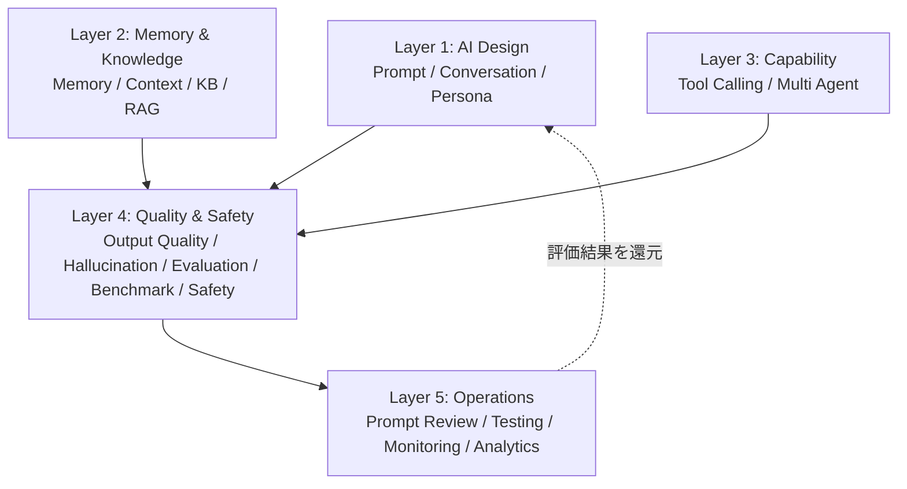
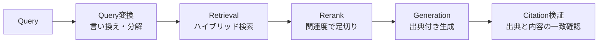
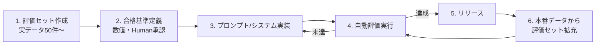

# AI Package — AI Operating System

> **AI Development Operating System — 全サービス共通AI基盤**
>
> **Mission: 世界最高品質のAIプロダクトを量産できる「AI Operating System」を作る。**
>
> AI機能の品質を「プロンプトを書いた人のセンス」に依存させない。設計・記憶・知識・評価・安全・運用のすべてを明文化し、[`platform/`](../platform/README.md) [`design/`](../design/README.md) と同様に**一度構築してすべてのAIプロダクトで再利用する**。
> OpenAI・Anthropic・Google・Perplexity・Cursor・Claude Codeのベストプラクティスを統合する。

| 項目 | 内容 |
|---|---|
| **Version** | 1.0.0 |
| **Status** | Active |
| **Last Updated** | 2026-07-09 |
| **関連ドキュメント** | [`Development_Workflow.md`](../00_System/Development_Workflow.md)（Phase 07） / [`Quality_Standard.md`](../00_System/Quality_Standard.md)（04 AI Quality） / [`Requirement_Engineering_Framework.md`](../01_Product/Requirement_Engineering_Framework.md)（Stage 16） / [`platform/README.md`](../platform/README.md)（Backlog: AI Platform） |

---

## 目次

1. [設計思想](#設計思想)
2. [Layer 1 — AI Design（設計）](#layer-1--ai-design)
   - Prompt Engineering / Conversation Design / Persona Design
3. [Layer 2 — Memory & Knowledge（記憶と知識）](#layer-2--memory--knowledge)
   - Memory / Long-term Memory / Context Management / Knowledge Base / RAG
4. [Layer 3 — Capability（能力拡張）](#layer-3--capability)
   - Tool Calling / Multi Agent
5. [Layer 4 — Quality & Safety（品質と安全）](#layer-4--quality--safety)
   - Output Quality / Hallucination Prevention / AI Evaluation / AI Benchmark / AI Safety
6. [Layer 5 — Operations（運用）](#layer-5--operations)
   - Prompt Review / AI Testing / AI Monitoring / AI Analytics
7. [Templates](#templates)
   - Prompt Template / Conversation Template / Output Checklist
8. [Best Practices統合元](#best-practices統合元)
9. [Deliverables](#deliverables)
10. [Version Management](#version-management)

---

## 設計思想

### 5原則

1. **評価がない機能は存在しない** — 評価データセットと合格基準（数値）をプロンプトより先に作る。「良くなった気がする」での変更を構造的に不可能にする。
2. **プロンプトはコード** — バージョン管理・レビュー・テスト・ロールバックをコードと同じ規律で行う。本番プロンプトの直接編集は禁止。
3. **失敗を前提に設計する** — 誤答・遅延・拒否・API障害・コスト超過の全失敗モードにフォールバックを用意してから出荷する。
4. **AIらしさを消し、誠実さを残す** — 出力は人間らしく自然に（[`design/README.md — UX Writing`](../design/README.md)）。ただしAIであることは偽らず、不確実性は隠さない。
5. **コンテキストは資産であり負債** — 入れるほど賢くなるは幻想。必要最小限のコンテキストが品質・速度・コストのすべてを改善する。

### レイヤー構造



---

# Layer 1 — AI Design

## Prompt Engineering

### 構造化プロンプトの標準構成（この順序で書く）

| # | セクション | 内容 | 根拠 |
|---|---|---|---|
| 1 | Role | 誰として振る舞うか（専門性・視点） | Anthropic: role prompting |
| 2 | Context | タスクの背景・前提・制約 | 静的な内容を先頭に（キャッシュ効率） |
| 3 | Instructions | 何をすべきか（番号付き・具体的） | 曖昧語禁止（[`Agent_Base_Template.md — Prompt Writing Standard`](../00_System/Agent_Base_Template.md#prompt-writing-standard)） |
| 4 | Examples | Few-shot例（入力→期待出力のペア） | 例は指示より雄弁。エッジケース例を含める |
| 5 | Input | 処理対象データ（XMLタグ等で明確に区切る） | 指示とデータの分離（インジェクション対策の基礎） |
| 6 | Output Format | 出力形式の厳密な指定（JSONスキーマ等） | 構造化出力を使えるならプロンプトでなくAPI機能で強制 |

### ルール

- **変数化**: 可変部分は `{{variable}}` で分離し、プロンプト本体は不変に保つ（キャッシュ・テスト・レビューの単位を安定させる）
- **1プロンプト1タスク**: 複数タスクの混載は品質を落とす。分割してチェーン化する
- **否定形より肯定形**: 「〜するな」より「〜せよ」。禁止事項は必要最小限に（禁止の羅列はかえって想起させる）
- **推論の余地**: 複雑な判断には考える手順（考慮すべき観点）を与える。ただしCoTの台本化はしない（[`Agent_Base_Template.md`](../00_System/Agent_Base_Template.md) と同思想）
- **モデル更新耐性**: 特定モデルの癖への過剰適応（magic words）を避け、意図を明示的に書く

## Conversation Design

| 設計項目 | ルール |
|---|---|
| **開始** | 初回メッセージで「何ができて・何ができないか」を1〜2文で示す。空のチャット欄を放置しない（開始例・サジェスト提示） |
| **ターン設計** | 1ターン1トピック。AIの応答は「答え→根拠→次の選択肢」の順。長広舌禁止（応答の長さ上限を設計する） |
| **文脈維持** | 会話内の指示語・省略を解決して引き継ぐ。話題転換はユーザー主導（AIが勝手に話題を戻さない） |
| **曖昧さの処理** | 曖昧な依頼は勝手に解釈せず、解釈の候補を提示して確認する（ただし確認は1回まで。確認の連打は体験を壊す） |
| **エラー・限界** | できないことは即座に正直に言い、代替手段を示す。「がんばって間違える」より「できないと言う」 |
| **終了** | タスク完了を明示し、次のアクションを提案する。会話の引き延ばし（不要な追い質問）は禁止 |
| **人間へのエスカレーション** | AIで解決できないケースの人間への接続経路を必ず設計する（サポート導線） |

## Persona Design

AI人格は要件定義（[`Requirement_Template.md`](../templates/Requirement_Template.md) 16.3）で定義し、以下の構成で実装する。

| 項目 | 定義内容 |
|---|---|
| **Identity** | 名前・役割・専門性（何の専門家として話すか） |
| **Tone** | ブランドのトーン&マナーとの一致（[`design/README.md — UX Writing`](../design/README.md) のVoice & Toneに完全準拠） |
| **語彙・文体** | 使う語彙のレベル・文の長さ・敬語の度合い・絵文字の可否 |
| **振る舞い** | 不確実なときどうするか・意見を求められたらどうするか・雑談への対応範囲 |
| **禁止事項** | 人間のふりをしない・専門外の断定（医療・法律・投資助言等）をしない・ペルソナ崩壊時の回復方法 |

**一貫性ルール**: ペルソナはシステムプロンプトで一元定義し、全機能・全チャネル（チャット・メール・通知文）で同一とする。機能ごとに人格が変わるプロダクトは信頼を失う。

---

# Layer 2 — Memory & Knowledge

## Memory（短期記憶）

| 種別 | 実装 | ルール |
|---|---|---|
| 会話内メモリ | コンテキストウィンドウ内の履歴 | 長い会話は要約で圧縮（下記Context Management）。全履歴の無加工持ち回りは品質・コスト両面の負債 |
| セッションメモリ | 会話をまたぐ当日の作業状態 | 「何をしていたか」を構造化して保存（生ログではなく状態として） |

## Long-term Memory（長期記憶）

| 設計項目 | ルール |
|---|---|
| **何を覚えるか** | ユーザーの明示的な好み・繰り返し現れる事実・訂正された誤り。**基準: 次回の会話で使うと体験が良くなるものだけ** |
| **何を覚えないか** | 機微情報（健康・信条等）はデフォルト記憶禁止・一時的な文脈・推測にすぎないこと |
| **構造** | 1記憶1ファクト＋出所＋日付（本OS自身のMemory設計と同型）。記憶同士の矛盾は新しい方を優先し古い方を無効化 |
| **ユーザー主権** | 記憶の閲覧・編集・削除をユーザーに開放する（何を覚えられているか見えないAIは不気味） |
| **鮮度管理** | 記憶には有効期限の概念を持たせ、古い記憶は「当時の情報」として扱う |

## Context Management

**原則: コンテキストは「多いほど良い」ではなく「必要十分が最良」。**（Claude Code / Cursorの実践知）

| 技法 | 内容 |
|---|---|
| **静的先頭・動的末尾** | 不変部分（システムプロンプト・知識）を先頭に、可変部分（会話・入力）を末尾に配置しキャッシュ効率を最大化する |
| **段階的読み込み** | 必要になってから読み込む（全部先読みしない）。ツール経由のオンデマンド取得を基本とする |
| **要約圧縮** | 長い履歴は「決定事項・未解決・現在の状態」に構造化要約して置き換える |
| **コンテキスト予算** | 機能ごとにトークン予算を定義し、超過を監視する（無限に伸びる設計を許さない） |
| **関連性フィルタ** | RAG・メモリからの注入は関連度で足切りする。「念のため入れる」は品質を下げる |

## Knowledge Base

| 設計項目 | ルール |
|---|---|
| **正本の一元化** | 知識の正本は1箇所（Git管理のMarkdown/構造化データ）。コピーを作らず参照する |
| **構造化** | 1ドキュメント1トピック・見出し階層・メタデータ（更新日・出所・対象範囲）付き — チャンク分割と検索の品質はここで決まる |
| **鮮度** | 全知識に更新日を持たせ、古い知識の回答には「〜時点の情報」を付ける。定期レビューで陳腐化を検出 |
| **ギャップ検出** | 「答えられなかった質問」をログから収集し、知識追加のバックログにする |

## RAG



| 段階 | ルール |
|---|---|
| **チャンク** | 意味の単位で分割（固定長で機械分割しない）。見出し・メタデータをチャンクに含める |
| **検索** | ベクトル＋キーワードのハイブリッドを標準とする（どちらか単独は取りこぼす） |
| **Rerank・足切り** | 関連度閾値未満は渡さない。「該当なし」は該当なしとして生成側に伝える（無理に埋めない） |
| **生成** | 出典明示を必須とする（どのドキュメントに基づくか）。検索結果にない内容の付け足しを禁止する指示を入れる |
| **評価** | RAGは検索と生成を分けて評価する（Retrieval: 再現率/適合率、Generation: 忠実性/回答関連性） |
| **権限** | 検索結果にはユーザーの権限フィルタを必ず適用（[`platform/README.md — 09 Search`](../platform/README.md) と同一原則） |

---

# Layer 3 — Capability

## Tool Calling

| 設計項目 | ルール |
|---|---|
| **ツール定義** | 名前は動詞ベースで曖昧さゼロ・説明は「いつ使うか/いつ使わないか」を含める・パラメータはスキーマで厳密に型定義 |
| **ツール数** | 1エージェントに渡すツールは必要最小限（多すぎる選択肢は誤選択を生む）。多い場合は段階開示・検索型定義を使う |
| **冪等性** | 読み取り系と副作用系を明確に分離。副作用系（送信・削除・課金）は確認ステップまたは人間承認を挟む |
| **エラー設計** | ツールのエラーは「AIが次の行動を判断できる形式」で返す（生スタックトレースではなく、原因と再試行可否） |
| **実行制限** | 最大呼び出し回数・タイムアウト・ループ検知を必ず設定（暴走の構造的防止） |

## Multi Agent

**原則: マルチエージェントは最後の手段。** 単一エージェント＋良いツールで解けるならそれが最良（複雑性はバグと コストの温床 — Anthropic/Cursorの実践知）。

| 採用基準 | マルチにする条件: ①並列化で明確に速くなる ②専門コンテキストの分離が品質を上げる ③単一のコンテキスト予算に収まらない — のいずれかを満たす場合のみ |
|---|---|
| **構成パターン** | Orchestrator-Worker型を標準とする（対等なエージェント同士の自由対話は収束しない） |
| **通信** | 構造化フォーマット（[`Agent_Base_Template.md — Communication Standard`](../00_System/Agent_Base_Template.md#agent-communication-standard)）で行い、自然言語の伝言ゲームを避ける |
| **責任** | 1成果物1責任エージェント。共同編集はさせない（本OSのAgent Architectureと同一原則） |
| **失敗の隔離** | Worker の失敗が全体を壊さない設計（リトライ・代替・部分結果での続行） |

---

# Layer 4 — Quality & Safety

## Output Quality

| 観点 | 基準 |
|---|---|
| 正確性 | 事実が正しい・計算が合う・出典と一致する |
| 完全性 | 依頼の全要素に応えている（一部だけ答えて完了顔をしない） |
| 簡潔性 | 冗長な前置き・繰り返し・不要な網羅がない（[`design/README.md — AIらしさ排除`](../design/README.md)のLintを出力に適用） |
| 形式遵守 | 指定フォーマット（JSON等）に100%準拠。パース失敗はバグとして扱う |
| トーン一致 | Persona定義・ブランドVoiceと一致 |
| 実用性 | ユーザーが次のアクションを取れる（評論で終わらない） |

## Hallucination Prevention

| 対策層 | 手法 |
|---|---|
| **設計で防ぐ** | 事実性が必要なタスクはRAG/ツールで根拠を与える（パラメトリック知識に頼らせない）・「わからない場合はわからないと答える」を明示的に許可・出典必須の出力形式 |
| **生成時に防ぐ** | 不確実性の言語化を要求（断定/推定/不明の3区分）・数値/固有名詞/日付は根拠とセットでのみ出力 |
| **検証で捕まえる** | 出典と生成内容の一致検証（Citation check）・重要出力は自己検証パス（生成→検証→修正）・LLM-as-judgeでの忠実性採点 |
| **UXで守る** | AI出力であることの明示・重要な判断（医療・法律・金銭）には人間確認を挟む導線・ユーザーによる誤り報告の仕組み |

## AI Evaluation

**評価駆動開発（本Package最重要プロセス）**:



| 項目 | ルール |
|---|---|
| 評価セット | 実データ由来50件以上（合成のみは不可）。正常系・エッジケース・攻撃ケースを含む。本番の失敗例を継続的に追加 |
| 評価方法 | コードで判定できるもの（形式・数値）はコード評価 / 品質判定はLLM-as-judge（ルーブリック明文化・人間採点との一致率を検証してから信頼する）/ 定期的な人間サンプリング評価 |
| 回帰評価 | プロンプト・モデル・RAG構成の変更時に全件再実行（CIに組み込む）。スコア低下はマージブロック |
| 記録 | 全評価結果をバージョンと紐付けて保存（「いつ何を変えてどうなったか」を追跡可能に） |

## AI Benchmark

| 用途 | ルール |
|---|---|
| モデル選定 | 公開ベンチマークは参考値に留め、**自社タスクの評価セットでの実測**を選定の正とする |
| 比較軸 | 品質スコア×レイテンシ（p50/p95）×コスト/リクエストの3軸で比較表を作る（品質だけで選ばない） |
| 定点観測 | モデルアップデート時・四半期ごとに同一評価セットで再計測し、乗り換え判断の材料を持ち続ける |
| 昇格基準 | モデル変更は評価セットで現行以上のスコア＋回帰なしを確認してから（新しい=良いではない） |

## AI Safety

| 領域 | 対策 |
|---|---|
| **Prompt Injection** | 指示とデータの構造的分離（タグ・ロール）・外部コンテンツ内の指示は「データ」として扱う原則（[`Agent_Base_Template.md — Security`](../00_System/Agent_Base_Template.md#11-security)）・ツール実行前の意図確認（重要操作） |
| **有害出力** | 入出力フィルタ・ユースケース別の拒否方針定義（何を断るかをプロダクト仕様として明文化） |
| **個人情報** | 入力からのPII検出とマスキング・出力への他ユーザー情報混入の構造的防止（コンテキスト分離）・ログのPIIマスキング |
| **データ利用** | ユーザーデータの学習利用可否を明示・同意なしのデータ利用禁止（法務: 人間確認必須） |
| **コスト暴走** | ユーザー/機能単位のレート制限・トークン上限・異常検知アラート（[`platform/README.md`](../platform/README.md) Rate Limitと連携） |
| **悪用対策** | 大量生成・スクレイピング的利用の検知・利用規約での禁止事項定義（人間: 法務確認） |

---

# Layer 5 — Operations

## Prompt Review

プロンプトの変更は[`Review_Process.md`](../00_System/Review_Process.md)の7ステージに従い、以下の観点でレビューする:

- [ ] 標準構成（Role→Context→Instructions→Examples→Input→Output Format）に準拠
- [ ] 変更理由と評価結果がセットで記録されている（評価なしの変更はFAIL）
- [ ] 曖昧語・矛盾する指示・到達不能な指示がない
- [ ] インジェクション面（データと指示の分離）が維持されている
- [ ] 変数・キャッシュ境界が壊れていない
- [ ] Persona・ブランドトーンとの一貫性

**運用**: プロンプトは `prompts/` でGit管理し、本番反映はPRマージ経由のみ。緊急ロールバックは直前バージョンへの切り戻しで行う。

## AI Testing

| テスト種別 | 内容 |
|---|---|
| 機能テスト | 評価セット全件の自動実行（合格基準達成） |
| 回帰テスト | 変更時の全件再実行＋スコア比較（CI） |
| 敵対テスト | インジェクション・ジェイルブレイク・境界入力の攻撃セット（Security Reviewと連携） |
| 障害注入 | APIタイムアウト・不正応答・レート制限時のフォールバック動作検証 |
| 一貫性テスト | 同一入力の複数回実行での出力分散測定（temperature設定の妥当性確認） |
| 負荷テスト | 同時リクエスト時のレイテンシ・キュー挙動（Performance Reviewと連携） |

## AI Monitoring

| 監視対象 | 指標・アラート |
|---|---|
| 品質 | ユーザーフィードバック率（👍👎）・再生成率・エスカレーション率の急変 |
| 性能 | レイテンシp50/p95・タイムアウト率・ストリーミング開始までの時間 |
| コスト | トークン消費/日・ユーザー単価・予算超過アラート（[`platform/README.md — 07 Monitoring`](../platform/README.md) に統合） |
| 安全 | フィルタ発動率・インジェクション検知数・拒否率の異常変動 |
| 依存 | プロバイダAPIのエラー率・レート制限到達（フォールバック発動の監視） |

## AI Analytics

| 分析 | 内容 |
|---|---|
| 利用分析 | どの機能が・誰に・どれだけ使われているか（AI機能のDAU/リピート率） |
| 品質分析 | 失敗会話の分類（誤答/理解失敗/知識不足/拒否過剰）→ 改善バックログ化 |
| 価値検証 | AI機能の利用とRetention/CVR/LTVの相関（[`Quality_Standard.md — KPI`](../00_System/Quality_Standard.md)・要件定義Stage 19の成功基準判定） |
| 知識ギャップ | 答えられなかった質問の集計 → Knowledge Base拡充へ還元 |
| プロンプト効果 | バージョン別の品質スコア・フィードバック比較（A/Bはfeature-flagと連携） |

---

# Templates

## Prompt Template（標準プロンプト雛形）

```markdown
# {{FEATURE_NAME}} — Prompt v{{VERSION}}

## Role
あなたは{{ROLE_DEFINITION}}です。

## Context
{{BACKGROUND_AND_CONSTRAINTS}}

## Instructions
1. {{INSTRUCTION_1}}
2. {{INSTRUCTION_2}}
3. 情報が不足している・確信が持てない場合は、推測せず「わからない」と明示し、必要な情報を質問してください。

## Examples
<example>
入力: {{EXAMPLE_INPUT}}
出力: {{EXAMPLE_OUTPUT}}
</example>
<example>
入力: {{EDGE_CASE_INPUT}}
出力: {{EDGE_CASE_OUTPUT}}
</example>

## Input
<input>
{{USER_INPUT}}
</input>

## Output Format
{{FORMAT_SPEC（JSONスキーマ / 文字数上限 / トーン指定）}}
```

管理情報（frontmatter）: `feature / version / model / eval_score / updated / owner` を必須とする。

## Conversation Template（会話設計雛形）

```markdown
# {{FEATURE_NAME}} — Conversation Design

## 開始
- 初回メッセージ: {{何ができるかの1-2文＋開始例3つ}}
- 空状態のサジェスト: {{候補}}

## メインフロー
| ユーザー意図 | AIの応答方針 | 次の選択肢提示 |
|---|---|---|
| {{意図1}} | {{方針}} | {{提示内容}} |

## 例外処理
| 状況 | 応答 |
|---|---|
| 曖昧な依頼 | 解釈候補を提示して1回だけ確認 |
| 範囲外の依頼 | できないと明示＋代替案: {{代替}} |
| 有害・不適切 | {{拒否方針に従った応答}} |
| 人間対応が必要 | {{エスカレーション導線}} |

## 終了
- 完了の明示: {{完了メッセージ方針}}
- 次のアクション提案: {{提案内容}}
```

## Output Checklist（出力品質の出荷前検査）

- [ ] 事実・数値・固有名詞に根拠がある（出典 or ツール結果）
- [ ] 指定フォーマットに100%準拠（機械検証済み）
- [ ] 依頼の全要素に応えている
- [ ] AIらしい冗長表現がない（design/ Writing Lint適用）
- [ ] Persona・トーンが一貫している
- [ ] 不確実な箇所が「推定」と明示されている
- [ ] 有害・PII混入がない（フィルタ通過）
- [ ] ユーザーが次のアクションを取れる

---

# Best Practices統合元

| 参照元 | 主に取り入れた実践 |
|---|---|
| **Anthropic** | 構造化プロンプト（XMLタグ）・役割付与・評価駆動・エージェント設計（シンプル優先）・Constitutional なトーン設計 |
| **OpenAI** | Few-shot設計・構造化出力・ツール定義のスキーマ厳密性・安全性の層防御 |
| **Google** | 評価ルーブリック・LLM-as-judgeの検証（人間一致率）・責任あるAI（透明性・ユーザー主権） |
| **Perplexity** | 出典必須の生成・Citation検証・「検索結果にないことを言わない」規律 |
| **Cursor** | コンテキスト最小主義・オンデマンド取得・単一エージェント優先 |
| **Claude Code** | 段階的コンテキスト読み込み・ツールの「いつ使うか」記述・Memory設計（1記憶1ファクト）・プロンプトのGit管理 |

---

# Deliverables

## Agent

既存の [`Agent_Architecture.md`](../00_System/Agent_Architecture.md) でカバーする（新Agent追加不要）:

| Agent | 本Packageでの責務 |
|---|---|
| AI Engineer Agent | 全Layerの設計・実装・評価の主担当 |
| Security Agent | Layer 4 AI Safety・敵対テストのレビュー |
| UX Designer Agent | Conversation Design・失敗時UXの協働設計 |
| Growth Agent | AI Analytics（価値検証・利用分析）の運用 |

## Skill

`skills/engineering/ai/` サブカテゴリに追加（[`Skill_Base_Template.md`](../00_System/Skill_Base_Template.md) 12セクション形式）:

| Skill | パス | 対応Layer |
|---|---|---|
| Prompt Engineering Skill | `skills/engineering/ai/prompt-engineering/` | Layer 1 |
| Conversation Design Skill | `skills/engineering/ai/conversation-design/` | Layer 1 |
| RAG Skill | `skills/engineering/ai/rag/` | Layer 2 |
| Agent Design Skill | `skills/engineering/ai/agent-design/` | Layer 3 |
| AI Evaluation Skill | `skills/engineering/ai/evaluation/` | Layer 4 |
| AI Safety Skill | `skills/engineering/ai/safety/` | Layer 4 |

## Prompt / Template / Checklist

| 種別 | 配置 |
|---|---|
| Prompt Template・Conversation Template | `ai/templates/`（本書Templates章の切り出し） |
| Output Checklist・評価セット雛形・モデル比較表雛形 | `ai/templates/` |
| 本番プロンプト（サービス別） | 各サービスの `prompts/`（frontmatter必須・Git管理） |

## Review

[`Review_Process.md — 04 AI Review`](../00_System/Review_Process.md) の詳細基準として本Packageを適用する: Prompt Review（Layer 5）＋ Output Checklist ＋ AI Safety検査。ゲートは既存Phase 07 / 13を使用（新設しない）。

## Workflow

[`Development_Workflow.md`](../00_System/Development_Workflow.md) との対応（新工程は追加しない）:

| Phase | 本Packageの適用 |
|---|---|
| Phase 07 AI Design | Layer 1-3の設計＋評価セット・合格基準の定義（実装前） |
| Phase 10 Backend | Layer 2-3の実装（Platform Adapter経由） |
| Phase 12 Testing | AI Testing 6種の実行 |
| Phase 13 QA Review | Output Checklist・AI Quality判定 |
| Phase 15 Security Review | AI Safety・敵対テスト |
| Phase 18-19 Analytics/Improvement | AI Monitoring / Analyticsの運用・評価セット拡充 |

## Repository構成

```
ai/
├── README.md              # 本ファイル（AI OS正本）
├── templates/             # Prompt/Conversation Template・Output Checklist・評価セット雛形
├── evals/                 # 評価ルーブリック・LLM-as-judge定義・ベンチマーク記録
├── safety/                # 拒否方針雛形・敵対テストセット・インジェクションパターン集
└── examples/              # 実案件の良例・失敗例・改善履歴（学びの還元先）
```

---

# Version Management

| Version | 日付 | 変更内容 | 担当 |
|---|---|---|---|
| 1.0.0 | 2026-07-09 | 初版作成（5 Layer構成: Design / Memory & Knowledge / Capability / Quality & Safety / Operations、Templates 3種、Deliverables一式） | Claude Code + Owner |

### 運用ルール

- 本書の変更はPull Request＋Owner承認で行う
- 原則（5原則・評価駆動）の変更はMajor、Layer内のルール追加はMinor
- モデル・プロバイダの進化で陳腐化しやすい層（ベンチマーク・具体的手法）は四半期レビューで更新する
- 本番の失敗事例（ハルシネーション・インジェクション・品質劣化）は必ず `ai/examples/` と評価セットに還元する（同じ失敗を二度しない）
- 配置は `platform/` `design/` と同じ無番号共有資産ディレクトリ規約に従う（`04_AI/` はWorkflow成果物用で役割が異なる）

---

*This package is part of the AI Development Operating System.*
*Maintained in: `ai/README.md`*
