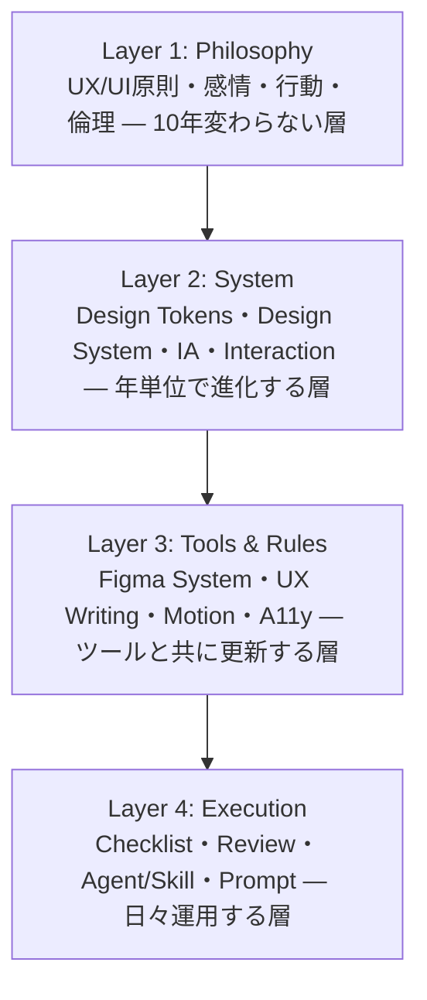

# Design Package — Design Operating System

> **AI Development Operating System — 全サービス共通デザイン基盤**
>
> **Mission: AppleレベルのUX品質を、誰が（どのAIが・どの人間が）作業しても再現できる「Design Operating System」を作る。**
>
> デザインの品質を個人のセンスに依存させない。原則・トークン・Figmaルール・ライティング・レビュー基準のすべてを明文化し、[`platform/`](../platform/README.md) と同様に**一度構築してすべてのサービスで再利用する**。

| 項目 | 内容 |
|---|---|
| **Version** | 1.0.0 |
| **Status** | Active |
| **Last Updated** | 2026-07-09 |
| **関連ドキュメント** | [`Development_Workflow.md`](../00_System/Development_Workflow.md)（Phase 03-06） / [`Quality_Standard.md`](../00_System/Quality_Standard.md)（02 UX / 03 UI Quality） / [`Review_Process.md`](../00_System/Review_Process.md) / [`platform/README.md`](../platform/README.md) |

---

## 目次

1. [設計思想](#設計思想)
2. [Design Philosophy](#design-philosophy)
3. [Figma System](#figma-system)
4. [UX Review](#ux-review)
5. [UX Writing](#ux-writing)
6. [Accessibility](#accessibility)
7. [Motion Design](#motion-design)
8. [Design Checklist（工程別）](#design-checklist工程別)
9. [Deliverables（Agent / Skill / Template / Prompt / Review / Workflow / Repository）](#deliverables)
10. [Version Management](#version-management)

---

## 設計思想

| 目的 | 実現方法 |
|---|---|
| **Apple級の品質を誰でも再現** | 「センス」を原則・数値・チェックリストに分解する。判定可能でないルールは書かない |
| **AIがデザインしても崩れない** | Claude Code（Figma MCP）が参照する前提でルールを機械可読な粒度まで具体化する |
| **全サービスで一貫** | トークン・コンポーネント・ライティングルールをサービス横断で共有し、ブランド差分は上書きレイヤーでのみ表現する |
| **倫理を構造に組み込む** | 行動デザイン・心理誘導・課金導線に倫理境界を明文化し、ダークパターンを構造的に排除する |
| **10年運用** | 特定ツールのUIに依存しない原則層と、Figma等の具体ツール層を分離する |

### Design OSの層構造



---

# Design Philosophy

## UX Principles（体験原則）

すべての設計判断はこの7原則に照らして行う。衝突したら番号の若い方を優先する。

| # | 原則 | 判定文 |
|---|---|---|
| 1 | **Clarity（明瞭）** | ユーザーは3秒以内に「この画面で何ができるか」を理解できる |
| 2 | **User Control（主導権）** | ユーザーはいつでも中断・取り消し・戻るができる。勝手に進めない |
| 3 | **Feedback（応答）** | すべての操作に100ms以内の視覚応答がある。システムの状態が常に見える |
| 4 | **Forgiveness（寛容）** | 誤操作は1アクションで回復できる。破壊的操作には確認がある |
| 5 | **Progressive Disclosure（漸進開示）** | 最初は最小限を見せ、必要になったら深い機能を開示する |
| 6 | **Consistency（一貫）** | 同じ操作は同じ結果を生む。画面間・サービス間でパターンを変えない |
| 7 | **Efficiency（効率）** | 主要タスクは最短経路で完遂できる。慣れたユーザーには近道を用意する |

## UI Principles（視覚原則）

| # | 原則 | 判定文 |
|---|---|---|
| 1 | **Hierarchy** | 視線が「最重要→次→補足」の順に自然に流れる。1画面の主役は1つ |
| 2 | **Whitespace** | 余白は要素と同格のデザイン素材。詰めて情報を増やすより削って明瞭にする |
| 3 | **Alignment** | すべての要素がグリッドに揃う。1pxのズレを放置しない |
| 4 | **Contrast** | 重要度の差は大きさ・太さ・色のコントラストで表現する（色だけに頼らない） |
| 5 | **Repetition** | 同じ役割は同じ見た目。バリエーションは意味の差があるときだけ作る |
| 6 | **Restraint（抑制）** | 装飾は情報を運ばないなら削る。「足す」より「引く」がデフォルト |

## Emotion Design（感情設計）

| 概念 | 適用ルール |
|---|---|
| **Peak-End Rule** | 体験のピーク（価値実感の瞬間）と終わり（タスク完了・退会時さえも）を意図的に設計する。全工程を均等に磨くより、ピークと終わりに投資する |
| **First Impression** | 初回起動〜Aha Momentまでを「プロダクトの第一印象」として専用設計する（オンボーディングは機能説明ではなく最初の成功体験） |
| **Delight（喜び）** | マイクロインタラクション・completion時の演出は「タスクの節目」にのみ配置する。常時の演出は喜びを摩耗させる |
| **Trust（信頼）** | 不安が生まれる箇所（決済・個人情報・削除・AI出力）には先回りの安心材料（何が起きるかの予告・実績・取り消し可能性）を必ず置く |
| **感情曲線** | ジャーニーマップの感情曲線で「不安・苛立ちの谷」を特定し、谷ごとに対策を設計する（[`Requirement_Engineering_Framework.md`](../01_Product/Requirement_Engineering_Framework.md) Stage 14と連動） |

## Behavioral Design（行動設計）

| 概念 | 適用ルール | 倫理境界 |
|---|---|---|
| **Fogg Behavior Model**（B=MAP） | 行動が起きない原因を「動機・能力・きっかけ」に分解して特定する。まず能力（簡単さ）を上げる | 動機の捏造（虚偽の緊急性・希少性）は禁止 |
| **Hook Model**（トリガー→行動→報酬→投資） | 継続の仕組みとして適用。ユーザーの投資（データ・カスタマイズ）が次回価値になる設計 | ユーザーの利益にならない習慣化（無意味な連続ログイン圧力等）は禁止 |
| **デフォルトの力** | ユーザーに最も有利な選択肢をデフォルトにする | 事業者に有利なだけのデフォルト（勝手なオプトイン）は禁止 |
| **社会的証明** | 実データのみ使用（利用者数・レビュー） | 偽装・水増しは禁止 |
| **損失回避** | 「失うもの」の提示は事実の範囲で（例: 試用期限の残り日数） | 偽のカウントダウン・偽の在庫表示は禁止 |

**ダークパターン禁止リスト（絶対）**: 解約妨害（Roach Motel）/ こっそり課金（Sneaking）/ 誤認誘導UI（Trick Question・視覚的誤導）/ 強制継続（Forced Continuity の無通知更新）/ 恥の植え付け（Confirmshaming）/ 偽の希少性・緊急性

## Human Interface Principles

Apple HIGの3原則を全プラットフォームの上位原則として採用する。

| 原則 | 意味 | 実務での適用 |
|---|---|---|
| **Clarity** | 文字は読め、アイコンは正確で、機能は明快 | 曖昧なアイコン単独使用の禁止（ラベル併記が基本） |
| **Deference** | UIはコンテンツに譲る。装飾がコンテンツと競わない | クロームの最小化・コンテンツファーストのレイアウト |
| **Depth** | 階層と遷移が空間的な文脈を伝える | モーダル/プッシュ/シートの使い分けを意味で統一（[Motion Design](#motion-design)と連動） |

## Design Tokens

トークンは3層構造とする。**サービス側がPrimitiveを直接参照することを禁止**し、ブランド差分はSemantic層の上書きでのみ表現する。

```
Primitive Tokens（原子値）     例: blue-500: #3B82F6 / space-4: 16px / radius-md: 8px
        ↓ 参照
Semantic Tokens（意味）        例: color-primary / color-danger / space-section / text-body
        ↓ 参照
Component Tokens（部品）       例: button-primary-bg / input-border-focus / card-padding
```

| カテゴリ | 定義する内容 |
|---|---|
| Color | Primitive パレット（10段階スケール）→ Semantic（primary / secondary / success / warning / danger / info / surface / text階層）→ ダークモード対応ペア |
| Typography | タイプスケール（1.25倍率基準）・weight・line-height・letter-spacing。役割名（display / headline / title / body / caption / label） |
| Spacing | 4pxベースのスケール（4/8/12/16/24/32/48/64）。任意値の使用禁止 |
| Radius | none / sm / md / lg / full の5段階 |
| Elevation | shadow 0〜4 の5段階（ダークモードでは光ではなく表面色で階層表現） |
| Motion | duration（fast: 100ms / base: 200ms / slow: 300ms / slower: 500ms）・easing（[Motion Design](#motion-design)参照） |

## Design System

構築順序と構成は固定: **Tokens → コンポーネント → パターン → 画面**（逆走禁止。画面から作ってあとでシステム化する方式は一貫性が崩壊する）。

| 層 | 内容 | ルール |
|---|---|---|
| Foundations | トークン・グリッド・アイコン体系・イラスト方針 | 全サービス共通。ブランド上書きはSemantic層のみ |
| Components | Button / Input / Card / Modal / Toast 等の基礎部品 | 全状態（default/hover/focus/active/disabled/error/loading）必須 |
| Patterns | フォーム / 空状態 / エラー処理 / 確認ダイアログ / オンボーディング等の複合パターン | 「同じ問題には同じ解法」を強制する層 |
| Screens | パターンの組み合わせとしての画面 | 一点物の要素は原則禁止（必要なら理由記録の上でコンポーネント化） |

## Information Architecture

| ルール | 内容 |
|---|---|
| ユーザーの語彙で分類 | 分類・ラベルは社内用語ではなくユーザーのメンタルモデルに従う（カードソーティングで検証） |
| 3クリック/タップ | 主要情報には3操作以内で到達できる |
| 1画面1目的 | 各画面はユーザーの1つの目的に対応する。目的が2つあるなら画面を分ける |
| ナビゲーションの定位置 | グローバルナビは全画面で同一位置・同一構造。「今どこにいるか」が常にわかる |
| 検索とブラウズの両立 | 探し方は人によって違う。一覧からの発見と検索の両方の経路を確保する |

## Interaction Design

| ルール | 内容 |
|---|---|
| 応答時間の知覚基準 | 100ms以内: 即時と知覚 / 1s以内: 流れが途切れない / 1s超: 進捗表示必須 / 10s超: 完了通知＋離脱許容設計 |
| タッチターゲット | 44pt（iOS）/ 48dp（Android・Web）以上。密集リストは行全体をターゲット化 |
| ジェスチャ | プラットフォーム標準のみ使用（独自ジェスチャは発見不能）。ジェスチャ操作には必ずボタン等の代替経路を用意 |
| 破壊的操作 | 「確認 → 実行 → Undo猶予」の3段構え。Deleteボタンを危険色にし、確認のデフォルトフォーカスはキャンセル側 |
| フォーム | インライン検証（送信時にまとめてエラーを出さない）・エラーは項目の直下・入力例をプレースホルダでなくヘルパーテキストで示す |

---

# Figma System

Claude Code（Figma MCP）と人間デザイナーの両方が同じ構造で作業するためのルール。

## File Structure

```
📁 {Service Name} Design
├── 📄 Cover              # サービス概要・ステータス・担当
├── 📄 00_Foundations     # トークン（Variables）・グリッド・アイコン
├── 📄 01_Components      # コンポーネントライブラリ（Variants込み）
├── 📄 02_Patterns        # 複合パターン（フォーム・空状態等）
├── 📄 03_Wireframes      # ワイヤーフレーム（低忠実度）
├── 📄 04_Screens         # 本デザイン（フロー単位でSection分割）
├── 📄 05_Prototype       # プロトタイプ用（検証シナリオ別）
└── 📄 99_Archive         # 廃案（削除せず移動。判断の履歴として保持）
```

## Component Rules

- すべてのコンポーネントは **Variants** で状態（default/hover/focus/disabled/error/loading）とサイズ（sm/md/lg）を持つ
- コンポーネントの色・数値は**すべてVariables参照**（生値のハードコード禁止。Design Lintで機械検査）
- インスタンスのDetach禁止。逸脱が必要ならコンポーネント側にVariant追加を検討する
- コンポーネントには**説明（Description）とCode Connectリンク**を必ず付ける（実装との対応を維持）

## Auto Layout Rules

- **全フレームAuto Layout必須**（絶対配置はイラスト等の例外のみ・理由記録）
- パディング・ギャップはSpacingトークン値のみ使用
- Resizing設定を必ず意図通りに（Hug/Fill/Fixed）設定する — 「たまたま見えている」レイアウトを作らない
- 最小/最大幅を設定し、コンテンツ量が変わっても崩れないことをテキスト長変更で検証する

## Variables / Design Tokens

- [Design Tokens](#design-tokens)の3層をFigma Variablesで実装する（Primitive Collection → Semantic Collection → Component層はStyle/Variant内参照）
- ライト/ダークはSemantic CollectionのModeで切り替える（コンポーネント側の分岐禁止）
- トークンの追加・変更はFigma上で直接行わず、`design/tokens/`（正本）を更新してから同期する

## Naming Convention

| 対象 | 規則 | 例 |
|---|---|---|
| ページ | `NN_Name`（番号+英語） | `01_Components` |
| コンポーネント | `Category/Component`（スラッシュ階層） | `Form/Input`, `Feedback/Toast` |
| Variantプロパティ | 小文字英語で `state=hover, size=md` | `state=disabled` |
| Variables | トークン名と完全一致（`color/primary`等） | `color/text-secondary` |
| 画面フレーム | `FlowID-NN_ScreenName`（要件定義のSC-IDと対応） | `SC-003_checkout-confirm` |
| 禁止 | `Frame 123` `Copy of...` `final_v2` | 未命名レイヤーはレビューFAIL |

## Responsive Design

- ブレークポイント標準: **Mobile 375 / Tablet 768 / Desktop 1280**（+必要に応じWide 1536）
- モバイルファーストで設計し、各ブレークポイントのフレームを`04_Screens`に並置する
- ブレークポイント間で「消える情報」がある場合は、劣化ではなく優先度設計であることをレビューで説明できること

## Prototype Rules

- プロトタイプは**検証したいシナリオ単位**で作る（全画面接続の巨大プロトタイプは作らない — 保守不能）
- 主要フロー（オンボーディング・コア機能・課金）は必ずプロトタイプ化し、ユーザビリティテスト（Phase 06）に使う
- 遷移はMotionトークンのduration/easingを使い、実装と同じ体感にする

---

# UX Review

Google UX Research・Apple HIG・Nielsen Norman Group・Material Designを統合したレビュー基準。[`Review_Process.md — 02 UX Review / 03 UI Design Review`](../00_System/Review_Process.md) の詳細版として適用する。

## レビュー基準表

| # | 観点 | ベース | 判定基準 |
|---|---|---|---|
| 1 | システム状態の可視化 | NN/g #1 | 処理中・成功・失敗が常に見える。100ms/1s/10sルール準拠 |
| 2 | 実世界との一致 | NN/g #2 | ユーザーの語彙・慣習に従う（IA・ライティングと連動） |
| 3 | 主導権と自由 | NN/g #3 / HIG | 取り消し・中断・戻るが常に可能 |
| 4 | 一貫性と標準 | NN/g #4 / Material | 内部一貫性＋プラットフォーム標準の両方に準拠 |
| 5 | エラー予防 | NN/g #5 | 制約・確認・スマートデフォルトでエラーを事前に防ぐ |
| 6 | 再認 > 想起 | NN/g #6 | 記憶に頼らせない（選択肢の提示・履歴・候補） |
| 7 | 柔軟性と効率 | NN/g #7 | 初心者の導線と熟練者のショートカットの両立 |
| 8 | 美的で最小限 | NN/g #8 / HIG Deference | 情報を運ばない要素がない |
| 9 | エラー回復支援 | NN/g #9 | エラーメッセージが「何が起き・なぜ・どうすれば」を含む（[UX Writing](#ux-writing)） |
| 10 | ヘルプ | NN/g #10 | 文脈内ヘルプ（その場で解決）＞ヘルプセンター送り |
| 11 | 感情品質 | Apple / [Emotion Design](#emotion-design) | ピーク・エンド・不安の谷に設計が存在する |
| 12 | 行動倫理 | [Behavioral Design](#behavioral-design) | ダークパターン禁止リストに抵触しない（人間必須判定） |
| 13 | HEART指標接続 | Google UX | Happiness/Engagement/Adoption/Retention/Task successのどれを狙う設計か説明できる |

## レビュー運用

- **AI事前検査**（機械判定可能な項目: 状態網羅・トークン準拠・ターゲットサイズ・コントラスト）→ **Agentレビュー**（基準表1-10）→ **人間判定**（11-12: 感情・倫理・ブランド）の3段階
- ユーザビリティテスト（5人・[`Development_Workflow.md`](../00_System/Development_Workflow.md) Phase 06）の重大問題ゼロが合格条件
- 指摘は「観点# / 箇所 / 問題 / 修正提案」形式（[`Review_Process.md`](../00_System/Review_Process.md) 準拠）

---

# UX Writing

## Voice & Tone（人間らしい文章設計）

| 原則 | ルール |
|---|---|
| 人に話すように書く | 音読して不自然な文は書き直す。「〜されました」の連続より「〜しました」 |
| ユーザー主語 | 「システムが処理します」ではなく「保存しました」「あと2歩で完了です」 |
| 1文1情報 | 40字を超える文は分割を検討。読点3つ以上の文は書き直し |
| 敬語は丁寧・簡潔 | 過剰敬語（「〜させていただきます」の乱用）禁止。「です・ます」で十分 |
| トーンの使い分け | 成功時: 温かく短く / エラー時: 冷静に具体的に（ふざけない）/ 課金・法務: 事実を正確に |

## AIらしさを排除するルール

AIが生成した文章から以下を機械的に検出・排除する（Writing Lintとして運用）:

- ❌ 冗長な前置き（「〜することができます」→「〜できます」/「まず初めに」→ 削除）
- ❌ 過剰な網羅（3つで伝わる説明に5つ書かない。箇条書きの乱発禁止）
- ❌ 抽象的な形容（「便利な機能」「快適な体験」→ 具体的な価値を書く）
- ❌ 翻訳調（「あなたのアカウント」→「アカウント」。日本語で不要な所有格・代名詞を削る）
- ❌ 記号の乱用（「！」の連続・絵文字のデフォルト使用。使うなら意図を持って1つ）
- ❌ 同語反復（同じ画面に同じ語尾・同じ言い回しを3回以上使わない）
- ✅ 判定法: 「人間の優秀なカスタマーサポートがこの文を書くか？」

## マイクロコピー

| 箇所 | ルール | 例（❌→✅） |
|---|---|---|
| ボタン | 動詞で結果を約束する。「OK」「送信」より具体的に | ❌ 送信 → ✅ 予約を確定する |
| 空状態 | 「データがありません」禁止。次の1歩を示す | ❌ 履歴がありません → ✅ 最初のプロジェクトを作ってみましょう |
| プレースホルダ | 入力例を書く（ラベルの代わりにしない） | ✅ 例: tanaka@example.com |
| 確認ダイアログ | 選択肢のボタンに結果を書く | ❌ はい/いいえ → ✅ 削除する/残しておく |
| 読み込み中 | 何が起きているかを伝える | ❌ Loading... → ✅ 議事録を生成しています（約30秒） |

## エラーメッセージ

必須3要素: **何が起きたか / なぜか（わかる場合）/ ユーザーは何をすればよいか**

- ❌ 「エラーが発生しました（code: 500）」
- ✅ 「保存できませんでした。通信が不安定なようです。数秒おいて、もう一度お試しください。」
- 責めない（「不正な入力です」→「メールアドレスの形式で入力してください」）
- 技術情報はデフォルト非表示（「詳細」で開ける）。サポート問い合わせ用のエラーIDは添える

## 会話設計（AI・チャットUI）

- AI人格は要件定義（[`Requirement_Template.md`](../templates/Requirement_Template.md) 16.3）で定義したトーンに完全準拠する
- AIであることを偽らない（人間のふりをさせない）。能力の限界を正直に言う設計にする
- 会話の主導権はユーザー（AIが一方的に話し続けない・いつでも中断可能）
- 不確実な回答には確信度を言語化する（「おそらく〜」「確認が必要ですが〜」）

## 心理誘導・継続率向上・課金導線

**原則: 誘導は「ユーザーの利益と一致する範囲」でのみ行う（[Behavioral Design](#behavioral-design)の倫理境界に完全準拠）。**

| 目的 | 許可される手法 | 禁止 |
|---|---|---|
| 継続率 | 進捗の可視化（達成感）/ 次回の楽しみの予告 / パーソナライズの深化 / 適切なタイミングのリマインド | 罪悪感の植え付け・FOMO の捏造・無限スクロールの中毒設計 |
| 課金導線 | 価値実感の直後にアップグレード提案 / 無料枠の透明な残量表示 / プラン比較の正直な提示 / 年額割引の明示 | 機能を突然取り上げて課金を迫る・解約導線を隠す・「無料」と言いながらカード必須を隠す |
| 心理の活用 | アンカリング（推奨プランの明示）/ 社会的証明（実数）/ デフォルト効果（ユーザー有利な初期値） | 偽の緊急性・比較対象の捏造・confirmshaming（「損してもいいなら解約」等の文言） |

**課金・解約のライティング鉄則**: 課金開始前に「いつ・いくら請求されるか」を明記。解約はガイド付きで簡単に（解約体験の良さが再契約率を作る）。

---

# Accessibility

**基準: WCAG 2.2 AA（全サービス必須）。** [`Quality_Standard.md — 4 Accessibility品質`](../00_System/Quality_Standard.md) の実務詳細版。

## WCAG 2.2（4原則の実務ルール）

| 原則 | 必須ルール |
|---|---|
| 知覚可能 | コントラスト4.5:1（通常）/3:1（大・UIパーツ）・色だけで意味を伝えない・全画像にalt（装飾はalt=""）・動画に字幕 |
| 操作可能 | 全機能キーボード到達可能・フォーカス可視・ターゲット24px以上（WCAG2.2）/実務は44pt/48dp・時間制限に延長手段・点滅3回/秒以下 |
| 理解可能 | エラーの特定と修正提案・ラベルと説明・予測可能な挙動（フォーカスで文脈を変えない） |
| 堅牢 | セマンティックHTML・正しいARIA（不要なARIAは書かない: No ARIA > Bad ARIA）・支援技術での実機確認 |

## Apple Accessibility

- **Dynamic Type** 対応（最大サイズでもレイアウトが破綻しない）
- **VoiceOver** で主要フロー完遂可能（ラベル・トレイト・読み上げ順序）
- **Reduce Motion** 尊重（[Motion Design](#motion-design)の全アニメーションに代替）
- Increase Contrast / Bold Text 設定への追従

## Android Accessibility

- **TalkBack** で主要フロー完遂可能（contentDescription・フォーカス順序）
- タッチターゲット48dp・フォントスケール200%対応
- Material のアクセシビリティガイド（ステートの多重表現）準拠

## 運用

- 機械検査（axe・Figma Lint）はSelf Reviewで必須実行 → 手動検査（キーボードのみ・スクリーンリーダー）はQA Reviewで実施
- アクセシビリティ違反のSeverity: タスク完遂不能 = Critical / 主要フローの障壁 = High（[`Review_Process.md — Severity System`](../00_System/Review_Process.md#severity-system)）

---

# Motion Design

## 原則

1. **意味のないモーションは作らない** — モーションの役割は「文脈の維持・因果の説明・状態の伝達」の3つのみ。装飾目的は削る
2. **速く・控えめに** — UIモーションは100〜300ms。ユーザーを待たせる演出は負債
3. **Reduce Motion に必ず代替** — 全モーションはフェード等の低刺激代替を持つ

## Motionトークン

| トークン | 値 | 用途 |
|---|---|---|
| duration-fast | 100ms | ホバー・フォーカス・小さな状態変化 |
| duration-base | 200ms | 一般的な遷移・表示切替 |
| duration-slow | 300ms | 画面遷移・モーダル出現 |
| duration-slower | 500ms | 大きな空間移動・完了演出（節目のみ） |
| easing-standard | cubic-bezier(0.2, 0, 0, 1) | 画面内の変化（Material標準） |
| easing-enter | cubic-bezier(0, 0, 0, 1) | 要素の入場（減速） |
| easing-exit | cubic-bezier(0.3, 0, 1, 1) | 要素の退場（加速） |

## 種別ごとのルール

| 種別 | ルール |
|---|---|
| **Animation** | トークンのduration/easingのみ使用。同時に動く要素は2つまで（視線の分散防止） |
| **Loading** | 1s以内: 表示なし可 / 1〜3s: スピナー / 3s超: 進捗バー＋何をしているかのコピー / 10s超: 完了通知設計（[UX Writing](#ux-writing)連動） |
| **Skeleton** | コンテンツの構造を予告する形状にする（汎用の灰色箱の羅列にしない）。表示は最大2回のパルス、それ以上かかるならエラー・再試行導線へ |
| **Transition** | 遷移方向に空間的一貫性を持たせる（進む=右から/戻る=左へ等をアプリ内で統一）。モーダルは下から・重なりで「上に乗った」ことを伝える |
| **Feedback** | タップ・送信・保存に100ms以内の視覚応答（リップル・押下状態）。成功はチェック等の短い確定演出（500ms以内）、失敗はシェイク等の否定演出＋エラーメッセージ |

---

# Design Checklist（工程別）

[`Development_Workflow.md`](../00_System/Development_Workflow.md) Phase 03〜13に対応する工程別チェックリスト。各工程の Exit Criteria 判定に組み込む。

### 1. 企画（Phase 02-03連動）
- [ ] ペルソナ・JTBD・感情曲線が承認済みで、デザインが参照できる状態
- [ ] このデザインが動かすべきKPI（HEART/CVR/継続率）が特定されている
- [ ] ブランドのトーン&マナー（世界観）が言語化されている

### 2. Wireframe（Phase 04）
- [ ] 全ユーザーストーリーに対応するフローが存在する
- [ ] 異常系（エラー・空・ローディング・オフライン）が全主要フローに設計されている
- [ ] IAルール準拠（1画面1目的・3クリック・ユーザー語彙）
- [ ] UX Principles 7項目のセルフチェック済み
- [ ] ビジュアルに踏み込んでいない（構造の合意が目的）

### 3. Prototype（Phase 05-06）
- [ ] 検証シナリオ単位で構築されている（オンボーディング・コア機能・課金は必須）
- [ ] Motionトークンで実装同等の体感になっている
- [ ] ユーザビリティテスト（5人）実施・重大問題ゼロ

### 4. UI（Phase 05）
- [ ] トークン3層が構築され、全画面がSemantic/Component参照（生値ゼロ）
- [ ] 全コンポーネントが全状態のVariantsを持つ
- [ ] Figma System準拠（File Structure・命名・Auto Layout・Variables）
- [ ] レスポンシブ3ブレークポイント設計済み
- [ ] コントラスト・ターゲットサイズの機械検査パス
- [ ] UX Writingルール準拠（マイクロコピー・エラー文の全数チェック）
- [ ] ブランド適合のHuman承認済み

### 5. 実装確認（Phase 09-11）
- [ ] 実装がFigmaと視覚一致（トークン参照で実装・差異は承認記録あり）
- [ ] 全状態（loading/error/empty）が実装されている
- [ ] モーションがトークンduration/easingで実装・Reduce Motion対応
- [ ] キーボードのみで主要フロー完遂・セマンティックHTML
- [ ] テキストが最終ライティング（仮テキスト残留ゼロ）

### 6. QA（Phase 13）
- [ ] UX Review基準表13観点すべて判定済み
- [ ] axe重大違反ゼロ＋スクリーンリーダー実機確認
- [ ] 実機・実回線での体感速度確認（Skeleton/Loading設計の実効性）
- [ ] ダークパターン最終チェック（人間判定）
- [ ] Design Quality Score算出（[`Quality_Standard.md — 03 UI Quality`](../00_System/Quality_Standard.md)）

---

# Deliverables

## Agent

既存の [`Agent_Architecture.md`](../00_System/Agent_Architecture.md) Design Layer 3AgentがこのPackageを運用する（新Agent追加は不要）。

| Agent | このPackageでの責務 | 参照する章 |
|---|---|---|
| UX Research Agent | 感情曲線・行動分析の証拠提供、ユーザビリティテスト設計 | Emotion / Behavioral Design |
| UX Designer Agent | Philosophy層の適用・IA・Interaction・Wireframe・UX Writing | Design Philosophy / UX Writing / Checklist 1-2 |
| UI Designer Agent | Figma System運用・トークン・Design System・Motion・A11y設計 | Figma System / Motion / Accessibility / Checklist 3-4 |

## Skill

`skills/` に追加するDesign Package対応Skill（[`Skill_Base_Template.md`](../00_System/Skill_Base_Template.md) の12セクション形式で作成）:

| Skill | パス | 内容 |
|---|---|---|
| Figma System Skill | `skills/ui/figma-system/` | 本書Figma System章の実行知識（MCP操作含む） |
| UX Writing Skill | `skills/ux/ux-writing/` | Voice&Tone・マイクロコピー・AIらしさ排除Lint |
| Motion Design Skill | `skills/ui/motion-design/` | Motionトークン・種別ルールの適用 |
| Accessibility Skill | `skills/ui/accessibility/` | WCAG/Apple/Android検査の実行知識 |
| 既存: UI Design / UX Design / Apple HIG / Material Design | `skills/ui/` `skills/ux/` | 本書を上位規範として参照するよう更新 |

## Checklist / Template / Prompt

| 種別 | 配置 | 内容 |
|---|---|---|
| Checklist | `design/checklists/` | 工程別6チェックリスト（本書該当章の切り出し・コピーして使用） |
| Template | `design/templates/` | トークン定義（tokens.json雛形）・Figmaファイル雛形構成・UX Writing対訳表・レビュー記録表 |
| Prompt | `design/prompts/` | AI作業用標準プロンプト（下記） |

**標準プロンプト（design/prompts/ の共通形式）**:

```markdown
# Design作業: {{TASK_TYPE: wireframe / ui-design / ux-writing / motion / a11y-audit}}

`design/README.md` の該当章に従い、{{SERVICE_NAME}} の {{TASK_DESCRIPTION}} を実行してください。

- 入力: {{INPUT_FILES}}（要件定義の該当章・ペルソナ・既存Figma）
- ブランド: {{BRAND_TONE}}（Semantic層の上書き定義）
- 制約: {{CONSTRAINTS}}

実行ルール:
1. Design Philosophy の原則番号を判断根拠として引用すること
2. トークン外の値・未定義パターンが必要な場合は作業を止めて提案すること
3. 完了時に該当する Design Checklist でセルフレビューし結果を報告すること
4. ダークパターン懸念・ブランド判断・感情品質は人間判定に回すこと
```

## Review

[UX Review](#ux-review) の13観点基準表を [`Review_Process.md`](../00_System/Review_Process.md) の 02 UX Review / 03 UI Design Review の詳細基準として適用する。ゲートは既存のPhase 06（Design Review）を使用（新設しない）。

## Workflow

[`Development_Workflow.md`](../00_System/Development_Workflow.md) との対応（本Packageは新工程を追加せず、既存Phaseの実行品質を規定する）:

| Workflow Phase | 本Packageの適用 |
|---|---|
| Phase 03 UX Research | Emotion/Behavioral Designの分析視点・感情曲線 |
| Phase 04 UX Design | UX Principles・IA・Interaction・Checklist 2 |
| Phase 05 UI Design | Figma System・Tokens・Design System・Motion・A11y・UX Writing・Checklist 3-4 |
| Phase 06 Design Review | UX Review 13観点＋ユーザビリティテスト |
| Phase 09-11 実装 | Checklist 5（実装確認）・Code Connect |
| Phase 13 QA Review | Checklist 6・Design Quality Score |

## Repository構成

```
design/
├── README.md                 # 本ファイル（Design OS正本）
├── tokens/                   # デザイントークン正本（JSON）→ Figma Variables/コードへ同期
│   ├── primitive.json
│   ├── semantic.json
│   └── motion.json
├── checklists/               # 工程別チェックリスト（企画/WF/Proto/UI/実装/QA）
├── templates/                # トークン雛形・Figma構成雛形・ライティング対訳表・レビュー記録表
├── prompts/                  # AI作業用標準プロンプト
└── examples/                 # 実案件の良例・レビュー指摘の蓄積（学びの還元先）
```

---

# Version Management

| Version | 日付 | 変更内容 | 担当 |
|---|---|---|---|
| 1.0.0 | 2026-07-09 | 初版作成（Design Philosophy 9領域・Figma System・UX Review 13観点・UX Writing・Accessibility・Motion Design・工程別Checklist・Deliverables一式） | Claude Code + Owner |

### 運用ルール

- 本書の変更はPull Request＋Owner承認で行う
- Philosophy層（原則）の変更はMajor、System/Tools層のルール追加はMinor、記述改善はPatch
- トークン正本は `design/tokens/` のJSONとし、Figma・実装コードは同期先とする（三重管理の禁止）
- レビュー指摘・ユーザビリティテストの発見は `design/examples/` に蓄積し、繰り返す指摘はルール化して本書へ還元する
- 配置は `platform/` と同じ無番号共有資産ディレクトリ規約に従う（`02_UX/`等のWorkflow成果物ディレクトリとは役割が異なる）

---

*This package is part of the AI Development Operating System.*
*Maintained in: `design/README.md`*
