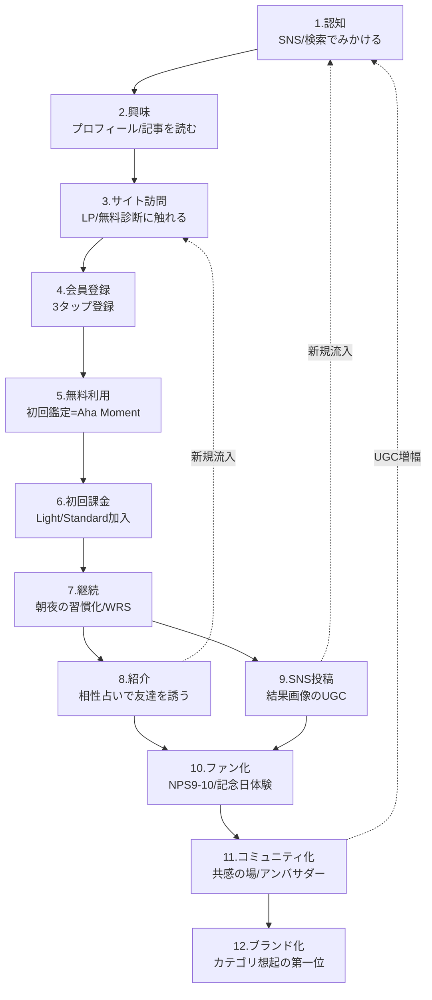

# 04. Customer Journey — 認知からブランド化までの12ステージ設計

本ドキュメントは、ユーザーが本サービスを「見かける」瞬間から「人生の一部として語る」までの全行程を12ステージで定義し、各ステージの感情・KPI・ボトルネック・打ち手・遷移目標率を実行可能な粒度で規定する正本である。すべての数値は [00_Strategy_Spine.md](./00_Strategy_Spine.md) §5 のKPIと整合し、NSMであるWRS（Weekly Resonant Sessions）に各ステージがどう寄与するかを明示する。

| 項目 | 内容 |
|---|---|
| Version | 1.0.0 |
| Status | Active |
| Last Updated | 2026-07-11 |
| Owner | Growth |

**関連ドキュメント**: [00_Strategy_Spine.md](./00_Strategy_Spine.md) / [03_Persona.md](./03_Persona.md) / [07_UX_Improvement.md](./07_UX_Improvement.md) / [08_Viral_Strategy.md](./08_Viral_Strategy.md) / [10_Pricing.md](./10_Pricing.md) / [11_CRM.md](./11_CRM.md) / [14_KPI_Dashboard.md](./14_KPI_Dashboard.md)

---

## 1. ジャーニー全体図（12ステージ）

**構造上の要点（3つ）**

1. **S8紹介とS9投稿はゴールではなく獲得装置**。S8→S3、S9→S1への還流がSpineの4ループ（UGC/リファラル）の実体であり、「広告費に依存しないグロース」（有料広告経由20%以下）の成立条件
2. **S5の「魔法の瞬間」がジャーニー全体の心臓**（§4）。S5の質がS6以降の全転換率の先行指標になる
3. **S7継続がNSM（WRS）の主戦場**。S7を通らずにS8/S9へ行くユーザー（P3型の即シェア）も許容する設計とする

---

## 2. ステージ別詳細設計

各ステージを共通フォーマットで規定する。**遷移目標率は§5のファネル表が正本**。

### Stage 1: 認知 — 「なんか最近よく見る」

| 項目 | 内容 |
|---|---|
| 感情・思考 | 受動的。「また占い系か」〜「ちょっと気になる」。信頼はゼロ、警戒は薄い |
| 行動 | TikTok/Instagram/Xのフィードで鑑定結果画像・診断動画・友達のストーリーズを目にする。検索結果で記事に出会う |
| タッチポイント | ショート動画、UGC（S9からの還流）、SEO/AEO記事、友達のシェアURL（S8からの還流） |
| KGI/KPI | 月間リーチUU、指名検索数、UGC投稿数（Spine: SNS投稿率3%が供給源） |
| ボトルネック仮説 | 占い系コンテンツは飽和しており、「無数の占いアカウントの一つ」として素通りされる |
| 打ち手（プロダクト） | シェア画像に一目でわかる独自ビジュアル署名（夜空トーン）を刻み、3回目の接触で「あのきれいなやつ」と認識される状態を作る |
| 打ち手（コンテンツ） | ペルソナ×チャネル固定運用（TikTok=P1/P3、X=P5/P6/P8。→ [12_Content_Strategy.md](./12_Content_Strategy.md)）。フックは「悩み」起点（「復縁を迷ってる人だけ見て」）でカテゴリ起点（「よく当たる占い」）ではない |
| 打ち手（CRM） | 該当なし（未接触層） |
| 次ステージ遷移目標 | リーチ→プロフィール/記事閲覧（興味）: **8%** |

### Stage 2: 興味 — 「これ、私のことかも」

| 項目 | 内容 |
|---|---|
| 感情・思考 | 「当たるのかな」「無料でどこまで？」「怪しくない？」。期待30%・懐疑70% |
| 行動 | SNSプロフィールを見る、投稿を数件遡る、記事を読了する、サービス名で検索し直す（深夜が多い） |
| タッチポイント | SNSプロフィール、固定投稿、記事下CTA、比較記事、App Store/レビュー |
| KGI/KPI | プロフィール→リンククリック率、記事読了率、指名検索数 |
| ボトルネック仮説 | 「無料と言いつつ課金誘導がしつこいのでは」という既存占いサービスへの不信の連帯責任を負っている |
| 打ち手（プロダクト） | LPファーストビューに「登録なしで1問体験」を置き、興味段階で価値を先に渡す |
| 打ち手（コンテンツ） | 「脅さない占い」という反ポジショニングの明文化（Spine §9）。レビュー・体験談UGCの整備で社会的証明を先回り配置 |
| 打ち手（CRM） | リターゲティングは軽微に留める（有料広告20%以下の制約。→ [05_Growth_Strategy.md](./05_Growth_Strategy.md)） |
| 次ステージ遷移目標 | 興味→サイト訪問: **40%** |

### Stage 3: サイト訪問 — 「試すだけ試してみるか」

| 項目 | 内容 |
|---|---|
| 感情・思考 | 「面倒だったらすぐ閉じよう」。滞在許容時間は最初の10秒 |
| 行動 | LP到達。スクロール、無料診断ボタンをタップ、または即離脱 |
| タッチポイント | LP、無料1問体験、価格ページ |
| KGI/KPI | 直帰率（目標55%以下）、無料体験開始率、訪問→登録CVR |
| ボトルネック仮説 | (1) 深夜のモバイル回線で表示が遅い (2) 登録要求が早すぎる (3) 何が無料かわからない |
| 打ち手（プロダクト） | LCP 2.0秒以下を維持（判定文: モバイル実測p75で2.0s以下）。登録前に1問だけAI鑑定を体験できる「先に価値、後で登録」構造 |
| 打ち手（コンテンツ） | 流入元の悩み文脈とLPファーストビューを一致させる（「復縁」動画から来た人には復縁の入口。最低5パターンの文脈別LP） |
| 打ち手（CRM） | 離脱時のexit intentは1回のみ・控えめに（ダークパターン回避） |
| 次ステージ遷移目標 | 訪問→会員登録: **40%** |

### Stage 4: 会員登録 — 「3タップで終わった」

| 項目 | 内容 |
|---|---|
| 感情・思考 | 「早く結果が見たい」。入力項目1つ増えるごとに期待が冷める |
| 行動 | LINE/Apple/Googleでソーシャルログイン→生年月日入力→相談テーマ選択（計3タップ+1入力を上限とする） |
| タッチポイント | 登録フォーム、LINE連携許諾 |
| KGI/KPI | 登録完了率、登録所要時間（目標60秒以内）、LINE連携率（目標70%: S7の通知生命線） |
| ボトルネック仮説 | 生年月日・出生時間など占い特有の入力が重い。「なぜ必要か」の説明不足で不信を招く |
| 打ち手（プロダクト） | 必須は生年月日のみ。出生時間・出生地は「精度が上がる任意項目」として初回鑑定後に回収。入力理由をその場で一行説明 |
| 打ち手（コンテンツ） | 登録中のローディングに「あなたの星を読んでいます…」の世界観演出（体感時間の短縮） |
| 打ち手（CRM） | 登録未完了の離脱者へLINE経由で1回だけ再開導線（24時間以内） |
| 次ステージ遷移目標 | 登録→初回鑑定完了: **80%** |

### Stage 5: 無料利用（初回鑑定）— 「え、なんでわかるの」【最重要ステージ】

| 項目 | 内容 |
|---|---|
| 感情・思考 | 懐疑→驚き→（うまくいけば）涙・安堵。「もっと聞いてほしい」 |
| 行動 | 初回対話鑑定（10〜15分）。悩みを入力し、深掘りされ、締めの言葉と「明日の一歩」を受け取る |
| タッチポイント | 鑑定チャットUI、結果サマリ画面、保存/シェアボタン、感情フィードバックUI |
| KGI/KPI | **Aha Moment到達率（§4で定義）: 初回セッションの50%**、初回完了率、D1継続率45%（Spine） |
| ボトルネック仮説 | (1) 序盤が一般論でバーナム感が露呈する (2) 対話が長すぎて完結前に離脱 (3) 締めの言葉が弱く感情のピークが立たない |
| 打ち手（プロダクト） | 最初の3往復以内に入力情報を使った個別具体の言及を必ず入れる。10分で必ず一区切りの完結構造。終端に「今日の言葉」カード（保存・シェア可能な美しい出力）を自動生成 |
| 打ち手（コンテンツ） | 締めの言葉ライブラリの継続ABテスト（ピークエンド最適化。→ [07_UX_Improvement.md](./07_UX_Improvement.md)） |
| 打ち手（CRM） | 鑑定完了3時間後に「今夜、少しは軽くなりましたか」の1通（翌朝運勢の予告を添える） |
| 次ステージ遷移目標 | 初回鑑定完了→D7残存: **25%**（Spine D7）、初回→初回課金は§5ファネル参照 |

### Stage 6: 初回課金 — 「この続きは、聞く価値がある」

| 項目 | 内容 |
|---|---|
| 感情・思考 | 「¥980ならいいか」（P1/P3）〜「コーチングより安い」（P2/P8）。課金直後は「正しかったよね？」の不協和 |
| 行動 | 深掘り途中の自然な提案、または7日目の習慣定着タイミングでプラン加入。決済はストア/カード/キャリア |
| タッチポイント | プラン提案画面、価格ページ、決済フロー、課金直後のウェルカム体験 |
| KGI/KPI | 無料→有料転換率 **6%**（12ヶ月目標、Spine）、転換までの中央値日数（目標7日）、初月解約率 |
| ボトルネック仮説 | (1) 無料が充実しすぎ/しなさすぎのバランス不全 (2) 提案タイミングが感情の谷と合っていない (3) プラン差がわからない |
| 打ち手（プロダクト） | 課金提案は「感情のピーク直後」のみに限定（鑑定の途中で核心を人質に取らない——Spine §9倫理）。課金直後に「あなた専用の深層プロフィール」を即時開放し不協和を解消 |
| 打ち手（コンテンツ） | ペルソナ別アンカー提示（P4: 電話占い1回分で1ヶ月/P8: コーチング比。→ [10_Pricing.md](./10_Pricing.md)） |
| 打ち手（CRM） | 無料枠を使い切ったユーザーへ「翌日回復」通知と、7日目のパーソナル振り返り+初回オファー（値引きではなく体験追加型） |
| 次ステージ遷移目標 | 初回課金→2ヶ月目継続: **85%**（初月解約15%以下） |

### Stage 7: 継続 — 「朝はここから始まる」【NSM=WRSの主戦場】

| 項目 | 内容 |
|---|---|
| 感情・思考 | 「今日はどんな日か見ておこう」「昨日の続きを話したい」。サービスが感情のインフラになる |
| 行動 | 毎朝の運勢閲覧→夜のふりかえり対話→保存/メモ→ストリーク維持（Spineリテンションループ） |
| タッチポイント | 朝の運勢通知（LINE/Push）、夜のふりかえり、鑑定ログ、ストリークUI |
| KGI/KPI | **WRS（鑑定完了+保存/シェア/メモ/再訪）**、D30 15%→25%、月次解約率7%→4%、DAU/MAU（目標25%） |
| ボトルネック仮説 | (1) 朝の運勢が汎用的で3日で飽きる (2) 悩みが解決するとジョブが消滅する (3) 通知疲れ |
| 打ち手（プロダクト） | 運勢を「昨日の対話内容」と接続しパーソナル化（「昨日決めた"連絡しない"、今日は守りやすい日」）。悩み解決時は次のジョブへ橋渡し（恋愛→自己理解→キャリア） |
| 打ち手（コンテンツ） | 週次「あなたの1週間の星の動き」レター、月替わりの深掘りテーマ |
| 打ち手（CRM） | 通知頻度の自己選択制（毎日/週3/週1）。3日未訪で「静かな一通」、7日未訪で§6休眠フローへ |
| 次ステージ遷移目標 | 継続ユーザー→紹介実行 **月8%** / →SNS投稿 **月3%**（Spine SNS投稿率と整合） |

### Stage 8: 紹介 — 「ねえ、一緒に相性占いやろ」

| 項目 | 内容 |
|---|---|
| 感情・思考 | 「この結果、あの子と見たい」。紹介という自覚がなく、遊びの延長 |
| 行動 | 相性占いの相手招待URL送信、友達の生年月日で占って結果を送る、紹介コード共有 |
| タッチポイント | 相性占い招待フロー、紹介プログラム、シェアURL |
| KGI/KPI | K-factor **0.25**（12ヶ月）→0.45（36ヶ月）、紹介経由新規比率 **25%→45%**（Spine）、招待受諾率（目標35%） |
| ボトルネック仮説 | (1) 招待された側の初回体験が「登録の壁」で死ぬ (2) 紹介インセンティブが金銭型で世界観を壊す |
| 打ち手（プロダクト） | 招待された側は**登録前に相性結果の一部が見える**（先に価値）。インセンティブは現金割引でなく「2人の相性の深掘り解放」など関係性報酬型（→ [08_Viral_Strategy.md](./08_Viral_Strategy.md)） |
| 打ち手（コンテンツ） | 「友達と見せ合う」前提の結果フォーマット（2人分の対比レイアウト） |
| 打ち手（CRM） | 相性占い実施者へ「他の人とも試す」提案は月2回まで |
| 次ステージ遷移目標 | 招待URL受信者→サイト訪問: **60%**、→登録: **40%**（S3/S4へ還流） |

### Stage 9: SNS投稿 — 「スクショ、ストーリーズへ」

| 項目 | 内容 |
|---|---|
| 感情・思考 | 「これは私を代弁している」「みんなの反応が見たい」 |
| 行動 | 結果画像の保存→Instagram ストーリーズ/TikTok/Xへ投稿。ハッシュタグ・メンション |
| タッチポイント | シェア画像生成機能、ハッシュタグ導線、投稿テンプレート |
| KGI/KPI | SNS投稿率 **月3%→6%**（Spine）、投稿1件あたり流入数、UGC総数 |
| ボトルネック仮説 | (1) 結果画像に悩みの生々しい内容が含まれ投稿を躊躇 (2) 画像がダサい/文字が多い |
| 打ち手（プロダクト) | シェア用出力は「悩みの詳細を含まない、美しい抽象化レイヤー」（今日の言葉・運勢グラフ・タイプ名）を自動生成。ワンタップでストーリーズ最適サイズ |
| 打ち手（コンテンツ） | 出力の美しさと言葉がシェアを生む（Spine §7-3）。デザインシステムはブランド資産として投資（→ [09_Brand_Strategy.md](./09_Brand_Strategy.md)） |
| 打ち手（CRM） | 投稿検知時（メンション）に公式から共感リアクション（ファン化の接点） |
| 次ステージ遷移目標 | 投稿閲覧者→S1認知への還流: 投稿1件あたり新規訪問 **2.0件以上** |

### Stage 10: ファン化 — 「これは私の生活の一部」

| 項目 | 内容 |
|---|---|
| 感情・思考 | 「ないと困る」「運営の思想が好き」。機能でなく関係への愛着 |
| 行動 | 6ヶ月以上継続、NPS 9-10回答、新機能を積極的に試す、友人へ能動的に推奨 |
| タッチポイント | 記念日体験（§7）、NPSサーベイ、ファン向け先行機能 |
| KGI/KPI | NPS **30→50**（Spine）、12ヶ月継続率、推奨者（NPS9-10）比率25% |
| ボトルネック仮説 | 継続はしているが「感謝される・特別扱いされる」体験がなく、愛着が単なる惰性に留まる |
| 打ち手（プロダクト） | 利用1周年の「振り返り鑑定書」（§7）、100セッション記念など節目の演出 |
| 打ち手（コンテンツ） | ブランドの思想発信（「なぜ脅さないのか」）でファンの共感軸を作る |
| 打ち手（CRM） | NPS9-10回答者へアンバサダー招待（§7） |
| 次ステージ遷移目標 | ファン→コミュニティ参加: **20%** |

### Stage 11: コミュニティ化 — 「ここには同じ気持ちの人がいる」

| 項目 | 内容 |
|---|---|
| 感情・思考 | 「私だけじゃなかった」（J-S2）。運営でなくメンバー同士の関係が定着の理由になる |
| 行動 | 公式コミュニティ（Discord/LINE OpenChat）参加、共感リアクション、月次イベント参加、UGC創作 |
| タッチポイント | コミュニティスペース、月次オンラインイベント（新月・満月のふりかえり会）、アンバサダー活動 |
| KGI/KPI | コミュニティMAU、参加者の解約率（非参加者比50%以下を判定条件）、UGC創出数/参加者 |
| ボトルネック仮説 | 悩み系コミュニティは「重く」なりやすく、新規参加の心理障壁が高い。放置すると誹謗・スピ過激化のリスク |
| 打ち手（プロダクト） | 匿名参加・共感スタンプ中心の軽い設計。ガイドライン（断定禁止・勧誘禁止）とモデレーション体制 |
| 打ち手（コンテンツ） | 月2回の公式イベント（暦と連動）で会話の火種を供給 |
| 打ち手（CRM） | 参加後30日のオンボーディング（最初の発言を促す1on1メッセージ） |
| 次ステージ遷移目標 | コミュニティ参加者→アンバサダー: **5%** |

### Stage 12: ブランド化 — 「占いといえば、ここ」

| 項目 | 内容 |
|---|---|
| 感情・思考 | ユーザーの自己認識に組み込まれる（「私は"ここ"で自分と向き合ってる」）。非ユーザーにもカテゴリ第一想起 |
| 行動 | 指名検索、SNSでの自発的推奨・擁護、グッズ/鑑定書の購入、他者への布教 |
| タッチポイント | 指名検索、PR/メディア露出、グッズ・物販（Spine収益15%枠）、周年イベント |
| KGI/KPI | 指名検索数（月次成長率）、カテゴリ第一想起率（年2回のブランド調査）、紹介経由新規比率45%（36ヶ月・Spine） |
| ボトルネック仮説 | ブランドは施策の総和でしか作れない。個別ステージのダークパターンが1つでもあれば信頼資産が毀損する |
| 打ち手（プロダクト） | 全ステージでの倫理設計の一貫性（Spine §9がブランドの核） |
| 打ち手（コンテンツ） | ブランドストーリーの発信、社会的テーマ（依存させない占い）でのPR |
| 打ち手（CRM） | 該当なし（ブランドは全チャネルの成果） |
| 遷移目標 | 終着点。判定文: 「有料広告経由新規が20%以下のまま、月次新規が成長し続けている」状態の維持 |

---

## 3. 主要ペルソナのジャーニーストーリー

### 3.1 P1 佐藤美咲（26歳・恋愛の不安）— 深夜2時の出会いから紹介まで

| 時点 | 出来事 | 感情 | ステージ |
|---|---|---|---|
| Day 0 23:40 | 彼のストーリーズに知らない女性。TikTokを無心でスクロール中、「復縁を迷ってる人だけ見て」の動画が流れる | 不安90 | S1 |
| Day 0 24:10 | 動画のコメント欄が「泣いた」で埋まっている。プロフィールへ→リンクは踏まず就寝を試みる | 不安85 | S2 |
| Day 1 2:05 | 眠れず「復縁 占い 当たる 無料」で検索。1位の記事から本サービスLPへ。「登録なしで1問きける」を発見 | 不安90/期待20 | S3 |
| Day 1 2:12 | 1問体験→「続きを話すには登録」。LINEログイン、生年月日、テーマ=復縁。3タップ60秒 | 期待40 | S4 |
| Day 1 2:15–2:33 | 初回鑑定。3往復目で「あなたは、彼に嫌われた事実より"確かめられない状態"に疲れていますね」に涙。締めに「今夜できるのは、連絡しないこと。それはあきらめではなく、態勢を整えること」+「今日の言葉」カードが出る。**保存する**（=Aha判定成立） | 涙→安堵70 | S5 |
| Day 1 8:30 | 「昨夜のあなたへ。今日は"待つ力"が育つ日」の朝通知。開く | 期待50 | S7予備 |
| Day 3 23:50 | 彼の投稿を見て不安が再燃。再訪して深掘り→無料枠の上限。「明日回復」表示に少しイラつくが、翌朝の通知で戻る | 不安70 | S5–S6間 |
| Day 7 22:00 | 7日間のふりかえりが届く。「あなたはこの7日で3回、連絡したい衝動を乗り越えた」。Light ¥980を「コンビニ2回分」と即決 | 自己効力60 | S6 |
| Day 9 21:00 | 親友との通話で泣きながら相談→「これやってみて」とURLをLINEで送る | 連帯 | S8 |
| Day 12 | 親友と相性占い（友情運）。2人の結果対比画像をストーリーズに投稿。「今日の言葉」カードは3回目の投稿 | 楽しさ | S9 |
| Month 3 | 復縁を自分の意思で「しない」と決める。悩みのテーマが「自分はどう愛されたいか」へ移行し、鑑定も自己理解モードへ。Standardに昇格 | 前向き | S7深化 |
| Month 12 | 1周年の振り返り鑑定書「あなたの365日」を受け取り、「去年の私、よく頑張った」とストーリーズに投稿 | 愛着 | S10 |

**設計含意**: P1の課金は「緊急性の谷」でなく「7日目の自己効力の実感」で起こす（不安を煽る課金はSpine §9で禁止）。感情曲線の谷（Day 3）では課金を売らず、翌朝の通知で受け止めることが信頼とD30に効く。

### 3.2 P3 山本ひなた（24歳・診断好きZ世代）— 昼休みの診断から友達3人巻き込みまで

| 時点 | 出来事 | 感情 | ステージ |
|---|---|---|---|
| Day 0 12:20 | 同期がストーリーズに「私の恋愛タイプ: 月光型」のかわいい画像。「なにこれw」とリプ | 好奇心 | S1 |
| Day 0 12:24 | ストーリーズのリンクから直接診断へ。登録不要の3問診断→「あなたは"星屑型"」。**当たってる、しかも画像がかわいい** | 「私すぎるw」 | S2–S3 |
| Day 0 12:28 | 結果をそのままストーリーズに投稿（登録前にUGC発生）。「もっと詳しく」で3タップ登録 | 楽しさ | S9→S4 |
| Day 0 21:30 | 寝る前に初回鑑定。「あなたは人の顔色より、自分の"好き"を信じていい人」の一節をスクショ保存（=Aha判定成立） | 小さな感動 | S5 |
| Day 1–6 | 毎朝の運勢を見る習慣化。ストリーク6日。週替わり診断「あなたの金運タイプ」もやる | 日課化 | S7 |
| Day 8 | 友達2人と放課後ならぬ退勤後カフェで相性占い大会。「一緒にやろ」で2人がその場で登録 | 盛り上がり | S8 |
| Day 15 | 限定の「私の取扱説明書」鑑定書（¥500買い切り）を購入。初課金は月額でなく買い切り | 収集満足 | S6 |
| Month 2 | プロフィールが育ち「私の星図鑑」が12ページに。Lightに加入（ストリーク特典と月替わり診断が決め手） | 保有愛着 | S6→S7 |
| Month 4 | 「#今日の言葉」で投稿がプチバズ（保存400件）。公式が共感リアクション | 承認 | S9→S10 |
| Month 6 | コミュニティの新月ふりかえり会に初参加。「診断仲間」ができる | 所属 | S11 |

**設計含意**: P3は**S9（投稿）がS4（登録）より先に来る**ことがある唯一のセグメント。登録前シェアを禁止せず歓迎する設計（結果画像に控えめなサービス名）がUGCループの回転数を決める。課金は月額より買い切りから入る導線を用意する（→ [10_Pricing.md](./10_Pricing.md)）。

---

## 4. 魔法の瞬間（Aha Moment）の定義

### 4.1 定義

> **Aha Moment = 初回セッションで「自分のことを言い当てられた」と感じ、かつ「明日やることが1つ決まった」状態。**
> これはSpineの提供価値「不安が言語化され、心が軽くなり、明日の一歩が決まる」の初回における成立であり、WRSの初回版である。

### 4.2 計測可能な判定条件（正本）

以下の**A かつ B**を満たした初回セッションをAha到達と判定する。

| 条件 | 判定文（イベントログで判定可能） |
|---|---|
| **A. 共鳴シグナル** | 初回セッション開始から**10分以内**に、(a)結果/カードの保存、(b)メモ追記、(c)感情フィードバック（「心が軽くなった」ボタン等）ポジティブ入力、(d)シェア実行 のいずれか1つ以上が発生 |
| **B. 行動決定シグナル** | セッション終端の「明日の一歩」提示に対し、(a)「やってみる」タップ、(b)リマインダー設定、(c)一歩の内容のメモ保存 のいずれか1つ以上が発生 |

### 4.3 目標値と検証

| 指標 | 目標 | 検証方法 |
|---|---|---|
| Aha到達率（初回鑑定完了者ベース） | **12ヶ月目標 50%**（当面ベースライン計測→+5pt/四半期） | ダッシュボード常設（→ [14_KPI_Dashboard.md](./14_KPI_Dashboard.md)） |
| Aha到達者のD7 / 非到達者のD7 | **2倍以上の差**があること | 差が2倍未満なら判定条件自体を見直す（先行指標として機能していない） |
| Aha到達者のD30 | 30%以上（全体目標15%の2倍） | コホート分析（月次） |

**運用ルール**: S5に関する全実験（締めの言葉、対話往復数、カードデザイン）の主要評価指標はAha到達率とし、課金転換率は副次指標とする（Aha→課金の順序を崩さない）。

---

## 5. 主要コンバージョンファネル表（12ヶ月目標）

Spine §5と完全整合。**太字はSpine正本値**、それ以外は本ドキュメントが正本とする中間目標値。

| # | 遷移 | 目標率 | 1,000リーチあたり | 根拠・備考 |
|---|---|---|---|---|
| F1 | リーチ→興味（プロフィール/記事閲覧） | 8% | 80 | ショート動画平均を上回るフック品質を要求 |
| F2 | 興味→サイト訪問 | 40% | 32 | 文脈一致LPが前提 |
| F3 | 訪問→会員登録 | **40%** | 12.8 | 「先に価値」構造の成立が条件。未達なら登録前体験を改善 |
| F4 | 登録→初回鑑定完了 | **80%** | 10.2 | 3タップ登録＋即鑑定開始 |
| F5 | 初回鑑定完了→Aha到達 | 50% | 5.1 | §4 |
| F6 | 初回鑑定完了→D7残存 | **25%** | 2.6 | Spine D7と同値運用 |
| F7 | 登録→D30残存 | **15%** | 1.5 | Spine D30 |
| F8 | 無料→有料転換（90日以内） | **6%** | 0.6 | Spine。36ヶ月で10% |
| F9 | 初回課金→2ヶ月目継続 | 85% | — | 初月解約15%以下 |
| F10 | 継続ユーザー→月次紹介実行 | 8% | — | K-factor 0.25の成立条件（実行率×受諾率×人数） |
| F11 | 継続ユーザー→月次SNS投稿 | **3%** | — | Spine SNS投稿率。36ヶ月で6% |
| F12 | 招待受信→登録 | 40% | — | 受け手にも「先に価値」 |

**ファネル運用の判定ルール**

1. 週次でF3〜F8を確認し、**目標比80%未満のFが最優先ボトルネック**として翌週の実験対象になる（→ [16_Growth_Operating_System.md](./16_Growth_Operating_System.md)）
2. 上流（F1〜F2）の改善より下流（F5〜F8）の改善を先に行う（穴の空いたバケツに水を注がない）
3. 全率が目標到達した場合の含意: リーチ1,000あたり課金者0.6人 → 課金者167万人にはリーチ約28億必要 → **オーガニックループ（S8/S9還流）なしでは不可能**。これがSpine §6の4ループが必須である算術的証明である

---

## 6. 逆ジャーニー — 離脱・休眠・解約の経路と復帰導線

### 6.1 離脱マップ（主要6離脱点）

| 離脱点 | 定義（判定文） | 主因仮説 | 主ペルソナ | 復帰導線 | 復帰目標 |
|---|---|---|---|---|---|
| R1 登録前離脱 | S3訪問後、登録せず離脱 | 登録の壁・表示速度・文脈不一致 | 全員 | リターゲティングは最小限。再訪時に前回の続きから再開できるcookieベースの「おかえり」導線 | 再訪率15% |
| R2 初回未完了 | 登録後、初回鑑定を完了せず24時間経過 | 対話が長い・入力が面倒 | P3 | LINEで「結果の続きが待っています」を24時間以内に1回のみ | 完了率+10pt |
| R3 早期休眠 | 初回完了後、D2〜D7で未訪問 | Ahaが立たなかった | P1, P3 | 3日目「あなたの星が動きました」個別トリガー通知、7日目「7日間の振り返り」 | D7への引き上げ寄与+3pt |
| R4 習慣切れ休眠 | 継続利用後、14日以上未訪問 | 悩みの解決・生活変化・通知疲れ | P2, P5 | 「解決した」を祝う設計（「あの悩み、どうなりましたか？」の1通）→次のジョブへの橋渡し鑑定を提案 | 30日以内復帰20% |
| R5 サブスク解約 | 解約手続き完了 | 価値実感の低下・家計見直し | P1, P3 | 解約は1タップで完了させる（ダークパターン禁止）。解約時に (a)一時停止（プラン休止）の選択肢 (b)無料プランへの継承（ログは消えない）を提示。解約理由1問アンケート | 解約者の90日以内再課金15% |
| R6 静かな不信離脱 | NPS 0-6回答後30日で利用半減 | 期待値と体験の乖離・不快な体験 | 全員 | NPS低回答者への個別フォロー（改善の約束と実装の報告）。**最も検知しづらく最も危険な離脱**として月次レビュー対象 | 検知率の計測から開始 |

### 6.2 逆ジャーニーの設計原則

1. **復帰導線は各離脱点に1本ずつ、静かに**。休眠者への通知は月2回を上限とする（通知疲れによる完全離脱・ブロックの方が損失が大きい）
2. **解約体験はブランド体験**。「引き止めないが、いつでも戻れる」設計。解約時のログ保全（保有効果の温存）が再課金15%の根拠
3. **休眠理由の一次データ化**: R4/R5の理由アンケート回答率30%以上を維持し、四半期のペルソナ更新（[03_Persona.md](./03_Persona.md) §1.2）に還元する
4. AP1（依存リスク層）検知ユーザーには復帰施策を適用しない（[03_Persona.md](./03_Persona.md) §6.1）

---

## 7. ファン化→コミュニティ化→ブランド化の設計

### 7.1 記念日・節目体験（ファン化装置）

| 体験 | 内容 | 対象 | 狙い |
|---|---|---|---|
| 利用1周年「振り返り鑑定書」 | この365日の対話から「あなたが乗り越えたこと・変わったこと」を1通の美しい鑑定書に自動編纂。PDF保存・印刷版購入（物販）・シェア用抜粋画像 | 継続12ヶ月到達者 | ピークの再体験＋S9投稿＋物販収益（Spine 15%枠） |
| 100セッション記念 | 「100回、自分と向き合った人」の称号と特別カード | ヘビーユーザー | 保有効果・自己アイデンティティ化 |
| 悩み卒業証書 | R4の「解決を祝う」設計の発展。悩みテーマの完了時に「この悩みとあなたの記録」を発行 | 全員 | 解決=離脱ではなく解決=信頼、の転換 |
| 誕生日ソーラーリターン鑑定 | 誕生日に「あなたのこれからの1年」特別鑑定 | 全員 | 年1回の確実な再訪トリガー |

### 7.2 アンバサダー制度

| 項目 | 設計 |
|---|---|
| 選抜 | NPS 9-10 かつ 継続6ヶ月以上 かつ UGC投稿歴あり、から招待制（公募しない）。初年度100名上限 |
| 提供 | 新機能の先行体験と開発への意見反映（金銭報酬は原則なし——内発的動機を金銭で上書きしない）、限定コミュニティ、年1回のオフラインイベント招待 |
| 役割 | 新診断の先行レビュー投稿、コミュニティの空気の担い手、機能フィードバック |
| KPI | アンバサダー1人あたり月間UGC 2件以上、経由新規の追跡（専用コード）、継続率95% |
| 禁止 | 投稿ノルマ・ステマ的な非開示PR（関係性は明示。ブランド毀損リスク回避） |

### 7.3 UGC文化の育成

1. **公式が拾う**: メンション付きUGCへの公式共感リアクションを24時間以内（S9→S10転換の最重要接点）
2. **月間UGCアワード**: 「今月の言葉」ベスト投稿を公式が（許諾を得て）紹介。金銭でなく名誉の報酬
3. **創作の余白**: 鑑定結果の二次創作（イラスト・考察）を歓迎するガイドラインを公開し、ファンアート文化を意図的に育てる（P6の界隈文化と接続）

### 7.4 ブランド化の判定基準（=このジャーニー設計の最終成功条件）

| 判定文 | 目標時期 |
|---|---|
| 指名検索数が月次+10%成長を12ヶ月継続 | 24ヶ月目 |
| 紹介経由新規比率 45%（Spine 36ヶ月目標） | 36ヶ月目 |
| NPS 50（Spine 36ヶ月目標） | 36ヶ月目 |
| 「AI占い」カテゴリの第一想起率 30%以上（ブランド調査） | 36ヶ月目 |
| 有料広告経由新規 20%以下を維持したまま上記を達成 | 常時 |

---

## 8. 本ドキュメントの運用

- **週次**: F3〜F8のファネル確認と最優先ボトルネックの特定（→ [16_Growth_Operating_System.md](./16_Growth_Operating_System.md)）
- **月次**: Aha到達率、WRS、逆ジャーニー指標（R1〜R6）、記念日体験の実施数レビュー
- **四半期**: ジャーニーストーリー（§3）を実ユーザーインタビュー3件以上と突合し、乖離があれば本書とペルソナ定義を改訂する
