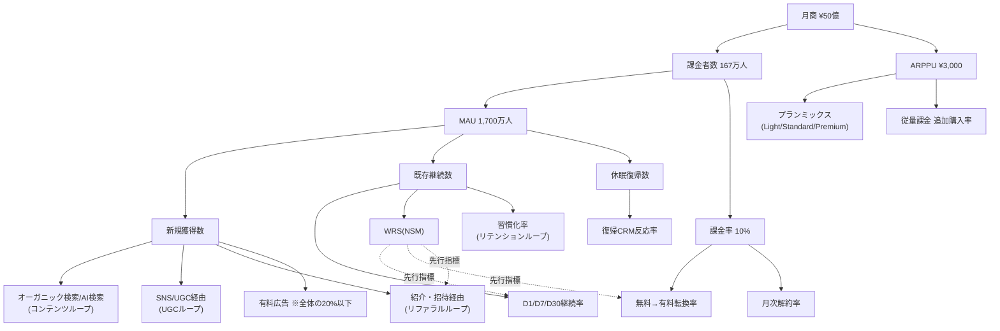

# 14. KPI Dashboard — KPI体系・計測定義・ダッシュボード設計

本ドキュメントは、月商50億円（課金者167万人 × ARPPU ¥3,000）に至る全KPIの定義・計測方法・目標値・アラート閾値と、6面構成のダッシュボード設計、計測ガバナンス、健全性ガードレールを定義する。「判定可能でなければ基準ではない」を原則とし、全指標は定義式・イベント・オーナー・閾値まで記述する。数値の正本は `00_Strategy_Spine.md` §5 である。

| 項目 | 内容 |
|---|---|
| Version | 1.0.0 |
| Status | Active |
| Last Updated | 2026-07-11 |
| Owner | Growth |

関連ドキュメント: [00_Strategy_Spine.md](./00_Strategy_Spine.md) / [15_Experiment_Backlog.md](./15_Experiment_Backlog.md) / [16_Growth_Operating_System.md](./16_Growth_Operating_System.md) / [17_Roadmap.md](./17_Roadmap.md)

---

## 1. KPIツリー — 月商50億円の全分解

### 1.1 トップライン分解（正本）

```
月商 ¥50億
├── サブスク収益（60% = ¥30億）
│    └── サブスク課金者数 × プラン別ARPPU（Light ¥980 / Standard ¥2,980 / Premium ¥9,800）
├── 従量課金収益（25% = ¥12.5億）
│    └── チケット購入者数 × 平均購入額
└── 物販・その他収益（15% = ¥7.5億）
     └── 鑑定書PDF・グッズ・提携・API

課金者 約167万人 × ブレンドARPPU ¥3,000 = 月商50億円
= MAU 約1,700万人 × 課金率10% × ARPPU ¥3,000
```

### 1.2 KPIツリー（mermaid）



### 1.3 ツリーの読み方（因果の優先順位）

| 階層 | レバー | 責任チーム | 動かす主手段 |
|---|---|---|---|
| L0 | 月商 | 事業責任者 | 全体 |
| L1 | 課金者数 / ARPPU | Growth / Pricing | 転換率・解約率・プランミックス |
| L2 | MAU / 課金率 | Growth / Product | 獲得・継続・ペイウォール |
| L3 | 新規 / 継続 / 復帰 | Growth / CRM | 4つのグロースループ |
| L4 | チャネル別新規、コホート別継続 | 各チャネルオーナー | 実験（→15_Experiment_Backlog） |

**原則**: L3以下の指標が動かない施策は、L0を語ってはならない。逆に、L4の実験は必ずL3以上のどの指標を動かすかを宣言する。

---

## 2. North Star Metric（WRS）

### 2.1 定義

> **WRS: Weekly Resonant Sessions（週次共鳴セッション数）**
> = 1週間（月曜0:00〜日曜24:00 JST）に「鑑定完了 かつ（保存 / シェア / メモ追記 / 24時間以内の再訪問のいずれか）」まで到達したセッション数

- 「開いた」ではなく「心が動いた」を計測する。共鳴行動（保存・シェア・メモ・再訪）は、鑑定結果がユーザーの感情・意思決定に作用した証拠行動である
- WRSは D30継続率・口コミ率・課金率すべての先行指標（Spine §3）

### 2.2 計測方法（判定可能な仕様）

| 項目 | 仕様 |
|---|---|
| 定義式 | `count(distinct session_id) where reading_completed = true AND (saved OR shared OR memo_added OR revisit_within_24h)` |
| 構成イベント | `reading_complete`, `result_save`, `result_share`, `memo_add`, `session_start`（再訪判定用） |
| セッション定義 | 30分無操作でセッション切断。同一鑑定への再訪は新セッションとして`revisit`フラグ付与 |
| 粒度 | 日次速報（7日移動累計）＋ 週次確定値（月曜午前に前週分確定） |
| 派生指標 | WRS/WAU（共鳴率）: WAUのうち共鳴セッションを1回以上持つUU比率 |
| オーナー | Head of Growth |
| 目標 | WRS/WAU 12ヶ月: 35% / 36ヶ月: 45%。WRS絶対数は§4のMAU計画に連動 |

### 2.3 アンチメトリクス（WRSを歪める指標 — 上がっても喜ばない）

WRSは行動ベースであるため、**「行動を機械的に誘発する施策」で偽装できる**。以下をアンチメトリクスとして併記し、WRS上昇時に必ず同時確認する。

| アンチメトリクス | 歪みのメカニズム | 監視ルール |
|---|---|---|
| 通知経由セッション比率 | 通知乱発で開封→即離脱セッションが増え、再訪判定が水増しされる | 通知経由比率が50%超 かつ 通知経由セッションの平均滞在<60秒 → WRS偽装疑いでレビュー |
| 通知オプトアウト率 | 通知乱発の直接的代償 | 週次オプトアウト率1.5%超でCRM配信量を自動減 |
| 保存ボタンの機械的タップ率 | UI誘導（モーダル強制等）で保存数だけ増える | 保存後7日以内の保存結果再閲覧率<10%なら「死に保存」とみなしWRSから除外検討 |
| 1UUあたり週次セッション数の異常値 | ヘビーユーザーの回転数でWRS総数が伸び、ユーザー数の広がりを隠す | WRS成長のUU寄与/頻度寄与を毎週分解。頻度寄与>70%が4週続けば警告 |
| 依存過多ユーザーのWRS寄与率 | §8のガードレール対象ユーザーがWRSを押し上げる | 依存過多層のWRS寄与>15%で施策レビュー |
| シェア到達なしシェアクリック | シェアボタン誤タップ・キャンセル | `share_click`と`share_complete`を分離。complete のみWRS判定に使用 |

**運用ルール**: 週次グロース定例（→16_Growth_OS §4）でWRSを報告する際、上記6指標を同一スライドに併記することを義務とする。アンチメトリクス警告中のWRS上昇は「未確定」として扱う。

---

## 3. 全KPI定義表

### 3.1 表の読み方

- **計測**: 使用ツールと主要イベント。プロダクト分析は Amplitude（正本）、広告計測は各媒体+MMP、BIは BigQuery + Looker Studio
- **粒度**: 日次=毎朝9:00確定、週次=月曜確定、月次=毎月3営業日以内確定
- **アラート閾値**: 超過/未達で当日中にオーナーがSlack `#growth-alert` に一次報告する義務が発生する値
- 12/36ヶ月目標はSpine §5と一致（Spineに無い指標は本表を正本とする）

### 3.2 アクティビティ指標

| KPI | 定義式 | 計測 | 粒度 | オーナー | 12ヶ月目標 | 36ヶ月目標 | アラート閾値 |
|---|---|---|---|---|---|---|---|
| DAU | 当日`session_start`を発火したUU | Amplitude | 日次 | Growth | 12万 | 100万 | 前週同曜日比 -15% |
| WAU | 直近7日のアクティブUU | Amplitude | 日次 | Growth | 45万 | 350万 | 前週比 -10% |
| MAU | 直近30日のアクティブUU | Amplitude | 日次 | Growth | 140万 | 830万 | 月次計画比 -10% |
| DAU/MAU比 | DAU ÷ MAU（習慣化度） | Amplitude | 週次 | Product | 15% | 20% | 12%未満が2週連続 |
| WRS | §2参照 | Amplitude | 日次/週次 | Growth | WRS/WAU 35% | 45% | 週次 -8% |
| 平均セッション時間 | セッション総時間 ÷ セッション数 | Amplitude | 週次 | Product | 6分 | 7分 | 3分未満 or 20分超（§8参照） |

### 3.3 継続・離脱指標

| KPI | 定義式 | 計測 | 粒度 | オーナー | 12ヶ月目標 | 36ヶ月目標 | アラート閾値 |
|---|---|---|---|---|---|---|---|
| D1継続率 | 登録翌日に再訪したUU ÷ 登録UU | Amplitude cohort | 日次 | Product | 45% | 55% | 38%未満が3日連続 |
| D7継続率 | 登録7日後（±0日）再訪UU ÷ 登録UU | 同上 | 週次 | Product | 25% | 35% | 20%未満が2週連続 |
| D30継続率 | 登録30日後再訪UU ÷ 登録UU | 同上 | 月次 | Product | 15% | 25% | 12%未満 |
| リテンションカーブ | 登録コホートのD0〜D90残存率曲線 | Amplitude | 週次更新 | Data | D90でD30比70%残存（平坦化） | 同左 | カーブが前月コホート比で全点悪化 |
| 週次離脱率 | 前週WAUのうち今週非アクティブ ÷ 前週WAU | BigQuery | 週次 | Growth | 25%以下 | 18%以下 | 32%超 |
| 休眠率 | MAUのうち直近14日非アクティブUU比率 | BigQuery | 週次 | CRM | 30%以下 | 22%以下 | 38%超 |
| 復帰率 | 30日以上非アクティブ→当月再訪UU ÷ 休眠UU | BigQuery | 月次 | CRM | 8% | 12% | 5%未満 |

### 3.4 収益指標

| KPI | 定義式 | 計測 | 粒度 | オーナー | 12ヶ月目標 | 36ヶ月目標 | アラート閾値 |
|---|---|---|---|---|---|---|---|
| 課金率 | 当月課金UU ÷ MAU | Stripe+BigQuery | 日次 | Growth | 6% | 9〜10% | 計画比 -15% |
| 無料→有料転換率 | 登録後30日以内に初課金したUU ÷ 登録UU（コホート） | 同上 | 月次 | Growth | 6% | 10% | 4.5%未満 |
| ARPPU | 月間総収益 ÷ 課金UU | Stripe | 月次 | Pricing | ¥3,000 | ¥3,000 | ¥2,600未満 |
| ARPU | 月間総収益 ÷ MAU | Stripe+BQ | 月次 | Pricing | ¥180 | ¥300 | 計画比 -15% |
| MRR | サブスク経常収益（プラン別内訳必須） | Stripe | 日次 | Pricing | ¥1.5億 | ¥13.5億 | 前月比マイナス |
| 月次解約率 | 当月解約サブスクUU ÷ 月初サブスクUU | Stripe | 月次 | CRM | 7% | 4% | 9%超 |
| LTV(12M) | ARPPU × 平均継続月数（12ヶ月打切り）= ¥3,000 × Σ(月次残存率, 12ヶ月) | BQモデル | 月次 | Data | ¥16,000 | ¥22,000 | 計画比 -15% |
| LTV(24M) | ARPPU × 平均継続月数（24ヶ月打切り） | BQモデル | 四半期 | Data | ¥21,000 | ¥33,000 | 同上 |
| 従量課金購入率 | 当月チケット購入UU ÷ MAU | Stripe | 月次 | Pricing | 3% | 5% | 2%未満 |

**LTV算出式の正本**: `LTV(nヶ月) = ARPPU × Σ(k=1..n) 残存率(k)`。残存率は月次解約率の実績コホートから算出（解約率7%一定なら平均継続月数≒1/0.07≒14.3ヶ月だが、12ヶ月打切りでΣ≒8.6ヶ月 → LTV12M ≒ ¥3,000×8.6 ≒ ¥25,800が理論上限。初期は低ARPPUプラン比率が高いため保守的に¥16,000を目標とする）。LTV/CAC は 12ヶ月LTV基準で 12ヶ月目標3以上、36ヶ月目標8以上（Spine §5）。

### 3.5 獲得指標

| KPI | 定義式 | 計測 | 粒度 | オーナー | 12ヶ月目標 | 36ヶ月目標 | アラート閾値 |
|---|---|---|---|---|---|---|---|
| 新規登録数 | 当日`signup_complete` UU | Amplitude | 日次 | Growth | 6,000/日 | 30,000/日 | 前週比 -20% |
| CAC（ブレンド） | 当月マーケ総費用 ÷ 当月新規登録UU | BQ | 月次 | Growth | ¥1,500以下 | ¥800以下 | ¥1,800超 |
| CAC（チャネル別） | チャネル費用 ÷ チャネル経由新規（ラストタッチ+MMP補正） | MMP+BQ | 週次 | 各チャネルオーナー | 有料広告CAC ¥3,000以下 | ¥2,000以下 | LTV12M÷CAC<3のチャネル |
| CPA（課金） | チャネル費用 ÷ チャネル経由初課金UU | MMP+BQ | 週次 | Growth | ¥25,000以下 | ¥8,000以下 | LTV12M超 |
| ROAS | チャネル経由90日収益 ÷ チャネル費用 | BQ | 月次 | Growth | 60%(90日) | 120%(90日) | 40%未満が2ヶ月 |
| 有料広告経由比率 | 有料広告経由新規 ÷ 全新規 | BQ | 月次 | Growth | 20%以下 | 15%以下 | 25%超（Spine違反） |
| 指名検索数 | ブランド名の月間検索Vol | Search Console+キーワードツール | 月次 | Brand | 5万/月 | 50万/月 | 前月比 -20% |
| AI検索言及数 | 主要AI検索（ChatGPT/Gemini/Perplexity等）の定型50クエリでの言及率 | 月次手動+APIサンプリング | 月次 | Content | 30% | 70% | 前月比 -15pt |

### 3.6 CVRファネル（訪問→課金）

ファネル定義: `visit → signup → first_reading_complete → first_payment`（各段30日以内）

| 段 | 定義式 | 12ヶ月目標 | 36ヶ月目標 | アラート閾値 | オーナー |
|---|---|---|---|---|---|
| 訪問→登録 | signup ÷ unique visit | 12% | 18% | 8%未満 | Growth(LP) |
| 登録→初回鑑定完了 | first_reading ÷ signup（24時間以内） | 75% | 85% | 65%未満 | Product |
| 初回鑑定→7日内2回目鑑定 | 2nd_reading ÷ first_reading | 45% | 55% | 35%未満 | Product |
| 初回鑑定→初課金（30日内） | first_payment ÷ first_reading | 8% | 12% | 6%未満 | Pricing |
| 通し: 訪問→課金 | first_payment ÷ visit | 0.7% | 1.8% | 0.4%未満 | Growth |

### 3.7 バイラル・紹介指標

| KPI | 定義式 | 計測 | 粒度 | オーナー | 12ヶ月目標 | 36ヶ月目標 | アラート閾値 |
|---|---|---|---|---|---|---|---|
| K-factor | 招待送信数/UU × 招待→登録CVR（30日窓） | BQ | 月次 | Growth | 0.25 | 0.45 | 0.15未満 |
| 紹介率 | 当月1人以上招待送信したUU ÷ MAU | Amplitude | 月次 | Growth | 8% | 15% | 5%未満 |
| 紹介経由新規比率 | 招待・相性リンク経由新規 ÷ 全新規 | BQ | 月次 | Growth | 25% | 45% | 18%未満 |
| 紹介数 | 当月の招待経由登録UU数 | BQ | 週次 | Growth | 計画連動 | 計画連動 | 前月比 -20% |
| SNS投稿率（UGC率） | 当月シェア完了UU ÷ MAU | Amplitude+SNS API | 月次 | Brand | 3% | 6% | 2%未満 |
| UGC数/MAU | SNS上のサービス言及投稿数 ÷ MAU | SNSリスニングツール | 月次 | Brand | 1.5% | 3% | 前月比 -30% |
| 口コミ率 | NPS調査の「実際に人に薦めた」回答率 | 四半期調査 | 四半期 | Brand | 20% | 35% | 15%未満 |
| シェア→流入CVR | シェアURL閲覧→自分も試すCVR | BQ | 週次 | Growth | 15% | 25% | 10%未満 |

### 3.8 満足・CS指標

| KPI | 定義式 | 計測 | 粒度 | オーナー | 12ヶ月目標 | 36ヶ月目標 | アラート閾値 |
|---|---|---|---|---|---|---|---|
| NPS | 推奨者% − 批判者%（四半期・n≥400） | アプリ内調査 | 四半期 | Brand | 30 | 50 | 20未満 |
| 鑑定満足度 | 鑑定直後の5段階評価の4-5比率 | アプリ内 | 週次 | Product | 70% | 80% | 60%未満 |
| CS一次応答時間 | 問い合わせ→一次応答の中央値 | ヘルプデスクツール | 週次 | CS | 4時間以内 | 1時間以内 | 12時間超 |
| CS解決率 | 7日以内クローズ ÷ 全チケット | 同上 | 週次 | CS | 90% | 95% | 80%未満 |
| 問い合わせ率 | チケット数 ÷ MAU | 同上 | 月次 | CS | 0.5%以下 | 0.3%以下 | 1%超（品質異常シグナル） |
| アプリストア評価 | 直近90日レビュー平均 | ストアコンソール | 週次 | Product | 4.4 | 4.6 | 4.2未満 |

---

## 4. ダッシュボード構成（6面）

### 4.1 全体設計原則

- 1画面 = 1つの問いに答える。「今週、事業は計画通りか？」「今日、どこかが壊れていないか？」等
- 全ダッシュボードに**計画線（目標値）とアラート閾値線**を必ず引く。実績のみのグラフは禁止
- 更新はエグゼクティブ以外すべて自動。手動集計指標はダッシュボードに載せない（月次調査系は除く）

### 4.2 ① エグゼクティブ（週次・5指標のみ）

対象: 経営会議。「5つだけ見れば事業の健康がわかる」画面。

| # | 指標 | 表示 |
|---|---|---|
| 1 | 月商（MRR+従量+物販、計画比） | 折れ線+計画線 |
| 2 | WRS/WAU（アンチメトリクス警告フラグ付き） | 折れ線+警告バッジ |
| 3 | MAU（新規/継続/復帰の積み上げ） | 積み上げ棒 |
| 4 | D30継続率（直近確定コホート） | 折れ線 |
| 5 | LTV12M/CAC（ブレンド） | 数値タイル+推移 |

### 4.3 ② グロース（日次）

対象: 日次スタンドアップ（→16_Growth_OS §3）。

- 昨日のDAU / 新規登録 / 初回鑑定完了率 / 初課金数（各: 前週同曜日比）
- WRS 7日移動累計
- ファネル4段CVR（§3.6）の7日移動平均
- チャネル別新規（オーガニック/UGC/紹介/広告、有料比率20%ラインを明示）
- アラート発火一覧（§3の閾値超過を自動リスト）

### 4.4 ③ プロダクト（機能別）

- 機能別利用率: タロット / 占星術 / 四柱推命 / 相性占い / 毎日の運勢 / メモ（各: 利用UU/DAU）
- 機能別→WRS寄与: 各機能利用者のWRS到達率
- 初回体験ファネル: 登録→質問入力→鑑定完了→保存/シェア（ステップ別離脱率）
- Aha指標: 「初回セッションで保存/シェア/メモまで到達」比率（目標: 12ヶ月 40%）
- 鑑定満足度（機能別・週次）、ストア評価

### 4.5 ④ 収益（プラン別）

- MRR分解ウォーターフォール: 新規MRR + 復帰MRR + アップグレード − ダウングレード − 解約MRR
- プラン別課金者数・MRR・月次解約率（Light/Standard/Premium）
- プランミックス推移（ARPPU ¥3,000維持の監視）
- 従量課金: チケット購入率・平均購入額・リピート購入率
- 無料→有料転換の30日コホート推移、解約理由分布（解約時アンケート）

### 4.6 ⑤ バイラル

- K-factor月次推移（=紹介率×招待あたり送信数×招待CVRの3因子分解を併記）
- シェア機能別: 結果カードシェア数 / 相性占い招待数 / Wrappedシェア数
- シェア→閲覧→登録のバイラルファネル
- UGC数/MAU、SNSリスニング（言及数・ポジネガ比率）
- 紹介経由新規比率（Spine目標25%→45%への進捗）

### 4.7 ⑥ CRM

- チャネル別（LINE/メール/プッシュ）: 配信数・開封率・クリック率・オプトアウト率
- シナリオ別成果: オンボーディング / 習慣化 / 休眠予防 / 復帰 / 解約防止（各: 目標CVRと実績）
- 通知経由セッションの質（滞在時間・WRS到達率）— §2.3アンチメトリクス監視
- 休眠率・復帰率の週次推移

---

## 5. コホート分析・セグメント分析の標準ビュー

すべてのコホートビューは「登録月 × 指標マトリクス（M0〜M12）」のヒートマップ形式を標準とする。

| ビュー | 軸 | 主要指標 | 更新 | 主な用途 |
|---|---|---|---|---|
| 登録月別コホート | 登録月 | 残存率、累積LTV、課金転換率 | 月次 | プロダクト改善の効果検証（新コホートは古いコホートより良いか？） |
| チャネル別コホート | 獲得チャネル | D1/D7/D30、LTV12M、CAC回収月数 | 月次 | チャネルポートフォリオ再配分（→16_GOS §6 四半期） |
| ペルソナ別コホート | 登録時アンケート+行動推定セグメント（03_Persona準拠: コア20-34女性/35-49女性/男性/Z世代） | 継続率、ARPPU、シェア率 | 月次 | ペルソナ別の勝ちパターン特定 |
| プラン別コホート | 初課金プラン | 解約率、アップ/ダウングレード率、LTV | 月次 | 価格・プラン改定判断 |
| 実験コホート | 実験ID | 実験主要指標+ガードレール | 実験期間中日次 | 15_Experiment_Backlogの判定 |

**標準の問い（毎月のコホートレビューで必ず答える3問）**:
1. 直近コホートのD30は、6ヶ月前コホートより改善しているか？（No なら改善施策が効いていない）
2. LTV12M/CACが3未満のチャネルはどれか？（該当チャネルは増額禁止）
3. 解約率が最も高いプラン×ペルソナの組み合わせはどこか？

---

## 6. データ品質・計測ガバナンス

### 6.1 イベント命名規約

- 形式: `対象_動詞`（スネークケース、英小文字）。例: `reading_complete`, `result_share`, `plan_upgrade`
- 必須プロパティ: `user_id`, `session_id`, `timestamp(JST)`, `platform(web/line/app)`, `feature`（占術種別）, `experiment_ids[]`
- 新規イベントは**イベント辞書（スプレッドシート正本）への登録なしに実装禁止**。辞書には定義・発火条件・オーナー・追加日を記載
- 廃止イベントは削除せず`deprecated_`プレフィックスで6ヶ月保持後に削除

### 6.2 計測漏れ・異常の検知

| 仕組み | 仕様 |
|---|---|
| イベント量監視 | 主要20イベントの日次発火数が前週同曜日比±40%を超えたら自動アラート（`#data-alert`） |
| ファネル整合性チェック | `reading_complete > result_save` 等の論理制約を日次バッチで検証。違反は当日中にData担当が調査 |
| 二重計測検知 | Amplitude と BigQuery生ログの主要指標乖離が3%超で調査 |
| リリース時チェック | 全リリースのQA項目に「主要イベント発火確認」を必須項目として含める |
| 定義変更管理 | KPI定義の変更は本ドキュメントのPRとして提出し、Growth+Dataの承認で確定。変更日はダッシュボードに注記線を引く |

### 6.3 プライバシー・同意管理

- 占い相談内容は**要配慮に準じる情報**として扱う。分析基盤には相談原文を送らず、カテゴリ化されたトピックタグのみ送出する
- 同意管理: 登録時に「サービス改善のための利用データ分析」への同意を取得。計測タグは同意ステータスに連動（同意なしユーザーは匿名集計のみ）
- 広告用データ連携（CAPI等）は明示的オプトイン者のみ。オプトアウト導線を設定画面に常設
- データ保持: 行動ログ24ヶ月、相談テキストはユーザー削除要求から30日以内に完全削除
- 未成年（16歳未満）は保護者同意なしの課金・データ分析対象化を行わない

### 6.4 データスタック（正本の所在）

| レイヤー | ツール | 役割 | 正本となる指標 |
|---|---|---|---|
| 収集 | 自社SDK+サーバサイドイベント | イベント発火（命名規約§6.1） | — |
| プロダクト分析 | Amplitude | 行動分析・ファネル・コホート | DAU/WAU/MAU、継続率、WRS、Aha率 |
| DWH | BigQuery | 生ログ統合・LTVモデル・アトリビューション | 収益系全指標、CAC、K-factor |
| 課金 | Stripe（+ストア決済） | 決済事実 | MRR、ARPPU、解約率 |
| BI | Looker Studio | 6面ダッシュボード（§4）の描画 | — |
| 実験 | 実験プラットフォーム（自社 or GrowthBook） | 割当・experiment_ids付与 | 実験判定値 |
| SNS | リスニングツール | UGC数・センチメント | UGC数/MAU |

- 同一指標が複数ツールで出る場合の正本は上表の割当に従う（例: 継続率はAmplitude、収益はBQ+Stripe）。会議で数値が食い違ったら**正本側だけを読む**

### 6.5 計測実装チェックリスト（新機能リリース時）

1. イベント辞書に新イベントを登録済みか（定義・発火条件・オーナー）
2. 必須プロパティ6点（§6.1）が全イベントに付与されているか
3. ステージング環境でAmplitude/BQ双方への到達を確認したか
4. 影響するダッシュボード面（§4）とファネル定義の更新が済んでいるか
5. 同意ステータス連動（§6.3）が新イベントにも適用されているか
6. リリース注記線をダッシュボードに追加したか

---

## 7. 目標値の期間展開（ダッシュボードの計画線）

Spine §5 と 17_Roadmap の成長カーブに基づく計画線（基本シナリオ）。詳細は [17_Roadmap.md](./17_Roadmap.md) §7。

| 時点 | MAU | 課金率 | 課金者 | ARPPU | 月商 |
|---|---|---|---|---|---|
| 3ヶ月 | 9万 | 4.0% | 3,600 | ¥2,800 | ¥0.1億 |
| 6ヶ月 | 35万 | 5.0% | 1.75万 | ¥2,900 | ¥0.5億 |
| 12ヶ月 | 140万 | 6.0% | 8.4万 | ¥3,000 | ¥2.5億 |
| 24ヶ月 | 420万 | 8.0% | 33.6万 | ¥3,000 | ¥10億 |
| 36ヶ月 | 830万 | 9.0% | 74.7万 | ¥3,000 | ¥22.4億 |
| 60ヶ月 | 1,700万 | 10.0% | 167万 | ¥3,000 | ¥50億 |

---

## 8. 健全性ガードレール指標 — 伸びても喜ばない指標

本サービスの倫理原則（Spine §9: 恐怖訴求・依存誘発をしない）を数値で監視する。**これらの指標はKGIに対して逆相関で管理する（悪化はグロース目標達成より優先して対処する）**。

| ガードレール指標 | 定義式 | 閾値と対応 | オーナー |
|---|---|---|---|
| 依存過多ユーザー率 | 1日合計3時間以上利用 or 1日15セッション以上のUU ÷ DAU | 2%超: 該当ユーザーに利用リズム提案UIを自動表示。3%超: 経営レビュー+機能側の誘因調査 | Product |
| 深夜連続利用率 | 深夜1〜5時に60分以上連続利用したUU ÷ DAU | 1.5%超で「今日はおやすみ」ナッジを強化 | Product |
| 不安系ワード増加率 | 相談トピックタグのうち不安・恐怖・強迫カテゴリ比率の前月比 | +20%超: 出力トーン監査を実施（AIが不安を増幅していないかサンプル100件レビュー） | Brand+Product |
| 同一質問反復率 | 同一トピックを24時間に5回以上鑑定するUU比率 | 1%超: 反復時に「結果は変わりません。心の整理を手伝いましょうか」と応答切替 | Product |
| 高額従量課金集中率 | 従量課金の月間¥30,000超ユーザーの収益寄与率 | 15%超: 月間購入上限（ソフトキャップ+確認画面）の導入検討 | Pricing |
| 解約防止画面の離脱強度 | 解約フロー完了までの平均ステップ数 | 3ステップ超は「ダークパターン」とみなし禁止 | CRM |
| 未成年利用シグナル | 年齢申告+行動推定による16歳未満疑い率 | 検知時は課金制限+保護者同意フロー | CS |

**運用**: ガードレール指標は②グロースダッシュボードに常設し、月次のブランド健全性レビュー（→16_GOS §5）で全件確認する。ガードレール悪化を伴う実験は、主要指標が勝っていても**棄却**する（→15_Experiment_Backlog §2）。

---

## 9. 指標診断フロー — 「どの指標が悪化したら、次にどこを見るか」

アラート発火時の一次調査を標準化する。オーナーは以下のフローに沿って調査し、`#growth-alert` への一次報告に「どの分岐だったか」を含める。

### 9.1 DAU/MAUが計画割れしたとき

```
DAU低下
├── 新規が減った？ → チャネル別新規へ
│    ├── オーガニック減 → 検索順位変動/AI検索言及/記事流入をContent確認
│    ├── 紹介減 → 招待送信率 or 招待CVRのどちらが落ちたか分解
│    ├── UGC減 → シェア完了率 or シェア→流入CVRを分解
│    └── 広告減 → 予算消化/クリエイティブ疲弊/媒体審査を確認
├── 既存が減った？ → 継続側へ
│    ├── 特定コホートだけ悪化 → 直近リリース/実験の影響を疑う（experiment_ids で切る）
│    ├── 全コホート一様に悪化 → 通知到達率（OSアップデート/LINE API変更）と障害を疑う
│    └── 特定プラットフォームだけ悪化 → アプリ審査/ストア/ブラウザ互換を疑う
└── 計測が壊れた？ → イベント量監視（§6.2）とBQ突合を最初の15分で必ず除外する
```

### 9.2 WRSが悪化したとき

1. WRS = 鑑定完了 × 共鳴行動率 に分解。どちらが落ちたか
2. 鑑定完了が落ちた → セッション開始数（=DAU問題、§9.1へ）か完了率（=プロダクト/生成品質問題）か
3. 共鳴行動率が落ちた → 保存/シェア/メモ/再訪のどの行動か → 該当機能の直近変更・満足度スコアを確認
4. 逆に**WRSが急上昇したときも同じ分解**を行い、アンチメトリクス（§2.3）6点セットで偽装を除外してから祝う

### 9.3 課金・収益が悪化したとき

```
MRR成長鈍化
├── 新規MRR減 → 転換率か新規数か（ファネル§3.6で段特定）
│    └── 転換率減 → ペイウォール到達率 × ペイウォールCVR × 決済完了率 に3分解
│         （決済完了率の低下は決済障害/カード審査の技術問題として即エスカレーション）
├── 解約MRR増 → プラン別×テニュア別（初月/2-3ヶ月/4ヶ月+）に分解
│    ├── 初月解約増 → 期待値ギャップ（直近の課金訴求変更を疑う）
│    └── 長期解約増 → 提供価値の摩耗（利用頻度低下が先行していないか）
└── ダウングレード増 → 上位プランの利用実態（Premium機能の利用率）を確認
```

### 9.4 標準の一次報告フォーマット（発火から24時間以内）

```markdown
[ALERT] 指標名 / 発火日 / 実測値 vs 閾値
分岐: §9のどの経路だったか（例: DAU減 → 既存減 → 全コホート → LINE通知到達率が62%→41%）
推定原因: 1行
対応: 実施済み/実施予定のアクションと期限
影響額: 放置した場合の週次インパクト概算（円 or UU）
```

---

## 10. アトリビューション・集計規約

チャネル別CAC/ROAS（§3.5）の集計ルールを固定し、「チャネル間の手柄の取り合い」を防ぐ。

| 項目 | 規約 |
|---|---|
| 標準モデル | ラストタッチ（クリック優先、7日クリック/1日ビュー）を正本とする。MMPの計測値と自社BQログが乖離した場合はBQを正とする |
| 紹介の優先権 | 招待リンク経由は他の全タッチに優先して「紹介」に帰属（K-factor計測の一貫性を守る） |
| オーガニック定義 | 指名検索・直接流入・非広告SNS・AI検索経由。**「不明」はオーガニックに含めない**（別枠「unattributed」で管理し、10%超で計測改善タスク化） |
| ブレンドCAC分子 | 広告費+制作費+インフルエンサー費+紹介インセンティブ原価。人件費は含めない（含めた「フルCAC」は四半期レビューでのみ参考算出） |
| 収益の帰属 | LTV/ROASのチャネル帰属は初回登録時のチャネルに固定（後の再訪チャネルで動かさない） |
| 為替・税 | 全金額は税込JPY。海外展開後は月初レートで換算し固定 |

---

## 11. 用語集（本ドキュメント群の共通言語）

| 用語 | 定義 |
|---|---|
| WRS | Weekly Resonant Sessions。§2参照。NSM |
| 共鳴行動 | 保存・シェア・メモ追記・24時間以内再訪の4行動 |
| Aha率 | 初回セッション内で共鳴行動に到達したUU比率 |
| セッション | 30分無操作で切断される利用単位 |
| コホート | 登録月（または実験割当）で束ねたユーザー群 |
| 課金者 | 当月に1円以上の支払いが発生したUU（サブスク+従量+物販） |
| ARPPU | 月間総収益 ÷ 課金者数。Spine前提¥3,000 |
| K-factor | 招待送信数/UU × 招待→登録CVR（30日窓） |
| ガードレール指標 | 実験・施策で悪化させてはならない防衛指標（§8および15_Experiment §2） |
| 準実験 | A/B統計が成立しない規模で行う前後比較+ホールドアウトまたは定性検証（15_Experiment §1.2） |
| 計画線 | §7の基本シナリオ数値。全ダッシュボードに引く目標線 |

---

## 12. 本ドキュメントの改訂ルール

- KPI定義・閾値の変更はGrowth+Dataオーナーの合意で改訂し、Versionを更新する
- 目標値（12/36ヶ月）の変更はSpine §5の改訂が先行しなければならない
- 四半期ごとに「使われていないダッシュボード面・指標」を棚卸しし、3ヶ月間意思決定に使われなかった指標は削除候補とする（→16_GOS §7「やめる」仕組み）
