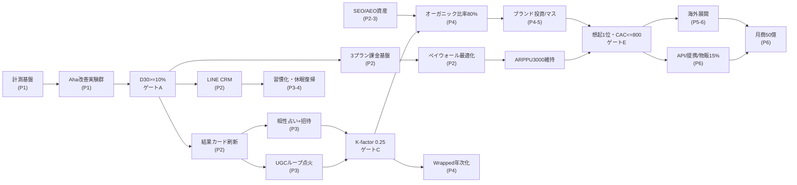

# 17. Roadmap — 3〜60ヶ月ロードマップと成長シミュレーション

本ドキュメントは、MVP稼働済みの現在から月商50億円（課金者167万人 × ARPPU ¥3,000）に至る60ヶ月の道筋を、フェーズ別の「証明すべき仮説」・主要施策・目標KPI・投資規模・撤退基準・マイルストーンゲート・成長シミュレーション（3シナリオ）・依存関係・主要リスクとして定義する。数値の正本は [00_Strategy_Spine.md](./00_Strategy_Spine.md) §4-5、指標定義は [14_KPI_Dashboard.md](./14_KPI_Dashboard.md) に従う。

| 項目 | 内容 |
|---|---|
| Version | 1.0.0 |
| Status | Active |
| Last Updated | 2026-07-11 |
| Owner | Growth |

関連ドキュメント: [00_Strategy_Spine.md](./00_Strategy_Spine.md) / [14_KPI_Dashboard.md](./14_KPI_Dashboard.md) / [15_Experiment_Backlog.md](./15_Experiment_Backlog.md) / [16_Growth_Operating_System.md](./16_Growth_Operating_System.md)

---

## 1. ロードマップ総論

### 1.1 設計思想

- ロードマップは「機能の予定表」ではなく**「仮説の証明順序」**である。各フェーズは前フェーズの証明の上にのみ成立する（リテンションなき獲得投資は穴の空いたバケツに水を注ぐ行為）
- 各フェーズには数値のマイルストーンゲート（§6）があり、**ゲートを通過するまで次フェーズの投資を解禁しない**
- 広告依存を排し（有料広告経由新規は常に20%以下）、4つのグロースループ（コンテンツ/UGC/リファラル/リテンション）を順に点火する

### 1.2 フェーズと証明すべき仮説

| Phase | 期間 | テーマ | 証明すべき仮説 | 月商目安 |
|---|---|---|---|---|
| 1 | 〜3ヶ月 | リテンション基盤 | **PMF検証**: 「不安が言語化され心が軽くなる体験」は繰り返し使われる（D30 ≥ 10%） | ¥1,000万級 |
| 2 | 〜6ヶ月 | 課金とシェアの基礎 | **リテンション証明+課金成立**: 継続するユーザーは¥3,000/月払う（転換率 ≥ 4%） | ¥5,000万級 |
| 3 | 〜12ヶ月 | バイラルループ点火 | **バイラル証明**: 共鳴体験は構造的に人を連れてくる（K-factor ≥ 0.25、紹介経由 ≥ 25%） | ¥2〜3億級 |
| 4 | 〜24ヶ月 | スケール | **収益スケール証明**: ループは規模でも壊れない（K 0.4、オーガニック比率80%、解約率 ≤ 5%） | ¥10億級 |
| 5 | 〜36ヶ月 | 国内リーダー確立 | **カテゴリリーダー証明**: ブランドが獲得コストを構造的に下げる（想起1位、CAC ≤ ¥800） | ¥20〜25億級 |
| 6 | 〜60ヶ月 | 50億円・市場拡張 | **市場拡張証明**: 体験は言語・文化・カテゴリを越える（海外+プラットフォーム収益15%） | ¥50億 |

---

## 2. Phase 1（〜3ヶ月）: リテンション基盤

| 項目 | 内容 |
|---|---|
| テーマ | Aha改善・毎日の運勢・計測基盤。「獲得より前に、留まる理由を作る」 |
| 証明する仮説 | 初回体験で共鳴（保存/シェア/メモ/再訪）したユーザーは翌週も戻る。D30 ≥ 10%を小規模ユーザー（MAU数万人）で示す |

**主要施策**

| 領域 | 施策 |
|---|---|
| プロダクト | Aha率改善（初回60秒で結果、保存促し、「今日の一歩」出力: EXP-Q1-01〜05）/ 毎日の運勢+翌朝通知予約（ACT-03）/ 鑑定履歴・メモ |
| グロース | 計測基盤の完成（イベント辞書・Amplitude・BigQuery・実験プラットフォーム: 14_KPI §6が動く状態）/ 実験OS稼働（月4本判定: 16_GOS §1.2）|
| ブランド | トーン&マナー確定（脅さない・寄り添う）、出力品質ガイドラインv1、結果カードの言葉の磨き込み |
| 組織 | 3人体制（PM+グロース+コンテンツ: 16_GOS §2.1）。日次/週次リズムの定着 |

**目標KPI（3ヶ月末）**: MAU 9万 / 課金者 3,600（課金率4.0%）/ 月商 ¥1,000万 / D1 40% / D7 20% / D30 10% / K-factor 計測開始（〜0.1）

**投資規模感**: 月¥500〜800万（人件費3人+LLMコスト+ツール。広告はテスト予算月¥100万以下）

**リスクと撤退基準**: 3ヶ月時点でD30 < 7%（複数回の初回体験改善実験後も）なら、獲得を止めてPMF再定義（ターゲット・提供体験のピボット検討: §6）。

---

## 3. Phase 2（〜6ヶ月）: 課金とシェアの基礎

| 項目 | 内容 |
|---|---|
| テーマ | プラン確立・結果カード・LINE CRM。「留まる人が払う仕組みと、語りたくなる出力」 |
| 証明する仮説 | (a) 3プラン（Light ¥980/Standard ¥2,980/Premium ¥9,800）で無料→有料転換 ≥ 4%、初月以降の月次解約率 ≤ 9%。(b) 結果カードはシェアされる（シェア完了率 ≥ 4%） |

**主要施策**

| 領域 | 施策 |
|---|---|
| プロダクト | 3プラン+従量チケットの課金基盤 / ペイウォール最適化（REV-01/02/09）/ 結果カード刷新（REF-01/03/05）|
| グロース | LINE公式アカウント基盤とCRMシナリオ5本（オンボ/習慣化/休眠予防/復帰/解約防止: 11_CRM準拠）/ SEO記事の量産開始（コンテンツループの種まき）|
| ブランド | ブランド名・ビジュアルアイデンティティ確定（09_Brand）。カードにブランドが乗る状態 |
| 組織 | 5〜6人へ（CRM・データの専任化開始） |

**目標KPI（6ヶ月末）**: MAU 35万 / 課金者 1.75万（5.0%）/ 月商 ¥5,000万 / D30 12% / 月次解約率 9%以下 / SNS投稿率 1.5% / LINE連携率 40%

**投資規模感**: 月¥1,500〜2,500万（累計投資 〜¥1億。広告比率20%以下維持）

**リスクと撤退基準**: 転換率が2ヶ月連続 < 3%なら価格体系を再設計（プラン数・価格点・ペイウォール位置の全面見直し）。解約率 > 12%なら新規課金促進を止め解約要因を先に潰す。

---

## 4. Phase 3（〜12ヶ月）: バイラルループ点火

| 項目 | 内容 |
|---|---|
| テーマ | 相性占い・招待・Wrapped初回・SEO資産。「1人のユーザーが次のユーザーを連れてくる」 |
| 証明する仮説 | 関係性占い（相性・友達）は構造的に他者を巻き込み、K-factor 0.25・紹介経由新規比率25%を成立させる（Spine §5・§6-3） |

**主要施策**

| 領域 | 施策 |
|---|---|
| プロダクト | 相性占い+相手招待フロー（REF-02）/ 招待インセンティブ（REF-04）/ ギフト鑑定（REF-07）/ 年末Wrapped初回（REF-10） |
| グロース | SEO/AEO/LLMO資産の本格化（13準拠: 悩み×占術の構造化コンテンツ群、AI検索言及率30%）/ ショート動画のオーガニック運用（ACQ-11）/ 実験月8本体制 |
| ブランド | UGCの二次活用（許諾を得た投稿の公式紹介）、PR（「脅さない占い」ポジションの言語化発信） |
| 組織 | 10〜15人（Phase 2組織図: 16_GOS §2.1）。OKR運用の本格化 |

**目標KPI（12ヶ月末・Spine §5の12ヶ月目標と一致）**: MAU 140万 / 課金者 8.4万（6.0%）/ 月商 ¥2.5億 / D1 45% / D7 25% / D30 15% / K-factor 0.25 / 紹介経由比率 25% / 転換率 6% / 解約率 7% / NPS 30 / CAC ¥1,500以下 / LTV/CAC 3以上 / SNS投稿率 3%

**投資規模感**: 月¥4,000〜6,000万（累計 〜¥4億。LLMコストがMAU比例で増加、原価率の監視開始）

**リスクと撤退基準**: 12ヶ月時点でK-factor < 0.15なら、バイラルを主エンジンとする前提を修正し、コンテンツループ（SEO/AEO）比重を高めた成長モデルに切り替え（成長速度目標を下方修正してでも広告依存には戻らない）。

---

## 5. Phase 4〜6（13〜60ヶ月）: スケール → リーダー確立 → 50億円

### 5.1 Phase 4（〜24ヶ月）: スケール

| 項目 | 内容 |
|---|---|
| テーマ | ループの産業化と組織化。「仕組みで成長する会社になる」 |
| 証明する仮説 | K-factor 0.4・オーガニック比率80%が月商10億円規模でも維持できる（規模とともにCACが下がる構造の証明） |
| 主要施策 | プロダクト: 習慣化の深化（ストリーク/週次ダイジェスト）、パーソナライズ精度（鑑定履歴の文脈活用）、アプリ体験の完成度 / グロース: チャネルポートフォリオの科学化（コホートLTV/CAC駆動の再配分）、Wrapped年次イベント化 / ブランド: TVCM等マス投資の是非をLTV/CACで判定（指名検索の伸びで効果測定）/ 組織: 6チーム体制へ移行（16_GOS §2.1 Phase 3）、実験月16本 |
| 目標KPI（24ヶ月末） | MAU 420万 / 課金者 33.6万（8.0%）/ 月商 ¥10億 / D30 20% / K-factor 0.4 / オーガニック比率（非有料広告）80%以上 / 解約率 5% / NPS 40 |
| 投資規模感 | 月¥1.5〜2.5億（累計 〜¥15億。この期から営業利益の黒字化を必須条件とする） |
| リスクと撤退基準 | 月商5億到達後に解約率 > 7%へ逆行したら、新規獲得投資を30%削り継続改善へ再配分。オーガニック比率 < 70%が2四半期続けば広告を機械的に減額（Spine §2の構造原則を優先） |

### 5.2 Phase 5（〜36ヶ月）: 国内リーダー確立

| 項目 | 内容 |
|---|---|
| テーマ | ブランド想起1位・多言語準備。「『AI占いといえば』の座を取る」 |
| 証明する仮説 | カテゴリ想起1位はCACを構造的に下げる（指名検索・AI検索言及がトップとなり、CAC ≤ ¥800、LTV/CAC ≥ 8） |
| 主要施策 | プロダクト: 意思決定支援の深化（人生イベント別の伴走: 転職・結婚・引越）、物販・鑑定書PDFの商品ライン確立（収益15%構成へ）/ グロース: AI検索（LLMO）言及率70%、休眠復帰の産業化（復帰率12%）/ ブランド: 年次ブランド調査で想起1位確認、健全利用スタンスの社会発信（依存批判への構造的耐性: 16_GOS §8.3）/ 組織・海外: 多言語版（繁体字圏を第1市場とする）の翻訳ではなく「文化ローカライズ」の設計・小規模βを開始 |
| 目標KPI（36ヶ月末・Spine §5の36ヶ月目標と一致） | MAU 830万 / 課金者 74.7万（9.0%）/ 月商 ¥22.4億 / D1 55% / D7 35% / D30 25% / K-factor 0.45 / 紹介経由比率 45% / 転換率 10% / 解約率 4% / NPS 50 / CAC ¥800以下 / LTV/CAC 8以上 / SNS投稿率 6% |
| 投資規模感 | 月¥3〜4億（うち海外準備は上限月¥3,000万の実験予算として隔離） |
| リスクと撤退基準 | 国内MAU成長が2四半期連続で計画比 -20%（TAM上限接近のシグナル: Spine §4）なら海外展開を前倒し。海外βのD30 < 国内比60%なら市場を変更して再β（最大2市場まで） |

### 5.3 Phase 6（〜60ヶ月）: 月商50億円・市場拡張

| 項目 | 内容 |
|---|---|
| テーマ | 海外展開・プラットフォーム化・「意思決定と感情のパートナー」への拡張 |
| 証明する仮説 | (a) 海外市場（繁体字圏→東南アジア→英語圏）で国内の継続率水準が再現できる。(b) API/提携/物販のプラットフォーム収益が全体の15%を構成できる（Spine §4収益分解の完成） |
| 主要施策 | 海外: 36ヶ月βの勝ち市場へ本格展開（現地パートナー+現地文化の占術統合）/ プラットフォーム: 鑑定API（メディア・アプリ提携）、キャラクター/グッズ物販、法人提携（ウェルネス・HR領域は倫理審査必須）/ プロダクト拡張: 占いを入口とした「意思決定と感情のパートナー」へ（日記×星回り、迷いの整理セッション、ライフイベント伴走）。※拡張は占いのコア体験のWRSを毀損しない範囲で段階導入 |
| 目標KPI（60ヶ月末） | MAU 1,700万（うち海外500万）/ 課金者 167万（10.0%）/ ARPPU ¥3,000 / **月商 ¥50億**（サブスク60%・従量25%・物販その他15%）/ 解約率 3.5% / NPS 55 |
| 投資規模感 | 月¥6〜8億（海外・提携含む。国内事業単体の営業利益で全社投資を賄う構造） |
| リスクと撤退基準 | 海外2市場で18ヶ月投資してもLTV/CAC < 2なら海外は縮小し、国内ARPPU深化（プレミアム化・物販）で50億円の代替パスへ切替（§6ゲートF代替パス） |

---

## 6. マイルストーンゲート（フェーズ移行の判定条件）

各ゲートは四半期オフサイト（16_GOS §6.1）で判定する。**判定は数値で機械的に**行い、未達時は「延長（最大1四半期）→ピボット」の順で対応する。

| ゲート | 移行 | 通過条件（すべて満たす） | 未達時のピボット選択肢 |
|---|---|---|---|
| A | P1→P2 | D30 ≥ 10% かつ 初回Aha率 ≥ 40% かつ 計測基盤稼働（記録率100%） | ①ターゲット変更（コアペルソナの再定義）②コア体験変更（対話型→毎日の運勢中心 等の主役交代）③初回体験の全面再設計。3ヶ月以内に再判定 |
| B | P2→P3 | 転換率 ≥ 4% かつ 解約率 ≤ 9% かつ シェア完了率 ≥ 4% かつ 月商 ≥ ¥4,000万 | ①価格体系再設計 ②課金価値の再定義（深掘り鑑定の品質投資）③シェアが弱い場合はカードでなく「招待型」（相性）を前倒し |
| C | P3→P4 | K-factor ≥ 0.25 かつ 紹介経由比率 ≥ 25% かつ 月商 ≥ ¥2億 かつ LTV/CAC ≥ 3 | ①コンテンツループ主導モデルへ切替（SEO/AEO投資2倍、成長目標-30%）②相性占いの体験再設計 ③この時点で広告比率を上げる誘惑は**拒否**（Spine §2） |
| D | P4→P5 | 月商 ≥ ¥8億 かつ K ≥ 0.35 かつ オーガニック比率 ≥ 75% かつ 営業黒字 | ①黒字未達なら成長投資を減速し単月黒字を先に確保 ②K未達ならマス投資凍結（ブランド投資はバイラル成立後のブースター、の順序を守る） |
| E | P5→P6 | 月商 ≥ ¥18億 かつ 想起調査トップ2 かつ CAC ≤ ¥1,000 かつ 海外β1市場でD30 ≥ 国内比60% | ①海外前倒し（国内TAM上限時）②海外β不調なら市場変更 ③国内深化パス（下記F）準備 |
| F | 50億到達 | 月商 ¥50億 = 課金者167万 × ARPPU ¥3,000（±: 課金者140万×ARPPU¥3,600等の等価な組合せは可） | 海外不調時の代替パス: 国内MAU 1,100万 × 課金率11% × ARPPU ¥4,100（プレミアム化+物販強化）で¥50億の別解を四半期でシミュレーション維持 |

---

## 7. 成長シミュレーション表（3シナリオ）

前提: ARPPUは全シナリオ¥3,000へ収斂（初期はLight比率が高く¥2,800前後）。課金率は転換率改善・機能拡充で漸増。**基本シナリオが計画線（14_KPI §7と一致）**。保守=基本の約0.6倍成長、強気=約1.4倍成長+課金率上振れ。

### 7.1 月次（〜12ヶ月・基本シナリオ）

| 月 | MAU | 課金率 | 課金者 | ARPPU | 月商 | 主要イベント |
|---|---|---|---|---|---|---|
| 1 | 3万 | 3.0% | 900 | ¥2,700 | ¥240万 | 計測基盤稼働 |
| 2 | 6万 | 3.5% | 2,100 | ¥2,750 | ¥580万 | Aha実験群judged |
| 3 | 9万 | 4.0% | 3,600 | ¥2,800 | ¥1,000万 | **ゲートA判定** |
| 4 | 14万 | 4.3% | 6,000 | ¥2,850 | ¥1,700万 | 3プラン正式化 |
| 5 | 23万 | 4.6% | 10,600 | ¥2,900 | ¥3,100万 | LINE CRM 5シナリオ |
| 6 | 35万 | 5.0% | 17,500 | ¥2,900 | ¥5,100万 | **ゲートB判定**・カード刷新 |
| 7 | 48万 | 5.2% | 25,000 | ¥2,950 | ¥7,400万 | 相性占いβ |
| 8 | 62万 | 5.4% | 33,500 | ¥2,950 | ¥9,900万 | 招待フロー本番 |
| 9 | 78万 | 5.6% | 43,700 | ¥3,000 | ¥1.3億 | SEO流入が最大チャネル化 |
| 10 | 96万 | 5.8% | 55,700 | ¥3,000 | ¥1.7億 | ショート動画本格化 |
| 11 | 117万 | 5.9% | 69,000 | ¥3,000 | ¥2.1億 | Wrapped初回（12月想定） |
| 12 | 140万 | 6.0% | 84,000 | ¥3,000 | ¥2.5億 | **ゲートC判定** |

### 7.2 四半期（13〜60ヶ月・3シナリオの月商、期末月次値）

| 時点 | 保守: MAU/課金率/月商 | 基本: MAU/課金率/月商 | 強気: MAU/課金率/月商 |
|---|---|---|---|
| 15ヶ月 | 120万 / 5.5% / ¥2.0億 | 190万 / 6.5% / ¥3.7億 | 260万 / 7.0% / ¥5.5億 |
| 18ヶ月 | 150万 / 6.0% / ¥2.7億 | 250万 / 7.0% / ¥5.3億 | 370万 / 7.5% / ¥8.3億 |
| 21ヶ月 | 180万 / 6.2% / ¥3.3億 | 330万 / 7.5% / ¥7.4億 | 500万 / 8.0% / ¥12.0億 |
| 24ヶ月 | 210万 / 6.5% / ¥4.1億 | **420万 / 8.0% / ¥10.1億** | 640万 / 8.5% / ¥16.3億 |
| 30ヶ月 | 280万 / 7.0% / ¥5.9億 | 610万 / 8.5% / ¥15.6億 | 900万 / 9.0% / ¥24.3億 |
| 36ヶ月 | 350万 / 7.5% / ¥7.9億 | **830万 / 9.0% / ¥22.4億** | 1,150万 / 9.5% / ¥32.8億 |
| 42ヶ月 | 430万 / 8.0% / ¥10.3億 | 1,020万 / 9.3% / ¥28.5億 | 1,350万 / 10.0% / ¥40.5億 |
| 48ヶ月 | 520万 / 8.5% / ¥13.3億 | 1,230万 / 9.5% / ¥35.1億 | 1,550万 / 10.0% / ¥46.5億 |
| 54ヶ月 | 620万 / 9.0% / ¥16.7億 | 1,460万 / 9.8% / ¥42.9億 | 1,700万 / 10.3% / ¥52.5億 |
| 60ヶ月 | 730万 / 9.5% / ¥20.8億 | **1,700万 / 10.0% / ¥50.1億** | 1,800万 / 10.5% / ¥56.7億 |

- 保守シナリオは60ヶ月で¥20億強にとどまる。**保守線に2四半期連続で近づいた場合、ゲート未達と同じ扱いでピボット審査を発動する**（50億は基本線でのみ成立する）
- 強気シナリオはWrapped/相性のバイラル上振れ（K 0.5超）+海外前倒しを想定。強気で推移した場合はLLMコスト・CS・信頼性投資を先行増強する（成長がOSを壊すのを防ぐ）
- 前提監査: 各四半期オフサイトで「課金率・ARPPU・チャーンの実績」でシミュレーション表を再計算し、本表を改訂する（静的な計画表にしない）

### 7.3 感度分析（基本シナリオ・36ヶ月時点）

| 変数の変化 | 月商インパクト |
|---|---|
| 解約率 4%→6% | 課金者残存の悪化で月商 約-18%（¥22.4億→¥18.4億） |
| K-factor 0.45→0.30 | 新規の紹介分が減り MAU -15%、月商 約-15% |
| ARPPU ¥3,000→¥2,700（Light偏重） | 月商 -10%。プランミックス監視（14_KPI ④収益面）が防衛線 |
| 転換率 10%→8% | 月商 約-20%。最も感度が高い変数であり、課金体験実験（REV系）を常時1本走らせる根拠 |

---

## 8. 依存関係マップ（どの施策がどの施策の前提か）

**読み方（順序の絶対則）**:
1. 計測基盤 → すべての実験（測れないものは改善できない）
2. リテンション（ゲートA）→ 課金・CRM・シェア（留まらないユーザーに課金も紹介も設計できない）
3. シェアされる出力（カード）→ UGC/リファラルループ（Spine §7-3: シェアは出力の美しさから生まれる）
4. バイラル成立（ゲートC）→ マス・ブランド投資（バイラルの増幅器として使う。先に打つと燃焼効率が悪い）
5. 国内ブランド確立（ゲートE）→ 海外・プラットフォーム化（国内の勝ちパターンが輸出の元手）

---

## 9. 主要リスク10と対応

| # | リスク | 発生シグナル（監視指標） | 予防策 | 発生時対応 |
|---|---|---|---|---|
| 1 | LLMコスト高騰/原価率悪化 | 鑑定1回あたり原価の月次推移、粗利率<70% | モデルの階層化（無料=軽量モデル/有料=高性能）、キャッシュ・要約再利用、複数ベンダー互換の抽象層 | 無料枠の回数・文長調整。値上げは最終手段（既存者は据置） |
| 2 | 規制（景表法・特商法・消費者保護、占い商法批判の制度化） | 業界への行政指導ニュース、CS苦情の種別変化 | 断定的効能表現の禁止（出力ガイドライン）、価格・解約の透明性、法務レビューの月次化 | 該当表現の全面改修+外部専門家監修の公表 |
| 3 | 競合大手参入（LINE・大手アプリ・海外AI占い） | 競合のストア順位・広告出稿量・指名検索の相対推移 | 参入で消えない資産に集中: 鑑定履歴の文脈資産（スイッチングコスト）、ブランド倫理ポジション、リファラル網 | 機能追随はしない。継続率とWRSの差で守る（同質化競争を拒否） |
| 4 | プラットフォーム規約（App Store/Google Play手数料・占いカテゴリ審査、LINE API変更） | 規約改定の告知、審査リジェクト | Web課金導線の常時維持（アプリ依存度を収益の50%以下に）、LINE以外のCRMチャネル（メール/プッシュ）併走 | 影響チャネルの収益を90日でWebへ移送するプレイブック起動 |
| 5 | 依存批判・社会的炎上 | ガードレール指標（14_KPI §8）、メディア論調 | 健全利用機能を先回り実装し公開（Spine §9を製品で証明）、16_GOS §8.3プレイブック | データ自己診断→事実なら即是正をロードマップ最優先に割込み |
| 6 | 誤鑑定・有害出力事故 | 出力監査サンプリング、通報率 | 禁止事項リスト+自動フィルタ+週次監査、医療/法律/投資は必ず専門家案内へ誘導する出力規則 | 16_GOS §8.2（機能一時停止を含む） |
| 7 | データ漏洩（相談内容=センシティブ） | セキュリティ監査、異常アクセス検知 | 相談原文の分析基盤非送出（14_KPI §6.3）、暗号化・アクセス最小権限、年次外部診断 | 16_GOS §8.4特則（当局報告フロー） |
| 8 | バイラル不発（K-factorが構造的に伸びない） | ゲートC未達、招待CVRの停滞 | REF系実験の多重仮説（カード/招待/ギフト/診断の4型）、Wrappedの季節資産化 | コンテンツループ主導モデルへ計画切替（ゲートC選択肢①） |
| 9 | 採用・組織化の失敗（OSがスケールしない） | 実験スループット停滞、意思決定率低下（16_GOS §1.2） | フェーズ先行の採用計画（§5）、プレイブック・オンボ資料の更新義務（16_GOS §9.1） | 成長目標を組織能力に合わせ一時減速（OS崩壊させて走らない） |
| 10 | 占いブーム退潮・季節変動 | 市場検索Volのトレンド、業界アプリDAU総量 | 「占い」から「意思決定と感情のパートナー」への価値軸拡張（P6）、年中行事（正月・誕生日・Wrapped）の需要平準化 | 拡張ユースケース（日記・迷い整理）の前倒しでカテゴリ依存を低減 |

---

## 10. 本ドキュメントの運用

- 四半期オフサイト（16_GOS §6.1）でゲート判定・シミュレーション再計算・リスク表の見直しを行い、改訂ごとにVersionを更新する
- フェーズ目標値の変更はSpine §5の改訂が先行する（Spine冒頭規約）
- 月次では動かさない。日次・週次の変動でロードマップを書き換えないこと（短期の反応は15_Experiment・16_GOSのリズムで吸収する）
