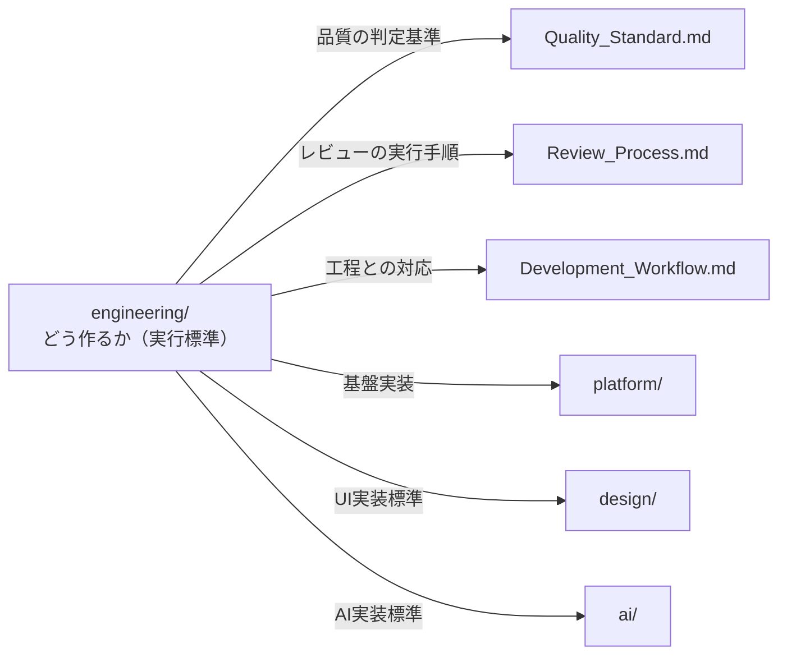
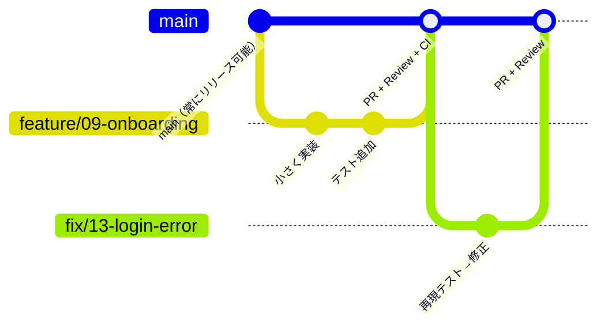

# Engineering & Review Package — Engineering Operating System

> **AI Development Operating System — 全サービス共通エンジニアリング基盤**
>
> **Mission: 世界トップレベルのEngineering Organizationの実行標準を、誰が（どのAIが・どの人間が）書いても再現できる形で明文化する。**
>
> [`Quality_Standard.md`](../00_System/Quality_Standard.md) が「何をもって合格か」、[`Review_Process.md`](../00_System/Review_Process.md) が「誰がどうレビューするか」を定義するのに対し、本Packageは「**どう作るか**」— 13のEngineering Domainの実行標準・Git運用・DoR/DoD・統合Reviewカタログ — を定義する。

| 項目 | 内容 |
|---|---|
| **Version** | 1.0.0 |
| **Status** | Active |
| **Last Updated** | 2026-07-09 |
| **関連ドキュメント** | [`Quality_Standard.md`](../00_System/Quality_Standard.md) / [`Review_Process.md`](../00_System/Review_Process.md) / [`Development_Workflow.md`](../00_System/Development_Workflow.md)（Phase 08-15） / [`platform/README.md`](../platform/README.md) / [`design/README.md`](../design/README.md) / [`ai/README.md`](../ai/README.md) |

---

## 目次

1. [設計思想](#設計思想)
2. [Engineering Domains（13領域の実行標準）](#01-frontend)
3. [Git & Delivery Standard](#git--delivery-standard)
   - Git Flow / Branch Strategy / Commit Convention / Pull Request Rules
4. [Definition of Ready / Definition of Done](#definition-of-ready--definition-of-done)
5. [統合Review System（12 Review Catalog）](#統合review-system12-review-catalog)
6. [Review Checklist（共通）](#review-checklist共通)
7. [Quality Gate](#quality-gate)
8. [Deliverables](#deliverables)
9. [Version Management](#version-management)

---

## 設計思想

### 5原則

1. **Boring Technology, Exciting Product** — 実績ある退屈な技術で作り、冒険はプロダクト価値でする。新技術の採用は「解決する課題」を先に言えるときのみ。
2. **小さく作り、常に出せる状態を保つ** — mainは常にリリース可能。大きな変更はフラグの裏で小さくマージし続ける（長命ブランチは負債）。
3. **自動化できる検査を人間にやらせない** — Lint・型・テスト・脆弱性・フォーマットはCIが落とす。人間とAgentのレビューは設計判断と文脈にだけ使う。
4. **読む時間 > 書く時間** — コードは書く時間の10倍読まれる。可読性・一貫性・ドキュメントは速度の敵ではなく速度そのもの。
5. **すべての標準に「なぜ」を残す** — ルールには理由を併記する。理由が消えたルールはカーゴカルトとして四半期レビューで削除する。

### 本Packageと既存正本の関係



**重複禁止ルール**: 判定基準はQuality_Standard、レビュー手順はReview_Processを正本とし、本Packageは参照する。同じルールを二重に書かない。

---

# Engineering Domains（13領域の実行標準）

## 01 Frontend

| 項目 | 標準 |
|---|---|
| スタック | Next.js（App Router）+ TypeScript strict（[`platform/`](../platform/README.md) デフォルトスタック準拠） |
| 実装順序 | デザイントークン → 共通コンポーネント → 画面（[`design/`](../design/README.md) と同一。画面から作らない） |
| 状態管理 | サーバー状態とUI状態を分離（サーバー状態はデータ取得ライブラリに任せ、グローバルストアを最小化） |
| スタイル | トークン参照のみ（生値禁止・Design Lintで機械検査） |
| 必須品質 | 全状態実装（loading/error/empty）・コンソールエラーゼロ・キーボード完遂・Code ConnectでFigmaと対応 |
| 禁止 | `any`の濫用 / useEffectでのデータ取得の手書き乱用 / 一点物コンポーネント（理由記録なし） |

## 02 Backend

| 項目 | 標準 |
|---|---|
| 設計 | 仕様駆動（API仕様書を実装より先に更新）・データモデルファースト |
| 層構造 | ルーティング / ビジネスロジック / データアクセスの3層分離。ロジックをルートハンドラに書かない |
| エラー | 統一エラーフォーマット・握りつぶし禁止・リトライ可否を呼び出し側が判断できる形式 |
| 必須品質 | 全エンドポイントに認証・認可・バリデーション / 構造化ログ＋相関ID / マイグレーションで環境再現 |
| 非同期 | 重い処理・外部通知はキュー化（リクエストパスをブロックしない） |

## 03 Architecture

| 項目 | 標準 |
|---|---|
| 出発点 | **モジュラーモノリスから始める**。マイクロサービスは組織とスケールの課題が実測されてから |
| 依存方向 | ドメインロジックは外側（フレームワーク・DB・外部API）に依存しない。外部依存はPort/Adapter（[`platform/`](../platform/README.md) と同一原則） |
| 決定記録 | 重要な設計判断はADR（Architecture Decision Record）として残す: 背景/選択肢/決定/結果。`architecture/adr/` に連番保存 |
| 変更容易性 | 「半年後にこの決定を覆すコストはいくらか」を設計レビューの標準質問とする |

## 04 Database

| 項目 | 標準 |
|---|---|
| 既定 | PostgreSQL。特殊要件（全文検索・時系列・グラフ）もまずPostgres拡張で検討してから専用DBへ |
| 設計 | 正規化を基本とし、非正規化は計測に基づく明示的判断として記録 / 外部キー制約・NOT NULL・CHECKをDBレベルで強制（アプリだけに任せない） |
| マイグレーション | 前方互換（expand → migrate → contract）・ロールバック手順付き・レビュー必須 |
| 性能 | インデックスは実行計画で検証 / N+1はCIまたはレビューで検出 / スロークエリログ常時有効 |
| 台帳 | 金銭・残高・監査対象は追記型台帳（UPDATE禁止 — [`platform/ 02 Payment`](../platform/README.md) と同一原則） |

## 05 API

| 項目 | 標準 |
|---|---|
| スタイル | RESTを既定（リソース指向・複数形名詞・適切なHTTPメソッド/ステータス）。GraphQL/tRPCは要件が正当化する場合のみ |
| バージョニング | 破壊的変更はバージョンを上げる（`/v1/`）。既存クライアントを黙って壊さない |
| スキーマ | OpenAPI等のスキーマ定義から型を生成（フロント・バックの型を一致させる。手書きの二重定義禁止） |
| ページネーション | カーソル方式を既定（オフセットは小規模のみ） |
| レート制限・冪等 | 全公開APIにRate Limit / 副作用系エンドポイントは冪等キー対応 |

## 06 CI/CD

| 項目 | 標準 |
|---|---|
| パイプライン | lint → 型 → ユニットテスト → ビルド → 結合/E2E → デプロイ の標準順序（GitHub Actions） |
| 速度 | CI全体10分以内を維持（超えたら並列化・キャッシュ・テスト分割で改善する。遅いCIは品質検査のスキップを誘発する） |
| ブロック条件 | いずれかの失敗でマージ不可。「あとで直す」での赤マージ禁止 |
| デプロイ | mainマージ→自動デプロイ / PR→Preview環境自動生成 / ロールバックは1操作（[`platform/ 11 Deployment`](../platform/README.md)） |
| Secret | CIのSecretは環境ごとに分離・ログへの漏洩をマスキングで防止 |

## 07 Docker

| 項目 | 標準 |
|---|---|
| ビルド | マルチステージビルド必須（ビルド環境を本番イメージに含めない）・イメージは最小ベース（distroless/alpine系） |
| 再現性 | バージョンタグ固定（`latest`禁止）・lockファイルからの決定的ビルド |
| セキュリティ | 非rootユーザー実行・イメージ脆弱性スキャンをCIに組み込み・Secretをイメージに焼き込まない |
| 開発環境 | `docker compose up` で全依存（DB・キュー等）が一発起動する状態を維持 |

## 08 Testing

| 項目 | 標準 |
|---|---|
| 配分 | テストピラミッド: ユニット（多・速）> 結合 > E2E（少・主要フローのみ）。逆ピラミッドは保守不能 |
| 対象 | テストは「振る舞い」に書く（実装詳細への密結合はリファクタを殺す） |
| 必須 | 変更にはテストが伴う / 異常系・境界値 ≧ 正常系 / バグ修正はまず再現テストを書いてから直す |
| E2E | 主要ユーザーフロー（オンボーディング・コア機能・課金）のみ。フレーキーテストは即隔離・修理（放置=削除） |
| AI機能 | 評価セットによる回帰評価をCIに統合（[`ai/ — AI Testing`](../ai/README.md)） |
| 詳細基準 | [`Quality_Standard.md — 06 Testing Quality`](../00_System/Quality_Standard.md) を判定の正とする |

## 09 Performance

| 項目 | 標準 |
|---|---|
| 予算 | パフォーマンスバジェットを最初に決める（CWV目標・バンドルサイズ上限・API p95）。予算超過はCIで警告 |
| 計測 | 実機・実回線・フィールドデータ（RUM）が正。ローカル計測で判断しない |
| 改善 | 計測→特定→1改善→再計測（推測での最適化・過剰最適化の禁止） |
| 数値基準 | [`Quality_Standard.md — Quality Numbers`](../00_System/Quality_Standard.md)（LCP≦2.5s / INP≦200ms / CLS≦0.1 / API p95≦500ms） |

## 10 Security

| 項目 | 標準 |
|---|---|
| 原則 | Secure by Default・最小権限・多層防御（[`platform/ 10 Security`](../platform/README.md) をコード実装の正とする） |
| 実装 | 入力バリデーション（スキーマベース）・出力エスケープ・パラメータ化クエリ・CSRF/CSPの標準適用 |
| 依存 | Dependabot等での脆弱性自動検出・Critical/Highは即時対応 |
| Secret | リポジトリ・クライアント・ログに置かない三原則 / pre-commitのシークレットスキャン |
| AI固有 | 指示とデータの分離・ツール実行の権限制御（[`ai/ — AI Safety`](../ai/README.md)） |

## 11 Infrastructure

| 項目 | 標準 |
|---|---|
| IaC | インフラはコードで管理（コンソール手作業の変更禁止。緊急対応は事後コード化） |
| 環境 | dev / staging / prod の3環境・データと鍵の完全分離・stagingは本番同等構成 |
| 観測 | 構造化ログ・メトリクス・アラート＋Runbookを標準装備（[`platform/ 07 Monitoring`](../platform/README.md)） |
| 復旧 | バックアップは「リストア演習済み」のみ有効とみなす / 障害対応後は非難なしのポストモーテム→再発防止を標準・チェックリストへ還元 |
| コスト | 月次でコストレビュー・異常増加のアラート設定 |

## 12 Code Quality

| 項目 | 標準 |
|---|---|
| 機械強制 | Formatter（議論禁止・自動適用）・Linter・型チェックstrict・循環依存検出をCIで強制 |
| 命名 | 意図を表す名前 > 短い名前。省略形は一般的なもののみ |
| 関数・ファイル | 1関数1責務 / ファイルは1トピック（巨大化したら分割） |
| コメント | 「なぜ」のみ書く（「何を」は命名で表現）。TODOは期限とIssue番号付きのみ許可 |
| 重複 | 3回目の重複でヘルパー化を検討（早すぎる抽象化は重複より高くつく — AHA原則） |
| レビュー容易性 | 400行を超えるPRは分割を要求できる |

## 13 Documentation

| 項目 | 標準 |
|---|---|
| 必須セット | README（起動手順が新規参加者で再現できる）/ API仕様（実装と同期）/ ADR / Runbook / CHANGELOG |
| 同期 | コード変更でドキュメントが古くなるPRは、同一PRでドキュメントも更新する（別PR送りは腐敗の始まり） |
| 品質 | [`Quality_Standard.md — 1 Documentation`](../00_System/Quality_Standard.md) 共通5基準に準拠 |
| 図 | 構成図・フロー図はMermaid（テキスト管理・差分レビュー可能）を既定とする |

---

# Git & Delivery Standard

## Git Flow / Branch Strategy

**Trunk-Based（GitHub Flow系）を採用する。** Git Flow（develop/release/hotfixの多層ブランチ）は採用しない — 長命ブランチは結合の後回しと巨大マージを生むため。



| ルール | 内容 |
|---|---|
| ブランチ | `main` + 短命ブランチのみ。**寿命は最長3日**（超えるなら分割かフラグの裏でマージ） |
| 命名 | `{type}/{phase-or-scope}-{short-desc}`（例: `feature/09-onboarding-flow`, `fix/13-login-error`, `chore/ci-cache`） |
| type | `feature` / `fix` / `refactor` / `chore` / `docs` / `hotfix` |
| main保護 | 直接push禁止・PR必須・CIグリーン必須・Human承認必須・force push禁止 |
| 未完成機能 | Feature Flag（[`platform/ 12`](../platform/README.md)）の裏でマージする（ブランチで寝かせない） |
| hotfix | mainから分岐→修正→即PR（通常フローの高速版。レビュー省略はしない） |

## Commit Convention

**Conventional Commits を採用する。**

```
{type}({scope}): {要約 — 何をなぜ}

{本文（任意）: 背景・トレードオフ・影響範囲}

{footer: Refs #issue / BREAKING CHANGE:}
```

| ルール | 内容 |
|---|---|
| type | `feat` / `fix` / `refactor` / `test` / `docs` / `chore` / `perf` / `ci` |
| 要約 | 50字以内・命令形・「何を」だけでなく「なぜ」が読み取れること |
| 粒度 | 1コミット1目的。「WIP」「fix」「修正2」のようなコミットはsquashしてからPR |
| 紐付け | Issue/要件ID（US-XXX等）をfooterで参照（トレーサビリティ） |
| 自動化 | commitlintでCIチェック / CHANGELOGはConventional Commitsから自動生成 |

## Pull Request Rules

| ルール | 内容 |
|---|---|
| サイズ | **1PR1目的・400行以下目安**。超える場合は分割（レビュー品質はPRサイズに反比例する） |
| 説明 | テンプレート必須: 目的（Why）/ 変更内容（What）/ 検証方法（How verified）/ スクリーンショット（UI変更時）/ 関連Issue |
| セルフレビュー | 提出前に自分のdiffを1行ずつ読む＋AI Review Automation（[`Review_Process.md`](../00_System/Review_Process.md#ai-review-automation)）を通す。機械検出可能な指摘を人間レビューに持ち込まない |
| レビュー応答 | 指摘には24時間以内に応答（修正 or 理由付き反論）。2往復で決着しない議論はエスカレーション（[`Review_Process.md`](../00_System/Review_Process.md#issue-escalation-flow)） |
| マージ条件 | CIグリーン + 必須Reviewer承認 + 未解決スレッドゼロ + DoD充足 |
| マージ方式 | Squash merge既定（mainの履歴を1PR1コミットに保つ） |
| Draft活用 | 設計の方向性確認は実装完了前にDraft PRで早めに見せる |

---

# Definition of Ready / Definition of Done

## Definition of Ready（着手可能の定義）

タスク（ストーリー・Issue）は以下を満たすまで実装に着手しない:

- [ ] 要件が受け入れ基準（Given/When/Then）付きで記述されている（[`Requirement_Template.md`](../templates/Requirement_Template.md) Stage 12）
- [ ] UI変更を伴う場合、承認済みデザイン（Figma）が存在する
- [ ] 依存する上流成果物（API仕様・データモデル）が確定している
- [ ] 完了の検証方法が明確である（どう確かめるか）
- [ ] 見積もり可能な粒度に分割されている（1PR＝最長3日で完了する大きさ）
- [ ] Human判断が必要な未決事項が残っていない（残っている場合はブロックとして明示）

**Readyでないタスクに着手した手戻りは、着手者の責任とする（「とりあえず始める」の禁止）。**

## Definition of Done（完了の定義）

すべてのタスクは以下を満たすまで「完了」と呼ばない:

- [ ] 受け入れ基準がすべてパス（テストで検証済み）
- [ ] テストが追加され、CI全体がグリーン
- [ ] コードレビュー承認済み・未解決スレッドゼロ
- [ ] ドキュメント（API仕様・README・ADR）が同期更新済み
- [ ] 該当するReview（下記カタログ）を通過
- [ ] Feature Flagの設定・計測イベントの発火確認（該当時）
- [ ] ステージング環境で動作確認済み
- [ ] [`Quality_Standard.md`](../00_System/Quality_Standard.md) 該当領域のPass Condition充足

**「動いた」はDoneではない。「証拠を残して検証された」がDone。**

---

# 統合Review System（12 Review Catalog）

すべてのReviewは [`Review_Process.md`](../00_System/Review_Process.md) の7ステージ（Creation→Release）とPASS/WARNING/FAIL判定で実行する。本カタログは全Review種別の索引と、Review_Process未詳細化分の基準を定義する。

| # | Review | 対象 | 主宰 | 基準の正本 | 主なタイミング |
|---|---|---|---|---|---|
| 1 | **UI Review** | Figma・実装UI | UI Designer | [`design/ — UX Review表`](../design/README.md)（観点1-10）+ 03 UI Quality | Phase 05-06, 09 |
| 2 | **UX Review** | フロー・IA・プロトタイプ | UX Designer | [`design/ — UX Review表`](../design/README.md) 13観点 | Phase 04, 06 |
| 3 | **Code Review** | 全PR | Engineering相互 | [`Review_Process.md — 05`](../00_System/Review_Process.md) + 本Package Domain標準 | 全PR |
| 4 | **Architecture Review** | 設計書・ADR・構造変更 | Backend Engineer | 本Package 03 + 下記追加基準 | Phase 08・大型変更時 |
| 5 | **Security Review** | コード・インフラ・AI | Security | [`Quality_Standard.md — 07`](../00_System/Quality_Standard.md) | Phase 15・Payment/Auth変更時 |
| 6 | **Performance Review** | 実測データ | Performance | [`Quality_Standard.md — 08`](../00_System/Quality_Standard.md) | Phase 13-14 |
| 7 | **SEO Review** | 公開ページ | Growth（検証QA） | [`Quality_Standard.md — 09`](../00_System/Quality_Standard.md) | Phase 13, 16 |
| 8 | **Accessibility Review** | UI・実装 | QA + UI Designer | [`design/ — Accessibility`](../design/README.md)（WCAG 2.2 AA） | Phase 06, 13 |
| 9 | **Prompt Review** | プロンプト変更 | AI Engineer | [`ai/ — Prompt Review`](../ai/README.md)（評価なし変更はFAIL） | 全プロンプトPR |
| 10 | **AI Review** | AI機能全体 | AI Engineer | [`ai/ — Output Checklist / Safety`](../ai/README.md) | Phase 07, 12-13 |
| 11 | **Release Review** | リリース候補全体 | PM | [`Development_Workflow.md`](../00_System/Development_Workflow.md) Phase 16 Launch Checklist + DoD全充足 | Phase 16-17 |
| 12 | **Repository Review** | リポジトリ健全性 | Backend Engineer | 下記追加基準 | 四半期ごと |

### 追加基準（本Packageで新設の2 Review）

**Architecture Review（#4）の観点**:
- [ ] 要件（機能・非機能）を満たす構成か / 過剰設計でないか（YAGNI）
- [ ] 依存方向がPort/Adapter原則に従っているか
- [ ] 「半年後に覆すコスト」が許容範囲か・不可逆な決定が特定されているか
- [ ] 障害モード（単一障害点・カスケード）が分析されているか
- [ ] ADRが作成されているか（選択肢・トレードオフ・決定理由）

**Repository Review（#12）の観点**（四半期の健全性監査）:
- [ ] CI所要時間10分以内を維持 / フレーキーテストゼロ
- [ ] 期限切れFeature Flag・死んだコード・未使用依存の棚卸し
- [ ] ドキュメントと実装の乖離検査（起動手順を新環境で再現）
- [ ] 依存パッケージの更新滞留（メジャー2つ遅れはWARNING）
- [ ] Secretスキャン・監査ログの動作確認
- [ ] 形骸化したルール・チェックリストの削除提案

---

# Review Checklist（共通）

すべてのReviewerが種別を問わず最初に確認する共通チェック（種別固有の基準の前段）:

- [ ] **DoR/DoD**: 対象はDoReadyで着手され、DoDを満たすと主張されているか（証拠つき）
- [ ] **機械検査済み**: CI・Lint・自動Review（[`Review_Process.md — AI Review Automation`](../00_System/Review_Process.md#ai-review-automation)）を通過しているか（未通過なら差し戻し・人間レビュー開始しない）
- [ ] **サイズ**: レビュー可能な大きさか（大きすぎるなら分割を要求）
- [ ] **説明**: Why/What/検証方法がPR説明に書かれているか
- [ ] **トレーサビリティ**: 要件ID（US-XXX等）と紐づいているか
- [ ] **指摘形式**: 自分の指摘は「箇所/問題/Severity/修正提案」の4点セットか

---

# Quality Gate

本Packageの成果物が通過するGate（既存Gateに統合。新設しない）:

| Gate | 位置 | 本Packageからの入力 |
|---|---|---|
| PR Gate | 全PR | CI + Code Review + DoD（マージ＝Gate通過） |
| Phase 08 Gate | Architecture Design | Architecture Review + ADR |
| Phase 13 QA Gate 🚧 | QA Review | Review Catalog #1-10の統合結果 |
| Phase 15 Security Gate 🚧 | Security Review | Security Review + 依存スキャン + AI Safety |
| Phase 16-17 Release Gate 🚧 | Launch | Release Review + Launch Checklist + ロールバック演習 |

判定は常に PASS / WARNING / FAIL（[`Quality_Standard.md — Quality Gate System`](../00_System/Quality_Standard.md#quality-gate-system)）。**Critical/High指摘が1件でもあればFAIL・マージ/リリース不可。**

---

# Deliverables

## Agent

既存の [`Agent_Architecture.md`](../00_System/Agent_Architecture.md) Engineering + Quality Layer でカバーする（新Agent追加不要）:

| Agent | 本Packageでの責務 |
|---|---|
| Frontend Engineer | Domain 01・UI実装のCode Review |
| Backend Engineer | Domain 02-05, 07, 11・Architecture Review主宰・Repository Review主宰 |
| AI Engineer | AI機能実装・Prompt/AI Review主宰 |
| QA Engineer | Domain 08・Review Catalog統合（Phase 13） |
| Security | Domain 10・Security Review主宰 |
| Performance | Domain 09・Performance Review主宰 |

## Skill

`skills/engineering/` 配下に追加・拡充（[`Skill_Base_Template.md`](../00_System/Skill_Base_Template.md) 12セクション形式）:

| Skill | パス | 対応Domain |
|---|---|---|
| Architecture Skill | `skills/engineering/backend/architecture/` | 03（ADR・Port/Adapter・モジュラーモノリス） |
| Database Skill | `skills/engineering/backend/database-design/` | 04 |
| API Design Skill | `skills/engineering/backend/api-design/` | 05 |
| CI/CD Skill | `skills/engineering/platform/deployment/` | 06-07（[`platform/`](../platform/README.md) Deployment Skillと統合） |
| Testing Skill | `skills/quality/qa/testing/` | 08 |
| Code Review Skill | `skills/quality/qa/code-review/` | Code Review実行知識（観点・指摘の書き方） |
| 既存: Frontend / Backend / Security / Performance | `skills/engineering/` `skills/quality/` | 本Packageを上位規範として参照するよう更新 |

## Template / Prompt / Checklist

| 種別 | 配置 | 内容 |
|---|---|---|
| Template | `engineering/templates/` | PR説明テンプレート・ADRテンプレート・ポストモーテムテンプレート・Runbookテンプレート |
| Checklist | `engineering/checklists/` | DoR / DoD / Review共通チェック / Repository Review（本書該当章の切り出し） |
| Prompt | `engineering/prompts/` | AI実装作業用標準プロンプト（下記） |

**標準プロンプト（engineering/prompts/ の共通形式）**:

```markdown
# Engineering作業: {{TASK_TYPE: implement / refactor / fix / review / adr}}

`engineering/README.md` の該当Domain標準に従い、{{TASK_DESCRIPTION}} を実行してください。

- 対象: {{SERVICE_NAME}} / {{FILES_OR_SCOPE}}
- 要件: {{REQUIREMENT_IDS}}（US-XXX / 受け入れ基準へのリンク）
- 制約: {{CONSTRAINTS}}

実行ルール:
1. 着手前にDoRを確認し、未充足なら作業せず報告すること
2. 変更は1PR1目的・400行以下に分割すること
3. テストを変更とセットで書くこと（バグ修正は再現テストから）
4. コミットはConventional Commits・要件IDをfooterに含めること
5. 完了時にDoDチェックリストの充足状況を証拠つきで報告すること
```

## Review / Workflow

- **Review**: 本Package「統合Review System」の12 Reviewカタログを [`Review_Process.md`](../00_System/Review_Process.md) の実行フレームに載せて運用する（手順の正本はReview_Process・基準の索引が本書）
- **Workflow**: [`Development_Workflow.md`](../00_System/Development_Workflow.md) Phase 08-15の実行標準として適用（新工程は追加しない）

## Repository構成

```
engineering/
├── README.md              # 本ファイル（Engineering OS正本）
├── templates/             # PR説明・ADR・ポストモーテム・Runbookテンプレート
├── checklists/            # DoR / DoD / Review共通 / Repository Review
├── prompts/               # AI実装作業用標準プロンプト
└── examples/              # 良いPR・良いADR・ポストモーテム実例（学びの還元先）
```

---

# Version Management

| Version | 日付 | 変更内容 | 担当 |
|---|---|---|---|
| 1.0.0 | 2026-07-09 | 初版作成（13 Engineering Domain実行標準・Trunk-Based Git Standard・DoR/DoD・12 Review Catalog・Quality Gate統合・Deliverables一式） | Claude Code + Owner |

### 運用ルール

- 本書の変更はPull Request＋Owner承認で行う
- Domain標準・Git Standardの変更はMajor、チェックリスト・テンプレート改善はMinor
- ポストモーテム・レビュー指摘の再発防止は該当Domain標準またはチェックリストへ必ず還元する
- 理由を説明できなくなったルールは四半期のRepository Reviewで削除する（ルールは少なく・鋭く保つ）
- 配置は `platform/` `design/` `ai/` と同じ無番号共有資産ディレクトリ規約に従う

---

*This package is part of the AI Development Operating System.*
*Maintained in: `engineering/README.md`*
