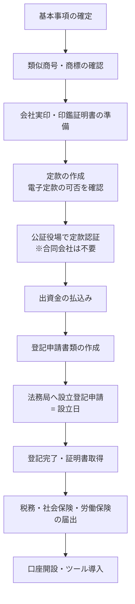

# 法人設立・法務 セットアッププラン — {{BUSINESS_NAME}}

> 法人設立の**手順・選択肢・必要書類・士業との分担**を整理する。AIは情報整理・比較・チェックリスト・書類案の作成まで。**個別事案の法的判断・申請代理は司法書士・税理士・社労士・行政書士・弁護士の業務**であり、必ず士業の確認を経る。
> 費用・期限・要件は目安。改正・個別事情で変わるため、各項目に**出典URL（公式）と確認日**を記録する。

| 項目 | 内容 |
|---|---|
| **作成日 / 版** | {{CREATED_DATE}} / {{VERSION}} |
| **法令・制度の確認日** | {{LAW_CHECKED_DATE}} |
| **Confidence** | High / Medium / Low |

---

## 1. 法人形態の比較

| 観点 | 株式会社 | 合同会社 | 個人事業（参考） |
|---|---|---|---|
| 設立時の法定費用（目安） | 定款認証＋登録免許税（最低額あり）＋謄本等 | 登録免許税（最低額あり）＋謄本等。定款認証は不要 | 開業届のみ |
| 手続の重さ | 定款認証あり | 比較的軽い | 軽い |
| 社会的信用・資金調達 | 一般に高い。外部出資を受けやすい | 株式会社より認知が低い場面がある | 法人より低い場面がある |
| 意思決定・機関 | 取締役等。機関設計を選ぶ | 社員（出資者）中心で柔軟 | 本人 |
| 将来の組織変更 | — | 株式会社への組織変更が可能（費用・手続あり） | 法人成り |
| 社会保険 | 法人は原則加入 | 法人は原則加入 | 業種・人数で任意の場合あり |
| 向いているケース | 外部調達・採用・取引先信用を重視 | 小規模・低コストで早く始めたい | まず小さく検証したい |

**推奨と根拠**: {{RECOMMENDED_FORM}} / {{REASON}}　**選ばなかった案と理由**: {{REJECTED}}

---

## 2. 基本事項の確定

| 項目 | 案 | 確認ポイント | 確定 |
|---|---|---|---|
| 商号 | | 類似商号・商標の事前調査（WBS 2.3）。同一本店所在地の同一商号は登記できない | ☐ |
| 本店所在地 | | 賃貸借契約・バーチャルオフィスの可否（銀行・許認可・補助金の要件に影響） | ☐ |
| 事業目的 | | 現在の事業＋将来やりそうな事業。許認可が必要な事業は目的の書き方にも注意 | ☐ |
| 資本金 | | [`capital-plan.md`](./capital-plan.md) の決定を反映 | ☐ |
| 役員構成・任期 | | 代表者・取締役・監査役の要否 | ☐ |
| 事業年度（決算月） | | 繁閑・消費税/法人税の納付時期・資金繰りで決める | ☐ |
| 機関設計・株式（株式会社） | | 発行可能株式総数・株式譲渡制限・種類株の要否 | ☐ |
| 公告方法 | | 電子公告か官報か（費用が異なる） | ☐ |
| 実質的支配者 | | 申告書の記載が必要 | ☐ |

---

## 3. 設立手続フロー（株式会社・発起設立の例）

| ステップ | 担当 | 主な書類 | 期限の目安 | WBS |
|---|---|---|---|---|
| 定款作成〜認証 | 司法書士 / 本人 | 定款・実質的支配者の申告書・印鑑証明書 | — | 2.5 / 3.1 |
| 出資金の払込み | 本人 | 通帳コピー・払込証明書 | — | 3.2 |
| 設立登記 | 司法書士 / 本人 | 登記申請書・就任承諾書・印鑑届書等 | 払込み等の完了から2週間以内が目安 | 3.3〜3.4 |
| 設立後の届出 | 税理士・社労士 | [`legal-procedure-tracker.csv`](./legal-procedure-tracker.csv) | 手続ごと（設立日起算で自動計算） | 4.x |

---

## 4. 許認可・登録の要否

| 事業内容 | 該当しそうな許認可・登録 | 所管 | 要件（資本金・人的・場所） | 営業開始前に必要か | 確認日・出典 |
|---|---|---|---|---|---|
| | | | | | |

> 要否が不明な事業は、**所管官庁・自治体の窓口と行政書士に確認**する。AIの判断で「不要」と断定しない。

---

## 5. 税務の入口（税理士に確認）

| 論点 | 確認内容 |
|---|---|
| 青色申告 | 承認申請の期限と要否 |
| 消費税 | 課税/免税・インボイス登録の判断（取引先の要件と有利不利の試算） |
| 源泉所得税 | 納期の特例の要否 |
| 役員報酬 | 定期同額給与のルール・期中変更の制限 |
| 決算月・申告 | 申告・納付の時期と資金繰りへの影響 |

---

## 6. 契約・規約・表示（弁護士に確認）

| 文書・論点 | 要否 | 備考 |
|---|---|---|
| 利用規約・サービス契約 | | |
| プライバシーポリシー（個人情報保護法） | | 取得する個人情報の種類・目的・第三者提供・委託先 |
| 特定商取引法に基づく表記 | | 通信販売・役務提供など該当する場合 |
| 広告表示（景品表示法・ステマ規制） | | SNS投稿・インフルエンサー依頼を含む |
| 商標・著作権 | | 屋号・ロゴ・コンテンツの権利 |
| 業務委託・フリーランスとの取引 | | フリーランス保護法・下請法の該当を確認 |
| 秘密保持契約・業務委託契約の雛形 | | |

---

## 7. 士業の役割分担

| 士業 | 主な依頼内容 | 依頼する/しない | 選定基準・費用 |
|---|---|---|---|
| 司法書士 | 設立登記・定款 | | |
| 税理士 | 税務届出・会計・決算・消費税判断 | | |
| 社会保険労務士 | 社保・労保の手続・規程・給与計算 | | |
| 行政書士 | 許認可・各種申請 | | |
| 弁護士 | 規約・契約・紛争予防 | | |

---

## 8. 確認ログ・Open Issues

| # | 項目 | 状態 | 確認先 | 確認日 |
|---|---|---|---|---|
| 1 | | 未確認 | | |
