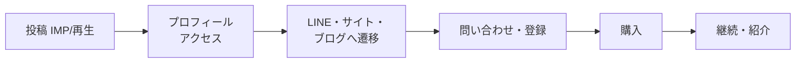

# SNSマーケティング フレームワーク — {{BUSINESS_NAME}}

> 目的から逆算して、**誰に・どの媒体で・何を・どう届け・何で測るか**を1枚で決める。数値目標は [`kpi-kgi.csv`](./kpi-kgi.csv)、投稿計画は [`sns-content-calendar.csv`](./sns-content-calendar.csv) に落とす。
> 実行Skill: [`sns-marketing-framework`](../../skills/growth/sns-marketing-framework/SKILL.md)

| 項目 | 内容 |
|---|---|
| **作成日 / 版** | {{CREATED_DATE}} / {{VERSION}} |
| **対象期間** | |
| **Confidence** | High / Medium / Low |

---

## 1. 目的とKGI

| 項目 | 内容 |
|---|---|
| ビジネス上の目的 | 例: 初回の有料顧客を獲得する / 認知を作る / 採用を助ける |
| KGI（月次） | 例: 売上◯円 / 新規顧客◯人 |
| 逆算結果 | 必要問い合わせ◯件 → プロフィールアクセス◯件 → IMP◯（[`kpi-kgi.csv`](./kpi-kgi.csv)） |
| 検証期間と見直し条件 | 例: 8週間運用し、プロフィール遷移率が◯%未満ならフックを見直す |

---

## 2. ターゲット・ペルソナ・提供価値

| 項目 | 内容 |
|---|---|
| 想定顧客（属性ではなく行動・状況で書く） | |
| 解決したいジョブ（JTBD） | |
| いま使っている代替手段 | |
| 提供価値（1文） | |
| 競合との違い | [`company-analysis.md`](./company-analysis.md) |
| 発信する人格・トーン | ブランドの最終判断は人間 |

---

## 3. チャネル選定

| チャネル | 役割 | ターゲットとの相性 | 制作コスト | 資産性（検索/蓄積） | 採否 | 週あたり投稿数 |
|---|---|---|---|---|---|---|
| X | 認知・会話・速報 | | | 低 | | |
| TikTok | 認知（動画の拡散） | | | 低〜中 | | |
| Instagram（リール/フィード） | 認知・世界観・信頼 | | | 中 | | |
| YouTube | 信頼・検索流入 | | | 高 | | |
| ブログ / note（オウンドメディア） | 検索流入・信頼・CV | | | 高 | | |
| LINE公式アカウント等 | 関係維持・CV | | | 高（顧客リスト） | | |

> 原則: 借り物の場（SNS）で認知を取り、**自分の場（サイト・メール/LINE）に顧客リストを蓄積する**導線を最初から設計する。

---

## 4. コンテンツ戦略

### コンテンツピラー（投稿の柱）

| ピラー | 目的 | 比率 | 例 |
|---|---|---|---|
| 教育（役立つ知識） | 信頼 | | |
| 事例・実績 | 社会的証明 | | |
| 世界観・人柄 | 共感・ファン化 | | |
| 提案・告知（CTA） | 転換 | | |

### フックと心理効果

| フックの型 | 例 | 使う心理効果 |
|---|---|---|
| 質問型 | 「〇〇、まだ◯◯していませんか？」 | 好奇心 |
| 数字型 | 「◯分でできる3つの方法」 | 具体性 |
| 逆説型 | 「実は◯◯は逆効果」 | 意外性 |
| 権威型 | 「専門家が教える」 | 権威性 |
| 希少型 | 「今月だけ」 | 希少性（誇大・虚偽にしない） |
| 事例型 | 「◯人が試して…」 | 社会的証明（事実に基づく） |

> 心理効果は**誠実に**使う。誇大表現・虚偽・不安の過度な煽り・解約妨害などのダークパターンは使わない（倫理は人間が最終判断）。

### 台本・本文の基本構成

`フック（最初の1文）→ 共感（誰の課題か）→ 価値（解決の中身）→ 行動（CTA）`

### ベンチマーク運用

| 項目 | 内容 |
|---|---|
| 参考アカウント・動画の選び方 | 同ジャンルで反応が良い投稿を週◯本収集し、**型だけ**を学ぶ（丸写しはしない。著作権・権利に注意） |
| 記録先 | [`sns-content-calendar.csv`](./sns-content-calendar.csv) の「ベンチマーク」列 |

---

## 5. ファネルと導線



| 段階 | 指標 | 計測方法 | 目標（月） |
|---|---|---|---|
| 認知 | IMP / 再生数 | 各SNSのアナリティクス | |
| 興味 | プロフィールアクセス数 | 同上 | |
| 転換 | 問い合わせ・登録数 | フォーム/LINE/UTM | |
| 収益 | 新規顧客数・売上 | 決済・会計 | |
| 継続 | 解約率・リピート率 | 決済/CRM | |

**UTM規約**: `utm_source={媒体}` `utm_medium=social` `utm_campaign={キャンペーン名}` を全リンクに付与し、`sns-content-calendar.csv` の UTM 列に記録する。

---

## 6. 運用ルール

| 項目 | 内容 |
|---|---|
| 投稿頻度・時間帯 | |
| 制作フロー | 企画 → 台本 → 制作 → **承認（人間）** → 予約/投稿 → 計測 |
| AIの担当範囲 | 企画案・台本案・分析（生成物は必ず人間が確認してから公開） |
| 人間の担当 | 最終承認、ブランド判断、炎上・クレーム対応、実在の人・事実の確認 |
| 週次レビュー | 毎週◯曜日。W1（公開後1週間）の数値で勝ち/負けパターンを判定 |

---

## 7. コンプライアンス（公開前チェック）

- [ ] 広告・PRの表示（ステマ規制・景品表示法）: 対価を受けた投稿は広告と分かる表示にした
- [ ] 誇大・断定表現: 根拠のない効果・効能・収益の断定をしていない
- [ ] 業法の広告規制（医療・薬機・金融・士業 等）: 該当する事業は所管のガイドラインを確認した
- [ ] 著作権・肖像権・商標: 画像・音源・参考動画・他人の発言の権利を確認した
- [ ] 個人情報: 顧客の情報・事例を本人の同意なく掲載していない
- [ ] プラットフォーム規約: 各SNSの規約・AI生成コンテンツの表示ルールに従っている
- [ ] 特定商取引法の表記・プライバシーポリシー・利用規約へ導線がある（[`legal-setup-plan.md`](./legal-setup-plan.md) §6）

---

## 8. 計測と改善ループ

```
計測（毎週）→ 勝ちパターン抽出（フック・ピラー・時間帯）→ 型として再現 → 負け投稿は原因を仮説化 → 次週の計画へ
```

| 週 | 投稿数 | IMP | ER | プロフィールアクセス | 問い合わせ | 学び（So What） | 次の打ち手 |
|---|---|---|---|---|---|---|---|
| W1 | | | | | | | |
| W2 | | | | | | | |
