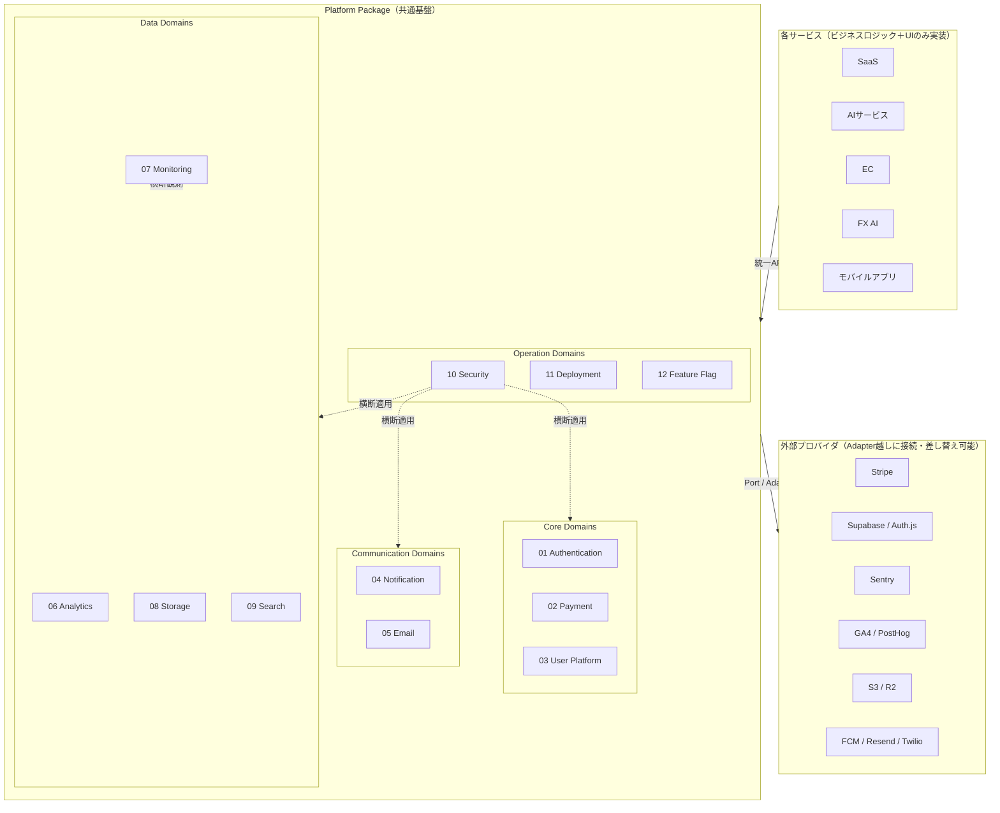
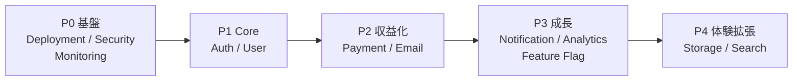
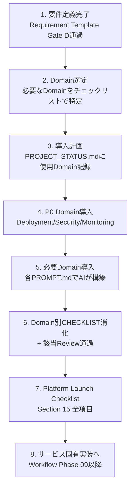

# Platform Package — 共通基盤アーキテクチャ

> **AI Development Operating System — 全サービス共通Platform**
>
> AIサービス・Webサービス・SaaS・モバイルアプリ・AI Agent・FX AI・EC・サブスクリプションサービス — 今後制作する**すべてのサービスが再利用する共通基盤**の設計書。
>
> **Mission: 一度構築すれば、今後10年間すべてのサービスで使い続けられるPlatformを作る。**
> Platformはサービスごとに毎回作るものではない。サービス側は「ビジネスロジックとUI」だけを書き、認証・決済・通知・監視などの基盤はこのPackageを組み込むだけで完成する状態を目指す。

| 項目 | 内容 |
|---|---|
| **Version** | 1.0.0（Blueprint — 設計フェーズ） |
| **Status** | Active |
| **Last Updated** | 2026-07-09 |
| **関連ドキュメント** | [`Development_Workflow.md`](../00_System/Development_Workflow.md) / [`Quality_Standard.md`](../00_System/Quality_Standard.md) / [`Review_Process.md`](../00_System/Review_Process.md) / [`Skill_Architecture.md`](../00_System/Skill_Architecture.md) / [`Project_Template.md`](../00_System/Project_Template.md) |

---

## 目次

1. [設計思想](#設計思想)
2. [全体アーキテクチャ](#全体アーキテクチャ)
3. [技術スタック方針](#技術スタック方針)
4. [Platform Domains 01〜12](#01-authentication)
5. [Human × AI Responsibility](#13-human--ai-responsibility)
6. [Template体系](#14-template体系)
7. [Platform Launch Checklist](#15-platform-launch-checklist)
8. [Best Practices参照元](#16-best-practices参照元)
9. [Repository構成](#17-repository構成)
10. [Platform Skills](#18-platform-skills)
11. [Platform Review System](#19-platform-review-system)
12. [Roadmap](#20-roadmap)
13. [運用マニュアル（サービスへの導入手順）](#運用マニュアルサービスへの導入手順)
14. [Version Management](#version-management)

---

## 設計思想

### 5原則

1. **Build Once, Use Everywhere** — 各Domainはサービス非依存で設計する。サービス固有のロジックをPlatformに混入させない。固有要件は設定（Config）と拡張ポイント（Hook）で吸収する。
2. **Adapter Patternで10年に耐える** — 外部プロバイダ（Stripe・Supabase・Sentry等）は直接呼ばず、必ず自前のインターフェース（Port）越しに使う。プロバイダが死んでも・値上げしても、Adapterの差し替えだけで生き残る。
3. **Secure by Default** — 全Domainはセキュリティ最大の設定をデフォルトとし、緩和する場合のみ明示的な設定と理由を要求する。
4. **Observable by Default** — 全Domainは構造化ログ・メトリクス・エラー追跡を標準で吐く。「監視は後付け」を構造的に不可能にする。
5. **AIが実装し、人間が鍵を握る** — 実装・テスト・ドキュメントはAI（Claude Code）が担い、本番鍵・課金・法務・リスク受容は人間だけが扱う（[Section 13](#13-human--ai-responsibility)）。

### 配置の設計判断（当初案からの変更）

当初案の `02_Platform/` は既存の `02_UX/`（Workflow成果物ディレクトリ）と番号が衝突するため、`agents/` `skills/` `templates/` と同列の**無番号共有資産ディレクトリ `platform/`** として配置した。Platformは特定Phaseの成果物ではなく全サービス横断の再利用資産であり、この位置づけが本OSのリポジトリ構造と一貫する。

---

## 全体アーキテクチャ



**レイヤールール**:
- サービス → Platform の呼び出しは統一API（各DomainのPort）経由のみ。プロバイダSDKをサービス側から直接importすることを禁止する
- Security（10）とMonitoring（07）は横断Domain。全Domainに自動適用される
- Domain間の依存は「Core ← 他Domain」の一方向のみ許可（例: PaymentはAuthに依存してよいが、AuthはPaymentに依存しない）

---

## 技術スタック方針

**デフォルトスタック**（新サービスはこれを起点とし、変更にはTechnical Requirements（要件定義Stage 17）での理由記録を要する）:

| レイヤー | デフォルト | Adapter対応の代替 | 選定理由 |
|---|---|---|---|
| フレームワーク | Next.js（App Router）+ TypeScript strict | — | エコシステム・Vercel親和性・採用実績 |
| BaaS / DB | Supabase（Postgres + Auth + Storage） | Firebase, 自前Postgres | RDB基盤・RLS・オープンソースで脱出可能 |
| 決済 | Stripe | — （決済はStripe固定・Adapterで抽象化のみ） | 業界標準・ドキュメント品質・網羅性 |
| ホスティング | Vercel | Cloud Run, Cloudflare | Preview環境・DX |
| メール | Resend | SendGrid, SES | DX・テンプレート管理 |
| Push | FCM（+APNs） | OneSignal | 標準・無料 |
| SMS | Twilio | — | 実績 |
| 分析 | GA4 + PostHog | Mixpanel, Amplitude | 無料枠＋セルフホスト可能性 |
| 監視 | Sentry + BetterStack（Uptime） | Datadog | コスト・十分な機能 |
| ストレージ/CDN | Cloudflare R2 + Cloudflare CDN | S3 + CloudFront | エグレス無料・コスト |
| 検索 | Postgres FTS → Meilisearch（規模拡大時） | Typesense, Algolia | 段階導入・コスト |
| CI/CD | GitHub Actions + Docker | — | リポジトリ一体 |
| Feature Flag | PostHog Flags / DB-backed Config | GrowthBook | 分析基盤と統合 |

**Adapterルール**: プロバイダ依存コードは各Domainの `adapters/` にのみ置く。Port（インターフェース）はプロバイダの語彙ではなくドメインの語彙で定義する（例: `sendEmail()` であって `resend.emails.send()` ではない）。

---

# 01 Authentication

**目的**: すべてのサービスで同一の認証・認可体験とセキュリティ水準を提供する。

### 提供機能

| 分類 | 機能 |
|---|---|
| ログイン方式 | Email（+パスワード/Magic Link）/ Google / Apple / LINE / GitHub |
| アカウント回復 | Password Reset（有効期限付きトークン・使い捨て） |
| 多要素認証 | 2FA（TOTP標準・SMSはオプション）・リカバリーコード |
| セッション | Session管理（デバイス一覧・個別失効・全失効）/ JWT（短命Access + Rotate式Refresh） |
| 連携 | OAuth 2.0 / OIDC（外部サービスへの提供・受け入れ） |
| 権限管理 | RBAC（Role: Admin / User を標準、サービス側でRole追加可能）・Permission（リソース×操作の宣言的定義）・Row Level Security |

### 主要設計判断

- **JWTは短命（15分）+ Refresh Token Rotation**。Refresh再利用検知で全セッション失効（トークン窃取対策）
- Roleはenum直書き禁止。`roles`/`permissions` テーブルで宣言的に管理し、権限チェックはミドルウェアで一元化（各エンドポイントに手書きさせない）
- ソーシャルログインのアカウント統合（同一メール別プロバイダ）は明示的な本人確認を経てのみ許可
- Apple Login はApp Store提出要件（他のソーシャルログインがある場合は必須）として最初から組み込む

### 完成条件（抜粋）

- [ ] 5方式のログイン・2FA・Reset・セッション管理がテスト済み
- [ ] 権限昇格・IDOR・セッション固定の攻撃テストをパス
- [ ] 認証イベント（成功/失敗/失効）が監査ログに記録される

---

# 02 Payment

**目的**: 課金モデル（サブスク・都度・クレジット）をどのサービスでも即日導入可能にする。**金銭を扱うため全Domain中最も高い品質基準を適用する。**

### 提供機能

| 分類 | 機能 |
|---|---|
| 決済手段 | Stripe（カード）/ Apple Pay / Google Pay |
| 課金モデル | サブスクリプション（月額/年額・プラン変更・比例配分）/ 都度課金 / Credit System（プリペイド消費型）/ ポイント / クーポン（割引・無料期間） |
| 帳票 | 請求書 / 領収書（自動発行・再発行） |
| ライフサイクル | 無料体験（カード有無両対応）/ プラン変更（アップ/ダウングレード）/ キャンセル（即時・期間末）/ 返金（全額・一部） |
| 運用 | Webhook処理（冪等・順序保証・リトライ）/ Billing Portal（Stripe Customer Portal）/ 決済失敗時の処理（Dunning: リトライ→通知→猶予→停止）/ 売上管理（MRR/ARR集計）/ 税率対応（Stripe Tax） |
| 環境 | テスト環境（Stripe Test Mode + テストカード一式）/ 本番環境（鍵の分離管理） |

### 主要設計判断

- **Webhookが正、リダイレクトは補助**。決済状態の確定はWebhook（署名検証＋冪等キー）でのみ行う。success URLへの到達を課金成立と見なさない
- 価格・プランはStripe側を正としDBへ同期（二重管理の禁止）
- Credit/ポイントの残高操作は追記型台帳（ledger）で管理。残高カラムの直接UPDATE禁止（監査・巻き戻し可能性）
- 決済失敗のDunningフローは標準搭載: 3回リトライ → メール通知 → 7日猶予 → 機能停止 → データは保持

### Payment Launch Checklist（このDomain固有）

- [ ] テストモードで全課金フロー（購入・変更・解約・返金・失敗）を通した
- [ ] Webhook署名検証・冪等処理・リトライ耐性を検証した
- [ ] 本番で実カードの少額決済 → 領収書 → 返金を1周した
- [ ] 特商法表記・価格表示（税込）・解約導線が法令要件を満たす（人間確認）
- [ ] 売上がダッシュボードで確認できる

---

# 03 User Platform

**目的**: ユーザーのライフサイクル全体（登録→利用→退会→復元）を法令準拠で管理する。

### 提供機能

| 分類 | 機能 |
|---|---|
| プロフィール | Profile（表示名・アバター・自己紹介の共通スキーマ＋サービス固有拡張フィールド） |
| アカウント | Account（メール変更・パスワード変更・連携管理）/ Settings（サービス共通設定の枠組み） |
| 通知設定 | Notification Settings（チャネル×イベント種別のマトリクス型オプトイン/アウト） |
| プライバシー | Privacy（公開範囲設定）/ Block（ユーザー間ブロック）/ Export（GDPR対応のデータエクスポート）/ Delete（データ削除権） |
| コンプライアンス | 利用規約同意（バージョン管理・再同意フロー）/ 年齢確認（サービス要件に応じた段階: 自己申告→年齢推定→書類） |
| 退会 | 退会（ソフトデリート→猶予期間→物理削除）/ 復元（猶予期間内の復帰） |

### 主要設計判断

- 退会は**30日のソフトデリート**を標準とする（誤操作・気変わりからの復元と、削除権の両立）。猶予後の物理削除はジョブで自動実行し、削除証跡を監査ログに残す
- 規約同意はバージョン付きで記録（いつ・どの版に同意したか）。規約改定時は再同意フローを自動発動
- Export はGDPR/個人情報保護法の開示請求に応えられる形式（機械可読JSON＋人間可読）で全Domainのユーザーデータを集約する

---

# 04 Notification

**目的**: あらゆるチャネルへの通知を単一のAPI（`notify()`）に統一する。

### 提供機能

| 分類 | 機能 |
|---|---|
| チャネル | Push（FCM/APNs）/ Email（05に委譲）/ SMS（Twilio）/ LINE / Discord / Slack / Webhook（外部システム向け）/ アプリ内通知（Inbox型） |
| 管理 | 通知テンプレート（変数埋め込み・多言語対応枠）/ 通知履歴（送達状態: 送信済/到達/開封/失敗）/ 通知設定（03のSettingsと連動したオプトアウト尊重） |

### 主要設計判断

- サービス側は `notify(user, event, payload)` を呼ぶだけ。**チャネル選択・オプトアウト判定・テンプレート適用・リトライはPlatformが行う**
- 通知はキュー経由の非同期処理（メイン処理をブロックしない・スパイクに耐える）
- オプトアウトは必ずチャネル×イベント種別の粒度で尊重する。「重要なお知らせ」でもマーケティング通知をオプトアウト済みユーザーに送らない（法令・信頼）
- 失敗はチャネルごとのリトライポリシー（Push: 3回 / Webhook: 指数バックオフ6回）後にDead Letter Queueへ

---

# 05 Email

**目的**: トランザクショナル/マーケティングメールの送信・テンプレート・到達性を一元管理する。

### 提供機能

| 分類 | 機能 |
|---|---|
| 標準テンプレート | Welcome / Verification（メール確認）/ Password Reset / Invoice（請求）/ Receipt（領収）/ Subscription（開始・更新・失敗・解約）/ Marketing（キャンペーン枠）/ Transactional（汎用） |
| 管理 | テンプレート管理（コード管理・変数型チェック・プレビュー）/ 送信ログ（到達・開封・バウンス） |

### 主要設計判断

- **Transactional と Marketing は送信ドメイン（サブドメイン）を分離**する。マーケの評判低下がパスワードリセットの到達性を殺す事故を構造的に防ぐ
- SPF / DKIM / DMARC はPlatform導入時の必須セットアップ（Launch Checklistでブロッカー扱い）
- テンプレートはリポジトリでコード管理（React Email等）。管理画面での直接編集は不可（レビューを通す）
- バウンス・苦情（complaint）はWebhookで受けて自動的に送信停止リストへ

---

# 06 Analytics

**目的**: 全サービスで同一のイベント体系・KPI定義で計測し、サービス間比較と意思決定を可能にする。

### 提供機能

| 分類 | 機能 |
|---|---|
| プロバイダ | GA4 + PostHog（標準）/ Mixpanel / Amplitude（Adapter） |
| 標準指標 | Conversion Funnel / Retention（D1/D7/D30）/ LTV / DAU / MAU / Session |
| イベント | 標準Event（sign_up, login, purchase等の共通スキーマ）/ Custom Event（サービス固有・命名規則準拠） |
| 可視化 | Dashboard（[`Quality_Standard.md — 10 Analytics Quality`](../00_System/Quality_Standard.md) の必須KPIを標準装備） |

### 主要設計判断

- イベントは `track(event, properties)` の統一APIで送り、**Adapterが各プロバイダへ配信**（サービスコードにGA4/PostHogの直書き禁止）
- イベント名・プロパティはスキーマ定義（型付き）で管理し、未定義イベントの送信をビルド時に検出する（計測の暗黙的破壊を防ぐ）
- 同意管理（Cookie同意）と連動し、同意前はCookielessまたは送信停止（10 Securityと連携）
- 計測要件は要件定義Stage 19（[`Requirement_Engineering_Framework.md`](../01_Product/Requirement_Engineering_Framework.md)）の成果物から自動でイベント定義に変換する

---

# 07 Monitoring

**目的**: 全サービスの健全性を同じ方法で観測し、障害を「ユーザーからの報告」ではなく「アラート」で知る。

### 提供機能

| 分類 | 機能 |
|---|---|
| 検知 | Health Check（/healthz 標準エンドポイント: DB・外部依存の疎通含む）/ Error（Sentry: 例外集約・リリース紐付け）/ Crash（モバイル/フロントのクラッシュ収集）/ Uptime（外形監視） |
| 観測 | Performance（Core Web Vitals RUM・APIレイテンシ）/ Logging（構造化JSONログ・相関ID・PIIマスキング標準） |
| 対応 | Alert（Severity別ルーティング: Critical→即時通知 / Warning→デイリーダイジェスト）/ Status（ステータスページ） |

### 主要設計判断

- ログは**構造化JSON＋リクエスト相関ID**を全サービス標準とする。個人情報・秘密情報はログ層で自動マスキング（うっかり漏洩の構造的防止）
- アラートはSeverity定義（[`Review_Process.md — Severity System`](../00_System/Review_Process.md#severity-system)）と対応付け、「アラート疲れ」を防ぐため Critical / High のみ即時通知
- 全アラートに Runbook（対応手順）へのリンクを必須とする。手順のないアラートは作らない

---

# 08 Storage

**目的**: ファイルの受け入れ・配信・保管を安全かつ低コストで標準化する。

### 提供機能

| 分類 | 機能 |
|---|---|
| 対応形式 | Image（自動リサイズ・WebP/AVIF変換）/ Video（トランスコード枠）/ Audio / PDF / 汎用ファイル |
| 転送 | Upload（署名付きURL直アップロード・サイズ/型検証・ウイルススキャン枠）/ Download（署名付きURL・権限チェック） |
| 配信 | CDN（Cloudflare）/ Cache（キャッシュ戦略・パージAPI） |
| 保全 | Backup（日次・世代管理）/ Archive（低頻度アクセス層への自動移行）/ Retention（保持期間ポリシー・自動削除） |

### 主要設計判断

- アップロードは**署名付きURLでクライアント→ストレージ直送**（サーバーを経由させない: コスト・性能）。ただし発行時に型・サイズ・権限を検証する
- 公開ファイルと非公開ファイルはバケットレベルで分離。非公開はすべて署名付きURL（有効期限付き）でのみ配信
- ユーザー削除（03のDelete/Export）と連動し、当該ユーザーのファイルを特定・削除・エクスポートできるようowner IDを必ずメタデータに持つ

---

# 09 Search

**目的**: 「探す・見つかる」体験を段階導入可能な形で標準化する。

### 提供機能

| 分類 | 機能 |
|---|---|
| 検索 | 全文検索（Postgres FTS → Meilisearch）/ タグ検索 / カテゴリ検索 / フィルター（ファセット） |
| AI | AI Search（埋め込み＋pgvectorによるセマンティック検索・ハイブリッド検索） |
| 体験 | レコメンド（閲覧・行動ベースの関連提示）/ 検索履歴 / お気に入り（保存・コレクション） |

### 主要設計判断

- **段階導入**を前提に設計する: Phase 1 = Postgres FTS（追加インフラゼロ）→ Phase 2 = Meilisearch（規模拡大時）→ Phase 3 = AI Search（価値が明確な場合のみ）。最初からAI検索を強制しない
- 検索インデックスは非同期更新（書き込みパスをブロックしない）。整合性は「最終的に一致」で十分と割り切り、遅延SLO（例: 30秒以内）を監視する
- 検索結果には必ず権限フィルタを適用する（見えてはいけないものが検索では見える、を防ぐ — 10 Securityと連携）

---

# 10 Security

**目的**: 全Domainに横断適用されるセキュリティ標準。**個別サービスの判断でオフにできない層**として設計する。

### 提供機能

| 分類 | 機能 |
|---|---|
| アクセス制御 | 認証・認可の強制（01と連携・未認証アクセスのデフォルト拒否）/ Rate Limit（IP・ユーザー・エンドポイント粒度） |
| 攻撃対策 | CSRF（トークン）/ XSS（CSP・出力エスケープ標準）/ SQL Injection（ORM・パラメータ化の強制）/ 依存パッケージ脆弱性スキャン（CI組み込み） |
| データ保護 | Encryption（保存時・転送時TLS1.2+）/ Secret管理（Vault/環境変数・ローテーション手順）/ API Key（発行・スコープ・失効・利用ログ） |
| コンプライアンス | Audit Log（誰が・いつ・何を: 認証/権限変更/課金/データ削除は必須記録）/ GDPR（Export/Delete/同意の技術的裏付け）/ Cookie（同意バナー・分類管理）/ Session（07 Authと連携） |
| 環境 | Environment分離（dev/staging/prodの鍵・データ完全分離） |

### 主要設計判断

- **セキュリティはミドルウェア層で強制**する。「各エンドポイントで実装者が気をつける」方式は10年運用で必ず漏れるため、デフォルト適用＋明示的除外（理由記録必須）の構造にする
- 監査ログは追記専用（改竄不可）・PIIマスキング済み・保持期間定義付き
- 本番SecretはAIに渡さない・リポジトリに置かない・ログに出さないの三原則（[Section 13](#13-human--ai-responsibility)）
- OWASP Top 10 / ASVS を設計チェックリストの土台とする

---

# 11 Deployment

**目的**: 「デプロイが怖くない」状態を全サービスで標準化する。

### 提供機能

| 分類 | 機能 |
|---|---|
| ビルド | Docker（再現可能ビルド・マルチステージ）/ GitHub Actions（lint→型→テスト→ビルド→デプロイの標準パイプライン） |
| 環境 | Preview（PR単位の使い捨て環境）/ Production / Environment管理（dev/staging/prod） |
| リリース | CI/CD（mainマージ→自動デプロイ）/ Rollback（1コマンド/1クリックで直前版へ）/ Version（semver＋Gitタグ）/ Release（リリースノート自動生成） |

### 主要設計判断

- **Preview環境を標準装備**（PRごと）。レビューは「コードを読む」だけでなく「動かして確認」を基本にする（[`Review_Process.md`](../00_System/Review_Process.md) のReview高速化）
- ロールバックは事前にリハーサル済みであること（Workflow Phase 16のLaunch Checklist連携）。「戻せる」ことがデプロイ頻度と品質を両立させる
- DBマイグレーションは前方互換（expand → migrate → contract）を標準とし、アプリとDBのロールバックを分離可能にする
- デプロイはmainマージへの自動反応のみ。手動の本番SSH・手動ファイル配置は禁止

---

# 12 Feature Flag

**目的**: 「デプロイ」と「リリース」を分離し、安全な段階公開と実験を標準化する。

### 提供機能

| 分類 | 機能 |
|---|---|
| フラグ | Feature Flag（bool/多値・ユーザー/セグメント/割合ターゲティング）/ Remote Config（動的設定値） |
| 公開制御 | Beta Release（特定ユーザー群への先行公開）/ Canary Release（1%→10%→100%の段階Rollout・メトリクス連動の自動停止） |
| 実験 | A/B Test / Experiment（仮説・成功基準・サンプルサイズを事前定義 — [`Skill: CRO`](../00_System/Skill_Architecture.md) と連携。06 Analyticsで判定） |

### 主要設計判断

- フラグには**オーナーと有効期限を必須**とする。期限切れフラグはCIが警告し、四半期ごとに棚卸しする（フラグ地獄の防止）
- Canaryはエラー率・レイテンシ（07 Monitoring）と連動し、閾値超過で自動的に旧版へ戻す
- A/Bテストの開始・終了判定は人間の承認を要する（ユーザー体験への実験は[`Review_Process.md — Human Decision Framework`](../00_System/Review_Process.md#human-decision-framework)の対象）

---

# 13 Human × AI Responsibility

Platform構築・運用における責任分担。**「人間が担当」の項目をAIが代行することを禁止する。**

| 領域 | 🤖 AIが担当 | 👤 人間が担当 | 🤝 共同作業 |
|---|---|---|---|
| **設計** | 各Domainの詳細設計ドラフト・比較表・リスク分析 | アーキテクチャ承認・プロバイダ契約の決定 | 設計レビュー |
| **実装** | コード実装・テスト・ドキュメント・Adapter開発 | PRマージ承認 | コードレビュー |
| **認証** | 実装・攻撃テスト・設定検証 | OAuth各社の開発者アカウント作成・審査対応（Apple/LINE） | 権限モデルの設計 |
| **決済** | Stripe実装・テストモード検証・Webhook実装 | **本番鍵の管理・実カード決済テスト・価格の決定・返金の実行判断** | 課金モデル設計 |
| **法務系** | 規約・ポリシーのドラフト・法規制の論点整理 | **利用規約/プライバシーポリシーの確定・法的判断・専門家への確認** | コンプライアンス要件定義 |
| **Secret** | 環境変数の構成設計・ローテーション手順書 | **本番Secretの発行・保管・投入**（AIに本番鍵を渡さない） | — |
| **デプロイ** | CI/CD構築・Preview検証・リリースノート生成 | **本番初回リリースのGo判断・ロールバック実行判断** | 障害対応（AIが分析・人間が決断） |
| **監視** | ダッシュボード構築・アラート設定・異常分析 | アラート受領体制の確立・エスカレーション先の決定 | Runbook整備 |
| **実験** | A/Bテスト設計・実装・統計判定 | 実験実施の承認・UXとのトレードオフ裁定 | 仮説立案 |
| **データ** | Export/Delete機構の実装 | 削除リクエストへの最終対応責任 | データ保持ポリシー策定 |

---

# 14 Template体系

各Domainのディレクトリに以下の4種テンプレートを標準配置する（[Repository構成](#17-repository構成)参照）。

| Template | 内容 | 運用方法 |
|---|---|---|
| **CHECKLIST.md** | そのDomainの導入時・変更時・Launch時のチェックリスト | 新サービス導入のたびにコピーして消化。✅の証跡をサービス側リポジトリに残す |
| **REVIEW.md** | Domain固有のレビュー観点（[Section 19](#19-platform-review-system)の詳細版） | [`Review_Process.md`](../00_System/Review_Process.md) の7ステージのAgent Review時に適用 |
| **PROMPT.md** | そのDomainをAI（Claude Code）で構築・改修する際の標準プロンプト | 変数（`{{SERVICE_NAME}}` 等）を埋めて起動。改善したら本体に還元 |
| **examples/** | 導入例・設定例・過去サービスでの実装サンプル | 実案件で得た知見を追加していく（学びの蓄積先） |

### 標準プロンプト（PROMPT.mdの共通形式）

```markdown
# Platform Domain構築: {{DOMAIN_NAME}}

`platform/{{domain}}/README.md` の設計に従い、{{SERVICE_NAME}} に {{DOMAIN_NAME}} を導入してください。

- 対象サービス: {{SERVICE_NAME}}（{{PRODUCT_TYPE}}）
- 要件: {{REQUIREMENTS}}（Requirement_Template.md 該当章へのリンク）
- 使用プロバイダ: {{PROVIDERS}}（デフォルトから変更する場合は理由必須）
- 制約: {{CONSTRAINTS}}

実行ルール:
1. platform/{{domain}}/CHECKLIST.md を開始前に読み、完了時に全項目を検証する
2. プロバイダSDKはAdapter越しにのみ使用する（サービスコードへの直書き禁止）
3. Secretはプレースホルダで実装し、本番値の投入は人間に依頼する
4. 完了時に platform/{{domain}}/REVIEW.md の観点でセルフレビュー結果を報告する
```

---

# 15 Platform Launch Checklist

Platform（またはPlatformを組み込んだサービス）が本番運用可能かの最終確認。[`Development_Workflow.md`](../00_System/Development_Workflow.md) Phase 16のLaunch Checklistに追加して適用する。

### Core
- [ ] **Auth**: 全ログイン方式が本番設定で動作・2FA/Reset検証済み・セッション失効が機能する
- [ ] **Payment**: 本番実カードで購入→領収書→返金を1周・Webhook本番疎通・Dunning動作確認・特商法/価格表示の人間確認
- [ ] **User**: 規約同意フロー・Export・退会→復元→物理削除のライフサイクル検証済み

### Communication
- [ ] **Notification**: 全対象チャネルの実機受信確認・オプトアウトの尊重を検証
- [ ] **Email**: SPF/DKIM/DMARC設定済み・全トランザクショナルメールの受信確認・バウンス処理動作

### Data
- [ ] **Analytics**: 全標準イベント発火確認・同意連動の検証・ダッシュボード稼働
- [ ] **Monitoring**: /healthz・外形監視・Sentry疎通・Criticalアラートの通知先で実受信・全アラートにRunbookあり
- [ ] **Storage**: アップロード検証（型・サイズ・権限）・署名付きURL・バックアップからのリストア演習済み
- [ ] **Search**: 権限フィルタの検証（見えてはいけないものが検索で見えない）

### Operations
- [ ] **Security**: Rate Limit動作・CSP設定・依存スキャンCI組み込み・監査ログ記録・本番Secret分離・Critical/High脆弱性ゼロ
- [ ] **Deployment**: Preview環境動作・本番デプロイ→ロールバックのリハーサル完了・DBマイグレーション前方互換の確認
- [ ] **Feature Flag**: 全フラグにオーナー・期限設定・Canary自動停止の閾値設定

### 総合
- [ ] [`Quality_Standard.md`](../00_System/Quality_Standard.md) のQuality Numbers達成（実機計測）
- [ ] [Section 19](#19-platform-review-system) の5レビューすべてPASS
- [ ] Human Owner がリリースを承認した

---

# 16 Best Practices参照元

| 参照元 | 主に取り入れる領域 |
|---|---|
| **Apple** | Sign in with Apple要件・プライバシーラベル・HIG（通知の節度） |
| **Google** | OAuth審査要件・GA4イベント設計・Core Web Vitals・SRE（エラーバジェット・Runbook文化） |
| **Stripe** | 決済API設計・Webhook冪等性・ドキュメント品質・テストモード設計 |
| **GitHub** | Actions CI/CD・環境保護ルール・Dependabot・リリース管理 |
| **OpenAI / Anthropic** | APIキー管理・レート制限設計・AI安全性（インジェクション対策）・段階的ロールアウト |
| **Linear** | リリース頻度と品質の両立・フラグ運用・変更の小ささ |
| **Notion** | 権限モデル（共有・ゲスト）・データエクスポート |
| **Cloudflare** | CDN/キャッシュ戦略・R2コスト設計・WAF/Rate Limit |
| **Vercel** | Preview環境・デプロイDX・環境変数管理 |
| **Supabase** | RLS（Row Level Security）・Auth設計・オープンソースによる脱出可能性 |
| **Firebase** | FCM・Remote Config・Crashlytics |

---

# 17 Repository構成

```
platform/
├── README.md                    # 本ファイル（Platform全体アーキテクチャの正本）
├── ADOPTION.md                  # サービスへの導入手順（運用マニュアル詳細版）
│
├── auth/                        # 01 Authentication
│   ├── README.md                #   Domain設計書（本書該当章の詳細版）
│   ├── CHECKLIST.md             #   導入・変更・Launchチェックリスト
│   ├── REVIEW.md                #   レビュー観点
│   ├── PROMPT.md                #   AI構築用標準プロンプト
│   ├── src/                     #   実装（Port定義・コアロジック）
│   ├── adapters/                #   プロバイダ実装（supabase/ authjs/ ...）
│   └── examples/                #   導入例・知見の蓄積
│
├── payment/                     # 02 Payment（構成は auth/ と同一。以下同様）
├── user/                        # 03 User Platform
├── notification/                # 04 Notification
├── email/                       # 05 Email
├── analytics/                   # 06 Analytics
├── monitoring/                  # 07 Monitoring
├── storage/                     # 08 Storage
├── search/                      # 09 Search
├── security/                    # 10 Security（横断）
├── deployment/                  # 11 Deployment
└── feature-flag/                # 12 Feature Flag
```

**構成ルール**:
- 全Domainは同一の内部構成（README / CHECKLIST / REVIEW / PROMPT / src / adapters / examples）を持つ。構成の統一自体が学習コストを下げる
- `src/`（Port・コアロジック）と `adapters/`（プロバイダ依存）の分離は全Domain必須
- 実装コードの言語・配布形態（npmパッケージ化・モノレポ共有・コピー導入）は最初の実案件（Roadmap P0）で確定する

---

# 18 Platform Skills

Platform専用Skillを `skills/engineering/platform/` サブカテゴリとして追加する（[`Skill_Architecture.md`](../00_System/Skill_Architecture.md) の既存7カテゴリ構造を維持し、engineeringのサブカテゴリとして配置。カテゴリ新設を避け、既存ルール「サブカテゴリ分割」に準拠）。

| # | Skill | パス | 内容 | 主利用Agent |
|---|---|---|---|---|
| 1 | Auth Skill | `skills/engineering/platform/auth/` | 認証・認可・RBAC・セッション・OAuth実装の専門知識 | Backend, Security |
| 2 | Stripe Skill | `skills/engineering/platform/stripe/` | Stripe API・Webhook冪等・Dunning・税率・Billing Portal | Backend |
| 3 | Notification Skill | `skills/engineering/platform/notification/` | マルチチャネル通知・キュー設計・オプトアウト管理 | Backend |
| 4 | Analytics Skill | `skills/engineering/platform/analytics/` | イベントスキーマ設計・GA4/PostHog・同意連動 | Backend, Growth |
| 5 | Monitoring Skill | `skills/engineering/platform/monitoring/` | 構造化ログ・Sentry・アラート設計・Runbook | Backend, Performance |
| 6 | Storage Skill | `skills/engineering/platform/storage/` | 署名付きURL・CDN・バックアップ・Retention | Backend |
| 7 | Security Skill（Platform版） | `skills/engineering/platform/security/` | ミドルウェア層の強制設計・監査ログ・GDPR技術対応 | Security, Backend |
| 8 | Deployment Skill | `skills/engineering/platform/deployment/` | Docker・GitHub Actions・Preview・前方互換マイグレーション | Backend, Frontend |
| 9 | Feature Flag Skill | `skills/engineering/platform/feature-flag/` | フラグ設計・Canary・A/B実験の実装 | Backend, Growth |

各Skillは [`Skill_Base_Template.md`](../00_System/Skill_Base_Template.md) の12セクション形式で作成する（Roadmap P1以降で、対応Domainの構築と同時に作成）。

---

# 19 Platform Review System

[`Review_Process.md`](../00_System/Review_Process.md) の7ステージレビューに、Platform固有の5レビューを追加する。

| レビュー | 対象 | 主宰 | 必須観点 | Human承認 |
|---|---|---|---|---|
| **Authentication Review** | 01 Auth の導入・変更 | Security Agent | 権限昇格・セッション固定・IDOR・OAuth設定ミス・2FA迂回 | 権限モデルの承認 |
| **Payment Review** | 02 Payment の導入・変更 | Backend + Security Agent | Webhook冪等・二重課金・金額計算・返金処理・台帳整合・法令表示 | **必須（実カードテスト・価格・特商法）** |
| **Security Review** | 全Domain横断 | Security Agent | OWASP・Secret管理・監査ログ・依存脆弱性・Rate Limit | リスク受容 |
| **Performance Review** | 06-09 Data Domains中心 | Performance Agent | キュー遅延・検索レイテンシ・CDNヒット率・負荷耐性 | コストトレードオフ |
| **Launch Review** | Platform全体（本番投入前） | PM Agent | [Section 15](#15-platform-launch-checklist) 全項目＋5レビューの統合判定 | **必須（リリースGo）** |

**運用ルール**: Payment・Authに関わる変更は、他Domainより1段厳しく「軽微な変更でもAgent Review省略不可」とする（金銭・個人情報を扱うため）。判定はPASS / WARNING / FAIL（[`Quality_Standard.md`](../00_System/Quality_Standard.md) 準拠）。

---

# 20 Roadmap

### 構築フェーズ（依存関係順）



| Phase | Domain | 理由・依存 |
|---|---|---|
| **P0（最初）** | 11 Deployment / 10 Security / 07 Monitoring | すべての土台。CI/CD・Secret管理・監視がない状態で他Domainを作らない（Secure & Observable by Default の実現条件） |
| **P1** | 01 Authentication / 03 User Platform | ほぼ全サービスの前提。PaymentもNotificationもUserに依存する |
| **P2** | 02 Payment / 05 Email | 収益化に必須。EmailはPaymentの帳票・通知の前提 |
| **P3** | 04 Notification / 06 Analytics / 12 Feature Flag | グロース・改善ループの装備 |
| **P4** | 08 Storage / 09 Search | サービス特性により必要時に構築（EC・コンテンツ系は前倒し可） |

**進め方の原則**: Platformを空論で作り込まず、**P0完了後は最初の実サービス開発と並走して構築する**（実需要のないDomainを先回りで作らない）。各Domainの完成 = 実装 + 4テンプレート + 対応Skill + 該当Review通過。

### 今後追加すべきPlatform（Backlog）

| 候補 | 内容 | 優先度の目安 |
|---|---|---|
| **i18n / Localization** | 多言語・多通貨・タイムゾーン | 海外展開サービスの発生時 |
| **Admin Console** | 全サービス共通の管理画面基盤（ユーザー検索・返金操作・監査ログ閲覧） | P2完了後は早期に価値大 |
| **Support / Helpdesk** | 問い合わせ・FAQ・チャットサポート（AI一次対応） | ユーザー数拡大時 |
| **AI Platform** | LLM呼び出しの共通層（プロバイダAdapter・評価・コスト管理・プロンプト管理） | AIサービス2つ目の開発時（1つ目で得た実装を汎化） |
| **Referral / Affiliate** | 紹介・アフィリエイト基盤 | グロース施策として必要時 |
| **Community** | コメント・レビュー・フォーラム | UGC系サービスの発生時 |
| **Data Pipeline** | DWH・ETL・BI（サービス横断の経営ダッシュボード） | サービス3つ以上の運用時 |

---

## 運用マニュアル（サービスへの導入手順）

新サービスがPlatformを導入する標準フロー。詳細版は `platform/ADOPTION.md` として整備する（P0で作成）。



| ステップ | 内容 |
|---|---|
| 1. 前提 | 要件定義（[`Requirement_Template.md`](../templates/Requirement_Template.md)）のStage 17-20が完了し、必要なPlatform機能が要件から特定できる状態 |
| 2. Domain選定 | 12 Domainのうち必要なものを選定（例: 無料ツールならPayment不要）。**不要判断も記録する** |
| 3-5. 導入 | 各Domainの `PROMPT.md` を使いAIが構築。Secretの本番値投入・プロバイダ契約は人間が実施 |
| 6-7. 検証 | Domain別チェックリスト → Platform Launch Checklist の二段階検証 |
| 8. 引き継ぎ | Platform導入完了をHandoff NoteでWorkflow本編（Phase 09 実装）へ引き渡す |

**Platformへの還元ルール**: サービス開発中にPlatformの不足・不具合を発見した場合、サービス側で場当たり的に直さず、`platform/` 側のIssue → 修正 → 全サービスへ反映の経路を必ず通す（分岐したPlatformは死ぬ）。

---

## Version Management

| Version | 日付 | 変更内容 | 担当 |
|---|---|---|---|
| 1.0.0 | 2026-07-09 | 初版作成（12 Domain設計・Human×AI責任分担・Template体系・Launch Checklist・Repository構成・Platform Skills・Review System・Roadmap・運用マニュアル） | Claude Code + Owner |

### 運用ルール

- 本書はPlatform全体アーキテクチャの正本。各Domainの詳細は `platform/{domain}/README.md` に分割し、矛盾時は**Domain側README を正**とし本書を追従させる（実装に近い方が正確）
- Domain追加・削除・依存方向の変更はMajor、Domain内の機能追加はMinor
- 各Domainの構築完了時に、本書の該当章を「設計」から「実装済み仕様」へ更新する
- プロバイダ変更（Adapter差し替え）が発生したら、理由と移行手順を該当Domainの `examples/` に必ず記録する

---

*This package is part of the AI Development Operating System.*
*Maintained in: `platform/README.md`*
