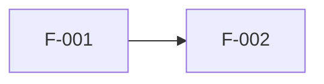

# Requirement Template — {{PROJECT_NAME}}

> **記入用テンプレート**: [`01_Product/Requirement_Engineering_Framework.md`](../01_Product/Requirement_Engineering_Framework.md) の20ステージに対応。
> 各章をStage順に埋める。**Exit Criteria未達のまま次章に進まない。** 記入ガイド（`>` ブロック）と `{{ }}` は記入後に削除する。
> 複数AI（Claude Code / ChatGPT / Gemini）で分担する場合は、必ずStatus Trackerで担当と状態を管理する。

```markdown
---
project: {{PROJECT_NAME}}
product_type: {{SaaS / Webサービス / モバイルアプリ / AIエージェント / 自動化 / その他}}
version: 0.1.0
status: Draft   # Draft / In Review / Frozen（Gate D通過後）
owner: {{HUMAN_OWNER}}
created: {{YYYY-MM-DD}}
updated: {{YYYY-MM-DD}}
---
```

---

## Status Tracker

> 各Stageの進捗・担当・Gate判定をここで一元管理する。マルチAI分担時の衝突防止に必須。

| Stage | 担当（Agent/AI/人間） | 状態 | Exit Criteria | Gate |
|---|---|---|---|---|
| 01 Business Analysis | | 未着手 / 作業中 / 完了 | ☐ | |
| 02 Problem Definition | | 未着手 | ☐ | Gate A: ☐ |
| 03 Target User | | 未着手 | ☐ | |
| 04 Persona | | 未着手 | ☐ | |
| 05 JTBD | | 未着手 | ☐ | |
| 06 Value Proposition | | 未着手 | ☐ | Gate B: ☐ |
| 07 Feature List | | 未着手 | ☐ | |
| 08 Functional Requirements | | 未着手 | ☐ | |
| 09 Non Functional Requirements | | 未着手 | ☐ | |
| 10 User Stories | | 未着手 | ☐ | |
| 11 Use Cases | | 未着手 | ☐ | |
| 12 Acceptance Criteria | | 未着手 | ☐ | |
| 13 MVP Definition | | 未着手 | ☐ | Gate C: ☐ |
| 14 UX Requirements | | 未着手 | ☐ | |
| 15 UI Requirements | | 未着手 | ☐ | |
| 16 AI Requirements | | 未着手 / N/A | ☐ | |
| 17 Technical Requirements | | 未着手 | ☐ | |
| 18 Security Requirements | | 未着手 | ☐ | |
| 19 Analytics Requirements | | 未着手 | ☐ | |
| 20 Release Requirements | | 未着手 | ☐ | Gate D: ☐ |

## Glossary（用語集）

> このプロジェクトで使う用語の唯一の定義。表記揺れ禁止。新出用語は必ずここに追加してから使う。

| 用語 | 定義 | 禁止する同義語 |
|---|---|---|
| {{用語1}} | {{定義}} | {{使わない表記}} |

## Open Issues

> 未解決の指摘・前工程との矛盾はここに記録する（前工程の成果物を勝手に書き換えない）。

| # | 内容 | 発見Stage | 対象Stage | Severity | 状態 |
|---|---|---|---|---|---|
| 1 | | | | | Open |

---
---

# 0. Idea（起点）

> 発案時の原文をそのまま残す（後から「元々何がしたかったか」に立ち返るため）。

- **アイデア原文**: {{発案時の文章をそのまま}}
- **発案者**: {{名前}} / **発案日**: {{日付}}
- **制約**: 予算 {{金額}} / 期限 {{日付}} / その他 {{制約}}

---

# 1. Business Analysis

## 1.1 市場分析
- **市場規模**: {{TAM / SAM / SOM。出典必須}}
- **成長性・トレンド**: {{出典必須}}

## 1.2 競合分析（最低3社）

| 競合 | 主要機能 | 価格 | ポジショニング | 強み | 弱み |
|---|---|---|---|---|---|
| {{競合A}} | | | | | |
| {{競合B}} | | | | | |
| {{競合C}} | | | | | |

## 1.3 SWOT

| | プラス要因 | マイナス要因 |
|---|---|---|
| **内部** | S: {{強み}} | W: {{弱み}} |
| **外部** | O: {{機会}} | T: {{脅威}} |

## 1.4 ポジショニング
- **軸1**: {{例: 特化⇄汎用}} / **軸2**: {{例: 高価格⇄低価格}}
- **自社の位置と根拠**: {{記述}}

## 1.5 収益モデル
- **モデル**: {{サブスク / 従量 / 広告 / 手数料 等}}
- **価格仮説**: {{金額と根拠}}
- **ユニットエコノミクス**: LTV {{仮説}} / CAC {{仮説}} / 成立条件 {{記述}}

## 1.6 KPI仮説・ROI試算
- **North Star Metric候補**: {{指標と理由}}
- **ROI試算**: 投資 {{開発コスト}} → 回収 {{シナリオ}}（前提: {{明記}}）
- **この事業の最大のリスク**: {{1つに特定}}

- [ ] **Exit Criteria充足を確認した（6要素・最大リスク特定・Human承認）**

---

# 2. Problem Definition 🚧 Gate A

## 2.1 Problem Statement
> 「[誰]は[状況]のとき[課題]に困っている。なぜなら[原因]」の1文で。

{{課題文}}

## 2.2 課題の証拠（最低2種類）
1. {{証拠1（出典付き）}}
2. {{証拠2（出典付き）}}

## 2.3 既存の代替手段と不満
| 代替手段 | ユーザーの不満 |
|---|---|
| {{現在の解決方法}} | {{何が不十分か}} |

## 2.4 この課題が放置されている理由
{{なぜ誰も解決していないのか / 解決が難しい理由}}

## 2.5 Gate A判定（Human）
- **判定**: ☐ Go / ☐ No-Go
- **判定者**: {{名前}} / **日付**: {{日付}} / **理由**: {{記録}}

---

# 3. Target User

## 3.1 セグメント候補
| セグメント | 課題の強度 | 到達可能性 | 支払い意思 | 評価 |
|---|---|---|---|---|
| {{候補1}} | 高/中/低 | 高/中/低 | 高/中/低 | |

## 3.2 初期ターゲット（1つに絞る）
- **選定**: {{セグメント}} / **理由**: {{記述}}
- **到達チャネル仮説**: {{どうやってこの層に届くか}}
- **ターゲット外（将来候補）**: {{記録}}

---

# 4. Persona

> プライマリ1体は必須。行動・目標・ペイン・文脈・心理の5要素を必ず埋める。事実と仮説を区別する。

## Persona 1（Primary）: {{名前}}
- **基本**: {{年齢・職業・環境（最小限に）}}
- **行動**: {{1日の流れ・使っているツール・情報行動}}
- **目標**: {{達成したいこと}}
- **ペイン**: {{困っていること・ストレス}}
- **利用文脈**: {{いつ・どこで・どんな状態でこのプロダクトに触れるか}}
- **心理・欲求**: {{表面的な要望}} ← 本質: {{本当の欲求}}
- **デジタルリテラシー**: {{高/中/低と根拠}}

---

# 5. JTBD

- **メインジョブ**: 「{{状況}}のとき、{{動機}}したい。そうすれば{{期待する結果}}」
- **機能的ジョブ**: {{タスクとして片付けたいこと}}
- **感情的ジョブ**: {{どう感じたいか}}
- **社会的ジョブ**: {{他者からどう見られたいか}}
- **雇用の条件**（このプロダクトを使い始める条件）: {{記述}}
- **解雇の条件**（使うのをやめる条件）: {{記述}}

---

# 6. Value Proposition 🚧 Gate B

## 6.1 価値提案文
> 「{{PROJECT_NAME}}は、[誰]の[課題]を[どう]解決する。[競合/代替]と違い[差別化]ができる。」

{{価値提案文}}

## 6.2 Value Proposition Canvas
| 顧客側 | 内容 | ⇔ | 提供側 | 内容 |
|---|---|---|---|---|
| Jobs | {{JTBD要約}} | ⇔ | Products | {{提供物}} |
| Pains | {{ペイン}} | ⇔ | Pain Relievers | {{どう和らげるか}} |
| Gains | {{得たい成果}} | ⇔ | Gain Creators | {{どう生み出すか}} |

## 6.3 競争優位性
- **選ばれる理由**: {{記述}}
- **優位性の源泉**: {{データ / ネットワーク効果 / 専門性 / スイッチングコスト 等}}
- **競合が真似できない/しにくい理由**: {{記述}}

## 6.4 世界観・ブランド方向性（Human決定）
- **トーン**: {{例: 誠実で機能的 / 遊び心 / プロフェッショナル}}
- **プロダクトが約束すること**: {{1文}}

## 6.5 Gate B判定（Human）
- **判定**: ☐ 承認 / ☐ 差し戻し — **判定者**: {{名前}} / **日付**: {{日付}}

---

# 7. Feature List

> 全機能にID（F-001形式）を振る。以降の全工程はこのIDでトレースする。

| ID | 機能名 | 概要 | 対応ジョブ | Kano分類 | 競合有無 |
|---|---|---|---|---|---|
| F-001 | | | {{JTBD参照}} | 当たり前/性能/魅力 | |
| F-002 | | | | | |

## やらない機能リスト
| 機能 | やらない理由 |
|---|---|
| {{機能}} | {{理由}} |

---

# 8. Functional Requirements

> 「システムは〜できること」形式。曖昧語（〜など・適切に・柔軟に）禁止。

| 要件ID | 機能ID | 要件 | 入力 | 出力 | 制約 |
|---|---|---|---|---|---|
| FR-001 | F-001 | システムは{{...}}できること | | | |

## 機能間依存


---

# 9. Non Functional Requirements

> 初期値は [`Quality_Standard.md — Quality Numbers`](../00_System/Quality_Standard.md) を適用。変更は理由必須。

| カテゴリ | 要件 | 基準値 | Quality Standardからの変更理由 |
|---|---|---|---|
| 性能 | LCP / INP / CLS / API p95 | {{値}} | {{標準どおり or 理由}} |
| 可用性 | 稼働率 / 復旧時間 | {{値}} | |
| 拡張性 | 想定ユーザー数 / ピーク | {{値}} | |
| 保守性 | デプロイ頻度 / 環境再現 | {{値}} | |
| アクセシビリティ | WCAG準拠レベル | 2.2 AA | |
| 対応環境 | ブラウザ / OS / デバイス | {{マトリクス}} | |

---

# 10. User Stories

> 「[ペルソナ]として、[目的]のために、[操作]したい」形式。INVEST原則準拠。

| Story ID | 機能ID | ストーリー | 優先度 |
|---|---|---|---|
| US-001 | F-001 | {{ペルソナ名}}として、{{目的}}のために、{{操作}}したい | High |

---

# 11. Use Cases

> 主要ストーリーに対して作成。例外系を正常系と同じ密度で書く。

## UC-001: {{ユースケース名}}（US-{{XXX}}対応）
- **アクター**: {{誰}}
- **事前条件**: {{状態}}
- **基本フロー**: 1. {{...}} 2. {{...}} 3. {{...}}
- **代替フロー**: {{分岐条件と流れ}}
- **例外フロー**: {{エラー・中断・権限なし・データなし時の挙動}}
- **事後条件**: {{完了後の状態}}

---

# 12. Acceptance Criteria

> Given/When/Then形式。1基準1検証。異常系を必ず含める。

| AC ID | Story ID | Given | When | Then | 検証方法 |
|---|---|---|---|---|---|
| AC-001-1 | US-001 | {{前提}} | {{操作}} | {{期待結果}} | 自動/手動 |
| AC-001-2 | US-001 | {{異常系の前提}} | {{操作}} | {{期待挙動}} | 自動/手動 |

---

# 13. MVP Definition 🚧 Gate C

## 13.1 RICEスコア
| 機能ID | Reach | Impact | Confidence | Effort | Score |
|---|---|---|---|---|---|
| F-001 | | | | | |

## 13.2 MVPスコープ
- **In（MVP）**: {{機能ID列挙}}
- **Out（v1以降）**: {{機能ID}} — 入れない理由: {{記録}}

## 13.3 MVPが検証する仮説と成功基準
- **仮説**: {{MVPで確かめたいこと}}
- **成功基準**: {{数値。例: 登録後7日継続率 ≧ 20%}}
- **判定時期**: {{リリース後N週間}}

## 13.4 リリース段階計画
| 段階 | スコープ | 目的 |
|---|---|---|
| MVP | | 仮説検証 |
| v1 | | |

## 13.5 Gate C判定（Human）
- **判定**: ☐ 承認 / ☐ 差し戻し — **判定者**: {{名前}} / **日付**: {{日付}}

---

# 14. UX Requirements

## 14.1 主要ユーザーフロー
```mermaid
flowchart LR
    A[{{開始}}] --> B[{{ステップ}}] --> C[{{完了}}]
```
> 正常系・異常系を全MVPストーリー分。各ステップに「ユーザーの疑問・不安」を注記。

## 14.2 情報設計（IA）方針
{{分類・ナビゲーション構造の方針}}

## 14.3 導線・離脱対策
| 導線 | 離脱リスクポイント | 対策 |
|---|---|---|
| {{流入→CV}} | {{どこで離脱しそうか}} | {{対策}} |

## 14.4 継続率・CVR設計方針
- **Aha Momentの定義**: {{価値実感の瞬間}}
- **初回体験→Aha Momentまでの最短導線**: {{記述}}
- **再訪の仕組み**: {{記述}}

---

# 15. UI Requirements

## 15.1 画面一覧
| 画面ID | 画面名 | 対応フロー | 状態バリエーション |
|---|---|---|---|
| SC-001 | | | default / error / empty / loading |

## 15.2 コンポーネント一覧
{{共通コンポーネント候補}}

## 15.3 デザインシステム要件
- **トークン方針**: {{色・タイポ・スペーシングの方針}}
- **ブランド・トーン&マナー（Human決定）**: {{Stage 06の世界観を反映}}

## 15.4 レスポンシブ / アクセシビリティ / Figma
- **ブレークポイント**: {{値}}
- **アクセシビリティ**: WCAG 2.2 AA（コントラスト4.5:1 / ターゲット44pt/48dp）
- **Figma運用**: {{ファイル構成・命名・Auto Layoutルール}}

---

# 16. AI Requirements

> AI機能がない場合: ☐ N/A（判断者: {{名前}}）と記録してスキップ。

## 16.1 AI機能一覧
| AI機能ID | 機能 | 入力 | 出力 | 対応機能ID |
|---|---|---|---|---|
| AI-001 | | | | F-{{XXX}} |

## 16.2 プロンプト要件
{{役割・制約・出力形式の要件}}

## 16.3 AI人格（Human決定）
- **ペルソナ・トーン**: {{ブランドと一致する人格}}
- **やってはいけない振る舞い**: {{記述}}

## 16.4 Memory / Knowledge / RAG / Conversation
| 項目 | 要件 |
|---|---|
| Memory | {{何を記憶し、何を忘れるか・保持期間}} |
| Knowledge | {{参照する知識源と鮮度要件}} |
| RAG | {{検索対象・更新頻度・出典明示}} |
| Conversation | {{対話フロー・文脈維持・引き継ぎ}} |

## 16.5 AI評価基準（数値必須）
| AI機能ID | 評価方法 | 合格基準 |
|---|---|---|
| AI-001 | {{評価データセット・指標}} | {{数値}} |

## 16.6 フォールバック要件
| 失敗モード | ユーザーへの見せ方 |
|---|---|
| 誤答 / 遅延 / API障害 / 拒否 | {{各対応}} |

## 16.7 AI利用範囲の倫理判断（Human）
- **AIに任せてよい判断**: {{範囲}} / **任せない判断**: {{範囲}}
- **判断者**: {{名前}} / **日付**: {{日付}}

---

# 17. Technical Requirements

## 17.1 Architecture要件
{{構成方針。詳細設計はWorkflow Phase 08で}}

## 17.2 Database要件
- **データ特性**: {{量・更新頻度・整合性要件}}
- **主要エンティティ**: {{一覧}}

## 17.3 API要件
- **外部連携**: {{依存する外部API・リスク}}
- **公開方針**: {{自社APIの公開有無}}

## 17.4 認証要件
- **方式**: {{メール / OAuth / SSO}} / **多要素**: {{要否}}

## 17.5 技術選定（Human承認）
| レイヤー | 選定 | 理由 | 不採用案と理由 |
|---|---|---|---|
| Frontend / Backend / DB / Infra / AI | | | |
- **月額インフラコスト見込み**: {{金額}} — **承認者**: {{名前}}

---

# 18. Security Requirements

## 18.1 データ分類と保護
| データ | 分類 | 保護要件 | 保持期間 |
|---|---|---|---|
| {{データ}} | 個人情報/機密/公開 | {{暗号化等}} | |

## 18.2 認証・認可要件
{{権限モデル・セッション管理}}

## 18.3 プライバシー要件
- **収集する個人情報（最小化済み）**: {{一覧}}
- **同意の取得方法**: {{記述}}

## 18.4 法務要件（Human確認必須）
- 該当しうる法規制: {{個人情報保護法 / 特商法 / 資金決済法 / 業法 等の論点}}
- 必要な規約類: ☐ 利用規約 ☐ プライバシーポリシー ☐ 特商法表記
- **確認者**: {{名前}} / **日付**: {{日付}} / **専門家確認**: 要 / 不要（理由: {{記述}}）

## 18.5 AI固有セキュリティ
{{プロンプトインジェクション対策・出力フィルタ・データ学習利用の方針}}

---

# 19. Analytics Requirements

## 19.1 KPIツリー
- **North Star Metric（Human確定）**: {{指標}} — 目標: {{値}}
- **ドライバー指標**: {{NSMを分解した指標と目標値}}

## 19.2 計測イベント一覧
| イベント名 | 発火タイミング | 対応フロー/画面 | 対応KPI |
|---|---|---|---|
| {{event_name}} | | SC-{{XXX}} | |

## 19.3 ダッシュボード / Monitoring / Error Logging
- **ダッシュボード**: {{必須KPI: CVR / Retention / LTV / DAU / MAU / Session / Exit / Drop / Funnel}}
- **Monitoring**: {{死活監視・アラート閾値・通知先}}
- **Error Logging**: {{収集ツール・通知条件}}

---

# 20. Release Requirements 🚧 Gate D

## 20.1 SEO要件
- **対象キーワード・検索意図**: {{一覧}}
- **構造化データ / OGP**: {{要件}}

## 20.2 Deployment要件
- **環境**: {{dev / staging / production}}
- **CI/CD**: {{方針}} / **ロールバック**: {{手順の要件}}

## 20.3 公開条件
[`Development_Workflow.md`](../00_System/Development_Workflow.md) Phase 16のLaunch Checklist全項目を適用する。プロダクト固有の追加項目: {{あれば}}

## 20.4 トレーサビリティ検査（AI実行）
- [ ] 価値提案 → 機能（F-ID） → ストーリー（US-ID） → 受け入れ基準（AC-ID） → 画面（SC-ID） → 計測イベント が全件接続している
- [ ] 8ドメインマトリクス（Framework参照）の全項目が記入済み
- [ ] Open Issuesにブロッカーが残っていない

## 20.5 Human Final Review（8つの問い）
| # | 問い | Yes/No |
|---|---|---|
| 1 | 本当に価値があるか | ☐ |
| 2 | 感情が動くか | ☐ |
| 3 | ブランドらしいか | ☐ |
| 4 | サービスの世界観と一致するか | ☐ |
| 5 | 競争優位性があるか | ☐ |
| 6 | 利益が出るか | ☐ |
| 7 | 長期運用できるか | ☐ |
| 8 | 法的問題はないか | ☐ |

## 20.6 Gate D判定（Human）— 要件凍結
- **判定**: ☐ Development Ready / ☐ 差し戻し（対象Stage: {{番号}}）
- **判定者**: {{名前}} / **日付**: {{日付}}
- **凍結後の変更管理**: 要件変更はOpen Issues起票 → 影響分析（AI） → Human承認 → 該当Stage改訂 → 再凍結

---

# Changelog

| Version | 日付 | 変更内容 | 担当 |
|---|---|---|---|
| 0.1.0 | {{日付}} | 初版ドラフト | |

---

*This document follows the Requirement Engineering Framework.*
*Template maintained in: `templates/Requirement_Template.md`*
